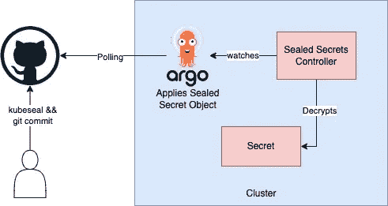

# 以 GitOps 的方式处理 Kubernetes 的秘密—第 1 部分

> 原文：<https://medium.com/google-cloud/handle-kubernetes-secrets-the-gitops-way-part-1-7079bd8221f3?source=collection_archive---------0----------------------->


伊万·肯尼迪在 [Unsplash](https://unsplash.com?utm_source=medium&utm_medium=referral) 上拍摄的照片

GitOps 是实现云原生应用持续部署的一种方式。它通过使用开发人员已经熟悉的工具，包括 Git 和持续部署工具，关注操作基础设施时以开发人员为中心的体验。

GitOps 的核心思想是拥有一个 Git 存储库，该存储库总是包含生产环境中当前所需的基础设施的声明性描述，以及一个使生产环境与存储库中描述的状态相匹配的自动化过程。如果您想要部署一个新的应用程序或更新一个现有的应用程序，您只需要更新存储库—自动化过程会处理所有其他事情。这就像用巡航控制来管理生产中的应用程序一样。

需要注意的是，GitOps 是**而不是**devo PS 甚至 DevOps 2.0 之后的下一个东西。

GitOps 是一套部署实践，而 DevOps 是一种范式，或者更好的说法是一种思维模式。他们共享的原则使得团队能够更容易地将 GitOps 工作流用于现有的 DevOps 技术。

现在我们知道了什么是 GitOps，让我们理解在 Kubernetes 集群中实现它时的一些实际挑战。

**挑战:**

您的应用程序和基础设施都需要访问一些敏感信息，如数据库凭证、API 密钥等。在 Kubernetes 环境中，通常使用 Kubernetes 的秘密来存储这些值，然后使用环境变量或挂载的卷将这些值公开给应用程序。然而，

1.  Kubernetes 的秘密并不完全安全，因为它们只是 base64 编码，很容易被解码。
2.  GitOps 的一个关键需求是使用 git 作为应用程序和基础设施的真实来源。这要求将这些不安全的 Kubernetes 秘密提交给你的 SCM，暴露整个组织的敏感信息。

**方法:**

有两种方法可用于管理 GitOps 中的机密:

1.  加密的秘密，在 SCM 中检查之前加密 Kubernetes 秘密，由 Kubernetes 控制器解密为常规的 Kubernetes 秘密
2.  外部机密，将机密存储在外部机密管理器系统中，如 GCP 机密管理器、哈希公司保险库等，并提交对这些外部机密的引用，这些外部机密由 Kubernetes 控制器提取，并作为常规 Kubernetes 机密应用到集群。

在这篇博客中，我们将看到如何使用 Bitnami Sealed Secrets 项目来使用方法 1。

**解决方案:**

《密封的秘密》由两部分组成:

1.  集群侧控制器/操作员

2.一个客户端实用程序: **kubeseal**

加密是使用 kubeseal 完成的，它生成一个 **SealedSecret** 定制资源，集群端控制器对该资源进行解密并将其转换为 Kubernetes 秘密对象



密封的秘密工作

因此，需要做三件事:

1.  在目标集群中安装 Sealed Secrets 控制器，并在本地客户端中安装 kubeseal CLI
2.  下载将用于在客户端加密机密的公共证书，并加密机密。
3.  将 SealedSecret 对象检查到作为 ArgoCD 应用程序源的 SCM repo。

**安装控制器和 kubeseal:**

要在本地安装 kubeseal，只需从 Github 发布页面安装即可，如下所示:

```
wget https://github.com/bitnami-labs/sealed-secrets/releases/download/<release-tag>/kubeseal-<version>-linux-amd64.tar.gz
tar -xvzf kubeseal-<version>-linux-amd64.tar.gz kubeseal
sudo install -m 755 kubeseal /usr/local/bin/kubeseal
```

安装控制器取决于您的 Kubernetes 部署方法。如果你已经使用了头盔或者 Kustomize，那么这是你最好的选择，正如这里描述的。如果您编写常规的 Kubernetes Yaml 文件，那么您可以从这里的发布页面[下载 controller.yaml 文件。](https://github.com/bitnami-labs/sealed-secrets/releases/)

**下载公共证书:**

理论上，您不需要下载公共证书，因为如果您的用户可以访问集群并且在 kubeconfig 文件中设置了正确的上下文，kubeseal 可以直接与集群通信

但是，在企业设置中，理想情况下您的集群应该是私有的。因此，我们将使用离线密封方法。

安装控制器后，在 bastion VM 上运行以下命令来获取公共证书

```
kubectl log --tail -1 -f -l name=sealed-secrets-controller -n <namespace>
```

复制输出的证书并将其粘贴到本地的 pem 文件中。

现在，让我们加密这个秘密。运行以下命令创建自定义资源。

```
kubeseal <prod-secret.yaml --cert cert.pem -o yaml> prod-sealed-secret.yaml
```

这将产生一个 yaml 文件，其中包含由加密数据组成的 SealedSecret 定制资源。

现在，您可以在您的 SCM repo 中安全地提交这个密封的秘密资源了。**确保您没有提交原始机密和 pem 文件。**

一旦 ArgoCD 同步了集群和存储库之间的状态，您就可以通过运行以下命令来确认解密已经完成

```
kubectl get secret <secret-name> -n <namespace>
```

你应该看到一个普通的 Kubernetes 秘密物品，你的豆荚可以正常使用。

**缺点:**

虽然密封的秘密很棒，但这种方法肯定有一些缺点。显著的缺点如下:

1.  密钥轮换，然后将它传播到您的存储库，这对您的基础架构团队来说是一项巨大的工作。
2.  最终，秘密对象仍然在您的存储库中，不管加密与否。恶意用户可以获取提交者的信息并发送社会工程漏洞，或者收集有助于攻击目标基础设施的线索。

**结论:**

如果你正在开始你的 GitOps 之旅,《密封的秘密》是一个很好的解决方案，因为它很便宜，很容易开始和理解。然而，随着您的部署过程变得复杂和 SecOps 过程的发展，您将需要一个适当的秘密管理系统。

在本博客的下一部分，我们将深入探讨方法 2——使用外部秘密管理系统，在该系统中，您只需将秘密的引用存储在您的存储库中。

**参考文献:**

【https://codefresh.io/learn/gitops/ 

[https://www.gitops.tech/](https://www.gitops.tech/)

[https://better programming . pub/why-you-should-avoid-sealed-secrets-in-your-gitops-deployment-e 50131d 360 DD](https://betterprogramming.pub/why-you-should-avoid-sealed-secrets-in-your-gitops-deployment-e50131d360dd)