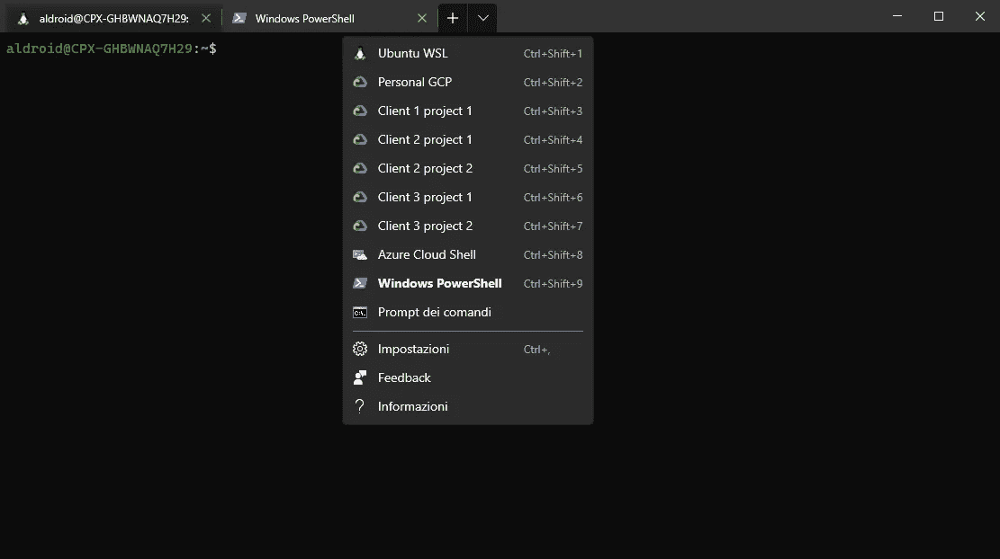
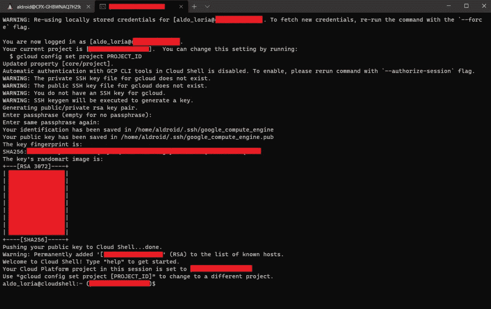

# 使用 Windows 终端处理多个 Google Cloud Shell

> 原文：<https://medium.com/google-cloud/handle-multiple-google-cloud-shell-using-windows-terminal-f5ce0573eaf4?source=collection_archive---------0----------------------->

*Windows 终端*是 2019 年 5 月公布的一个*微软* [开源项目](https://github.com/microsoft/terminal/)。第一个稳定版本于 2020 年 5 月发布；作为一个基于 Windows 的用户，我很抱歉这几个月忽略了它，它确实是一个有用的工具，具有高度可定制的界面。

为埃森哲谷歌事业群工作时，由于客户安全限制，我的日常活动被分成几个 GCP 项目和不同的谷歌账户是很常见的。

*终端*提供了一个有趣的功能:**配置文件**。

*终端*将提供开箱即用的一些动态生成的配置文件:

*   *Cmd 提示*
*   *Windows Powershell*
*   天蓝色的云壳
*   您在*窗口*中安装的任何 WSL

而且它还允许您定义不同配置文件，您可以从一个简单的访问选择列表中直接启动这些配置文件:



决赛成绩

如你所见，我能够为几个项目/账户定义几个*谷歌云外壳*配置文件。我发现这非常方便，让我们看看如何做。

# 要求

*   Windows 10 1903(内部版本 18362)或更高版本
*   [Windows 终端](https://www.microsoft.com/en-us/p/windows-terminal/9n0dx20hk701?activetab=pivot:overviewtab)
*   [谷歌云 SDK](https://cloud.google.com/sdk/docs/quickstart)
*   [Ubuntu WSL](https://www.microsoft.com/en-us/p/ubuntu/9nblggh4msv6?activetab=pivot:overviewtab) ( *不完全是我的喜好:)*)

# 步伐

## 登录您的帐户

打开 WSL 并登录到您的 google 帐户:

```
gcloud auth login {user_email}
```

跟随浏览器中的链接，并向提示提供验证码。

## **定义切换脚本**

让我们定义一个 shell 脚本来使用脚本参数切换帐户/项目，并使用 *Google Cloud SDK* 启动一个指向 *Google Cloud Shell* 的 ssh 会话:

```
#!/bin/bash
gcloud auth login $1
gcloud config set project $2gcloud cloud-shell ssh
```

以 *set-gcloud-env.sh* 保存到~文件夹

## 生成 guid

打开一个 *Windows Powershell* 并使用命令:

```
[guid]::NewGuid()
```

为下一步保存结果。

## 定义终端配置文件

从*终端*的选择列表中打开 settings，这将导致一个 *setting.json* 文件，让我们将一个具有所需属性的新元素添加到 json 对象的 *profiles.list* 部分:

```
{"guid": "{{guid_generated}}","name": "{client} {project_name}","commandline": "wsl ~/set-gcloud-env.sh {user_email} {project_name}","hidden": false}
```

保存 *settings.json* ，不需要重启终端。

## 结果

从选择列表中点击上一步创建的配置文件:



已连接到已配置的云外壳配置文件:)

我们成功地创建了一个工作的 *Google Cloud Shell* 概要文件！

第一次连接会提示输入密码，生成个人 ssh 密钥并将公钥发布到*谷歌云外壳*，它还会修改你的 *~/。ssh/已知 _ 主机*。

**对任何需要的轮廓重复上述步骤**。

## 用户化

*终端*提供许多可定制的花哨属性，如:

*   图标
*   tabColor
*   丙烯电容
*   …

你可以在这里找到关于可定制属性[的文档。](https://aka.ms/terminal-profile-settings)

# 铌

与浏览器会话一样， *Google Cloud* 将保留您配置的机器，如果它在一段时间内不活动。在这种情况下，您需要使用选择列表重新启动配置文件，以便请求新的会话。

再见。👋

铝

# 裁判员

[1] [终端文档](https://aka.ms/terminal-documentation)

[2] [终端 github 项目](https://github.com/microsoft/terminal/)

[3] [终端的配置文件属性](https://aka.ms/terminal-profile-settings)

【4】[g cloud 云壳 ssh 命令](https://cloud.google.com/sdk/gcloud/reference/cloud-shell/ssh)