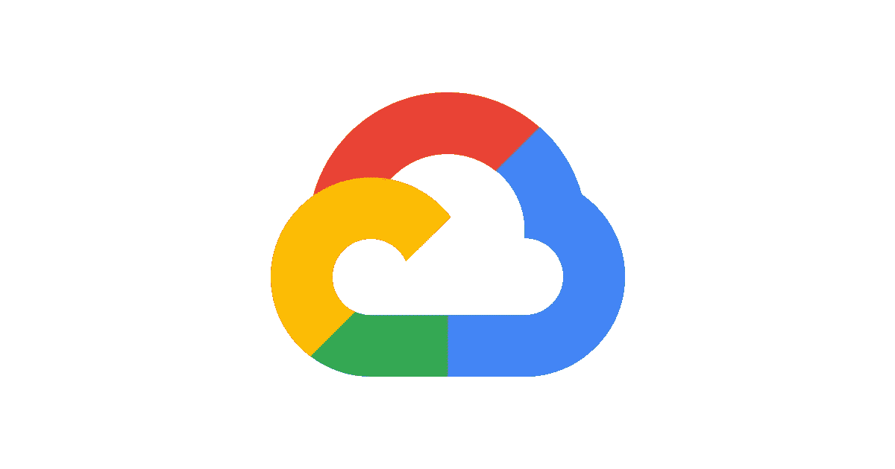

# 处理自动长时间操作

> 原文：<https://medium.com/google-cloud/handling-automl-long-operations-8cd9ea8b11e7?source=collection_archive---------0----------------------->



图片提供:[https://cloud.google.com/vision](https://cloud.google.com/vision)

由*谷歌云平台*提供的自然语言 AutoML 服务有一些操作需要一些时间来完成，如数据集导入、数据集导出、数据集删除、模型创建、模型删除、模型部署、模型取消部署和异步批量预测。

如果这些操作是从 UI 执行的，Google 会在操作完成后向用户提供电子邮件提醒。但是，如果这些操作是使用 python 客户端库进行的，则不会发送电子邮件通知，并且在操作仍在运行时，调用 API 的初始调用会立即返回。然而，Google 已经提供了一些方法，开发者可以通过这些方法来处理这些操作。

***使用 Python***

等待操作继续运行的一种方法是使用响应。结果()，以便程序等待操作完成。

***使用卷曲命令***

另一种方法是对您的操作保持轮询。您可以定期轮询以检查您的操作是否完成。

Curl 命令，其中操作名称为 projects/{ project-id }/locations/us-central 1/operations/{ operation-id }。您还可以通过在 python 代码中使用`response.operation.name`来获取操作名称，在 python 代码中，您将调用 API 来执行长时间运行的操作。

```
curl -X GET \
  -H "Authorization: Bearer $(gcloud auth application-default print-access-token)" \
  -H "Content-Type: application/json" \
  https://automl.googleapis.com/v1/operation-name
```

如果您想要等待一段时间直到执行完成，您可以使用下面的命令，其中超时是您想要等待操作完成的时间

```
curl -X POST \
  -H "Authorization: Bearer $(gcloud auth application-default print-access-token)" \
  -H "Content-Type: application/json" \
   -d '{"timeout":"timeout"}' \
  https://automl.googleapis.com/v1/operation-name:wait
```

取消正在运行的操作

```
curl -X POST \
  -H "Content-Type: application/json" \
  -H "Authorization: Bearer $(gcloud auth application-default print-access-token)" \
  https://automl.googleapis.com/v1/operation-name:cancel
```

关于处理 AutoML 长操作的更多细节可以在[https://cloud . Google . com/natural-language/AutoML/docs/long-operations](https://cloud.google.com/natural-language/automl/docs/long-operations)找到