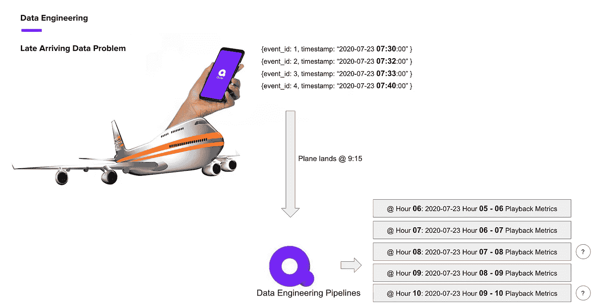
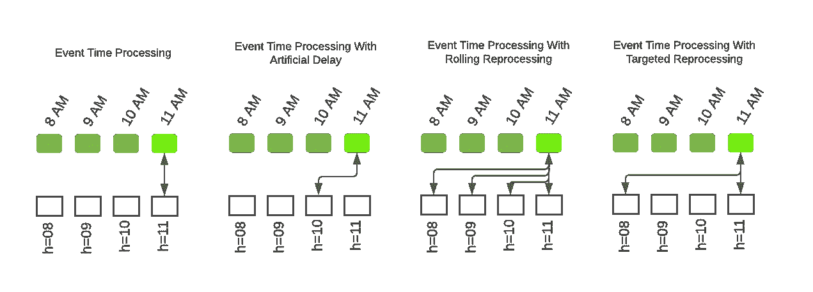
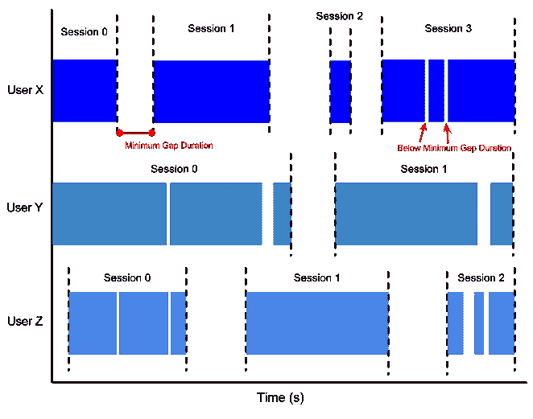
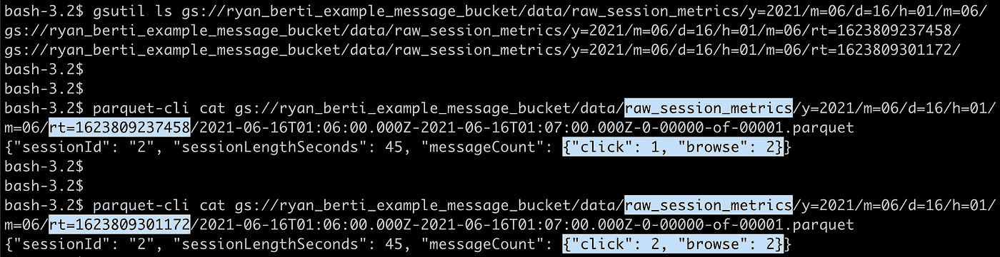
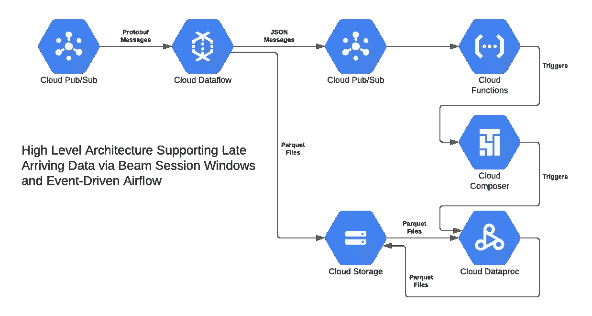
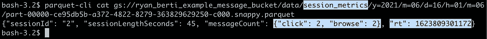
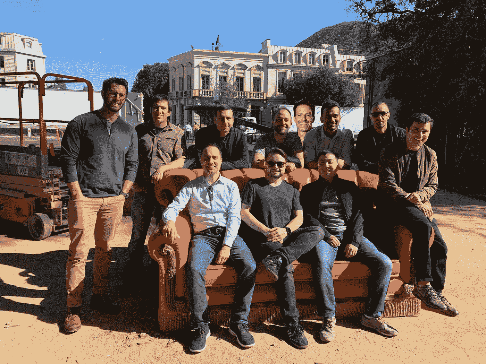

# 用 Apache Beam 和 Apache Airflow 处理迟到的数据

> 原文：<https://medium.com/google-cloud/handling-late-arriving-data-with-apache-beam-and-apache-airflow-a2b310099a8e?source=collection_archive---------0----------------------->

2019 年底，我受雇于一家专注于短格式内容的流媒体服务公司，帮助建立数据平台。这种流媒体服务的一个关键组成部分是对移动消费的关注，这使得我们的数据平台必须优雅地处理迟到的数据。我用了一个由于飞机飞行而离线观看的例子来说明这个问题。

您是否将该用户的播放包括在第 7 小时(事件时间)或第 9 小时(接收时间)的指标中？如果将回放与事件时间相关联，系统如何处理这些迟到的数据？

这个问题可以用各种方法、各种技术来解决，每种解决方案都有其利弊。最简单的解决方案是有效的，但可能会误导:丢弃迟到的数据。一种更正确但会导致延迟的解决方案包括将处理延迟任意长的时间，以便处理阈值内晚到达的数据，并且之后到达的任何数据(希望)都可以忽略并丢弃。一种更正确但计算效率低的解决方案涉及以一定的时间间隔在某个回顾窗口内重新处理所有事件。一种更复杂、更正确、计算效率更高的解决方案包括跟踪那些包含迟到数据的分区，并根据需要重新处理它们。

(过于简化的)处理模式

我曾希望我们的流媒体服务能够发展壮大，这样一来，大量的事件以及数据产品和利益相关方的要求将迫使我们使用正确、计算高效且不会增加不必要延迟的解决方案。不幸的是，流媒体服务从未扩大规模，但我相信我提出和 POC'd 的架构可以在其他环境中使用。这篇文章将概述建议的架构，提供一个示例实现，并提供对我们最终产品架构的见解。

流数据处理可能会令人望而生畏，尤其是对于没有实时需求的小型团队。也就是说，将数据平台设计成以事件为中心有明显的优势。权衡之下，该团队采用了 Apache Beam，因为它能够使用相同的 API 处理批处理和流作业，并且它可以作为托管服务在 GCP 使用。在数据平台中使用 Beam 作为核心组件的另一个好处是，它能够通过会话窗口实时将应用程序事件组合在一起，而不是登陆事件并在以后某个时间点进行分组。Beam 的会话窗口提供了调整在关闭会话之前等待事件多长时间(间隙持续时间)的能力，还提供了调整窗口关闭后允许迟到事件(允许迟到)的时间的能力。

Beam 还支持配置何时触发并让窗口输出分组事件以供下游处理(例如，在达到间隙持续时间后，以及在允许的延迟阈值结束时)。Beam 对多个触发器的支持允许实现写出部分结果，并在稍后的处理时间重写完整的结果。这个特性引发了一个问题:我如何写出这个部分输出供下游使用。Maxime Beauchemin 关于功能数据工程的基础文章的[‘迟到的事实’部分提供了一个解决方案:在事件时间+处理时间分区中写数据。](https://maximebeauchemin.medium.com/functional-data-engineering-a-modern-paradigm-for-batch-data-processing-2327ec32c42a)

[这里有一个示例 Beam 实现](https://github.com/RyanBerti/scio-airflow-session-window-pipeline)，它利用会话窗口，并将输出写入事件时间/处理时间分区。这里的想法是，管道将为同一个事件时间分区写入一个或多个接收时间分区，其中接收时间分区将包含具有迟到数据的会话的部分和完整管道结果。事件时间分区的下游使用者将负责删除在接收时间分区中发现的重复记录。这个实现使用了 Spotify 的 [Scio](https://github.com/spotify/scio) ，这是一个用于 Beam 的 Scala API，我们发现它比 Java API 简洁得多(Java API 还受益于类型安全和 Python API 中没有的其他 JVM/函数优势)。

示例射束管道输出

在任何以事件为中心的架构中，流数据输出的消费以及通过传统批处理管道的进一步处理是不可避免的下一步。该架构利用 PubSub 作为广告数据可用性的机制，目标是将下游处理与流数据生产者分离。在编写事件时间/接收时间分区之后，管道将 JSON 事件发布到一个 PubSub 主题。至少，JSON 事件包含关于事件时间分区的信息，其中流式管道已经写入了接收时间插入/更新。这种模式允许数据消费者灵活地使用流输出:在某些情况下，消费者可能是另一个流作业，它在事件时间分区可用时立即读取它们，而在其他情况下，这些事件时间更新可以通过传统的基于 cron 的工作流成批使用。

虽然基于 cron 的工作流可能足够了，但我想尝试通过事件异步驱动气流，因此这种架构利用 [Airflow 的 REST API](https://airflow.apache.org/docs/apache-airflow/stable/stable-rest-api-ref.html#operation/post_dag_run) 来触发 DAG 运行。这允许用户以熟悉的方式构建批处理风格的处理 Dag，并且假设 Dag 是幂等的，则它们可以在晚到达的数据变得可用时针对相同的源分区多次重新运行(并且这种处理可以并行发生，而没有 cron 引入的人为延迟)。该实现利用云函数来消费来自 PubSub 的事件，并在给定的执行时间值内驱动气流 DAG。这个实现是对 [GCP 示例的一个小修改，该示例在 GCS](https://cloud.google.com/composer/docs/how-to/using/triggering-with-gcf) 中提供数据时使用数据，并使用 Spark SQL 在事件时间分区内对会话进行简单的重复数据删除。

事件驱动气流输出示例

我喜欢使用这种架构构建我们的数据处理平台的想法，因为它具有灵活性和可扩展性:

*   经由气流 Dag 的下游消耗可以通过调整上游波束流水线发出数据可用性事件的步调以及在过去多长时间内将广告迟到的数据来针对性能/成本/正确性进行调整。例如，在向 PubSub 发出可用性事件之前，向管道添加一个过滤器和一个固定窗口，可以复制一个更传统的基于 cron 的工作流。
*   配置 PubSub 主题和订阅是很好理解的，我希望下游团队能够通过从这些主题中获取事件来“自助服务”(假设他们的用例不是通过事件驱动的流程处理的)。通过这种机制集中数据广告和消费，也可以很好地洞察跨团队的数据利用和沿袭。
*   Beam 的共享流和批处理 API 暗示了在流会话窗口作业和由下游气流 Dag 驱动的处理作业之间重用代码的能力。

不幸的是，这种架构也有一些弱点，这最终导致我们研究其他技术和架构:

*   运行和调试一个以 JVM 为中心的异步流系统的复杂性最好的情况是未知的，最坏的情况是会导致大量的文档/交叉培训/深夜传呼。
*   在 GCP 运行数据流的成本并不为人所知，尤其是与更传统的数据处理技术相比。当在更传统的以数据仓库为中心的体系结构中运行所有东西显然会更便宜时，很难说服团队投入与实现该体系结构相关的时间投资。
*   不可避免地会出现这样的情况，Beam 的会话窗口机制会将来自同一个会话的事件分割到不同的分区中(例如，无论我们的迟到阈值是多少，总会有迟到的数据；重播也会导致之前分组的事件被拆分)。处理这些案件无疑会增加复杂性和成本。

最后，我们最终将示例架构的组件用于一些特定的用例，但是决定将现代数据仓库架构用于大多数其他用例。我们利用 BigQuery 作为数据湖和数据仓库，并严重依赖 dbt 来构建和应用复杂的转换。向以 BigQuery 为中心的架构的转变导致对数据存储/分区处理模式的关注减少，而对数据建模和快速迭代的关注增加。虽然我提出的体系结构在理论上是灵活的、高效的和正确的，但是现代数据仓库方法证明在这些特性上更胜一筹，并且产生影响的时间要短得多。对我来说，这是一次重大的学习，因为在过去的二十年里，整个市场都在远离传统的数据仓库。也就是说，我们从来没有足够的数据来强调我在 ad-tech 工作期间磨练出来的处理效率。总的来说，我很高兴看到大数据格局将继续发生变化，我相信从示例架构中获得的经验将有利于现代数据仓库的大规模实施。

非常感谢 Quibi 数据工程团队的所有成员——从零开始构建数据平台是一次令人惊叹的经历，我迫不及待地希望有一天能再次见到大家！

