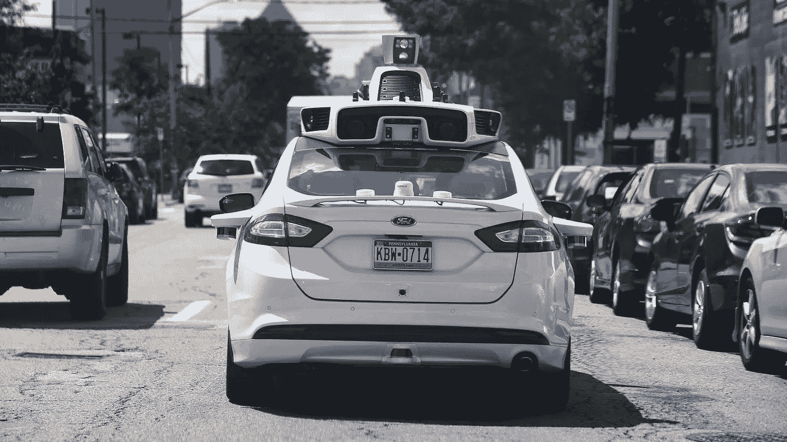

# 在谷歌云平台上处理敏感数据

> 原文：<https://medium.com/google-cloud/handling-sensitive-data-on-the-google-cloud-platform-12dac6a6b044?source=collection_archive---------1----------------------->

作者维克多·桑克和斯蒂安·德库伯，军情六处工程师@军情六处

数字世界中的隐私在公众意识中越来越重要。我们与无数不同的公司和政府共享大量数据。他们可能会利用这些数据做好事，他们甚至可能在大多数时候负责任地使用这些数据，但隐私不仅仅是表现良好。它是关于试图以这样一种方式建立系统，即使在未来，当法律、规范和道德发生变化时，也没有人能够使用这些数据来反对原始所有者。这不是关于你可能必须隐藏什么，**而是关于不允许任何人替你决定。**

这就是 GDPR 出现的原因。它并没有禁止公司使用你的数据，它只是**要求你有选择权**。但即使一家公司被允许使用这些个人数据，在数据保护和安全方面也有严格的规定要遵循。除了在生产环境中，不允许使用个人数据之类的规则，以及严格的加密要求，促使公司认真审视他们是如何处理数据的。

在 ML6，**我们经常从事需要我们处理敏感数据的机器学习项目**。近年来，深度学习的突破和 TensorFlow 等软件的发布为令人兴奋的新软件应用扫清了道路，这些应用通常涉及图像、音频或文本文件等非结构化数据。**然而，识别和屏蔽非结构化数据中的敏感部分并不总是简单明了的，**有时甚至无法使用基于规则的方法。在本文中，我们将**说明如何使用谷歌云机器学习服务来识别和屏蔽非结构化数据集中的敏感数据**。我们将从一些 Google 云视觉示例开始，然后强调如何通过结合云视觉和云自然语言来解决更复杂的问题。正如我们将展示的，这些服务功能强大，利用最先进的模型获得高度准确的结果，并且可以轻松集成到现有服务中或作为上游处理管道。

为了跟进，你需要创建一个谷歌云平台(GCP)项目。如果你还没有账户:试用期持续 1 年，你可以花 300 美元。在这里创建你的第一个项目[，并确保](https://console.cloud.google.com/cloud-resource-manager)[启用](https://cloud.google.com/billing/docs/how-to/modify-project)。谷歌云控制台是一个通用的地方，在这里你可以管理你想在 GCP 做的任何事情。在我们的例子中，我们需要**云视觉 API** 和**云自然语言 API** 。

为了认证，你需要创建一个 [**服务账户**](https://console.cloud.google.com/apis/credentials/serviceaccountkey) ，它基本上允许你编写的任何软件独立访问 GCP 项目。从下拉菜单中选择**新服务账户**并输入名称。出于我们的测试目的，让我们只给该帐户**所有者角色**，这样它就可以访问所有内容。最后一步，下载 **JSON keyfile** ，并将环境变量**GOOGLE _ APPLICATION _ CREDENTIALS**设置为它的路径。您的程序将使用这个密钥文件作为一种身份验证形式。

设置 GOOGLE_APPLICATION_CREDENTIALS 环境变量来设置身份验证

**用谷歌云视觉** 屏蔽车牌在全球范围内，仅在 2017 年我们就集体拍摄了约 **1.2 万亿张照片。所有这些数据都被用于机器学习应用，从物体检测到无人驾驶汽车。但在很多场景中，图像的部分对机器学习模型来说既不重要，又高度敏感。自动驾驶汽车其实不在乎车牌，只在乎有障碍。谷歌街景也有同样的问题:行人的脸对于一个好的街景来说是不必要的，但他们仍然是可见的，我们想保护这些人的隐私。**

谷歌的云视觉 API 能够在图像中进行强大的对象和文本检测。你可以在 https://cloud.google.com/vision/亲自尝试一下

现在是有趣的部分:**代码**！

我们从进口开始。谷歌云包中的视觉模块能够与 GCP 的视觉 API 对话。我们将向它发送汽车图片，并希望检测它们的牌照。我们使用 PIL 打开图像，绘制隐藏车牌的黑盒并保存图像。我们使用 io 来打开映像和操作系统，以确保路径跨平台工作。

你可以在代码的注释中看到对每个组件的解释，但基本上我们创建了一个函数，它将图像的路径作为输入，并保存图像的审查版本。注意，也可以通过 REST API 调用大多数 Google 云服务，包括这里讨论的那些。下面是一个脚本工作的例子。

正常图像

车牌被遮住了！

**掩蔽人脸** 现在我们有了基本代码，知道该做什么，我们可以将这种方法应用到云视觉识别的其他各种类别:人脸、地标、徽标……下面是扩展我们之前的示例的代码，使其具有检测人脸的能力。您可以尝试一下，并插入上述每个类别，作为匿名化您的数据的附加方法。

正常人玩得开心

正常人私下找乐子

这段代码看起来和上面的几乎一样！多酷啊。这非常容易做到，你可以创建尽可能多的这些功能(甚至组合它们)，并通过它们运行你的照片进行完整的匿名扫描。

**匿名商店收据:云视觉和云自然语言**

在车牌示例中，我们使用云视觉通过检测和屏蔽图像中的所有文本来模糊车牌。如果我们只想屏蔽某些类型的文本呢？输入云自然语言。自然语言 API 提供开箱即用的实体识别、情感分析甚至语法分析，目前支持 10 种主要语言。

假设我们有商店收据扫描数据集，出于隐私原因，我们希望屏蔽掉客户或员工的姓名。简单地检测和屏蔽所有文本会导致我们丢弃所有信息。另一种方法是首先使用 Vision API 从扫描中提取所有文本，然后使用实体识别来检测哪些文本实际上是名称。

云自然语言提供现成的语义文本分析和实体识别。对于我们的商店收据，API 可以帮助我们识别文档中的名字。结合云视觉，很容易建立一个管道，屏蔽图像中的名称。[https://cloud.google.com/natural-language/](https://cloud.google.com/natural-language/)

一旦我们确定了名称，就可以直接使用上面的代码将其屏蔽掉:

左图:我们扫描的商店收据。右图:通过云视觉和云自然语言，我们只需几行代码就可以匿名化收据，而不会丢失任何其他信息。

就实现而言，与前面示例的主要区别是对云自然语言的额外调用。实际上，这意味着只需要两行额外的代码:

**云语音和云视频** 除了视觉和自然语言服务，GCP 还提供用于语音到文本以及视频分析和注释的 API。虽然我们不会在这里讨论这些服务，但是它们显然也可以用于识别和屏蔽敏感数据。一个例子是从语音样本中自动提取和屏蔽姓名(例如，客户服务电话)，首先通过云语音转换为文本，然后调用云自然语言进行实体识别。

**云数据丢失防护** 一个额外的选择是利用 GCP 的数据丢失防护 API。它主要针对文本数据，并允许检测和编辑敏感数据，如信用卡号码，电话号码和姓名。此外，它还可以处理文本流，这样，在数据写入磁盘之前，就可以对其进行编辑。因此，它非常适合实时应用。

**但是，我的数据发送到 Google Cloud 时安全吗？** 是的。通过 HTTPS 向 GCP 服务发送数据，通过 TLS 连接确保安全性，这意味着您可以确保将数据发送到正确的接收方，并且您的数据在传输过程中是加密的。更普遍的情况是，谷歌云平台在将数据写入磁盘之前，默认会对所有数据进行加密。此外，每个数据块的加密密钥本身都是用一组主密钥加密的，GCP 提供了多种管理这些密钥的方法，从自动管理到由客户管理主密钥并保存在内部。

在 ML6，我们在将机器学习集成到软件产品方面拥有丰富的经验，无论是通过使用谷歌云 API 还是通过构建定制解决方案来解决更复杂的问题。对于任何项目，隐私保护都是我们优先考虑的事情，我们相信我们在解决未来复杂的 ML 问题上处于领先地位。

要了解更多关于 GCP 机器学习 API 的信息，请参考[本博客](https://blog.ml6.eu/digitizing-and-cataloging-the-boekentoren-book-tower-ffc0070793ac) t，其中我们讨论了如何使用云视觉为根特大学数字化超过一百万张目录卡。