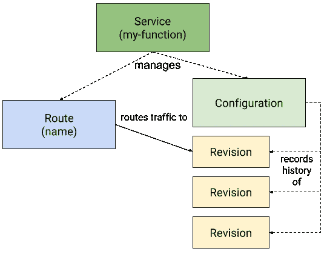
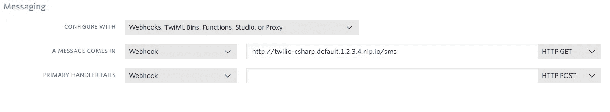

# 动手实践—第一部分

> 原文：<https://medium.com/google-cloud/hands-on-knative-part-1-f2d5ce89944e?source=collection_archive---------0----------------------->


最近我一直在调查 [Knative](https://github.com/knative/docs) 。在这个由 3 部分组成的博客系列中，我想解释一下我的收获，并展示一些我在 GitHub 上发布的[技巧教程](https://github.com/meteatamel/knative-tutorial)中的例子。

# Knative 到底是什么？

Knative 是一个开源构建块集合，用于运行在 Kubernetes 上的无服务器容器。

此时，您可能想知道:“Kubernetes，无服务器，这是怎么回事？”但是，仔细想想，还是有道理的。Kubernetes 是非常受欢迎的容器管理平台。应用程序开发人员希望以无服务器方式运行他们的代码。Knative 通过一组构建模块将两个世界结合在一起。

谈到构造块，它由 3 个主要组件组成:

*   [Knative Serving](https://github.com/knative/docs/tree/master/serving) 用于无服务器容器的快速部署和自动扩展。
*   [Knative Eventing](https://github.com/knative/docs/tree/master/eventing) 用于松散耦合、事件驱动的服务。
*   [Knative Build](https://github.com/knative/docs/tree/master/build) 轻松实现代码到注册中心容器的工作流。

让我们从被动发球开始。

# 什么是 Knative 发球？

简而言之，Knative Serving 允许快速部署和自动伸缩无服务器容器。您只需指定要部署的容器，Knative 负责如何创建该容器以及将流量路由到该容器的细节。一旦你把你的无服务器容器部署成一个 Knative 服务，你就可以获得自动伸缩、每次配置改变的修改、不同修改之间的流量分流等特性。

# Hello World 上菜

要将您的代码部署为 Knative 服务，您需要:

1.  将你的代码容器化，并将图像推送到公共注册中心。
2.  创建一个服务 yaml 文件，告诉 Knative 在哪里可以找到容器映像及其任何配置。

在我的 Knative 教程的 [Hello World Serving](https://github.com/meteatamel/knative-tutorial/blob/master/docs/01-helloworldserving.md) 部分，我详细描述了这些步骤，但在这里重述一下，这是最小 Knative 服务定义`service-v1.yaml`的样子:

```
apiVersion: serving.knative.dev/v1alpha1
kind: Service
metadata:
  name: helloworld-csharp
  namespace: default
spec:
  runLatest:
    configuration:
      revisionTemplate:
        spec:
          container:
            # replace {username} with your DockerHub 
            image: docker.io/{username}/helloworld-csharp:v1
            env:
              - name: TARGET
                value: "C# Sample v1"
```

`runLatest`暗示我们希望使用指定的容器和配置立即部署最新版本的代码。部署服务:

```
kubectl apply -f service-v1.yaml
```

在这一点上，你会看到一些东西被创建。首先，创建一个 Knative 服务及其 pod。其次，创建一个配置来捕获 Knative 服务的当前配置。第三，创建修订作为当前配置的快照。最后，创建一个路由，将流量定向到新创建的 Knative 服务:

```
kubectl get pod,ksvc,configuration,revision,route
NAME                                                      READY     STATUS    RESTARTS   
pod/helloworld-csharp-00001-deployment-7fdb5c5dc9-wf2bp   3/3       Running   0          

NAME                                            
service.serving.knative.dev/helloworld-csharp   

NAME                                                  
configuration.serving.knative.dev/helloworld-csharp   

NAME                                                   
revision.serving.knative.dev/helloworld-csharp-00001   

NAME                                          
route.serving.knative.dev/helloworld-csharp
```

# 更改配置

在 Knative Serving 中，每当您更改[服务](https://github.com/knative/serving/blob/master/docs/spec/spec.md#service)的[配置](https://github.com/knative/serving/blob/master/docs/spec/spec.md#configuration)时，它都会创建一个新的[版本](https://github.com/knative/serving/blob/master/docs/spec/spec.md#revision)，这是代码的一个时间点快照。它还创建了一条新的[路由](https://github.com/knative/serving/blob/master/docs/spec/spec.md#route)，新版本将开始接收流量。



在我的 Knative 教程的 [Change Configuration](https://github.com/meteatamel/knative-tutorial/blob/master/docs/03-changeconfig.md) 部分，您可以看到更改 Knative 服务的环境变量或容器映像是如何触发新版本的创建的。

# 流量分流

在 Knative 中，您可以非常容易地在不同版本的服务之间划分流量。例如，如果您想要推出新版本(0004)并将 20%的流量路由到该版本，您可以执行以下操作:

```
apiVersion: serving.knative.dev/v1alpha1
kind: Service
metadata:
  name: helloworld-csharp
  namespace: default
spec:
  release:
    # Ordered list of 1 or 2 revisions. 
    # First revision is traffic target "current"
    # Second revision is traffic target "candidate"
    revisions: ["helloworld-csharp-00001", "helloworld-csharp-00004"]
    rolloutPercent: 20 # Percent [0-99] of traffic to route to "candidate" revision
    configuration:
      revisionTemplate:
        spec:
          container:
            # Replace {username} with your actual DockerHub
            image: docker.io/{username}/helloworld-csharp:v1
            env:
              - name: TARGET
                value: "C# Sample v4"
```

请注意，我们从`runLatest`模式更改为`release`模式，以便为我们的服务分流流量。

我的 Knative 教程中的[流量分割](https://github.com/meteatamel/knative-tutorial/blob/master/docs/04-trafficsplitting.md)部分有更多的例子，比如如何在现有版本之间分割流量。

# 与其他服务集成

Knative 服务非常适合与其他服务集成。例如，您可以使用 Knative 服务作为 Twilio 等外部服务的 webhook。如果您有 Twilio 号码，您可以回复通过电话服务发送到该号码的短信。

[与 Twilio 集成](https://github.com/meteatamel/knative-tutorial/blob/master/docs/05-twiliointegration.md)我的 Knative 教程中有详细的步骤，但本质上可以归结为创建代码来处理 Twilio 消息:

```
[Route("[controller]")]
    public class SmsController : TwilioController
    {
        [HttpGet]
        public TwiMLResult Index(SmsRequest incomingMessage)
        {
            var messagingResponse = new MessagingResponse();
            messagingResponse.Message("The Knative copy cat says: " + incomingMessage.Body);
            return TwiML(messagingResponse);
        }
    }
```

从 it 中定义有价值的服务:

```
apiVersion: serving.knative.dev/v1alpha1
kind: Service
metadata:
  name: twilio-csharp
  namespace: default
spec:
  runLatest:
    configuration:
      revisionTemplate:
        spec:
          container:
            # Replace {username} with your actual DockerHub
            image: docker.io/{username}/twilio-csharp:v1
```

然后将 Knative 服务指定为 Twilio SMS 消息的 webhook:



就这样了。在下一篇文章中，我将谈论[决定性事件](https://github.com/knative/docs/tree/master/eventing)。