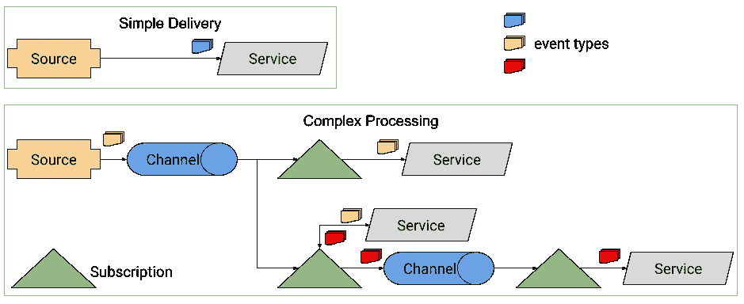

# 动手实践—第二部分

> 原文：<https://medium.com/google-cloud/hands-on-knative-part-2-a27729f4d756?source=collection_archive---------0----------------------->

在我的[上一篇文章](/google-cloud/hands-on-knative-part-1-f2d5ce89944e)中，我谈到了用于快速部署和自动伸缩无服务器容器的[主动服务](https://github.com/knative/docs/tree/master/serving)。如果您希望您的服务由 HTTP 调用同步触发，那么 Knative Serving 非常有用。然而，在无服务器的微服务世界中，异步触发器更加常见和有用。这时候 [Knative Eventing](https://github.com/knative/docs/tree/master/eventing) 开始发挥作用。

在 Knative 系列实践的第二部分中，我想介绍 Knative Eventing，并展示一些来自我的 [Knative 教程](https://github.com/meteatamel/knative-tutorial)的关于如何将其与各种服务集成的例子。

# 什么是 Knative Eventing？

Knative Eventing 与 Knative Serving 一起工作，它为松散耦合的事件驱动服务提供了原语。典型的 Knative 事件架构如下所示:



有 4 个主要组件:

*   **Source** (又名 Producer)从实际的源中读取事件，并向下游转发到通道，或者直接转发到服务。
*   **通道**从源接收事件，保存到它的底层存储(稍后将详细介绍)并扇出到所有订阅者。
*   **订阅**沟通渠道和服务(或另一个渠道)。
*   **服务**(又名消费者)是消费事件流的 Knative 服务。

让我们更详细地看看这些。

# 来源、渠道和订阅

Knative Eventing 的最终目标是将事件从一个源路由到一个服务，它使用我之前提到的原语来完成:源、通道和订阅。

**Source** 从实际来源读取事件，并将它们转发到下游。截至今天，Knative 支持从 [Kubernetes](https://github.com/knative/docs/tree/master/eventing#kuberneteseventsource) 、 [GitHub](https://github.com/knative/docs/tree/master/eventing#githubsource) 、 [Google Cloud Pub/Sub](https://github.com/knative/docs/tree/master/eventing#gcppubsubsource) 、 [AWS SQS 主题](https://github.com/knative/docs/tree/master/eventing#awssqssource)、[容器](https://github.com/knative/docs/tree/master/eventing#awssqssource)和 [CronJobs](https://github.com/knative/docs/tree/master/eventing#cronjobsource) 中读取事件。

一旦事件被拉入 Knative，它需要保存在内存中或更持久的地方，如 Kafka 或 Google Cloud Pub/Sub。这发生在**通道上。**它有多个[实现](https://github.com/knative/docs/tree/master/eventing/channels)来支持不同的选项。

从通道，事件被传递到所有感兴趣的 Knative 服务或其他通道。这可能是一对一或扇出。**订阅**决定了这种交付的性质，在渠道和 Knative 服务之间起到了桥梁的作用。

现在我们已经了解了 Knative eventing 的基础，让我们来看一个具体的例子。

# 你好世界活动

对于 Hello World Eventing，让我们从 Google Cloud Pub/Sub 读取消息，并在 Knative 服务中将其注销。我的 [Hello World Eventing 教程](https://github.com/meteatamel/knative-tutorial/blob/master/docs/06-helloworldeventing.md)有所有的细节，但在这里重述一下，这是我们需要设置的:

1.  一个 **GcpPubSubSource** 从 Google Cloud Pub/Sub 读取消息。
2.  一个**通道**将消息保存在内存中。
3.  一个**订阅**将频道链接到 Knative 服务。
4.  一个 **Knative 服务**用于接收消息和注销。

`gcp-pubsub-source.yaml`定义 GcpPubSubSource。它指向一个名为`testing`的发布/订阅主题，它拥有访问发布/订阅的凭证，并且还指定了应该将哪些通道事件转发给它，如下所示:

```
apiVersion: sources.eventing.knative.dev/v1alpha1
kind: GcpPubSubSource
metadata:
  name: testing-source
spec:
  **gcpCredsSecret**:  # A secret in the knative-sources namespace
    name: google-cloud-key
    key: key.json
  googleCloudProject: knative-atamel  # Replace this
  **topic: testing**
  sink:
    apiVersion: eventing.knative.dev/v1alpha1
 **kind: Channel
    name: pubsub-test**
```

接下来，我们用`channel.yaml`定义通道。在这种情况下，我们只是将消息保存在内存中:

```
apiVersion: eventing.knative.dev/v1alpha1
kind: Channel
metadata:
  name: pubsub-test
spec:
  provisioner:
    apiVersion: eventing.knative.dev/v1alpha1
    kind: ClusterChannelProvisioner
    name: in-memory-channel
```

继续创建源和通道:

```
kubectl apply -f gcp-pubsub-source.yaml
kubectl apply -f channel.yaml
```

您可以看到源和通道已创建，并且还创建了一个源窗格:

```
kubectl get gcppubsubsource
NAME             AGE
testing-source   1mkubectl get channel
NAME          AGE
pubsub-test   1mkubectl get pods
NAME                                              READY     STATUS    
gcppubsub-testing-source-qjvnk-64fd74df6b-ffzmt   2/2       Running
```

最后，我们可以创建 Knative 服务，并在一个`subscriber.yaml`文件中将它链接到订阅频道:

```
apiVersion: serving.knative.dev/v1alpha1
kind: **Service**
metadata:
  name: message-dumper-csharp
spec:
  runLatest:
    configuration:
      revisionTemplate:
        spec:
          container:
            # Replace {username} with your actual DockerHub
            image: docker.io/{username}/message-dumper-csharp:v1---
apiVersion: eventing.knative.dev/v1alpha1
kind: Subscription
metadata:
  name: gcppubsub-source-sample-csharp
spec:
  channel:
    apiVersion: eventing.knative.dev/v1alpha1
 **kind: Channel
    name: pubsub-test**
  subscriber:
    ref:
      apiVersion: serving.knative.dev/v1alpha1
 **kind: Service
      name: message-dumper-csharp**
```

如你所见，`message-dumper-csharp`只是一个常规的 Knative 服务，但它是通过订阅的 Knative 事件异步触发的。

```
kubectl apply -f subscriber.yamlservice.serving.knative.dev "message-dumper-csharp" created
subscription.eventing.knative.dev "gcppubsub-source-sample-csharp" configured
```

一旦你`kubectl apply`了所有的 yaml 文件，你就可以使用 gcloud 向 Pub/Sub topic 发送消息:

```
gcloud pubsub topics publish testing --message="Hello World"
```

您应该能够看到为该服务创建的窗格:

```
kubectl get pods
NAME                                                      READY
gcppubsub-testing-source-qjvnk-64fd74df6b-ffzmt           2/2       Running   0          3m
**message-dumper-csharp-00001-deployment-568cdd4bbb-grnzq **  3/3       Running   0          30s
```

该服务将 Base64 编码的消息记录在`Data`下:

```
info: message_dumper_csharp.Startup[0]
      C# Message Dumper received message: {"ID":"198012587785403","Data":"SGVsbG8gV29ybGQ=","Attributes":null,"PublishTime":"2019-01-21T15:25:58.25Z"}
info: Microsoft.AspNetCore.Hosting.Internal.WebHost[2]
      Request finished in 29.9881ms 200
```

查看我的 [Hello World Eventing 教程](https://github.com/meteatamel/knative-tutorial/blob/master/docs/06-helloworldeventing.md)，了解更多关于步骤和实际代码的细节。

# 与云存储和 Vision API 集成

当您试图以无缝方式连接完全不相关的服务时，Knative Eventing 确实大放异彩。在我的[与 Vision API 集成教程](https://github.com/meteatamel/knative-tutorial/blob/master/docs/08-visioneventing.md)中，我展示了如何使用 Knative Eventing 连接 Google 云存储和 Google Cloud Vision API。

云存储是一种全球可用的数据存储服务。存储桶可以配置为在保存图像时发出发布/订阅消息。然后，我们可以使用 Knative Eventing 监听这些发布/订阅消息，并将它们传递给 Knative 服务。在服务中，我们使用图像进行视觉 API 调用，并使用机器学习从图像中提取标签。所有的细节在教程中都有解释，但是我想在这里指出一些事情。

首先，在 Knative 中，所有出站流量都被默认阻止。这意味着默认情况下，您甚至不能从 Knative 服务调用 Vision API。这最初让我感到惊讶，所以请确保您[配置了网络出站访问](https://github.com/meteatamel/knative-tutorial/blob/master/docs/06-helloworldeventing.md#configuring-outbound-network-access)。

其次，每当一个图像被保存到云存储时，它都会发出 [CloudEvents](https://github.com/meteatamel/knative-tutorial/blob/master/docs/08-visioneventing.md#define-cloud-events) 。Knative Eventing 通常适用于 CloudEvents。您需要将传入的请求解析为 CloudEvents，并提取您需要的信息，例如事件类型和图像文件的位置:

```
var cloudEvent = JsonConvert.DeserializeObject<CloudEvent>(content);var eventType = cloudEvent.Attributes["eventType"];var storageUrl = ConstructStorageUrl(cloudEvent);
```

有了这些信息，很容易为图像构造一个存储 URL，并使用该 URL 进行 Vision API 调用。完整的源代码在这里[解释](https://github.com/meteatamel/knative-tutorial/blob/master/docs/08-visioneventing.md#add-vision-api)，但这里是相关部分:

```
var visionClient = ImageAnnotatorClient.Create();
var labels = await visionClient.DetectLabelsAsync(Image.FromUri(storageUrl), maxResults: 10);
```

一旦代码准备好了，我们就可以通过定义一个`subscriber.yaml`来将我们的服务与 Knative Eventing 挂钩。和以前很像。我们正在重用现有的源和通道，所以我们不必重新创建它们。我们刚刚创建了一个新的订阅，指向我们新的包含 Vision API 容器的 Knative 服务:

```
apiVersion: serving.knative.dev/v1alpha1
kind: **Service**
metadata:
  name: vision-csharp
spec:
  runLatest:
    configuration:
      revisionTemplate:
        spec:
          container:
            # Replace {username} with your actual DockerHub
            image: docker.io/{username}/**vision-csharp:v1**
---
apiVersion: eventing.knative.dev/v1alpha1
kind: **Subscription**
metadata:
  name: gcppubsub-source-vision-csharp
spec:
  channel:
    apiVersion: eventing.knative.dev/v1alpha1
 **kind: Channel
    name: pubsub-test**
  subscriber:
    ref:
      apiVersion: serving.knative.dev/v1alpha1
 **kind: Service
      name: vision-csharp**
```

一旦用`kubectl apply`创建了所有东西，每当您将一个映像保存到云存储桶时，您应该会看到该映像的 Knative service 日志标签。

例如，我有一张我最喜欢的地方的照片:


里约热内卢的伊帕内马海滩

当我将该图像保存到存储桶时，我可以在日志中看到来自 Vision API 的以下标签:

```
info: vision_csharp.Startup[0]
      This picture is labelled: Sea,Coast,Water,Sunset,Horizon
info: Microsoft.AspNetCore.Hosting.Internal.WebHost[2]
      Request finished in 1948.3204ms 200
```

如您所见，我们使用 Knative Eventing 将一个服务(云存储)连接到另一个服务(Vision API)。这只是一个例子，但可能性是无限的。在教程的[集成翻译 API](https://github.com/meteatamel/knative-tutorial/blob/master/docs/07-translationeventing.md) 部分，我展示了如何将发布/订阅连接到翻译 API。

这就是失败事件。在这个系列的下一篇也是最后一篇文章中，我将讨论 Knative Build。