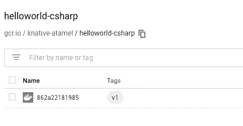

# 动手实践—第三部分

> 原文：<https://medium.com/google-cloud/hands-on-knative-part-3-d8731ad2f23d?source=collection_archive---------3----------------------->

在第 1 部分的[中，我谈到了无服务器容器的快速部署和自动伸缩的 Knative 服务。在](/google-cloud/hands-on-knative-part-1-f2d5ce89944e)[第 2 部分](/google-cloud/hands-on-knative-part-2-a27729f4d756)中，我谈到了如何通过 Knative Eventing 以松散耦合的方式连接服务。

在这个系列的第三部分也是最后一部分，我想谈谈[的 Knative Build](https://github.com/knative/docs/tree/master/build) ，并展示我的 [Knative 教程](https://github.com/meteatamel/knative-tutorial)中的几个例子。

# 什么是 Knative Build？

Knative Build 基本上允许你从源代码到注册表中的容器映像。例如，您可以编写一个构建来从存储库中获取源代码，构建一个容器映像，将该映像推送到注册中心，然后运行该映像，所有这些都在 Kubernetes 集群中完成。

# Knative 构建原语

Knative Build 有 4 个主要原语:

1.  [构建](https://github.com/knative/docs/blob/master/build/builds.md):表示包含一个或多个步骤的集群内构建作业。
2.  [BuildTemplate](https://github.com/knative/docs/blob/master/build/build-templates.md) :一组有序的、参数化的构建步骤。
3.  [构建器](https://github.com/knative/docs/blob/master/build/builder-contract.md):构建步骤中的一个容器，它执行一个动作(例如构建一个图像)
4.  [ServiceAccount](https://github.com/knative/docs/blob/master/build/auth.md) :用于 DockerHub 等的认证。

我们来看一个具体的例子。

# Hello World Build

在我的 Knative 教程的 [Hello World Build](https://github.com/meteatamel/knative-tutorial/blob/master/docs/09-helloworldbuild.md#hello-world-build) 中，我们用 Kaniko 设计了一个 Build 来构建并推送一个容器到 Google Cloud [容器注册表](https://cloud.google.com/container-registry/docs/) (GCR)。

Kaniko 是一个从 Dockerfile 文件构建容器映像的工具，位于 Kubernetes 集群的容器内部。Kaniko 的优势在于它不依赖于 Docker 守护进程。

创建一个`build-helloworld-csharp-gcr.yaml`构建文件。它使用 Knative Build 下载“工作区”目录中的源代码，然后使用 Kaniko 作为构建器来构建映像并将其推送到 GCR:

```
apiVersion: build.knative.dev/v1alpha1
kind: Build
metadata:
  name: build-helloworld-csharp-gcr
spec:
  source:
    git:
      url: "https://github.com/knative/docs.git"
      revision: "v0.1.x"
    subPath: "serving/samples/helloworld-csharp/"
  steps:
  - name: build-and-push
    image: "gcr.io/kaniko-project/executor:v0.6.0"
    args:
    - "--dockerfile=/workspace/Dockerfile"
    # MY_GCP_PROJECT: Replace with the GCP Project's ID.
    - "--destination=gcr.io/MY_GCP_PROJECT/helloworld-csharp:knativebuild"
```

您可以通过简单地应用 yaml 文件来终止构建(并查看进度[，如教程中的](https://github.com/meteatamel/knative-tutorial/blob/master/docs/09-helloworldbuild.md#run-and-watch-the-build)所述):

```
kubectl apply -f build-helloworld-csharp-gcr.yaml
```

在构建结束时，您应该会看到一个推送到 GCR 的图像:



# 服务帐户的秘密

前面的例子不需要认证。如果您想推送至 DockerHub，而身份验证不是可选的，该怎么办？我的 [Docker Hub 构建教程](https://github.com/meteatamel/knative-tutorial/blob/master/docs/10-dockerbuild.md)详细解释了这些步骤，但是在这里回顾一下，你需要:

1.  用 Base64 编码的用户名和密码在 Kubernetes 中为 DockerHub 创建一个秘密。
2.  在 Kubernetes 中创建一个使用该密码的 ServiceAccount。
3.  在 Knative 中创建一个使用该 ServiceAccount 的构建。

构建定义将与之前非常相似，除了它有一个用于身份验证的额外的 ServiceAccount 部分:

```
apiVersion: build.knative.dev/v1alpha1
kind: Build
metadata:
  name: build-helloworld-csharp-docker
spec:
  **serviceAccountName: build-bot** 
  source:
    git:
      url: "https://github.com/knative/docs.git"
      revision: "v0.1.x"
    subPath: "serving/samples/helloworld-csharp/"
  steps:
  - name: build-and-push
    image: "gcr.io/kaniko-project/executor:v0.6.0"
    args:
    - "--dockerfile=/workspace/Dockerfile"
    # Replace {username} with your actual DockerHub
    - "--destination=docker.io/{username}/helloworld-csharp:knativebuild"
```

# BuildTemplates 和 Kaniko

到目前为止，我们手工定义了构建中需要的所有步骤。BuildTemplate 允许您将构建步骤创建为模板，并在不同的构建中重用这些步骤。[使用 Knative 将无服务器应用程序部署到 Kubernetes codelab](https://codelabs.developers.google.com/codelabs/knative-intro/#12) 展示了如何创建自己的定制模板。

Knative 还附带了许多[构建模板](https://github.com/knative/build-templates)，您可以在构建中重用它们。其中一个模板是给 Kaniko 的。让我们安装该模板，以便在我们的构建中更容易使用 Kaniko:

```
kubectl apply -f https://raw.githubusercontent.com/knative/build-templates/master/kaniko/kaniko.yaml
```

检查模板是否已安装:

```
kubectl get buildtemplate
NAME      AGE
kaniko    24m
```

在下一节中，我们将使用这个模板来运行自动构建。

# 自动构建

在 Knative 中，您可以使用构建步骤配置 Knative 服务。这允许 Knative 在服务发生变化时构建和推送容器映像。我个人不把服务和构建混为一谈，特别是对于生产，但是对于测试来说这可能是一个好的选择。

我在我的教程的[自动构建](https://github.com/meteatamel/knative-tutorial/blob/master/docs/11-autobuild.md)部分有关于如何设置的详细说明，但是你基本上需要一个服务定义文件，如下所示:

```
apiVersion: serving.knative.dev/v1alpha1
kind: Service
metadata:
  name: helloworld-csharp-from-source
  namespace: default
spec:
  runLatest:
    configuration:
      **build**:
        apiVersion: build.knative.dev/v1alpha1
        kind: Build
        spec:
          serviceAccountName: build-bot
          source:
            git:
              url: https://github.com/meteatamel/knative-tutorial.git
              revision: master
            subPath: "serving/helloworld-csharp/"
          **template**:
            name: kaniko
            arguments:
              - name: IMAGE
                # Replace {username} with your actual DockerHub
                value: docker.io/{username}/helloworld-csharp:from-source
      revisionTemplate:
        spec:
          container:
            # Replace {username} with your actual DockerHub
            image: docker.io/{username}/helloworld-csharp:from-source
            imagePullPolicy: Always
            env:
              - name: TARGET
                value: "C# Sample from-source"
```

注意配置的内联构建部分，以及它如何使用我们之前安装的 Kaniko 模板。

一旦您应用了这个服务，您应该会看到创建了一个构建来构建和推送映像，不久之后，您应该会看到一个 Knative 服务启动并运行。

这就结束了我在 Knative 上的 3 部分系列。希望你喜欢它，并让我知道你还想读什么有意思的话题。