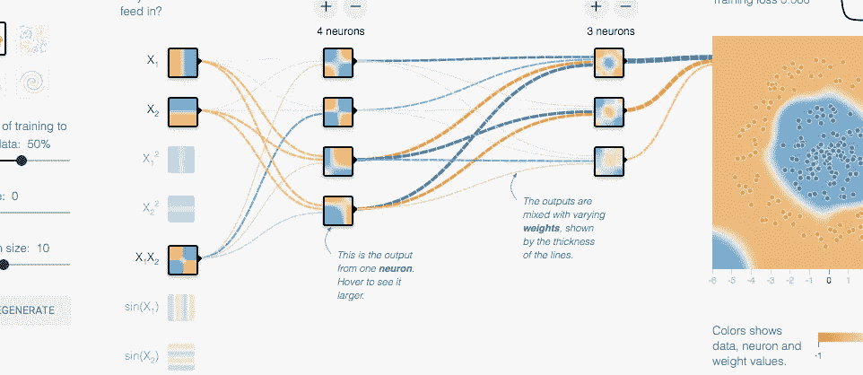

# 动手使用 Google 云平台、TensorFlow 和 big query——早期想法

> 原文：<https://medium.com/google-cloud/hands-on-with-google-cloud-platform-tensorflow-bigquery-early-thoughts-4d379cd693fc?source=collection_archive---------2----------------------->

本周，我在谷歌的悉尼办公室呆了两天，使用他们新的谷歌云平台(GCP ),并获得了一些使用 GCP 工具集的实践经验。

我有机会使用 GCP 工具来查询十亿行数据集，建立虚拟服务器和创建机器学习模型。

我们被鼓励去尝试……测试……随心所欲地测试 GCP。

两天后，我带着深刻的印象和激动的心情离开了。我觉得谷歌真的有这方面的东西。

它比谷歌的前身 App Engine 干净易用得多。老实说，应用引擎并没有那么好，谷歌将是第一个告诉你这一点的人。

谷歌云平台显然经过了重新思考和开发——具备数据分析、计算能力、机器学习、存储、数据处理等功能。

## **以下是我对 GCP 平台的一些早期想法:**

1.  首先，GCP 感受到了真正的弹性——弹性计算、弹性数据分析、弹性机器学习和弹性数据处理。它的建立是为了让你在 ***秒*** 内获得你需要的资源。例如，我们创建并使用三台虚拟机来运行一个机器学习库。在使用它们几分钟并得到我们的结果后，我们再次关闭它们。它们只使用了大约 175 秒，谷歌告诉我们，我们只需为这些机器被使用的那几秒钟付费。
2.  GCP 让数据科学家轻松进行机器学习——我能够在几分钟内创建并运行机器学习脚本。这真是一件令人兴奋的事情。它指出了一个未来，在这个未来，数据科学家在机械方面花费更少的时间，而专注于见解的解释和商业应用。
3.  BigQuery 轻松应对大数据处理。我能够在大约 17 秒内分析 200 亿行维基百科数据。是的——太棒了。我花了更多的时间来编写一行不言自明的 SQL 代码。
4.  易用性显然是 GCP 建设者们关注的焦点——GCP 在这方面感觉遥遥领先，尽管将来还需要一些改进(见下文)。当你有一张指南纸时，它很容易使用。界面是干净的。项目很容易组织，通过 GCP 工具集导航也很简单。
5.  虽然界面易于使用，但让某些工具端到端地工作需要用户以笨拙的方式跳来跳去。在一个示例中，数据处理任务要求我们创建几个虚拟机，切换屏幕，手动复制/粘贴它们的每个 IP 地址，将它们逐个粘贴到不同的屏幕，然后返回到原始屏幕以批准新服务器，最后打开命令行屏幕以将新机器添加到不同的流程区域。

总的来说，谷歌在 GCP 创造了一个伟大的平台，与市场相比，它在这个领域处于领先地位。

我花时间使用 GCP 工具集，思考如何用 IBM BlueMix/Watson 套件以及亚马逊的平台执行同样的任务。

差别在于易用性和弹性。在轻松创建机器、进行数据分析和运行机器学习脚本方面，GCP 觉得自己远远领先于 IBM 和亚马逊。就弹性而言，GCP 允许你一次运行几秒钟的虚拟机，这比你按小时付费的亚马逊更有弹性。

研讨会上的另一位与会者也在比较工具，他完美地总结了这一点，他说“其他工具使用起来有很高的障碍，有了这个我就可以让它工作了。”

他的话呼应了我在悉尼时的同样情绪。GCP 是为了“工作”而建造的。虽然各种流程都需要改进，但谷歌已经推出了一个伟大的产品和平台。

我很高兴开始将真实数据投入 GCP，并在野外测试该平台。在接下来的几周里，我将在现实世界的项目中尝试 BigQuery 和 TensorFlow，请关注我的更多内容。