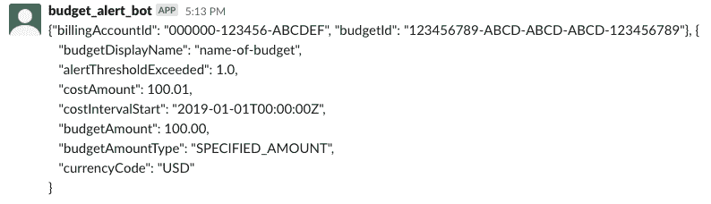

# 您最喜欢的沟通渠道收到预算通知了吗

> 原文：<https://medium.com/google-cloud/have-budget-notifications-come-to-your-favorite-comms-channels-611f6bb3592b?source=collection_archive---------1----------------------->

TL；DR——您可以使用程序化预算通知将预算更新发送到您最喜欢的通信渠道，如 Slack(以及任何您可以编码的东西),而不是等待预算提醒电子邮件。


*更多的预算可见性选项非常适合 FinOps 生命周期的信息阶段*

[的上一篇文章](https://cloud.google.com/blog/topics/developers-practitioners/costs-meet-code-programmatic-budget-notifications)介绍了程序化的预算通知，我们看到了一个打印一些信息的简单例子。因为我们可以用代码来响应预算通知，所以包括第三方集成在内的所有可能性都是可用的。

[Slack](https://slack.com/) 是一个流行的团队交流平台，所以它是发送预算信息和让你的团队了解你的预算状态的理想选择。在本帖中，我们将介绍向 Slack 发送预算通知的步骤。

**免责声明**:这些说明在写作的时候起作用，但是懈怠可能会改变事情。

# 配置时差

这是我们努力的方向:


成本和预测阈值未定义，因为此预算尚未达到阈值，所以这些参数不会出现在消息中

这是一条由 bot (gcp_cost_management_bot)发布的消息，它打印出一堆不同的预算通知细节。除了上一篇文章，这里没有太多的事情要做，但首先我们需要设置一个 Slack bot。

如果您还没有 Slack 帐户和工作区(但不是云监控帐户和工作区),您需要创建一个。我会把这部分的[解释留给他们](https://slack.com/help/articles/206845317-Create-a-Slack-workspace)，但是一旦你完成了，就去找[https://api.slack.com/apps](https://api.slack.com/apps)。你想做的第一件事是做一个新的应用程序。


考虑一个名字，比如“预算警报机器人”，或者甚至是“预算卫士超级英雄”。你想怎么叫都行，我不是你的老板

一旦你创建了你的应用程序，你可以配置很多关于你的机器人的其他东西，但是我们需要两个关键的信息来让它工作，一个 **OAuth 令牌**和一个**通道**。

要获得 OAuth 令牌，请查找标有“OAuth & Permissions”的菜单选项。在那里，找到 Bot 令牌作用域部分，然后单击“添加 OAuth 作用域”。发送消息所需的范围称为“聊天:写”,所以输入并添加它。


你可以用机器人做各种新奇的事情，但我喜欢保持简单

然后，向上滚动并查找“将应用程序安装到工作区”，这将引导您到一个许可屏幕，在那里您授权机器人发布消息。这样做之后，您将看到一个 OAuth 访问令牌，您应该复制并记下它，因为我们以后会用到它。


你不会以为我会把我的 OAuth Token 给你吧？

安全地存储之后，您唯一需要的就是一个您想要向其发送消息的通道。我使用了一个名为“预算提醒”的频道(不包括#)，但我建议使用一个新的频道，而不是一个现有的频道，至少在开始的时候！

**注意**:你还需要进入你的频道，运行一个命令，邀请机器人进入你希望它发布的频道。您需要根据您提供的名称更新机器人名称。

```
/invite @budget_alert_bot
```

# 回到云端！

现在我们有了令牌和通道，回到[谷歌云控制台](https://console.cloud.google.com)并创建一个新的谷歌云功能。如果您遵循了上一篇文章中的步骤，您可以保留或关闭 logger bot，因为 Pub/Sub 允许多个订阅者订阅一个主题。选择类似“预算-通知-时差”的名称，并确保选择相同的发布/订阅主题。如果你想复习创建一个函数，上一篇文章有更多的信息。

同样，我们将使用 Python 3.7，但这次我们将更改代码。默认情况下，左边有两个文件，main.py 和 requirements.txt。我不会在这里详细讨论 Python 细节，而是单击 requirements.txt 并添加这行代码:

```
slackclient==2.7.2
```

这里有一张图，以确保一切都是好的:


Google Cloud Functions 会自动处理很多依赖项，但是我们需要手动添加 Slack

之后，点击 main.py，使用这个代码([或者从这里抓取](https://cloud.google.com/billing/docs/how-to/notify#write-a-cloud-function)):

```
import base64
import json
import os
import slack
from slack.errors import SlackApiError
# See [https://api.slack.com/docs/token-types#bot](https://api.slack.com/docs/token-types#bot) for more info
BOT_ACCESS_TOKEN = 'xxxx-111111111111-abcdefghidklmnopq'
CHANNEL = 'C0XXXXXX'slack_client = slack.WebClient(token=BOT_ACCESS_TOKEN)def notify_slack(data, context):
    pubsub_message = datatry:
        notification_attr = json.dumps(pubsub_message['attributes'])
    except KeyError:
        notification_attr = "No attributes passed in"try:
        notification_data = base64.b64decode(data['data']).decode('utf-8')
    except KeyError:
        notification_data = "No data passed in"budget_notification_text = f'{notification_attr}, {notification_data}'try:
        slack_client.api_call(
            'chat.postMessage',
            json={
                'channel': CHANNEL,
                'text'   : budget_notification_text
            }
        )
    except SlackApiError:
        print('Error posting to Slack')
```

这不是太多的代码，但是让我们分解几个重要的部分:

```
BOT_ACCESS_TOKEN = 'xxxx-111111111111-abcdefghidklmnopq'
CHANNEL = 'C0XXXXXX'slack_client = slack.WebClient(token=BOT_ACCESS_TOKEN)
```

**注意**:如果不自己更新这部分代码，就不行。

在导入之后，这两行是您需要用之前安全保存的值进行更新的行。这两个都是需要替换的字符串，应该很清楚哪个值放在哪里。请注意，通道变量可以是您的通道的名称(如“预算-警报”)或通道 ID(如 C0123456789)。我们还用 bot 访问令牌设置了 Slack 客户机。

```
def notify_slack(data, context):
    pubsub_message = data
```

这是名为“notify_slack”的函数的开始，然后我们获取作为消息发布/订阅从预算中获取的数据。

**注意**:您还需要将函数的入口点从“hello_pubsub”更改为“notify_slack ”,因为这是我们想要调用的实际函数。如果不改变切入点，那就不行。

```
try:
        notification_attr = json.dumps(pubsub_message['attributes'])
    except KeyError:
        notification_attr = "No attributes passed in"
try:
        notification_data = base64.b64decode(data['data']).decode('utf-8')
    except KeyError:
        notification_data = "No data passed in"
```

在[的上一篇文章](https://cloud.google.com/blog/topics/developers-practitioners/costs-meet-code-programmatic-budget-notifications)中，我们回顾了 Pub/Sub 从预算中获得的消息，以及它发送给订户的内容。嗯，比我之前解释的要复杂一点(抱歉)。完整的消息实际上由两部分组成，**属性**和**数据**。你可以在这里阅读[的完整规范](https://cloud.google.com/billing/docs/how-to/budgets-programmatic-notifications#notification_format)，但是我们基本上只是获取属性(JSON)和数据(Base64 编码)，这样我们就可以使用它们作为有价值的数据。

```
budget_notification_text = f'{notification_attr}, {notification_data}'
```

这一行只是从属性和数据中获取值，并将它们放入一个字符串中。是的，这会很乱，但这只是我们现在的起点。

```
slack_client.api_call(
    'chat.postMessage',
    json={
        'channel': CHANNEL,
        'text'   : budget_notification_text
    }
)
```

最后，在这里我们尝试将消息发送到 Slack，指定通道和实际的消息。很简单。

所以，这就是我们需要的所有代码！确保如上所述替换 bot 令牌、通道名和函数入口点，并部署该函数！


部署功能可能需要一点时间，所以在等待的时候，请随意为自己泡一杯茶

一旦功能启动并运行，我们就可以继续测试它了！

# 证据就在通知里

类似于我们测试 logger 函数时，我们可以使用 Pub/Sub 发送测试消息，或者只是等待预算通知。我急得要命，就发个测试消息吧。进入发布/订阅页面，点击你的主题，然后点击发布消息。我们可以使用相同的测试体:

```
{
    "budgetDisplayName": "name-of-budget",
    "alertThresholdExceeded": 1.0,
    "costAmount": 100.01,
    "costIntervalStart": "2019-01-01T00:00:00Z",
    "budgetAmount": 100.00,
    "budgetAmountType": "SPECIFIED_AMOUNT",
    "currencyCode": "USD"
}
```

但是我们也可以添加一些属性来反映真正的通知可能是什么样子。两个重要的属性是记帐帐户的 ID 和预算的 ID，这两个属性都是唯一的。


*正如你能猜到的，那些不是我真正的唯一 id*

一旦你发送了消息，检查你的 Slack 频道，你应该会看到这样的内容:



好哇，是我们发的测试数据！

# 包装东西

正如您应该看到的，测试消息通过了，数据被发送到来自机器人的消息中！当然，如果您等待一段时间，您还会看到一条包含真实数据的实际预算通知消息，该消息会被发送到 Slack。

您可能会注意到，bot 消息与顶部的第一张图片不匹配(这些博客帖子确实很长)。这是因为您可以更新代码，而不仅仅是转储整个对象，您可以格式化特定于数据的消息和对您最有意义的格式。这篇文章很长，所以我把它留给你做练习！如果你想看更多的例子，[查看文档](https://cloud.google.com/billing/docs/how-to/notify)。