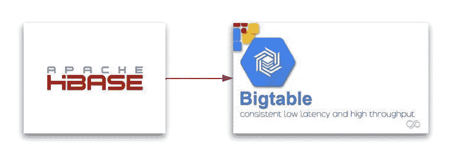
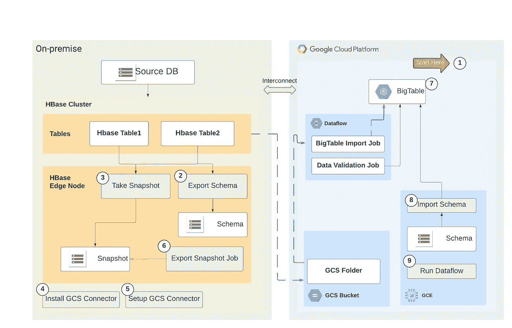
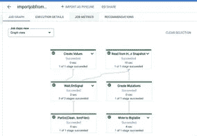
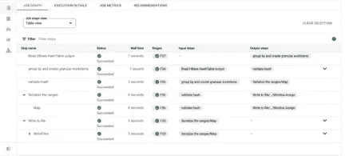

# 使用快照的 HBase 到 Bigtable 迁移策略—实验室

> 原文：<https://medium.com/google-cloud/hbase-to-bigtable-migration-strategy-using-snapshots-lab-37d3e6569def?source=collection_archive---------11----------------------->



Hbase 到 Bigtable 迁移

HBase 到云 Bigtable 的迁移包括从本地 HBase 表 GCP 云 Bigtable 中移动数据。在将数据从内部 Hbase 迁移到云时，Bigtable 是首选，因为它是一个完全托管的、基于云的 NoSQL 数据库，还具有 HBase 兼容客户端，从而最大限度地减少了应用程序更改。

虽然有许多关于 HBase 到 BigTable 迁移的参考资料，如[将数据从 HBase 迁移到云 Bigtable |将 Hadoop 迁移到 GCP | Google Cloud](https://cloud.google.com/architecture/hadoop/hadoop-gcp-migration-data-hbase-to-bigtable) ，但本博客的目的是提供详细的实施指南和样本数据集。

# 实验操作的先决条件:

1.  用 HBase 和 Zookeeper WebUI 创建一个 [Dataproc 集群](https://cloud.google.com/dataproc/docs/tutorials/spark-hbase#create_a_cluster)。
2.  为演示在 Google 云存储上创建一个样本[桶](https://cloud.google.com/storage/docs/creating-buckets#create_a_new_bucket)。
3.  创建一个[大表](https://cloud.google.com/bigtable/docs/creating-instance#creating-instance)实例。
4.  下载 [beam 导入 jar](https://search.maven.org/artifact/com.google.cloud.bigtable/bigtable-beam-import/2.0.0/jar) 和 [HBase 到 Bigtable 模式转换 jar](https://repo1.maven.org/maven2/com/google/cloud/bigtable/bigtable-hbase-1.x-tools/2.0.0/) 。
5.  对于本实验，使用了样本数据文件 [emp_data](https://github.com/avittala03/data-sample/blob/main/emp_data.csv) ，可以下载并用于测试。

# 概述和实施:

为了复制 HBase 到 Bigtable 迁移的场景，设置了一个预安装了 Hbase 的 Dataproc 集群。Hbase 的配置细节可以在 Dataproc 上 Hbase 的 WebUI 中找到。

由于从 HBase 区域服务器读取数据会直接影响实时 HBase 集群的性能，因此可以使用以下方法来捕获 HBase 中的数据并迁移到云 Bigtable:

1.  从 HBase 集群获取表的快照
2.  将快照导出到云存储桶
3.  启动一个数据流作业来读取云存储桶中的快照，并将数据导入复制集群中的云 Bigtable 表。

下图显示了迁移所需的详细步骤。



*云大表初始加载策略图*

下面是参考上图的详细步骤。

**步骤 1:迁移前状态**

在初始加载到 BigTable 之前，我们需要在 GCP 项目中准备和创建一些先决条件，如前面的先决条件步骤中所提到的。对于典型的客户环境，下面是在初始加载之前要做的关键事情。

*   创建 [GCP 项目](https://cloud.google.com/resource-manager/docs/creating-managing-projects#creating_a_project)
*   创建 GCP 服务，如[桶](https://cloud.google.com/storage/docs/creating-buckets#create_a_new_bucket)、 [GCE](https://cloud.google.com/compute/docs/instances/create-start-instance)
*   创建[服务帐户](https://cloud.google.com/iam/docs/creating-managing-service-accounts#creating)和所需的 IAM 角色和权限
*   通过使用 VM 实例获得[模式转换工具](https://repo1.maven.org/maven2/com/google/cloud/bigtable/bigtable-hbase-1.x-tools/2.0.0/)
*   使用虚拟机实例获取[导入工具](https://search.maven.org/artifact/com.google.cloud.bigtable/bigtable-beam-import/2.0.0/jar)

**步骤 2:从 Hbase 服务器导出模式**

对于本实验，从 [emp_data](https://github.com/avittala03/data-sample/blob/main/emp_data.csv) 示例数据文件创建一个示例表。

```
create 'emp_data',{NAME => 'cf'}
```

将样本数据从 csv 加载到 hbase 表中

```
hbase org.apache.hadoop.hbase.mapreduce.ImportTsv -Dimporttsv.separator=',' 
-Dimporttsv.columns='HBASE_ROW_KEY,cf:ename,cf:designation,cf:manager,cf:hire_date,cf:sal,cf:deptno' emp_data /user/aparnavittala/emp_data.csv
```

列出表的内容，以验证数据是否已加载。

```
scan 'emp_data'
```

注意:在 Hbase 中，我们有类似于模式/数据库的名称空间。在这个例子中，为了简单起见，我们使用了默认的名称空间。

根据需要定义环境变量。

```
PROJECT_ID=<PROJECT_ID>
INSTANCE_ID=<INSTANCE_ID>
TABLE_NAME_REGEX=<TABLE_NAME>
ZOOKEEPER_QUORUM=<ZOOKEEPER_QUORUM>
ZOOKEEPER_PORT=<ZOOKEEPER_PORT>
```

**步骤 2:从 Hbase 表中获取快照。**

通过从内部部署的边缘节点在 hbase shell 中执行以下命令来拍摄表快照。对于实验室，我们使用我们刚刚使用 dataproc Hbase 集群创建的表。

```
hbase> snapshot '<tableName>', '<snapshotName>'
hbase> snapshot 'emp_data', 'emp_data_snapshot'
```

注意:确保 hbase-site.xml 中的“*h base . snapshot . master . time out . millis*”和“*h base . snapshot . region . time out*”属性设置为足够大的数字，以避免拍摄快照时超时。如果出于备份目的定期拍摄快照，这些属性应该会得到适当的调整。

**步骤 3:创建用于验证的哈希**

接下来，在迁移完成后，创建用于验证的哈希。HashTable 是 HBase 提供的一个验证工具，它计算行范围的散列并将它们导出到文件中。您可以在目标表上运行同步表作业，以匹配哈希值并增强对迁移数据完整性的信心。

对我们刚刚导出的表运行以下命令:

```
hbase org.apache.hadoop.hbase.mapreduce.HashTable - batchsize=32000 - numhashfiles=20 \
emp_data /user/hbase/emp_data
```

**步骤 4:安装 GCS 连接器**

本实验不需要此步骤。但是，对于典型的迁移场景，请确保按照如下所述安装 GCS 连接器。

云存储连接器库将安装在 HBase 集群上，并进行一些配置更改。可以在 Hadoop 集群(例如边缘节点)上执行以下步骤来配置对云存储的访问:

1.  [下载云存储连接器](https://search.maven.org/search?q=g:com.google.cloud.bigdataoss%20AND%20a:gcs-connector%20AND%20v:hadoop2-*)(*GCS-connector-Hadoop 2–2 . 1 . 3-shaded . jar*)。确保阴影 jar 具有 *-shaded.jar* 后缀。
2.  为云存储连接器 JAR 文件创建一个包，并将该包分发到集群中的所有主机。
3.  创建一个服务帐户(如果尚未创建)，并下载 JSON 格式的私钥。

**步骤 5:设置 GCS 连接器**

修改 core-site.xml 的以下属性，并将其分发给集群中的所有节点

*   *fs。AbstractFileSystem.gs.impl*
*   *fs.gs.project.id*
*   *fs . GS . auth . service . account . enable*
*   *Google . cloud . auth . service . account . JSON . keyfile*
*   *fs . GS . http . transport . type*
*   *fs.gs.proxy.address(如果需要)*
*   *fs.gs.proxy.username(如果需要)*
*   *fs.gs.proxy.password(如果需要)*

修改 Hadoop 类路径以指向包中的云存储连接器 jar 文件。

```
export HADOOP_CLASSPATH=$HADOOP_CLASSPATH:/usr/lib/hadoop/lib/<gcs-connector-jar-file>
```

验证对云存储桶的访问。

```
hadoop fs -ls gs://<GCS-BUCKET>
```

**步骤 6:运行 Hbase 导出快照作业**

在 Hadoop 集群上的边缘节点上执行以下命令，将快照导出到云存储桶。

```
hbase org.apache.hadoop.hbase.snapshot.ExportSnapshot -snapshot 'emp_hbase_snapshot' -copy-to gs://<snapshot-bucket-name> -mappers 3 -bandwidth 40
```

*   使用*-映射器*选项控制导出作业中的映射器数量
*   使用*-带宽*选项限制要使用的带宽
*   或者，也可以通过使用*-dsnapshot . export . default . map . group*属性为每个映射器分配一定数量的 HFiles 来控制映射器的数量

完成客户表导出的预期时间取决于网络带宽和映射器将底层 HFiles 复制到云存储的并行性。

**步骤 7:** [**从控制台或命令行创建一个大表实例**](https://cloud.google.com/bigtable/docs/creating-instance#creating-instance) **。**

**步骤 8:导入表模式**

我们可以使用模式转换器工具，或者使用导入和导出模式文件的替代方法。

如果您的 HBase master 位于私有 VPC 中或者无法连接到互联网，您可以将 HBase 模式导出到一个文件中，并使用该文件在 Cloud Bigtable 中创建表。否则，我们可以使用模式转换器工具。

**使用模式转换器:**

在可以连接到 HBase 的主机上，定义模式文件的导出位置。

```
HBASE_EXPORT_PATH=gs://hbase_test_load/output/hbase-schema.json
```

从主机运行导出工具。

```
java \
-Dgoogle.bigtable.table.filter=emp_data\
-Dgoogle.bigtable.output.filepath=/home/aparnavittala/hbase-schema.json \
-Dhbase.zookeeper.quorum=hive-hbase-test-m:2181 \
-Dhbase.zookeeper.property.clientPort=2181 \
-jar bigtable-hbase-1.x-tools-2.0.0-jar-with-dependencies.jar
```

将模式文件复制到可以连接到 Google Cloud 的主机上。

```
gsutil cp /home/aparnavittala/hbase-schema.json gs://hbase_test_load/output/hbase-schema.json
```

使用模式文件在云 Bigtable 中创建表

```
gsutil cp gs://hbase_test_load/output/hbase-schema.json .
java \
-Dgoogle.bigtable.project.id=<PROJECT-ID> \
-Dgoogle.bigtable.instance.id=<BIGTABLE-INSTANCE-ID> \
-Dgoogle.bigtable.input.filepath=gs://hbase_test_load/output/hbase-schema.json \
-jar bigtable-hbase-1.x-tools-2.0.0-jar-with-dependencies.jar
```

通过检查日志中的以下两条消息，验证模式转换器是否已成功运行。

*19:09:19.520[main]INFO c . g . c . b . h . t . hbaseschematranslator—读取包含 1 个表的模式。*

*19:09:23.533[main]INFO c . g . c . b . h . t . hbaseschematranslator—在 Bigtable 中创建了表 emp_data。*

**或者**，我们可以按照[这个](http://If your HBase master is in a private VPC or can't connect to internet, you can export the HBase schema to a file and use that to create tables in Cloud Bigtable.)来导出和导入模式。

**第 9 步:运行数据流作业**

准备好要将数据迁移到的表后，就可以导入和验证数据了。

*   BigTable 导入作业

```
IMPORT_JAR="bigtable-beam-import-2.0.0-shaded.jar"
java -jar $IMPORT_JAR importsnapshot \
 - runner=DataflowRunner \
 - project=<PROJECT_ID> \
 - bigtableInstanceId=<BIGTABLE-INSTANCE-ID> \
 - bigtableTableId=emp_data \
 - hbaseSnapshotSourceDir=gs://<HBASE-SNAPSHOT-BUCKET> \
 - snapshotName=emp_hbase_snapshot \
 - stagingLocation=gs://<HBASE-SNAPSHOT-STAGING-BUCKET>/staging \
 - tempLocation=gs://<HBASE-SNAPSHOT-STAGING-BUCKET>/staging/temp \
 - maxNumWorkers=3 \
 - region=us-central1
```



数据流加载作业的屏幕截图

*   数据验证作业

```
java -jar bigtable-beam-import-2.0.0-shaded.jar sync-table \
 - runner=dataflow \
 - project=<PROJECT_ID> \
 - bigtableInstanceId=<BIGTABLE-INSTANCE-ID> \
 - bigtableTableId=emp_data \
 - outputPrefix=gs://<HBASE-LOAD-BUCKET>/output-emp_data-$(date +"%s") \
 - stagingLocation=gs://<HBASE-LOAD-BUCKET>/sync-table/sync-table/staging \
 - hashTableOutputDir=gs://<HBASE-LOAD-BUCKET>/hashtable/emp_data \
 - tempLocation=gs:gs://<HBASE-LOAD-BUCKET>/temp \
 - region=us-central1
```



验证作业的屏幕截图

在数据被导入和验证之后，初始加载活动就被认为完成了。

## **常见问题:**

1.  **GCS 连接器无法安装在 Hbase 集群上
    缓解措施:**在 HBase 集群上安装 GCS 连接器。Hbase 快照导出的推送机制是最常用且经过验证的方法。如果存在阻塞，请从 DataProc Hbase 中选择拉机制，这需要从身份验证和网络中进行额外的配置。
2.  **导出快照耗时太长
    缓解:**与其他操作相比，此步骤将运行更长时间。有许多因素会影响将数据从内部 Hbase 导出到 GCS 所需的时间。如果需要，我们可能需要将快照分成多个批次。减少对生产系统影响的另一个缓解措施是在低时段运行该操作。
3.  **从 GCS 到 BigTable 的数据加载花费太长时间
    缓解:**如果发生这种情况，根据监控中发现的瓶颈，考虑增加数据流节点或 BigTable 节点。
4.  **数据验证失败
    缓解:**如果在 BigTable 加载后立即运行验证作业，它可能会失败。在触发验证作业之前，请等待几分钟(~5 分钟)。如果作业仍然失败，请参考此处的[和](https://cloud.google.com/architecture/hadoop/hadoop-gcp-migration-data-hbase-to-bigtable#verify-hbase-data)。
5.  **h base 与 bitable 中的表名不同
    缓解:**有时我们可能想要更改 BigTable 上的表名。在这个场景中，我们可以使用 [this](https://github.com/googleapis/java-bigtable-hbase/tree/main/bigtable-hbase-1.x-parent/bigtable-hbase-1.x-tools#table-name-renaming) 文档并映射 Hbase 和 Big Table 的表名。