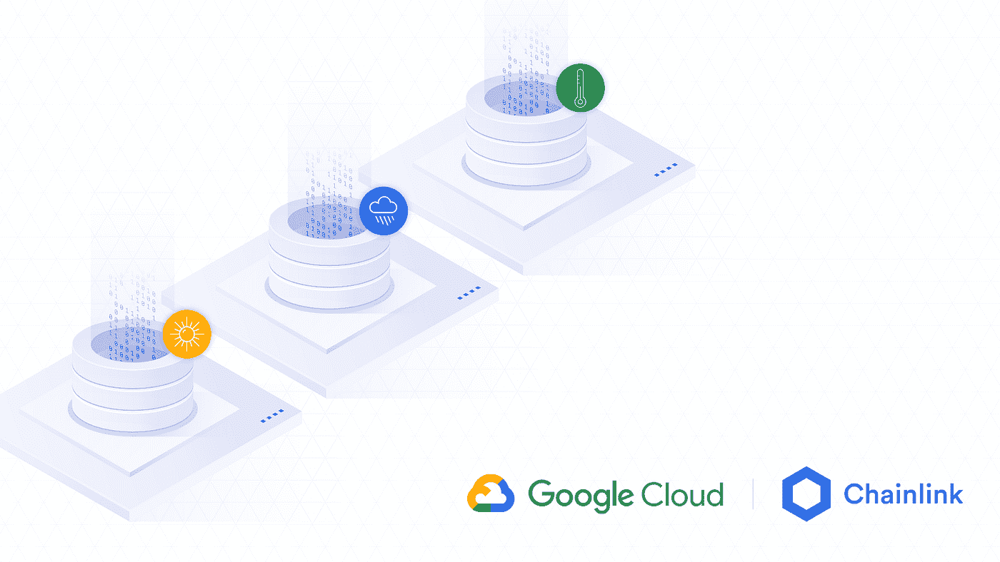
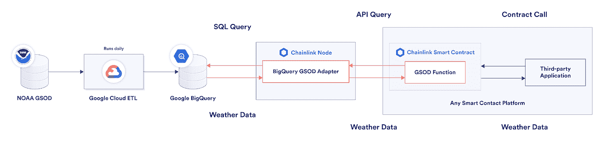

# 利用云数据集和区块链甲骨文抵御恶劣天气

> 原文：<https://medium.com/google-cloud/hedging-against-bad-weather-with-cloud-datasets-and-blockchain-oracles-7ba3e0150304?source=collection_archive---------0----------------------->

在本文中，我们展示了开放式天气数据和区块链技术，结合谷歌云的功能，如何创造经济效益，并通过可持续农业缓解气候变化。

意想不到的不利天气事件导致各行各业的经济损失，随着我们经历气候变化，这些事件变得越来越常见。这方面的例子包括干旱期间作物减产、暴风雪期间旅行路线中断、降雨量过多时体育赛事取消，以及大范围恶劣天气造成的生存风险和基础设施故障。

虽然我们还不具备控制天气的技术，但当事件本身更加可预测时，不利天气事件的影响可以得到缓解。幸运的是，当更多的数据可用时，可以做出更准确的预测。[谷歌云的公共数据集计划](https://cloud.google.com/public-datasets)托管数 Pb 的有用数据集，如历史天气和气候数据，企业可以立即访问这些数据，以优化天气风险的分析模型，并创建数据驱动的解决方案。这已经发生了；[用于天气预报的机器学习算法](https://cloud.google.com/press-releases/2020/1027/noaa)正被用于创造像天气保险这样的金融产品。

将天气数据直接提供给金融市场是减轻天气相关损失的另一个有希望的途径，并带来了改善预测本身的机会，因为拥有更准确天气模型的做市商将在天气预测资本市场中表现出色。

我之前描述了[混合区块链/云应用](https://cloud.google.com/blog/products/data-analytics/building-hybrid-blockchain-cloud-applications-with-ethereum-and-google-cloud)软件设计模式，在这篇博客文章中，我们将特别关注如何通过向新兴的[分散金融(DeFi)](https://blog.chain.link/analyzing-the-defi-ecosystem-and-the-many-ways-chainlink-can-accelerate-adoption/) 资本市场提供高质量的天气数据来实现该模式。由于这些市场对所有拥有互联网连接(无需许可)的参与者开放，并且可以根据明确定义和结构化的数据进行操作，因此它们为将天气数据驱动的金融产品立即推向全球市场提供了机会。

然而，随着潜在影响的增加，潜在风险也在增加。随着企业开始将智能合同(区块链网络上信任最小化的数字协议)纳入其业务流程，推动这些合同的数据必须具有高质量且安全可靠地交付。幸运的是，正如我们将要描述的，这些挑战是可以克服的。

关于数据质量，谷歌云在 BigQuery 中托管了来自美国国家海洋和大气管理局(NOAA)的[全球地表每日摘要](https://www.ncei.noaa.gov/access/metadata/landing-page/bin/iso?id=gov.noaa.ncdc:C00516) (GSOD)数据库。简而言之，GSOD 提供从 1929 年开始的超过 9000 个分布在全球的站点[的天气和气候观测的每日摘要。天气和气候数据来源于著名的数据提供商，包括 GPM 计划，这是美国国家航空航天局(NASA)和日本宇宙航空研究开发机构(JAXA)之间的一个合资项目，基于多卫星检索提供每三小时一次的全球降水地图。](https://gis.ncdc.noaa.gov/maps/ncei/cdo/daily)

在下一节中，我们将了解如何构建一个解决方案，通过 Chainlink(一个区块链 oracle 解决方案，为智能合约生态系统提供 300 多亿美元)将天气数据从 Google BigQuery 传送到托管最大 DeFi 市场的智能合约平台以太坊。最后，我们将讨论如何以及为什么这些数据可以最好地应用于发展[可持续农业](https://www.weforum.org/agenda/2021/06/blockchain-can-help-us-beat-climate-change-heres-how/)实践。

# 使用 Chainlink 将谷歌云的天气和气候数据集连接到智能合同

基于区块链的智能合同应用程序通过降低交易对手风险、加快结算和减少达成金融协议的摩擦，为企业提供了关键优势。将天气数据(如降雨量)作为输入，智能合约可以进一步实现预测市场，参与者可能同意以下条款:

*对于<价格>，如果<地理位置>的<天气测量>在<时间范围>* 内大于或小于<金额>的<，我们将同意在<结算时间>向买方进行<金额>的远期转账。

此类协议允许企业对冲温度、风速、降水和其他条件的极端天气波动。这种对冲会影响特定行业的盈利能力，在某些情况下还会影响其生存能力。

但是“链上”智能合约不能本地访问关于天气的外部“链外”输入。这是区块链的一个安全特性，也意味着需要一个被称为[区块链甲骨文](https://blog.chain.link/what-is-the-blockchain-oracle-problem/)的桥接组件来构建[混合区块链/云应用](https://cloud.google.com/blog/products/data-analytics/building-hybrid-blockchain-cloud-applications-with-ethereum-and-google-cloud)。

我与 Chainlink 的工程师合作，构建了一个适配器，使智能合约能够通过 BigQuery 查询 [NOAA GSOD 天气数据。GSOD 提供超过 9000 个气象站的每日测量数据，包括每个地点的温度、能见度、风速、降雨量等等。](https://console.cloud.google.com/marketplace/product/noaa-public/gsod)

该适配器在 Chainlink 支持的 50 多个平台上接受来自智能合约的天气数据请求。它将来自第三方应用程序的链上函数调用翻译成正确的形式，以检索 BigQuery 中托管的 GSOD 数据，并返回数据供下游使用。红色框/箭头是我们为这篇博文构建的组件。

源代码可在 [Github](https://gist.github.com/thodges-gh/26b2f745934d7113bdffc0f91b36d343) 上获得，您可以与地址为[0x6b 705 fc 5c 425 be 07 ebe 59d 09 aa 9f D2 c 0 df 88 cab 4](https://goerli.etherscan.io/address/0x6b705fc5c425be07ebe59d09aa9fd2c0df88cab4#code)的以太坊 Goerli 测试网和地址为[0x7f 7d 84789 ea FB 80 a6 ba 0 b 996d 37 a 06723 FCC 02 c 5](https://etherscan.io/address/0x7F7D84789eAfb80A6bA0B996D37A06723FCc02c5#code)的以太坊 Mainnet 上的 GSOD 数据进行交互。

应用程序开发人员可以向特定区域内的气象站请求数据，或者向离指定地点最近的气象站请求数据。

为了展示我们的解决方案，在 Goerli Testnet 上生成了来自以太坊智能合约的链上数据请求交易。这个契约有几个返回天气数据的函数，我们将在这里详细展示它们的一些例子。

虽然这些示例集中在特定位置(挪威卑尔根)，但是为了更加灵活，可以使用 [GeoJSON](https://en.wikipedia.org/wiki/GeoJSON) 数据结构或 [Geohash](https://en.wikipedia.org/wiki/Geohash) 来指定所请求的位置。

# 示例查询 1，固定位置:在时间段<start end="">内在挪威卑尔根测量的<average temperature="">是多少？</average></start>

这个[请求事务](https://goerli.etherscan.io/tx/0xa03bf1628ba27f75d5fa06cd4dec5af64bc2efc1da771c2c39e4fbda118b81cf)展示了智能合约调用的 requestAvgTemp()函数，使用 Chainlink 节点的预配置作业请求 2021 年 4 月 1 日至 5 月 1 日挪威卑尔根的平均温度。通过点击解码输入数据，可以在以太网扫描页面上查看请求者提供的输入日期。在请求事务中定义的地理坐标、时间跨度、聚合方法、天气类型和单位被离链 Chainlink 节点接收之后，以下输入被提供给节点的外部适配器:

在被外部适配器接收之后，在生成链上[响应事务](https://goerli.etherscan.io/tx/0xff4ce0bd043919c0ba4b84f04f1a5d17fa64d03c6146ea602e63f609499c79f2)之前，产生以下 5.29 C 的输出，该响应事务的值被编码为 uint256，并使用 Chainlink 节点的管道乘以 10^18 以支持十进制:

收到真实世界的天气数据后，使用智能合约可以利用这些数据来执行特定于应用程序的逻辑。

# 示例查询 2，固定位置:在时间段<start end="">内，挪威卑尔根的测量值<total rainfall="">是多少？</total></start>

除了获取挪威卑尔根的日平均温度之外，这个 Chainlink 节点和外部适配器组合还可以用于获取其他天气数据集，例如使用预先配置的作业获取挪威卑尔根的总降雨量。这个[请求事务](https://goerli.etherscan.io/tx/0x5159a36df43b37e9469a8dd9847c7156fa62904561ff4d6ea1902b82a1e82c2f)展示了智能合同调用的 requestTotalRain()函数，该函数使用预定义的地理坐标请求挪威卑尔根 2021 年 4 月 1 日至 5 月 1 日之间的总降雨量。请求智能合约给出的唯一输入是数据应该引用的时间范围。在处理该数据请求时，Chainlink 节点的外部适配器被给予以下输入有效负载:

通过 Google BigQuery 获取链外数据后，Chainlink 节点的外部适配器提供以下结果，指示给定时间范围内预定义地理区域的降雨量，然后通过链上[响应事务](https://goerli.etherscan.io/tx/0x0a50e4ed42bb8f191af1ec1290965b7d4a3ba4923f24083d4708d9c9722ed6b8)传递到链上，返回以 uint256 编码并乘以 10^18 以提供小数支持的结果:

# 示例查询 3，固定位置:在时间段<start end="">内在挪威卑尔根测量的<total hail="">是多少？</total></start>

由 Chainlink 节点提供的第三个示例作业允许 smart contracts 通过调用 requestHail()函数来查询给定日期范围内覆盖挪威卑尔根的坐标范围内是否有冰雹。像前面的作业一样，请求智能合同给出的唯一输入是要查询的时间段，如这个[请求事务](https://goerli.etherscan.io/tx/0x00b0bd009a37a9bfd390ab0439031bb076c84e0ae8d3aad66978c41ebd68959b)所示。没有冰雹的时间段返回零，而任何其他数值表示在该范围内的特定天数内出现了冰雹。在处理冰雹发生数据请求时，链环节点的外部适配器被给予以下输入有效载荷:

在接收到给定的有效负载后，Chainlink 节点的外部适配器从 BigQuery 获取天气数据，并提供以下输出，显示发生冰雹的天数，然后通过[响应事务](https://goerli.etherscan.io/tx/0x5f4353e7f2c0b6b9d002f82ba24c13847a1c19a09b7931e3ff85d148c843636d)在链上传递:

由于结果大于零，该结果表明在预定义的地理区域内至少有一天冰雹。通过使用此 Chainlink 节点，需要外部天气数据的智能合约可以从世界上一个或多个气象站所在的任何地理区域请求数据。

# 用智能合约推动下一代农作物保险

随着 NOAA 托管在 Google Cloud 上的天气和气候数据现在可以通过 Chainlink 直接在链上访问，智能合同开发人员可以创建预编程的作物保险协议，根据高质量的真实数据自动可靠地解决索赔。

随着此类协议市场的出现，企业获得了对冲风险的能力，无论其规模、管辖范围或位置如何，这使它们能够计划和安全地扩大业务，因为它们完全可以抵御不利天气事件。这些产品鼓励更多的可持续农业，并对土地使用变化有稳定作用，而土地使用变化是二氧化碳排放的主要来源。

类似地，通过建立基于智能合约的协议，保险商和保单持有人都可以更好地保证理赔是基于准确反映真实世界条件的数据进行的，从而为农作物保险行业带来了前所未有的透明度、可靠性和无许可准入。

此外，由于它们是通过公共智能合同构建的，因此可以在全球和微观范围内提供天气保险，而不会出现影响传统保险结算的不利因素和低效率，如延迟支付和主观调整。

# 利用混合区块链/云应用重新定义全球行业

智能合约生态系统中对高质量链外数据的需求继续快速增长，必须与行业重新定义的工具相匹配，以便智能合约开发人员能够构建他们设想的创新应用和用例。随着谷歌云和 Chainlink 在链上提供 NOAA 天气数据，可以创建智能合同作物保险协议等分散和无许可的应用程序，以提供以前无法获得的风险管理产品。

[混合区块链/云应用](https://cloud.google.com/blog/products/data-analytics/building-hybrid-blockchain-cloud-applications-with-ethereum-and-google-cloud)有能力重新定义金融经济，我们非常期待看到更多智能合同应用的诞生。智能合同作物保险有可能提高服务质量和执行保证，从而增加金融服务的可及性。我们预计，通过遵循本文中概述的模式，可以使用 Chainlink 和 GCP 上可用的各种公共数据构建许多其他应用程序。

我们期待看到开发人员和企业通过结合谷歌云平台和 Chainlink oracle 中间件来创建创新的智能合同应用程序。

# 了解更多信息

*   [探索谷歌云上的 GSOD 和其他公共数据集](https://cloud.google.com/solutions/datasets)
*   [探索使用 Chainlink Oracles 构建的其他解决方案](https://chain.link/solutions)