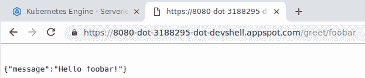
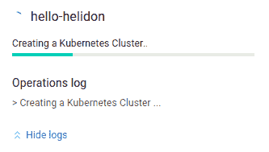

# Helidon 议员对谷歌 Kubernetes 引擎

> 原文：<https://medium.com/google-cloud/helidon-mp-on-google-kubernetes-engine-3e68396378b4?source=collection_archive---------0----------------------->

# 你看马，没有 [*](https://twitter.com/Caged/status/1039937162769096704/photo/1) ，没有库贝克！

凭借多年来在生产中运行 Kubernetes 的经验，谷歌现在提供了 [GKE](https://cloud.google.com/kubernetes-engine/) (Kubernetes 引擎)，这是一个完全托管的环境，使开发者能够使用打包成容器的几乎任何工具和框架。


对于 Java 开发人员来说，这提供了一个使用轻量级框架的机会，比如新发布的 [Helidon](http://helidon.io) ，特别是它的 Microprofile 风格(但实际上，以下步骤适用于许多类似的框架，不管使用什么语言)。

让我们从一些 Maven 脚手架开始(在我的例子中使用[云外壳](https://cloud.google.com/shell/)，因为它带有所有正确的[先决条件](https://helidon.io/docs/latest/#/getting-started/01_prerequisites)):

```
$ mvn archetype:generate -DinteractiveMode=false \
    -DarchetypeGroupId=io.helidon.archetypes \
    -DarchetypeArtifactId=helidon-quickstart-mp \
    -DarchetypeVersion=0.9.1 \
    -DgroupId=io.helidon.examples \
    -DartifactId=quickstart-mp \
    -Dpackage=io.helidon.examples.quickstart.mp
```

为了确保生成的示例应用程序正常工作，让我们构建、对接应用程序，并在本地测试它:

```
$ cd quickstart-mp
$ mvn package
$ docker build -t quickstart-mp target
$ docker run — rm -p 8080:8080 quickstart-mp:latest
```

*(或者，在容器化 Java 应用程序时，您可以使用*[*jib*](https://github.com/GoogleContainerTools/jib)*)*

此时，您可以在另一个窗口中使用 curl 进行测试，或者使用 Cloud Shell 的预览功能:



(确保附加/问候到 URL)

我们现在准备标记图像，并将其推送到 [Google Cloud Registry](https://cloud.google.com/container-registry/) :

```
$ gcloud auth configure-docker
$ docker tag quickstart-mp eu.gcr.io/***my-gcp-project***/quickstart-mp
$ docker push eu.gcr.io/***my-gcp-project***/quickstart-mp
```

*(注意我这里用的是欧洲注册表。还要确保在上面的 URI 中使用你自己的项目名称)*

是时候将映像部署到正在运行的 GKE 集群了！从您的 GCP 控制台，导航到 *Kubernetes 引擎>集群*并选择“部署容器”。没错，不需要预先配置集群。当然，您可以部署到现有的集群中。

只需使用“*选择谷歌容器注册表图像*，选择我们刚刚推送的图像:


…并给这个应用程序起个名字(“ *hello-helidon* 听起来是个合理的选择)。


为您的 GKE 集群选择一个位置(如果您喜欢，可以查看 YAML，您不必亲自编写) :


*(同样，我选择了欧洲的一个位置，以与之前做出的注册中心选择保持一致)。*最后点击*部署*。



在几分钟内(大部分时间是在创建集群的过程中)，您应该会看到您的映像部署到一个新创建的 GKE 集群中:


该部署使用了一个三节点 GKE 集群。如果您想使用现有的集群或创建一个定制的集群(比如连接了 TPU 的[)，只需创建一个新集群并将其用作映像部署的目标。部署到现有集群会快得多，因为不需要设置集群。](https://cloud.google.com/blog/products/ai-machine-learning/cloud-tpus-in-kubernetes-engine-powering-minigo-are-now-available-in-beta)

我们快到了！正如控制台中的消息所鼓励的那样，我们最终将通过创建一个服务来公开我们的部署:


…通过将端口 80 映射到 8080 映像目标端口:


同样，您可以在这里检查将要应用的 YAML，无论是从命令行还是在您最喜欢的“基础设施即代码”工具中获得灵感或重用。准备好后，点击*曝光*。

然后，Google Cloud 将为负载平衡器提供一个外部 IP 地址，并为您提供一个“外部端点”来访问您的应用程序。


请注意，这些都是在无需编写任何 YAML 和使用 kubectl CLI 的情况下完成的，我认为这对许多人来说是一个很好的初次体验。

概括地说，所有这一切只是一个两步过程:

1.  通过指向图像来创建部署
2.  将部署作为服务公开

这两个步骤自然都可以编写脚本。此外，在生产 GKE 集群上运行意味着您可以随意使用底层工具的所有功能，如下所示:

```
$ **gcloud** container clusters **get-credentials** hello-helidon-cluster \ 
    — zone europe-west4-d \
    — project my-gcp-project
Fetching cluster endpoint and auth data.
kubeconfig entry generated for hello-helidon-cluster.$ **kubectl get service hello-helidon-service** -o yaml
apiVersion: v1
kind: Service
metadata:
  creationTimestamp: 2018-09-17T14:08:50Z
  labels:
    app: hello-helidon
  name: hello-helidon-service
  namespace: default
  resourceVersion: "4012"
  selfLink: /api/v1/namespaces/default/services/hello-helidon-service
  uid: 33bead4c-ba83-11e8-bc3a-42010a8000b1
spec:
  clusterIP: 10.11.240.64
  externalTrafficPolicy: Cluster
  ports:
  - nodePort: 31509
    port: 80
    protocol: TCP
    targetPort: 8080
  selector:
    app: hello-helidon
  sessionAffinity: None
  type: LoadBalancer
status:
  loadBalancer:
    ingress:
    - ip: 35.224.34.121$ **curl http://35.224.34.121/greet/GCP**
{"message":"Hello GCP!"}
```

此时，您可以使用滚动更新来部署您的不断发展的映像，( [auto](https://cloud.google.com/kubernetes-engine/docs/concepts/cluster-autoscaler) ) [scale](https://cloud.google.com/kubernetes-engine/docs/how-to/resizing-a-cluster) 您的 GKE 集群，当然还可以利用谷歌云平台的其余部分，从[存储解决方案](https://cloud.google.com/storage-options/)，到[机器学习 API](https://cloud.google.com/products/ai/)，等等。