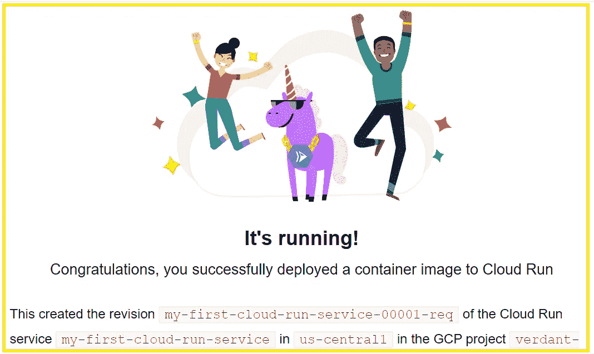

# 你好，云功能和云运行

> 原文：<https://medium.com/google-cloud/hello-to-cloud-function-cloud-run-f3a09f72d3f2?source=collection_archive---------2----------------------->

# 谷歌云功能:

想象一下，当一个事件发生时，我们想要执行一些代码，比如一个文件被上传到 Google Storage，一个错误日志被写到云日志或者一条消息到达发布/订阅主题。在这种情况下，谷歌云功能应运而生。

> 云功能的伟大之处在于，我们不需要担心服务器的设置、扩展和可用性。它会自己处理一切。云函数的每次调用都有时间限制。默认情况下。1 分钟，最长 9 分钟。最新的 V2 版本最长为 60 分钟。

让我们在演示中向云功能问好:

首先，在谷歌控制台中搜索云功能，如下图。如果这是你第一次参与这个项目，那么它将启用所有必要的 API。

创建云函数的第一个选择是使用第一代还是第二代。现在，让我们选择第一代并给函数命名。

对于触发器，我们可以使用 HTTP 端点。只需复制 URL 并取消选中 HTTPS，因为我们现在不需要它。点击下一步。

函数提供了许多可以使用的运行时，如 Node.js、Java、Go 和. Net。

部署完成后，让我们做一些测试。转到 Testing 选项卡并单击 Test in Cloud Shell，如下所示。

云壳可能需要一些时间来解压缩您的磁盘。一旦 Cloud Shell 启动，您将会看到一些 Curl 命令已经存在。只要按下回车键。授权 API 调用。我们的功能运行成功。

在日志中，我们将看到函数执行如下:

让我们在日志中打印一些东西。转到 Source 选项卡，然后单击 Edit 按钮。单击 Next 并根据您的运行时输入一个日志行，如下所示。部署好了再来测试吧！

现在，我们可以在日志和云壳中看到一条消息。

看，现在我们已经创建了一个云函数并部署了两次。云函数最重要的一点是，你只需要在调用它的时候付费。

# 谷歌云运行:

云运行是在几秒钟内将容器部署到生产环境的最简单方法。当我们使用 Kubernetes 时，我们需要创建一个集群，然后部署我们的微服务。但是，对于 Cloud Run 来说，一切都得到照顾。

让我们开始创建一个服务，在 Google 控制台中搜索 Cloud Run，然后单击 Create Service。第一步，我们需要选择一个容器图像。通常，您将首先创建一个容器，并将其推送到容器存储库。在这里，我们可以通过单击 select 从容器注册表中选择一个 Hello 容器映像。

> Container Registry 是一个存储私有容器映像**的服务。**它提供了一个由 Artifact Registry 提供的功能子集，这是一个通用的存储库管理器，也是在 Google Cloud 中管理容器图像和其他工件的推荐服务。

接下来的事情是给出服务名。让我们把这个名字命名为“我的首次云运行服务”。

对于 CPU 分配，我们有两个选项:

1.  仅在请求处理期间分配 CPU。为此，我们将按要求收费。
2.  为整个容器生命周期分配 CPU。为此，我们将终生为此付出代价。

出于演示目的，让我们保留默认值并允许未经身份验证的调用，如下所示:

给出一个实例的最大数量。我们现在设置为单击“Create”。

耶！我们的云跑在那里！点击网址:

> 我们已经看到，一旦有了容器，我们就能够在云运行中以最少的配置进行部署。它建立在开放标准的基础上，这是一种创新。这是一个完全托管的无服务器平台，适用于容器化的应用程序。这也是按使用付费。Cloud Run 没有语言、二进制和依赖方面的限制，因为我们使用的是容器。由于基于容器的架构，它很容易移植。

**结论:**

*   云函数用于执行事件上的代码。云运行用于部署容器化的应用程序。
*   两者都是完全托管的服务，我们必须付费使用。使用什么取决于我们的业务需求。
*   如果我们想要一个简单的微服务代码，那么我们可以使用云函数。如果我们想要一个可移植的基于容器的架构，我们可以使用云运行。

希望你喜欢。

如果你有任何相关的疑问，我很乐意帮助你。保持联系:)

## 推特:【https://twitter.com/SakshiKhandlwlT2
LinkedIn:[www.linkedin.com/in/sakshikhandelwal276](http://www.linkedin.com/in/sakshikhandelwal276)