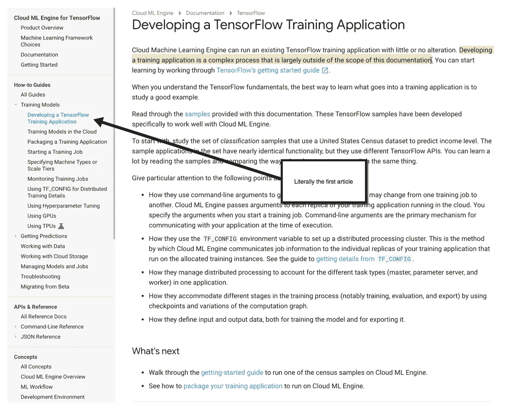
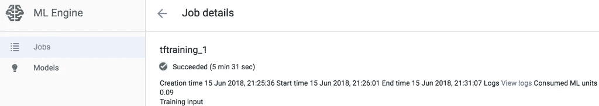
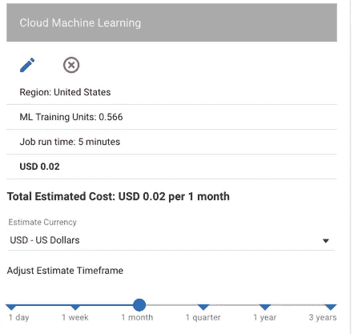
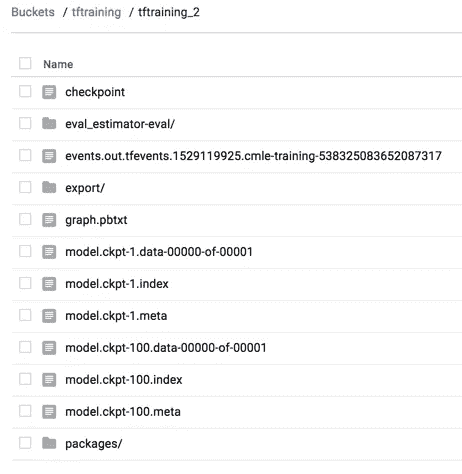
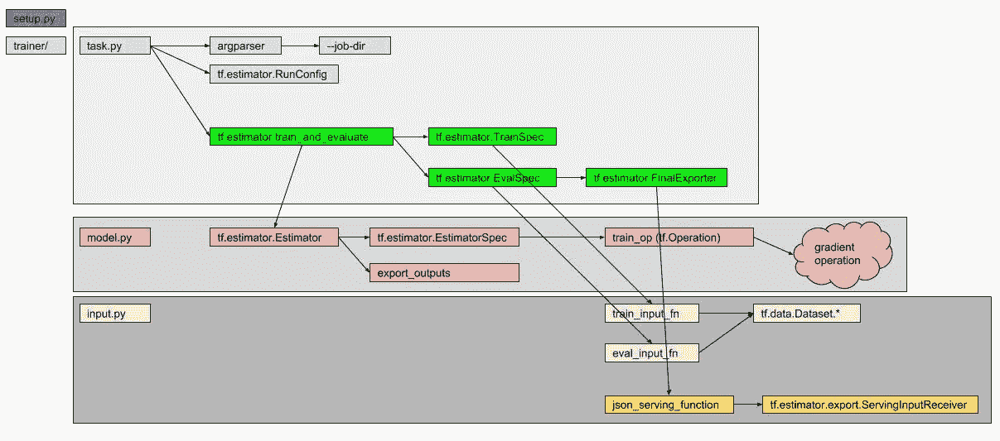

# GCP ML 引擎上的 Hello World

> 原文：<https://medium.com/google-cloud/hello-world-on-gcp-ml-engine-cc09f506361c?source=collection_archive---------0----------------------->

## 从零到 Web 请求的编码

在做我的 MushroomBot 项目时，我发现没有太多关于如何使用谷歌云平台 ML 引擎的文档。我认为这是因为 TensorFlow 可以做很多事情，大多数例子都有大约 500 行长，非常具有 T2 风格。为了证明某事的价值，你通常从最简单可行的例子开始。在这篇文章中，我将尝试类似的策略来关注构建模块，而不是一个花哨的 TensorFlow 程序。

## 什么是 ML 引擎？

从我的理解来说，ML Engine 是一套帮助你在 Google 云平台上训练和部署机器学习模型的工具。如果平台像宣传的那样简单，我们应该最终验证下面的陈述。

> 关注模型，而不是运营

我认为最好的用例是[部署](https://cloud.google.com/ml-engine/docs/tensorflow/deploying-models)一个机器学习模型的想法。这使得机器学习成为一个更有利于开发的过程，尤其是当模型不是有趣的部分时。我们算法的生命周期是我们将在本文中关注的。

## 你从哪里开始？

首先，我们需要找到一些好的文档。



“开发培训应用程序是一个复杂的过程，在很大程度上超出了本文档的范围”

我不认为开发培训应用程序超出了本文的范围。我认为开发一个**高效的**或**有用的**算法超出了本文的范围。我知道*真正的* TensorFlow 应用程序需要对框架如何工作有深刻的理解，但至少给我们*一些东西*作为开始。与其抱怨，我们可以(讽刺地)按照这一页的其余部分来继续。

从样本目录开始，我们可以看一看[普查示例](https://github.com/GoogleCloudPlatform/cloudml-samples/tree/master/census/tensorflowcore/trainer)。在这里，我们看到总共 800 行代码和三个文件(blah)。首先要做的是尝试并理解这种模式。为什么有三个文件？每个文件的重要性是什么？

## 项目结构

文档中隐藏着一些关于[项目结构](https://cloud.google.com/ml-engine/docs/tensorflow/packaging-trainer#recommended_project_structure)的段落。那一页上的图片非常有用，我们将从它开始。

```
$ tree .
.
├── setup.py
└── trainer
    ├── __init__.py
    ├── model.py
    ├── task.py
    └── util.py
```

我复制了他们的示例`setup.py`文件，并添加了一个 Makefile 来为所有有用的命令构建一个单一的事实来源。下面是这些文件的有用的片段。

> `task.py`包含管理工作的训练器逻辑。
> 
> `model.py`包含 TensorFlow 图形代码——模型的逻辑。
> 
> `util.py`如果有的话，包含运行训练器的代码。

虽然这些描述很有帮助，但我仍然不理解每个文件的输入和输出。这些需要命令行参数吗？它们是被直接调用还是被其他模块调用？

你可以在这里找到一些关于如何在本地运行训练器的命令[。将这一行添加到我的 Makefile 中，我们有以下内容:](https://cloud.google.com/ml-engine/docs/tensorflow/getting-started-training-prediction#develop_and_validate_your_trainer_locally)

```
MODEL_DIR=./output
TRAIN_DATA=./train
EVAL_DATA=./evaltrain_local:
 gcloud ml-engine local train \
    --module-name trainer.task \
    --package-path trainer/ \
    --job-dir ${MODEL_DIR} \
    -- \
    --train-files ${TRAIN_DATA} \
    --eval-files ${EVAL_DATA} \
    --train-steps 1000 \
    --eval-steps 100
```

和以下目录结构:

```
$ tree .
.
├── Makefile
├── eval
├── output
├── setup.py
├── train
└── trainer
    ├── __init__.py
    ├── model.py
    ├── task.py
    └── util.py
```

`eval`和`train`中的文件格式很可能取决于我们的算法，所以我们很快就需要一个可用的例子。

运行 trian_local 命令，我们得到以下结果:

```
$ make train_local
gcloud ml-engine local train \
    --module-name trainer.task \
    --package-path trainer/ \
    --job-dir ./output \
    -- \
    --train-files ./train \
    --eval-files ./eval \
    --train-steps 1000 \
    --eval-steps 100
```

之后，我们可以看到发生了一些事情，因为我们的一个文件已经被编译:

```
$ find .
.
./eval
./Makefile
./output
./setup.py
./train
./trainer
./trainer/__init__.py
./trainer/__init__.pyc <----------------------
./trainer/model.py
./trainer/task.py
./trainer/util.py
```

然而，很明显，我们可以在这个训练步骤中加入任何东西，而当地的教练似乎并不关心是否完成了任何事情。

## (几乎)写一些代码

[同一本指南](https://cloud.google.com/ml-engine/docs/tensorflow/getting-started-training-prediction#run_a_simple_tensorflow_python_program)确实展示了一个准系统 TensorFlow 程序。然而，指南并没有告诉我们在哪里写代码或者哪个文件应该做什么。指南的其余部分似乎在云中做了一堆很酷的东西，但我们这些普通人仍然停留在起点。

当我们试图得到一个服务于 web 请求的模型时，也许我们可以从那里逆向工作。[部署模型文档](https://cloud.google.com/ml-engine/docs/tensorflow/deploying-models)非常清楚地描述了它想要什么:`SavedModel`。太好了！假设 WebRequest 需要调用我们的 TensorFlow 程序，也许我们需要构造这些文件来获取一个非常具体的数据对象。

这些文档中的大部分引用了“服务功能”,这与我们的直觉一致，但对合同没有帮助。根据本文档[和](https://www.tensorflow.org/programmers_guide/saved_model#prepare_serving_inputs)，有关于函数命名的建议，但似乎没有什么是必需的。

虽然没有在任何地方引用，但是在 CloudML 样本存储库中确实存在一个`cloudml-template`目录[。我们将关注于`/template`目录，因为它包含 Python 包结构。我们正在用 Makefile 替换`/scripts`目录(并且可能从那里复制一些例子)。](https://github.com/GoogleCloudPlatform/cloudml-samples/tree/master/cloudml-template)

在`task.py`中，我们终于可以看到一个 Python 程序的“开始”了。

```
if __name__ == '__main__':
    main()
```

通过查看`main`函数，我们可以看到这个模块可以被多次调用。

```
# If job_dir_reuse is False then remove the job_dir if it exists
print("Resume training:", HYPER_PARAMS.reuse_job_dir)
```

进一步研究，我们可以发现一个`RunConfig`函数，它似乎

```
run_config = tf.estimator.RunConfig(
  tf_random_seed=19830610,
  log_step_count_steps=1000,
  save_checkpoints_secs=120,
  keep_checkpoint_max=3,
  model_dir=model_dir )
```

这个函数取我们之前定义为`model_dir = HYPER_PARAMS.job_dir`的`model_dir`。令人困惑的是，我们已经将`job_dir`设置为等于`MODEL_DIR`。啊！

在`run_config`被创建之后，它被传递给另一个函数来运行“实验”另一个函数`run_experiment`，是我们需要在我们的存储库中维护的另一个函数(尽管我假设所有 ML 引擎用户都遵循一个模式)。`run_experiment`函数将几个概念联系在一起。它从[tensor flow 数据/数据集包](https://www.tensorflow.org/api_docs/python/tf/data)开始，使用估算器包构建一些模型[，并使用以下公式对变量求和:](https://www.tensorflow.org/api_docs/python/tf/estimator)

```
# train and evaluate
tf.estimator.train_and_evaluate(
  estimator,
  train_spec,
  eval_spec )
```

总结一下:

*   `input.py`应该利用`tf.data`包将复杂的数据源转换成 TensorFlow 可以理解的东西
*   `task.py`应该使用`tf.estimator`包中的**函数**来运行你的模型。考虑与所用模型类型无关的函数。
*   `model.py`应该从`tf.estimator`包中返回**类**。想起类似`[LinearClassifier](https://www.tensorflow.org/api_docs/python/tf/estimator/LinearClassifier)`[的东西。](https://www.tensorflow.org/api_docs/python/tf/estimator/LinearClassifier)

但是，我们之前试图恢复的“服务功能”发生了什么变化呢？这是从哪里产生的？

因为服务功能被视为输入类型，所以在`input.py`中定义了一个`json_serving_input_fn`。这个函数被传递给上面提到的`run_experiment`函数中的`FinalExporter`。

```
exporter = tf.estimator.FinalExporter(
  'estimator',
  input.SERVING_FUNCTIONS[HYPER_PARAMS.export_format],
  as_text=False )
```

该导出器被传递给一个`tf.estimator.EvalSpec`，该导出器随后被传递给`run_experiment`函数末尾的最后一个`train_and_evaluate`函数。

总而言之，如果您想了解如何构建 TensorFlow 包，我建议从`run_experiment`函数向后看，看看依赖关系的“树”是如何工作的。

## 向后工作

尽管我们知道`input.py`实际上是我们数据的“起点”,但让我们把注意力集中在我们训练过程的主干上(即`main`和`train_experiment`功能)。

虽然有点傻，但我打算从下面的`model.py`开始:

```
import tensorflow as tfdef main():
    tf.estimator.train_and_evaluate(
        estimator,
        train_spec,
        eval_spec
    )if __name__ == '__main__':
    main()
```

运行后，`make test_local`可以看到我们少了 TensorFlow 包。我已经更新了我的`setup.py`中的`REQUIRED_PACKAGES`，以反映在 cloudml-samples 存储库中定义的[。这并没有改变任何行为，因为`ml-engine local train`任务没有安装你的包。我真的不喜欢挖掘他们的源代码，但我会想象这个命令基本上只是以某种方式运行 Python(暗示我们可能必须设置一个 virtualenv 或类似的)。](https://github.com/GoogleCloudPlatform/cloudml-samples/blob/master/cloudml-template/template/setup.py)

经过一番摸索，我得出了以下修改后的 Makefile:

```
VIRTUALENV_DIR=./env
PIP=${VIRTUALENV_DIR}/bin/pip
ACTIVATE=source ${VIRTUALENV_DIR}/bin/activate# Python + Environmentvirtualenv:
  virtualenv ${VIRTUALENV_DIR}install: virtualenv
  ${PIP} install --editable .# TensorFlowMODEL_DIR=./output
TRAIN_DATA=./train
EVAL_DATA=./evalTRAINER_PACKAGE=trainer
TRAINER_MAIN=${TRAINER_PACKAGE}.tasktrain_local:
  bash -c '${ACTIVATE} && gcloud ml-engine local train \
    --module-name ${TRAINER_MAIN} \
    --package-path ${TRAINER_PACKAGE} \
    --job-dir ${MODEL_DIR} \
    -- \
    --train-files ${TRAIN_DATA} \
    --eval-files ${EVAL_DATA} \
    --train-steps 1000 \
    --eval-steps 100'
```

不幸的是，没有使用 virtualenv 和 Makefiles 的好方法，所以我将`gcloud ml-engine`命令包装在`bash -c ''`中，这样我们就可以利用当前环境的 Python 环境，而不是依赖于用户的安装包。我想我们可以使用一些 Docker hacks 来获得一个跨所有开发机器的标准环境，这可能会将 virtualenv/python 的复杂性转移到跨主机操作系统的标准环境中。

通过使用`pip install --editable .`，我们可以在“编辑”模式下安装当前包，并将我们的依赖关系集中在`setup.py`文件中，而不是在[入门指南](https://cloud.google.com/ml-engine/docs/tensorflow/getting-started-training-prediction)中偶尔提到的`requirements.txt`。我发现任何对`requirements.txt`的引用都令人困惑，因为推荐的包结构是使用`setup.py`,然而《入门指南》并没有提到将我们的包安装为可编辑的。

更新 Makefile 后，`train_local`产生了我们所期望的`NameError: global name estimator is not defined`。

## 估计器、优化器、操作

现在，您应该开始复制 cloudml-sample 程序的一部分了。在这一点上有相当多的代码，所以我将在后面用一个突出显示组件的图表来覆盖最终结果。

我尝试创建自己的估算器，发现了以下情况:

*   要创建一个`Estimator`，你需要和`EstimatorSpec`。这个`EstimatorSpec`需要一个`training_op`(想想 TensorFlow 会话图的一部分)。这个`training_op`将执行一些数学计算*并且*更新`global_step`变量(从`tf.train.get_global_step()`返回)。通常情况下，像`tf.train.GradientDescentOptimizer`一样，通过调用预先创建的`Optimizers`函数`minimize`来生成`training_op`。虽然创建一个新的`Optimizer`可能和创建一个子类一样简单，但是你仍然会遇到关于`Operations`的问题。
*   [在 TensorFlow 中创建新的](https://www.tensorflow.org/extend/adding_an_op) `[Operation](https://www.tensorflow.org/extend/adding_an_op)`需要编译 C++代码，创建 Python 包装器。这意味着当我们试图创建一个不需要训练的“模型”时，我们不能轻易**创造一些虚假的`training_op`。**
*   `tf.estimator.TrainSpec`和`tf.estimator.EvalSpec`都需要它们各自的`step`参数大于零。

如果你想创建一个`Estimator`，你需要一个带渐变的图形。我不相信这意味着你需要一个带渐变的图来部署到 ML 引擎，但是你可能根本不能使用`gcloud ml-engine local train`命令。

## 构建最小图

可以通过预先创建的优化器构建和使用的最简单的图形是什么？

我认为 MNIST 的例子是一个好的开始。我们可以删除层和调整数字，直到我们最终得到更小的东西。

经过长时间的调查，我得出了下面的图表:

```
input_layer = tf.constant([[1.0]])
dense = tf.layers.dense(inputs=input_layer, units=1,
  activation=tf.nn.relu)
dropout = tf.layers.dropout(inputs=dense, rate=0.4,
  training=mode == tf.estimator.ModeKeys.TRAIN)
logits = tf.layers.dense(inputs=dropout, units=2)
```

我不知道这个图是做什么的，但它似乎足以编译没有梯度警告。

## 导出图表

一旦您摆脱了梯度警告，您可能会发现自己处于导出图表的位置。导出图表需要两件东西:`config`和`export_outputs`。

如果您最终向您的`EvalSpec`传递了一个`FinalExporter`，那么当您的模型以 Eval 模式运行时，您将能够导出您的函数。`FinalExporter`依赖于必须返回一个`ServingInputReceiver`的函数。虽然缺乏确凿的例子，但在文档中[有*的一些*信息。](https://www.tensorflow.org/api_docs/python/tf/estimator/export/ServingInputReceiver)

即使是导出器，如果你不把包含一个`model_dir`的[配置](https://www.tensorflow.org/api_docs/python/tf/estimator/RunConfig)传递给你的`Estimator`，你实际上也不会保存一个图。

## 为导出的图形提供服务

首先，你需要一个桶来放你的训练和评估数据。我们的数据是随机生成的，所以我们不需要担心这一步。但是，您需要一个铲斗来完成以下工作:

*   CLI 上传您的软件包
*   ML 引擎输出完成的模型

要提交我们的作业，我们需要将以下内容添加到 Makefile 中。

```
JOB_NAME=${BUCKET_NAME}_2
BUCKET_JOB_DIR=gs://${BUCKET_NAME}/${JOB_NAME}
REGION=us-central1
RUNTIME_VERSION=1.5train_job:
 gcloud ml-engine jobs submit training ${JOB_NAME} \
    --job-dir ${BUCKET_JOB_DIR} \
    --runtime-version ${RUNTIME_VERSION} \
    --module-name ${TRAINER_MAIN} \
    --package-path ${TRAINER_PACKAGE} \
    --region ${REGION} \
    -- \
    --train-files ${TRAIN_DATA} \
    --eval-files ${EVAL_DATA}
```

将作业提交给 ML 引擎后，您应该会看到作业在大约 5 分钟内完成。



5 分 31 秒~ 2 分钱

我对一份培训工作的成本做了一个快速分析，我认为每份工作的最低成本接近 2 美分。您可以通读[定价页面](https://cloud.google.com/ml-engine/docs/pricing)了解更多信息。



运行作业后，您可以在一个有趣的路径下找到上传到 bucket 中的模块:

```
gs://${BUCKET}/${JOB_NAME}/packages/3c8688e2846d9cda3337beb86f8cb0926fc7ecd136180758f70ea06fe25898b8
```

在这个目录中，您将找到您的 Python 模块。下载该模块时，我们可以看到以下内容:

```
$ tree hello-world-0.1
hello-world-0.1
├── PKG-INFO
├── setup.cfg
├── setup.py
└── trainer
    ├── __init__.py
    ├── input.py
    ├── model.py
    ├── task.py
    └── util.py1 directory, 8 files
```

那么导出的模型在哪里？无处可寻…

相反，我决定向前看，看看事情会变得多糟糕。首先，我尝试从这个目录创建一个模型(`gcloud ml-engine models create`和`gcloud ml-engine versions create`)。如果您尝试提交包含 python 文件的 bucket，您将得到以下内容:

```
ERROR: (gcloud.ml-engine.versions.create)
FAILED_PRECONDITION:
Field: version.deployment_uri
Error: Deployment directory gs://XYZ/ is expected to contain exactly one of:
  [saved_model.pb, saved_model.pbtxt].
```

在本地运行 ML Engine trainer 之后，我确认我正在导出`output`目录中的所有内容，并且实际上正在创建一个`saved_model.pb`文件(`export/${FINAL_EXPORTER_NAME}/${TIMESTAMP}/saved_model.pb`)。

```
output
├── checkpoint
├── eval_estimator-eval
│   └── events.out.tfevents.1528682282.genslerj.machine
├── events.out.tfevents.1528682281.genslerj.machine
├── export
│   └── estimator
│       └── 1528682283
│           ├── saved_model.pb
│           └── variables
│               ├── variables.data-00000-of-00001
│               └── variables.index
├── graph.pbtxt
├── model.ckpt-1.data-00000-of-00001
├── model.ckpt-1.index
├── model.ckpt-1.meta
├── model.ckpt-100.data-00000-of-00001
├── model.ckpt-100.index
└── model.ckpt-100.meta5 directories, 13 files
```

有了这些知识，我回去检查了 cloudml-sample 代码库和`gcloud` CLI 工具。现在，我们已经忽略命令行参数很长时间了。最后，我们来到[我们的模型需要的一个参数](https://github.com/GoogleCloudPlatform/cloudml-samples/blob/4686bb124f8fa55d9f2dd7a37a2bd8f990ae87b9/cloudml-template/template/trainer/task.py#L209-L213)，即`--job-dir`参数。

```
--job-dir=JOB_DIR
  A Google Cloud Storage path in which to store training outputs and other data needed for training. This path will be passed to your TensorFlow program as --job_dir command-line arg. The benefit of specifying this field is that Cloud ML Engine will validate the path for use in training. If packages must be uploaded and --staging-bucket is not provided, this path will be used instead.
```

就这样！



创建托管模型版本后，我们可以调用`ml-engine predict`调出 API。JSON 输入将对应于您的 JSON 服务函数。这是我的服务功能:

```
def json_serving_function():
    inputs = {
        'one': tf.constant([1]),
        'zero': tf.constant([0])
    }return tf.estimator.export.ServingInputReceiver(
        features={
            'one': tf.constant([1]),
            'zero': tf.constant([0])
        },
        receiver_tensors=inputs,
        # receiver_tensors_alternatives=inputs
    )
```

其对应于以下输入示例:

```
{"one": 42, "zero": 100}
{"one": 0, "zero": 100}
{"one": 100, "zero": 0}
```

测试 API，我们得到以下结果:

```
$ make test_model_version
gcloud ml-engine predict \
   --model helloworld_model \
   --version v1 \
   --json-instances ./json_instances.jsonl
OUTPUT
1.0
```

现在，我不确定是否发生了什么，但我认为我已经足够详细地帮助开始实验了(比如将`receiver_tensors`匹配到你的模型的输入)。

## 张量流“知识”依赖图

最后，我们可以把所有的概念拼凑成一个可管理的图表。我认为这将是从头到尾描述如何使用 ML Engine 的一个好方法(比本文少一些技巧)。



颜色代表分组信息

请注意，我遗漏了`train`和`eval`目录。我认为这些可能是可选的，因为对`tf.data.Dataset`的任何依赖都可能在运行时提取数据(不确定这是否是一个好主意，但理论上是可能的)。

如果我必须推荐一条使用 ML 引擎的途径，它可能是如下:

1.  从`model.py`开始。这些概念中的大部分是其余包装代码的核心。因为您将需要一个梯度操作，您将希望为您的用例开发直觉。
2.  继续前往`input.py`。从`Dataset`包开始，在那里进行筛选。您可以构建大量的代码来读取数据，所以请认真对待这一部分。您还将看到如何托管您的 API(服务功能)。这可能会指出您希望如何将数据组织到您的网络中，并且您可能会在`model.py`中修改代码。尽管你还不能将这项工作与第一部分联系起来，但你可能最终会发现一些“整合”的问题。
3.  最后可以用`task.py`把这些都拼凑起来。虽然不是必需的，但我认为您最终会摆弄`train`和`eval`步骤参数。
4.  用[超参数调谐](https://cloud.google.com/ml-engine/docs/tensorflow/hyperparameter-tuning-overview)和[分布式训练](https://www.tensorflow.org/deploy/distributed)全力以赴。
5.  …
6.  利润！

## 包扎

总的来说，这整个经历有点令人沮丧，但我对模式的出现感到非常兴奋。我认为 GCP ML 引擎令人惊讶地容易使用和灵活，因为我能够解决这个问题，而且我不是数据科学家或研究生/博士生。请继续关注我的具体用例以及它们最终如何工作的更多信息。干杯，感谢您的阅读！

[](https://github.com/jgensler8/gcp-minimal-ml-engine-project) [## jgensler 8/GCP-minimal-ml-engine-project

### 在 GitHub 上创建一个帐户，为 gcp-minimal-ml-engine 项目的开发做出贡献。

github.com](https://github.com/jgensler8/gcp-minimal-ml-engine-project)