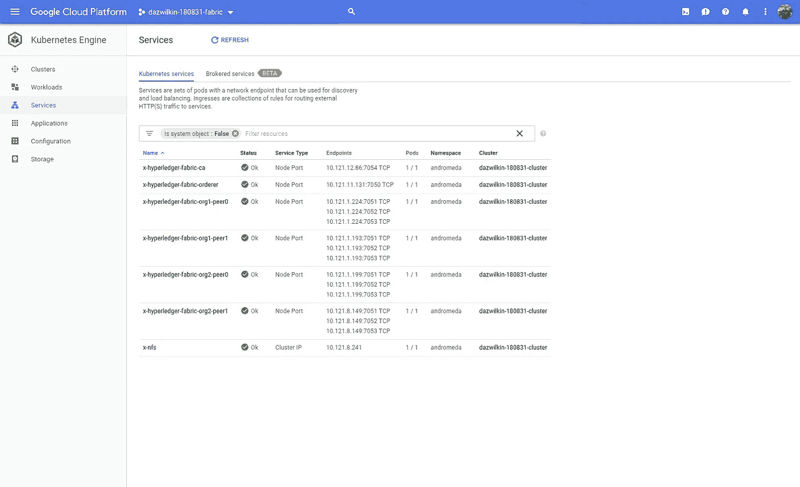
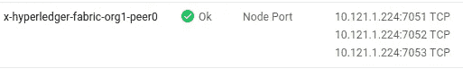

# 织物舵图(适用于 Kubernetes)

> 原文：<https://medium.com/google-cloud/helm-chart-for-fabric-for-kubernetes-80408b9a3fb6?source=collection_archive---------2----------------------->

## 失败-成功

我在尝试为 Hyperledger Fabric(用于 Kubernetes)创建舵图部署时令人失望的失败总结。这一系列短篇故事的目的是记录成就，描述局限性，并且——希望——提供一个连贯的工作总结，作为该项目的文档。

虽然跨多个主机部署 Fabric 很复杂，但我认为我所面临的大部分挑战是试图将 Fabric 塞进一个舵图中；我想我在赫尔姆更有挑战性。我非常感谢 IBM 的雅科夫和加里，他们在面料方面耐心而有益的指导。谢谢你们俩！

## 该建议

我(强烈)认为 Hyperledger Fabric 项目应该致力于为 Fabric 开发一个工作舵图解决方案。Fabric 是一个复杂的解决方案，在其频繁的发布之间会有很大的变化。核心开发团队最了解如何配置和部署解决方案，并且最能够使部署解决方案与核心产品保持同步。

由于 Helm 已经成为 Kubernetes 应用程序的事实上的部署工具，我认为 Fabric 团队最适合确定 Helm 的限制并|或调整 Fabric 以适应这些限制。

## 成功

很管用；-)



2 个双对等组织

并且:

```
peer chaincode query \
--channelID=${CHANNEL_NAME} \
--name=${NAME} \
--ctor='{"Args":[**"query","a"**]}'
**100**peer chaincode invoke \
--orderer=${RELEASE_NAME}-hyperledger-fabric-orderer:7050 \
--cafile=/.../example.com/orderers/orderer.example.com/... \
--channelID=${CHANNEL_NAME} \
--name=${NAME} \
--ctor='{"Args":[**"invoke","a","b","10"**]}'
2018-08-31 22:58:56.724 UTC [chaincodeCmd] chaincodeInvokeOrQuery -> INFO 001 Chaincode invoke successful. result: status:200 peer chaincode query \
--channelID=${CHANNEL_NAME} \
--name=${NAME} \
--ctor='{"Args":[**"query","a"**]}'
**90**
```

## 突出的问题

不幸的是，要让链代码实例化工作需要人工干预:-(

```
peer chaincode list --channelID=${CHANNEL_NAME} --installed
Get installed chaincodes on peer:
**Name: duvall, Version: 1.0**, Path: github.com/chaincode/example02/go/, Id: 4ed73815477c6da1a5e8fba4ff00d77cc740e12b2dd001246de4a53e0dc08c03
```

为了实例化链代码，对等体使用 docker-in-docker 创建链代码部署的 docker 映像，然后实例化它:

```
docker images --format="{{.Repository}}" | awk '!/gcr.io/'dev-org1-peer0-duvall-1.0-2c49d7...
```

> **NB** 镜像名称由网络名称(`dev`)、对等名称(`org1-peer0`)、链代码名称(`duvall`)和版本(`1.0`)组成

通过监视此映像的 Docker 事件，我们可以检测到容器是何时从映像创建的，以及容器是何时启动的:

```
docker events --filter=name=dev-org1-peer0-duvall-1.0-2c49d7...
```

注意:事件输出包括长容器 ID ( `3e1b22…`)

在容器死亡之前，我们可以拿到它的日志:

```
docker logs 3e1b22...
```

这产生了:

出现这个问题是因为容器是在 Docker 引擎的上下文中运行的，而不是在 Kubernetes 中。因为 Docker 引擎无法寻址对等体，所以回叫对等体的尝试失败。

## 黑客#1:编辑节点的主机文件

该同事在`10.121.1.224`可用于此次部署:



> 该地址对应于代表对等体的 Kubernetes 服务的集群 IP 地址。

正在编辑节点的(！)`/etc/hosts`允许 Docker 引擎正确寻址对等体:

```
more /etc/hosts
127.0.0.1 localhost
::1  localhost169.254.169.254 metadata.google.internal metadata
**10.121.1.224 x-hyperledger-fabric-org1-peer0**
```

现在，如果我们重新运行实例化，它将工作:

```
peer chaincode list --channelID=$CHANNEL_NAME --instantiated
Get instantiated chaincodes on channel channel:
Name: duvall, Version: 1.0, Path: github.com/chaincode/example02/go/, Escc: escc, Vscc: vscc
```

而且，我们可以使用容器的日志来验证:

```
docker logs 7e1a1e40e68b78653eb85103d0af03502820147ded1fa9288f70bf796b87ee37
2018-08-31 21:52:43.825 UTC [shim] SetupChaincodeLogging -> INFO 001 Chaincode (build level: 1.2.0) starting up ...
ex02 Init
**Aval = 100, Bval = 200**
```

我不清楚如何最好地适当、动态地确保每个节点(复数)Docker 引擎能够正确地引用当时可能正在其上运行的对等节点(复数)。

一旦实例化，为了调用链代码上的方法，对等体需要能够访问订购者:

```
peer chaincode query \
--channelID=${CHANNEL_NAME} \
--name=${NAME} \
--ctor='{"Args":["query","a"]}'
**100**peer chaincode invoke \
--orderer=${RELEASE_NAME}-hyperledger-fabric-orderer:7050 \
--cafile=/.../example.com/orderers/orderer.example.com/... \
--channelID=${CHANNEL_NAME} \
--name=${NAME} \
--ctor='{"Args":**["invoke","a","b","10"]**}'
2018-08-31 22:58:56.724 UTC [chaincodeCmd] chaincodeInvokeOrQuery -> INFO 001 Chaincode invoke successful. result: status:200 peer chaincode query \
--channelID=${CHANNEL_NAME} \
--name=${NAME} \
--ctor='{"Args":["query","a"]}'
**90**
```

容器的日志:

```
docker logs 7e1a1e...
2018-08-31 21:52:43.825 UTC [shim] SetupChaincodeLogging -> INFO 001 Chaincode (build level: 1.2.0) starting up ...
ex02 Init
Aval = **100**, Bval = 200
ex02 Invoke
Query Response:{**"Name":"a","Amount":"100"**}
ex02 Invoke
Aval = **90**, Bval = 210
ex02 Invoke
Query Response:{**"Name":"a","Amount":"90"**}
```

一切都好。

## 黑客# 2:orderer.example.com

只不过它需要第二次破解。

第二个问题是为网络定义的命名的结果，用`crypto-config.yaml`和`configtx.yaml`以及在集群中适当反映这一点的(我的)复杂性来表示。

当(我的)掌舵图导致订购方的服务可用，例如`x-hyperledger-fabric-orderer` ( `[release-name]-[chart-name]-orderer`)或完全合格的`x-hyperledger-fabric-orderer.andromeda.svc.cluster.local`时，同级如何正确称呼订购方？

第一个 hacky 解决方案采用 [CoreDNS](https://coredns.io/) 来提供`example.com`作为[存根域](https://kubernetes.io/docs/tasks/administer-cluster/dns-custom-nameservers/#configure-stub-domain-and-upstream-dns-servers)(补充 Kubernetes 的集群上 DNS 解析)。我的解决方案是过度设计的(见下面的替代方案)，但它为我提供了一个学习和使用 CoreDNS 以及与 Kubernetes 结合使用的机会。所以良好的学习体验和 CoreDNS 是一个甜蜜的产物。

在这种模式下，一个对等体试图解析`orderer.example.com`的请求被发送到 CoreDNS，CoreDNS 由 Kubernetes 服务列表编程，以将`orderer`解析到正确的 IP 地址。

我在这里记录了这种方法[并且不会重复它。](/google-cloud/coredns-afaa732aa35e)

另一个(也更容易)的解决方案是使用 Kubernetes 的`hostAliases` ( [link](https://kubernetes.io/docs/concepts/services-networking/add-entries-to-pod-etc-hosts-with-host-aliases/#adding-additional-entries-with-hostaliases) )。这些被定义为 kubelet(？)编程 Pod(不是节点的)`/etc/hosts`文件。

下面是一个清单示例:

```
hostAliases:
- ip: "10.121.11.131"
  hostnames:
  - "orderer.example.com"
```

这是 Pod 的`/etc/hosts`:

```
more /etc/hosts
# Kubernetes-managed hosts file.
127.0.0.1 localhost
::1 localhost ip6-localhost ip6-loopback
fe00::0 ip6-localnet
fe00::0 ip6-mcastprefix
fe00::1 ip6-allnodes
fe00::2 ip6-allrouters
10.56.0.9 x-hyperledger-fabric-org1-peer0-85874fd45c-nvrdc# Entries added by HostAliases.
**10.121.11.131 orderer.example.com**
```

> **NB** 增加了`orderer.example.com`和一个有用的系统提供的注释，解释它为什么在那里。

在这种方法中，对等体需要配置订购者的 IP，我需要使用 Helm ( `;-(`)来解决这个问题。

## 实施

下周初，我将简要总结我的编程笔记，并在这里引用这些笔记。希望我的旅程总结能给其他人提供一些指导，让他们知道如何前进和避免陷阱。希望我的错误能从其他人那里得到反馈，帮助我提高和克服我所面临的一些挑战。

## 结论

我将这个故事的副标题定为“失败-成功”,因为虽然我能够将 Fabric 部署到 Kubernetes 集群，但我无法开发一个掌舵图来(a)支持我想要的动态性；(b)提供了端到端的工作部署。

正如我的经理正确解释的那样，最好是快速失败，虽然我无法完成这个项目令人失望，但希望这个和相关的故事能帮助其他人，也许它能在 Fabric 项目中找到共识，为 Fabric 开发一个掌舵图(或其他 Kubernetes 部署)。

暂时就这样了。