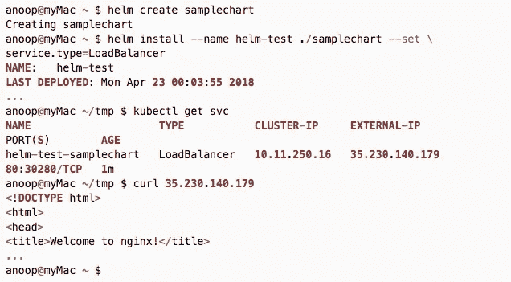

# GKE 集群掌舵——快速实践指南

> 原文：<https://medium.com/google-cloud/helm-on-gke-cluster-quick-hands-on-guide-ecffad94b0?source=collection_archive---------0----------------------->

这个快速指南有助于让 helm 在 Google Kubernetes 引擎(GKE)集群上运行。本文假设读者:

*   事先了解 [helm](https://github.com/kubernetes/helm) 、 [kubernetes](https://github.com/kubernetes/kubernetes) 和 [gke](http://console.cloud.google.com/kubernetes/) 。
*   有一个本地安装的`kubectl`和`helm`以及一个至少有 3 个节点(包括主节点)的 GKE 集群。
*   这是用以下版本测试的:

## 为 helm 创建服务帐户

首先创建一个服务帐户，并将群集管理角色附加到它。这使得 tiler pod 能够与 kubernetes api 进行通信。你应该这样做是有原因的。这可以用`kubectl apply -f <file>`来完成

为 helm 和 clusterrolebinding 创建服务帐户

## 提升创建 ClusterRoleBindings 的权限(如有必要)

如果上述命令成功，请跳过本节。有时候，你会在 GKE 犯一些被禁止的错误。解决这个问题的一个更简单的方法是以特权用户的身份执行 ClusterRoleBinding。

*   使用`gcloud describe`获取您的管理员密码

带描述的管理员密码

*   使用这些凭证并创建上一节中的服务帐户和集群角色绑定。一种方法是修改您的`$HOME/.kube/config`来添加一个新的用户条目，并将其提供给您的上下文，然后在初始化`helm`后恢复。

*   如果你碰巧提升了特权，你就不再需要它了。

## 初始化舵

现在运行`helm init`传递服务帐户。

## 验证舵

首先，在`kube-system`名称空间中应该至少有一个名为`tiller-deploy`的部署和服务。

创建一个`samplechart`并以名称`helm-test`安装它。这将安装一个简单的 nginx pod。将服务类型设置为`LoadBalancer`。

这就对了。

## 常见错误

# 参考

1.  helm 为什么需要服务账户—[http://jayunit100.blogspot.fi/2017/07/helm-on.html](http://jayunit100.blogspot.fi/2017/07/helm-on.html)
2.  更多关于赫尔姆—[https://docs.helm.sh/](https://docs.helm.sh/)
3.  Kubernetes docs — [http://kubernetes.io/](http://kubernetes.io/)
4.  Google kubernetes 引擎 (GKE) — [https://console.cloud.google.com/kubernetes/](https://console.cloud.google.com/kubernetes/)