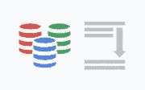
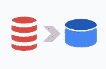
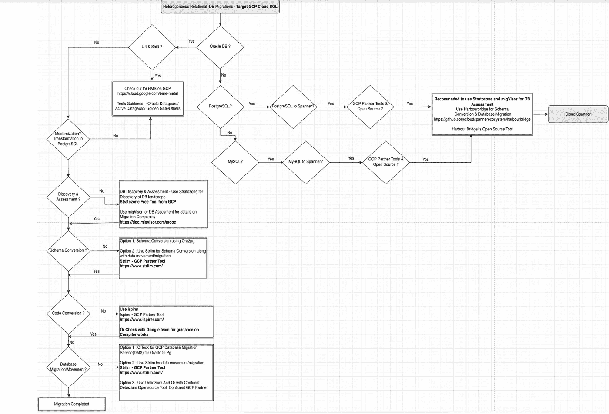

# 异构数据库迁移决策树—云 SQL 和扳手

> 原文：<https://medium.com/google-cloud/heterogeneous-db-migrations-decision-tree-c27e22637666?source=collection_archive---------2----------------------->

这是异构数据库迁移到 Google cloud 决策树系列的第二篇文章。我们看到了使用关系数据库(如云 SQL 和云原生数据库，即 Cloud Spanner)进行数据库迁移的巨大吸引力。

特别是对于异构数据库迁移，即跨数据库引擎，需要进行大量尽职调查。

步骤 1 —使用选择的工具发现数据资产上的数据库环境。在 Google cloud，广泛使用的工具是 Stratozone，或者你可以随意使用你选择的任何其他工具。

步骤 2-使用我们的合作伙伴工具进行数据库迁移评估，即 [migVisor](https://doc.migvisor.com/mdoc/) (我们来自 EPAM 的 GCP 合作伙伴工具)

步骤 3 —源数据库模式转换，使其与目标数据库兼容。例如，假设您要从 Oracle 迁移到 Postgres(云 SQL ),您可以选择 Ora2pg 或我们的合作伙伴 Striim 提供的具有模式转换功能的工具。

第 4 步——理想情况下，这一步是代码转换。同样，在谷歌云，我们有强大的合作伙伴生态系统，即 [Ispirer](https://www.ispirer.com/) 或最近从谷歌云收购的编译器作品。

步骤 5 —然后是从源到目标的数据移动或数据迁移。这包括源数据库的初始快照和源数据库到目标数据库的增量更改，具有 CDC 功能。根据使用案例，谷歌数据库迁移服务或我们的合作伙伴工具，如 [Striim](https://www.striim.com/) 等。

步骤 6 —移动数据后，在目标上进行数据验证。请检查这个非常方便的工具 [DVT](https://github.com/GoogleCloudPlatform/professional-services-data-validator)

当然，我们不要忘记回滚策略

在这篇博客中，我们将探索从 Oracle DB 到 Postgres 的路径以及到 Cloud Spanner 的路径。

异构数据库迁移的决策树

敬请关注即将发布的关于数据库迁移的博客！！！！