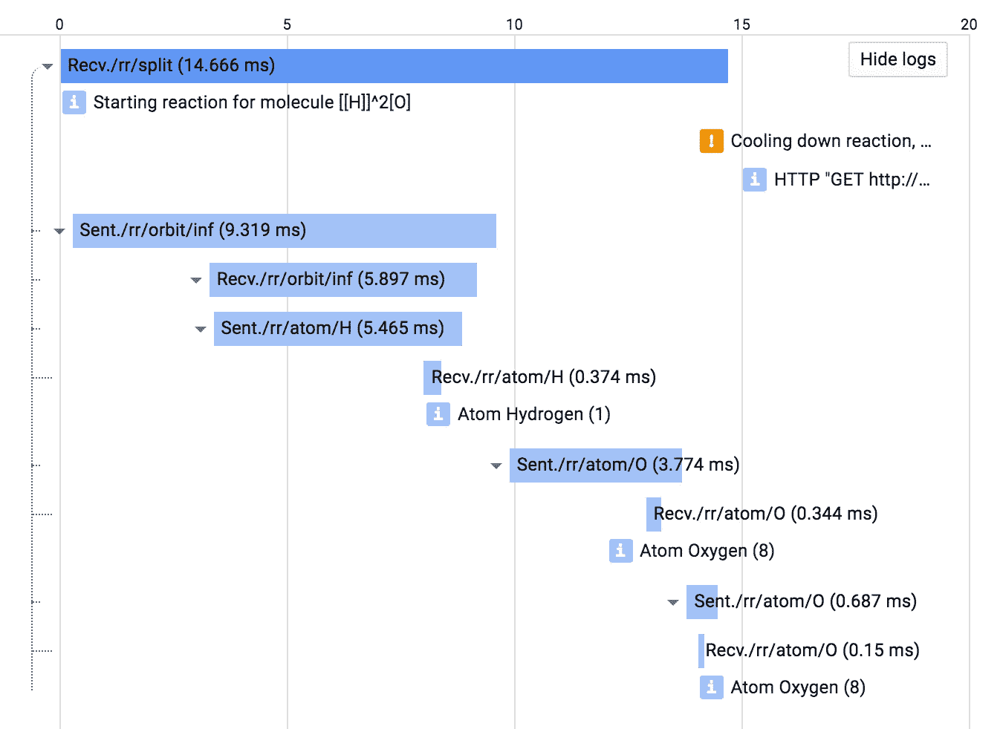
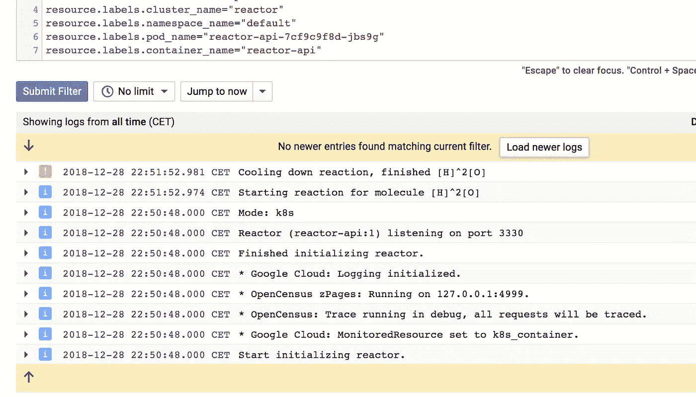
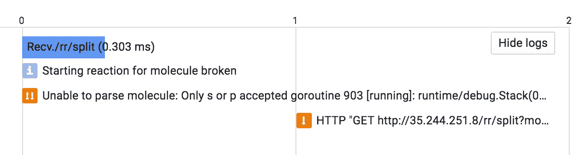
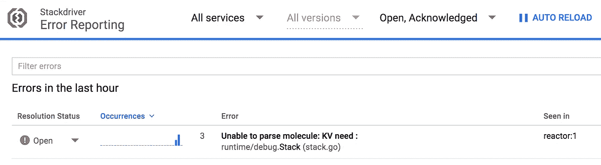
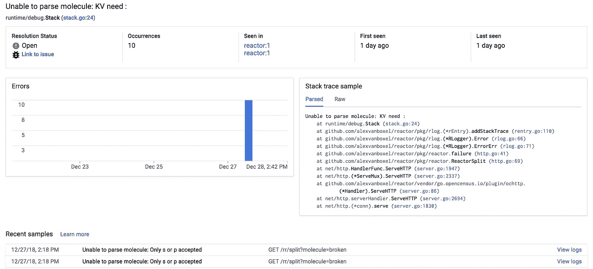
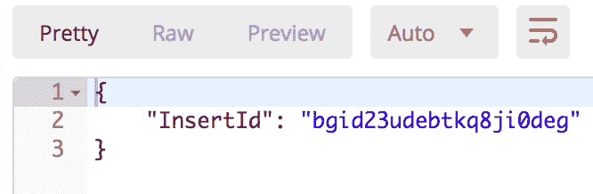
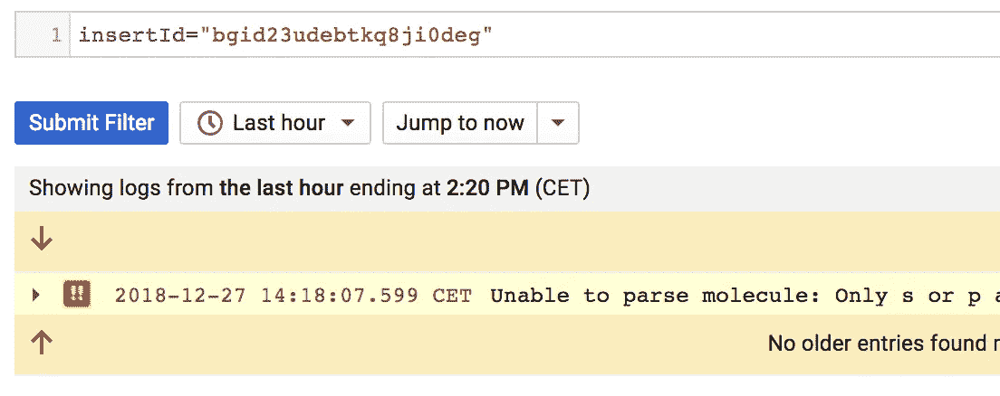
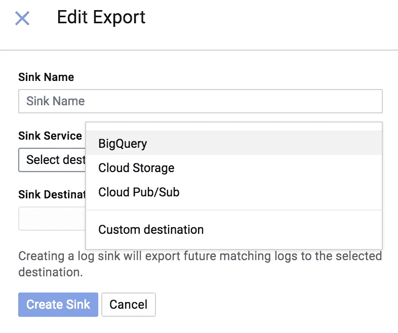

# Stackdriver 伐木公司隐藏的超能力

> 原文：<https://medium.com/google-cloud/hidden-super-powers-of-stackdriver-logging-ca110dae7e74?source=collection_archive---------0----------------------->

Stackdriver Logging 是 Google Cloud 产品组合中最被低估的产品之一。首先，这是理所当然的，但第二，许多人不知道它的超能力。

【https://unsplash.com/photos/CqgbxNGsf6Y 号

虽然这有点谷歌自己的错，因为一些惯用的客户端库没有公开这些特性。但是通过一点小技巧，你可以自己把它们添加到库中，正如[我为这篇文章在 google-cloud-go 客户端库上做的](https://github.com/googleapis/google-cloud-go/commit/edf9523a34b344928c2061c06509556636e52cb3)。

> 在本文中，我将使用[反应器](https://github.com/alexvanboxel/reactor)。 **Reactor** 是一个用 **golang** 编写的微服务，我写它是为了了解 GCP 的可观测性特性。您可以使用它来重现本文中描述的所有内容。按照[自述文件](https://github.com/alexvanboxel/reactor)中的说明，在本地或 Kubernetes 集群中设置它。本文假设安装在 **GKE** 上。

相关的跟踪和日志，以及额外的负载平衡器日志条目

# 元数据和跟踪相关性

第一个超能力是将日志与踪迹相关联。(你知道另一种具有这种能力的产品吗？如果你知道，请告诉我！).

如果您使用 OpenCensus 进行追踪，这很容易实现，因为当前追踪和 span id 在上下文中是可用的。看看反应堆的内部记录器包(`func [addSpan](https://github.com/alexvanboxel/reactor/blob/master/pkg/rlog/rlog.go)`)。它展示了如何从上下文中提取 span id，并将其添加到发送给 stackdriver API 的 LogEntry 中。

上面的跟踪是用`*http://<your_host>/rr/split?molecule=[[H]]^[O]*`调用 reactor 生成的。Reactor 会对自己进行一些 http 调用，但是当您转到跟踪控制台时，您会注意到在跟踪之间您会看到**日志条目**。您唯一需要做的就是确保 Trace 和 SpanID 被添加到 LogEntry 中。

由于 reactor 使用配置了 Stackdriver export 和 h**header propagation**的 OpenCensus Trace，因此它理解 Stackdriver 头格式。Reactor 安装在 Google Kubernetes 引擎上，通过 HTTP 负载平衡器(使用 k8s ingress)路由来电。因为负载平衡器生成第一个跨度，所以 OpenCensus 会选取它，并继续在负载平衡器跟踪中添加跨度。这就是为什么您还会在跟踪中看到**负载平衡器日志**(截图中的日志行 3)。

# 将 k8s 标准输出/错误与自定义日志记录相关联

在启动时，不可能直接记录到 Stackdriver 日志，因为您需要首先初始化客户端连接。当时登录到 **stdout** 没有问题。因为 Google Kubernetes 引擎聚合了 Stackdriver Logging 中的日志，所以我们有机会将自定义日志与 GKE 捕获的标准日志连接起来。这是使用[监控资源](https://cloud.google.com/monitoring/api/resources)完成的。

与容器 stdout/err 相关的自定义日志

当集群启用了新的**beta**stack driver Kubernetes 监控时，将在 [k8s_container](https://cloud.google.com/monitoring/api/resources#tag_k8s_container) 资源下捕获容器标准输出和错误。

当我们登录到同一个资源时，对您的自定义日志和标准输出进行分组会更容易。它甚至可以在 Kubernetes 工作负载屏幕中开箱即用。如果您选择其中一个窗格并转到*查看日志*，您将同时看到自定义日志和 stdout/err。

# 错误报告

另一个超能力是从日志条目创建错误报告的能力。

看看为下面的调用生成的跟踪:`*http://<your_host>/rr/split?molecule=broken*` *。* Reactor 对这个破碎的分子不是很满意，所以它向用户返回一个错误并记录一个错误。您会再次看到错误与跟踪以及负载平衡器日志条目混合在一起，作为一个警告。

如果您以特定的方式格式化您的日志条目，则会创建一个**错误报告**。要做到这一点，可以在源代码中添加一个发生错误的位置或一个完整的堆栈跟踪。有关如何格式化消息的更多详细信息，请参见此处的文档:[stack driver 日志记录中的格式化错误](https://cloud.google.com/error-reporting/docs/formatting-error-messages)

错误报告是一项伟大的服务。它记录了你所有的主要错误，包括许多有用的信息。

信息包括:错误发生的**第一次**时间和**最后一次**时间、**发生的次数**以及最近几天所有发生的详细图表。它还显示了发生错误的所有**版本**，这是一个有用的指标，可以帮助您跟踪发生错误的第一个版本。它还显示了一些**日志条目的最近样本**。

要记住的一件重要事情是，不是所有的异常都应该以错误报告结束。如果您的代码中出现错误，并且可以处理，不要这样记录，否则错误报告将充满错误，变得毫无用处。所以在记录你的错误时要明智。

# InsertId

当设计一个 api 时，你需要意识到当一个错误发生时，你不能向你的 API 客户泄露太多的信息。如果它能帮助 API 用户纠正错误，尽一切办法返回该信息，但确保不要泄漏敏感信息。

在不能通过 API 返回敏感信息的情况下，您仍然可以记录这些信息并返回一个惟一的 InsertId，特权用户可以使用它来搜索日志。

但是，这并不意味着您可以全权记录所有内容。仍然考虑你记录什么信息来保护你的用户的隐私。

# BigQuery

如果我们在谈论超能力，我们应该谈论其中最大的超能力:BigQuery。BigQuery 的前身是 Google 内部创建的，用来处理它的大量日志，那么我们为什么不能利用它来处理我们自己的日志呢？

日志接口使得将日志导出到 BigQuery、云存储或 Pub/Sub 变得很容易。

导出的日志为每个日志生成一个带有结构化行的分区表。BigQuery 能够在一行中拥有不同的重复结构和列，这使得将丰富的日志条目表示为结构化数据变得非常容易。另外，您不必担心云日志的保留政策，因为 BigQuery 可以永久保留您的日志。

# 公开普查记录

我认为用户仍然需要做太多的管道工作来获得大部分的日志超级能力，但是我有希望:目前开放的人口普查日志规范周期正在进行，希望它将把工具带给用户，他们不需要考虑管道。

以下是我对开放式人口普查规范的愿望清单:

*   在启动时设置资源(MonitoredResource)，最好是自动检测或提供如何设置的明确指导(例如标准环境变量)。
*   启动时设置应用程序名称和版本。
*   请求上下文感知。
*   跨上下文感知。
*   访问 InsertId，这样就可以将它返回给用户。
*   用户知道，但有可能混淆用户(可插拔)。
*   带有命名参数的结构化格式化日志记录，这些参数可以作为标签在日志条目中公开。使得搜索其他值比搜索用户更容易。
*   源代码位置感知

让我们希望制定规范的人会阅读这篇文章，而不是通过将它们锁在抽象背后来剥夺我使用这些特性的能力。

享受开发超能力的乐趣吧，这会让在生产中运行你的代码的人高兴。