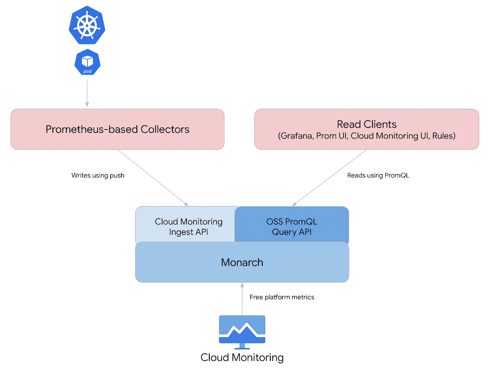

# 具有托管收集器的 Google 托管 Prometheus 的高分辨率用户定义指标

> 原文：<https://medium.com/google-cloud/high-resolution-user-defined-metrics-for-google-managed-prometheus-with-managed-collector-5a917c68fe22?source=collection_archive---------2----------------------->

本文与 [Scott Hsieh](https://tw.linkedin.com/in/scott-hsieh) 、 [Salem Amazit](https://sg.linkedin.com/in/samazit) 、 [Vannick Trinquier](https://id.linkedin.com/in/trinquiervannick) 和 [Ethan Han](https://sg.linkedin.com/in/feng-han-381595102) 合作发表。

# 背景

本指南介绍了一个解决方案，以解决带有托管收集器的[Google Cloud Managed Service for Prometheus(GMP)的局限性。本文中讨论的解决方案为带有托管收集器的 GMP 提供了额外的灵活性。它允许用户调整刮擦间隔，以更高的分辨率收集细粒度指标。](https://cloud.google.com/stackdriver/docs/managed-prometheus/setup-managed)

带托管收集器的 GMP 原生支持 [PodMonitoring](https://github.com/GoogleCloudPlatform/prometheus-engine/blob/v0.4.3-gke.0/doc/api.md#podmonitoring) 中的刮擦间隔调整。用户可以使用 PodMonitoring 资源中的 interval 参数来调整 GMP 监控的应用程序的刮擦时间间隔。具有受管收集器的 GMP 禁用了配置，以覆盖受管 prometheus 的[全局刮擦间隔](https://prometheus.io/docs/prometheus/latest/configuration/configuration/)。默认全局擦除时间间隔配置为 60 秒。

带有托管收集器的 GMP 的默认行为不支持 [cadvisor](https://github.com/google/cadvisor) 的更高分辨率指标或其他 Kubernetes 系统指标。

更高分辨率的指标对于监控动态变化的环境至关重要。任务关键型系统就是这种情况，例如:

*   金融服务业，
*   在 Kubernetes 集群上自动扩展突发工作负载

# 设计

通过使用定制的 Prometheus exporter 和 expose metrics in application 来解决 GMP 对托管收集器的限制，可以实现高频率的收集。

自定义 Prometheus 导出器可以用官方的 [Prometheus 客户端库](https://prometheus.io/docs/instrumenting/clientlibs/)以支持的语言编写，并以 Prometheus 格式公开自定义指标。

例如:

*   CPU/内存使用率
*   HTTP 请求成功/失败计数
*   API 调用延迟



[托管 Prometheus](https://cloud.google.com/stackdriver/docs/managed-prometheus)

托管收集可以通过使用 [PodMonitoring](https://github.com/GoogleCloudPlatform/prometheus-engine/blob/v0.4.3-gke.0/doc/api.md#podmonitoring) 以最小 5 秒的采样间隔收集这些自定义指标。

# 逐步指南

## 先决条件

您需要具备以下先决条件才能开始创建 prometheus 自定义导出器:

*   [谷歌云项目](https://cloud.google.com/resource-manager/docs/creating-managing-projects)
*   对 [Google Kubernetes 引擎](https://cloud.google.com/kubernetes-engine)的基本了解
*   对[码头工人](https://www.docker.com/)的基本了解
*   对[普罗米修斯](http://prometheus)的基本认识

启用了以下 API:

*   服务:container.googleapis.com

## 项目设置

客户导出器是用 Python 写的，你可以使用其他语言，比如 Java，或者去写自定义导出器。

有关项目相关参数和配置，请参考以下配置。请相应地更改配置。

> **区域**:亚洲-东南亚 1-a
> 
> **项目 ID** : gmp-demo-project
> 
> **GKE 集群名称**:GMP-集群
> 
> **GKE 集群命名空间** : gmp-test

所有命令都将在[云壳](https://cloud.google.com/shell)中执行。

## 初始化项目

您可以将每个值替换为您自己的配置。

1.  将*项目 ID* 值配置为 *gmp-demo-project*

```
export PROJECT_ID=gmp-demo-project
```

2.将*区域*值配置为*亚洲-东南 1-a*

```
export ZONE=asia-southeast1-a
```

3.将*集群*值配置为*GMP-集群*

```
export CLUSTER=gmp-cluster
```

4.将*名称空间*值配置为*GMP-测试*

```
export NAMESPACE=gmp-test
```

## 部署 Kubernetes 集群

1.  使用环境变量 *PROJECT_ID* 将项目设置为 *gmp-demo-project* 。

```
gcloud config set project $PROJECT_ID
```

2.部署启用了托管 prometheus 的 GKE 集群。GKE 集群将部署在*亚洲-东南亚 1-a* 区域*环境可变*。

```
gcloud beta container clusters create $CLUSTER --num-nodes=3 --zone $ZONE --enable-managed-prometheus
```

3.检索 GKE 集群身份证明

```
gcloud container clusters get-credentials $CLUSTER --zone $ZONE --project $PROJECT_ID
```

4.为 GKE 集群创建命名空间

```
kubectl create ns $NAMESPACE
```

## 包装定制出口商

我们需要创建一个应用程序，打包并存储在[容器注册表](https://cloud.google.com/container-registry)中。

1.  创建一个文件夹*GMP-演示-应用*

```
mkdir gmp-demo-application && cd gmp-demo-application
```

2.在 *gmp-demo-application* 中，创建一个 python 文件，命名为 *app.py* 。该应用程序将收集 Pod CPU 利用率，并通过指标端点公开。

```
#The content of this page is licensed under the Creative Commons Attribution 
#4.0 License, and code samples are licensed under the Apache 2.0 License

import logging
import random
import time

import psutil
from flask import Flask
from prometheus_client import Counter, Gauge, generate_latest, Histogram, REGISTRY

logger = logging.getLogger(__name__)

app = Flask(__name__)

CONTENT_TYPE_LATEST = str('text/plain; version=0.0.4; charset=utf-8')

number_of_requests = Counter(
    'number_of_requests',
    'The number of requests, a counter so the value can increase or reset to zero.'
)

custom_collector_cpu_usage = Gauge(
    'custom_collector_cpu_usage',
    'The current value of cpu usage, a gauge so it can go up or down.',
    ['server_name']
)

PYTHON_REQUESTS_COUNTER = Counter("python_requests", "total requests")
PYTHON_FAILED_REQUESTS_COUNTER = Counter("python_failed_requests", "failed requests")
PYTHON_LATENCIES_HISTOGRAM = Histogram(
    "python_request_latency", "request latency by path"
)

@app.route('/metrics', methods=['GET'])
def get_data():
    """Returns all data as plaintext."""
    number_of_requests.inc()
    custom_collector_cpu_usage.labels('custom_collector_cpu_usage').set(int(psutil.cpu_percent() * 10))
    return generate_latest(REGISTRY), 200

@app.route("/")
# [START monitoring_sli_metrics_prometheus_latency]
@PYTHON_LATENCIES_HISTOGRAM.time()
# [END monitoring_sli_metrics_prometheus_latency]
def homepage():
    # count request
    PYTHON_REQUESTS_COUNTER.inc()
    # fail 10% of the time
    if random.randint(0, 100) > 90:
        PYTHON_FAILED_REQUESTS_COUNTER.inc()
        # [END monitoring_sli_metrics_prometheus_counts]
        return ("error!", 500)
    else:
        random_delay = random.randint(0, 5000) / 1000
        # delay for a bit to vary latency measurement
        time.sleep(random_delay)
        return "home page"

if __name__ == '__main__':
    app.run(host='0.0.0.0', port=8080) 
```

3.用以下内容创建一个 *Dockerfile* 。

```
#The content of this page is licensed under the Creative Commons Attribution 
#4.0 License, and code samples are licensed under the Apache 2.0 License
FROM python:latest

COPY . .

RUN pip3 install -r requirements.txt

EXPOSE 8080

CMD python3 app.py
```

4.用以下内容创建一个 *requirements.txt* 。

```
prometheus_client
psutil
flask
```

5.通过执行以下命令构建 Docker 容器

```
docker build -t custom-collector-demo:0.1 .
```

6.标记 Docker 容器。

```
 docker tag custom-collector-demo:0.1 gcr.io/$PROJECT_ID/custom-collector-demo:0.1
```

7.在你的项目下将码头集装箱推到 GCR。

```
docker push gcr.io/$PROJECT_ID/custom-collector-demo:0.1
```

## 将海关出口商部署到 GKE

现在，我们将为应用程序创建一个部署，并部署一个 [PodMonitoring 定制资源](https://github.com/prometheus-operator/prometheus-operator/blob/main/Documentation/design.md) (CRs)。

1.  创建一个部署 yaml 文件，命名为*GMP-custom-exporter-deployment . YAML*。记得将 *gmp-demo-project* 更改为您的*项目 ID。*

```
# The content of this page is licensed under the Creative Commons Attribution # 4.0
# License, and code samples are licensed under the Apache 2.0 License

apiVersion: apps/v1
kind: Deployment
metadata:
  name: flask-example
  labels:
    app: flask-example
spec:
  selector:
    matchLabels:
      app: flask-example
  replicas: 3
  template:
    metadata:
      labels:
        app: flask-example
    spec:
      containers:
      - image: gcr.io/gmp-demo-project/custom-collector-demo:0.1
        name: flask-example
        ports:
        - name: metrics
          containerPort: 8080
```

2.创建一个自定义资源，并将其命名为 gmp-podmonitoring.yaml。您可以调整内部值来控制采样频率，截至编写日期，最小采样间隔为 5 秒。

```
# The content of this page is licensed under the Creative Commons Attribution 4.0
# License, and code samples are licensed under the Apache 2.0 License

apiVersion: monitoring.googleapis.com/v1
kind: PodMonitoring
metadata:
  name: flask-example
  labels:
    app.kubernetes.io/name: flask-example
spec:
  selector:
    matchLabels:
      app: flask-example
  endpoints:
  - port: metrics
    interval: 5s
```

3.部署部署和 PodMonitoring 资源。

```
kubectl -n $NAMESPACE apply -f gmp-custom-exporter-deployment.yaml
kubectl -n $NAMESPACE apply -f gmp-podmonitoring.yaml
```

4.可选步骤，您可以检查 Pod 部署状态。

```
kubectl get pods -n $NAMESPACE -w
```

## 在监控仪表板中可视化

在这一步中，我们将从 Metrics Explore 中检索自定义指标。

1.  访问“监控”页面，并选择度量浏览器。


监控仪表板

2.单击 MQL 并键入以下查询。*custom _ collector _ CPU _ usage*是我们在 *app.py* 中定义的自定义指标。单击运行查询，您将看到收集的指标出现在控制面板上。

```
fetch prometheus_target
| metric 'prometheus.googleapis.com/custom_collector_cpu_usage/gauge'
```

3.您可以放大查看仪表板中的值，以便仅显示 30 秒的结果。下面的两个图表显示了以 5 秒为间隔的 CPU 利用率。


数据点 1


数据点 2