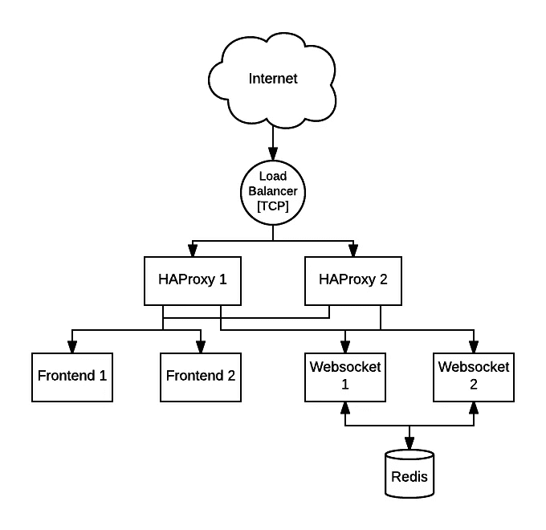
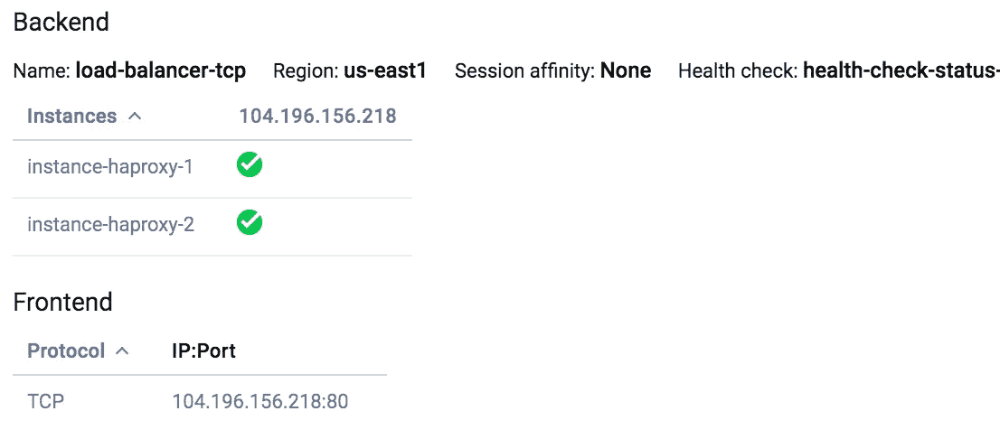
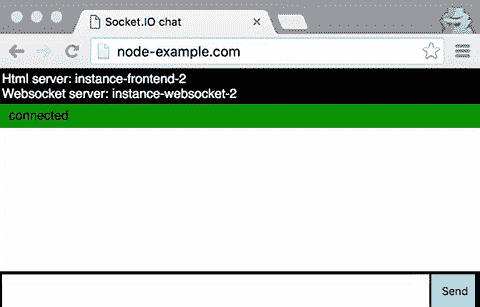
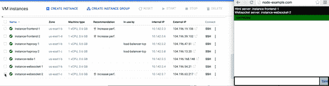
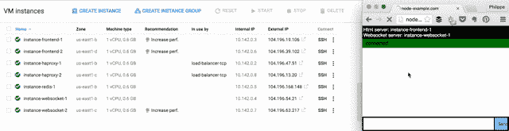

# Google Cloud 上的高可用性 Websockets

> 原文：<https://medium.com/google-cloud/highly-available-websockets-on-google-cloud-c74b35ee20bc?source=collection_archive---------0----------------------->

几周前，仍在@Storify 工作的@devongovett 联系我，分享了一个关于 Storify 对 websockets 进行负载平衡的方法的更新。两年前我们写了一篇[文章](/@Philmod/load-balancing-websockets-on-ec2-1da94584a5e9#.xepi18k8a)来解释我们如何使用 IP affinity 来使用 HAProxy 对 socket.io 进行负载平衡。

但使用源 IP 亲缘关系进行平衡可能会导致问题: [socket.io](http://socket.io/) 的轮询传输在一些企业网络上中断，在这些网络上，它们跨多个外部 IP 地址对流量进行负载平衡。在这种情况下，与特定会话 id 相关联的请求可能会连接到不同的进程，这将破坏 socket.io 为该特定会话缓冲消息的方式。

答案是切换到具有会话 cookie 的应用层持久性解决方案。

让我给你举个例子。

# 聊天示例

我将使用稍微修改过的 [socket.io 聊天示例](http://socket.io/get-started/chat/)的版本，将它分成两个服务器。

一个[服务器](https://github.com/Philmod/node-example-frontend)将负责服务单个 HTML 页面。另一个[服务器](https://github.com/Philmod/node-example-websocket)将负责向所有聊天用户广播消息。

在生产环境中，HTML 页面应该由 [CDN](https://cloud.google.com/cdn/) 交付。但是在演示中，我想展示我们如何对 HTTP 和 Websocket 请求进行负载平衡。

为了在 websocket 服务器之间传递消息，我们将使用 Redis [适配器](http://socket.io/docs/using-multiple-nodes/#passing-events-between-nodes)。当连接到*实例-websocket-1* 服务器的用户 A 发送消息时，该消息可以广播给连接到*实例-websocket-2* 的用户。

# 负载平衡流量



全网络图

谷歌云平台提供了一个 TCP 负载平衡器，它将被用作我们网络的公共入口点。它将在许多 HAProxy 实例之间对流量进行负载平衡。

**HAProxy** 将负责将流量重定向到所需的后端服务器(frontend 或 websocket)，并确保来自同一用户的 socket.io 请求总是进入同一进程。如果客户端不支持 WebSocket 协议，因此会退回到轮询传输，这一点非常重要。

# HAProxy [配置](https://gist.github.com/Philmod/21b7c8fbd5a2bc20987141bc99966951)

首先， [HAProxy](http://www.haproxy.org/) 将侦听端口 80 上的所有传入流量，并根据子域(“ws”)将其重定向到 websocket 后端)，否则发送到 HTTP 后端。

```
frontend public
  bind *:80
  maxconn 10000
  acl is_websocket hdr_end(host) -i ws.node-example.com
  use_backend ws if is_websocket
  default_backend www
```

HTTP 后端配置非常简单。它使用“循环”策略来平衡流量负载。让我们不要忘记定义 HTTP check url，这样 HAProxy 就知道其中一个服务器何时出现故障。我发现添加一个用于调试目的的查询字符串很有用。

```
backend www
  timeout check 5000
  option httpchk GET /status?haproxy=1
  balance roundrobin
  server www1 10.142.0.3:3001 maxconn 1000 weight 10 check inter 10000 rise 1 fall 3
  server www2 10.142.0.6:3001 maxconn 1000 weight 10 check inter 10000 rise 1 fall 3
```

神奇之处在于 websocket 后端配置。如果支持 WebSocket 协议，就不会有问题，因为只使用了一个 tcp 连接。但是在回退到轮询传输的情况下，许多连接都是到后端的。在第一次请求时，HAProxy 设置一个 cookie，指定使用哪个服务器，然后它使用这个 cookie 为后续请求选择同一个服务器。

```
backend ws
  timeout check 5000
  option httpchk GET /status?haproxy=1
  balance roundrobin
  cookie HAPROXY_WS_COOKIE insert indirect nocache
  server ws1 10.142.0.4:3002 maxconn 1000 weight 10 check inter 10000 rise 1 fall 3 check cookie ws1
  server ws2 10.142.0.7:3002 maxconn 1000 weight 10 check inter 10000 rise 1 fall 3 check cookie ws2
```

# Google 云负载平衡器配置

TCP [负载平衡器](https://cloud.google.com/load-balancing/)负责平衡端口 80 上的传入公共流量到 HAProxy 实例。



Google 云负载平衡器配置

# 演示

我在聊天页面中添加了一些信息，以便于检查整个系统:

*   “Html 服务器”显示哪个 HTTP 后端服务于该页面。
*   “Websocket 服务器”显示哪个 websocket 后端在监听用户的消息。
*   当页面连接/断开 websocket 后端时，会出现一条彩色消息。

## 粘性会话

通过刷新页面，我们可以看到 html 由两个后端服务器提供服务，但是 websocket 总是连接到同一个(原始)服务器。



前端负载平衡***vs***web socket cookie 会话

## 死 websocket 后端

如果 websocket 后端失败，用户将重新连接到另一个实例。在这个例子中，我们的用户连接到*实例-websocket-2* ，这个实例死亡，用户重新连接到*实例-websocket-1* 。



重新连接到健康的 websocket 后端

## 死亡的 HAProxy 实例

当一个 HAProxy 实例死亡时，Google Cloud 负载平衡器会将所有流量重定向到其他 HAProxy 实例。



死亡的 HAProxy 实例

# 结论

这整个堆栈为我们提供了一个健壮的方法来扩展我们的服务，它使用 socket.io 进行通信。

HAProxy 提供了微调流量重定向到所需微服务的能力，并提供了为 socket.io 附加会话 cookie 的必要选项。