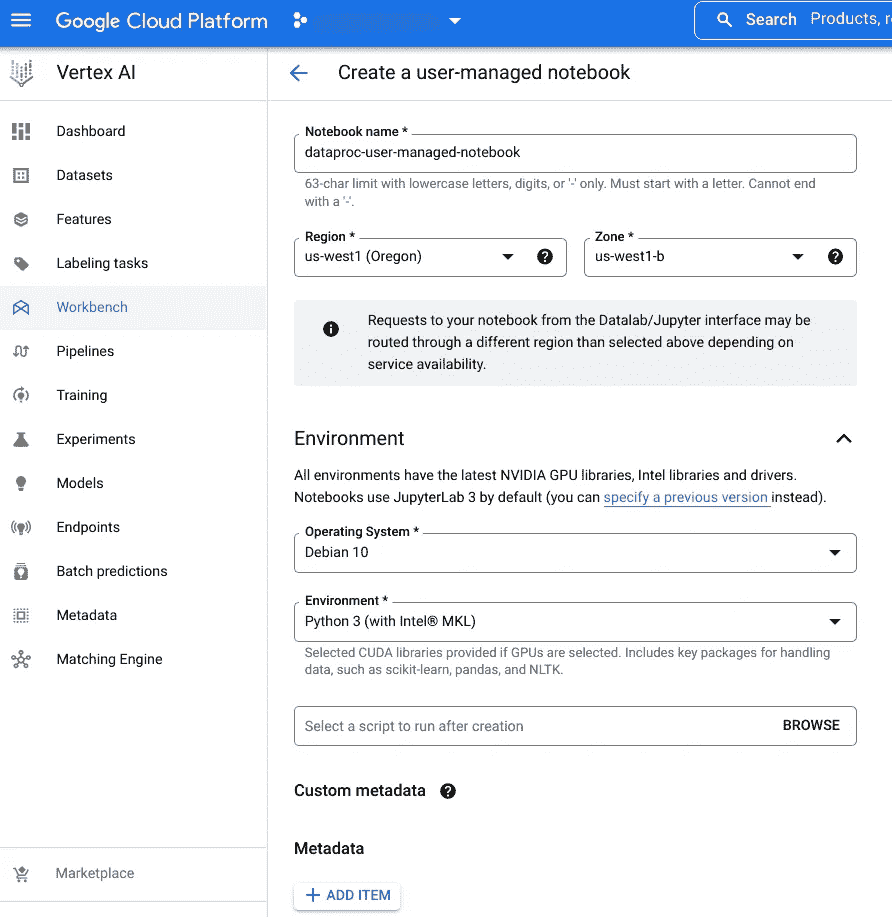
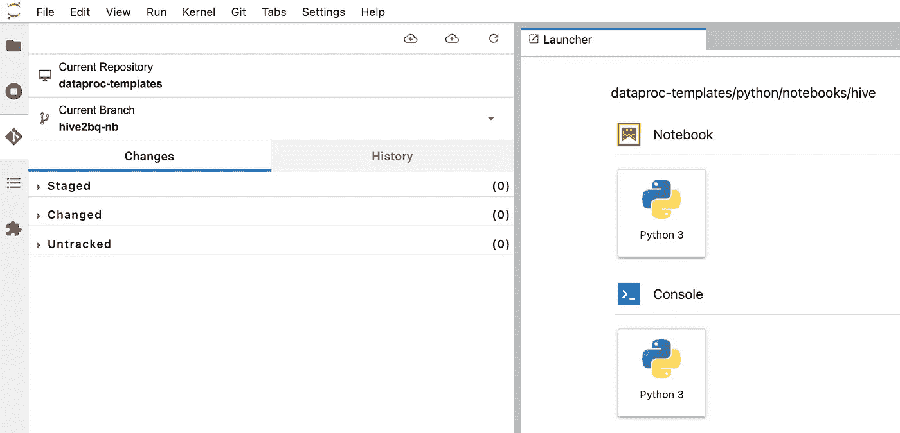
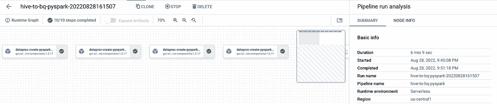

# Hive to BigQuery:使用 GCP Dataproc 无服务器高效地移动数据

> 原文：<https://medium.com/google-cloud/hive-to-bigquery-move-data-efficiently-using-gcp-dataproc-serverless-ee30d35aaf03?source=collection_archive---------1----------------------->


任何云迁移活动的主要要求之一是将数据从本地/云服务器迁移到现代数据仓库，如 BigQuery。将数据从 Hadoop 迁移到 BigQuery 是业内相当常见的用例。它通常包括多步过程，包括使用 DistCP 或其他方法将数据迁移到 GCS，然后构建从 GCS 到 BigQuery 的管道。

[Dataproc 模板](https://github.com/GoogleCloudPlatform/dataproc-templates)使用 [VertexAI 笔记本](https://cloud.google.com/vertex-ai/docs/tutorials/jupyter-notebooks)和 [Dataproc 无服务器](https://cloud.google.com/dataproc-serverless/docs)提供一站式解决方案，将数据从任何 Hadoop 环境中的 Hive 表直接迁移到 GCP BigQuery。

**设置 VertexAI 笔记本:**

1.  从 [API 控制台](https://console.developers.google.com/)启用 GCP 项目中的以下服务:

*   计算引擎 API
*   Dataproc API
*   顶点人工智能应用编程接口
*   顶点笔记本 API

2.在[顶点 AI 工作台中创建一个](https://pantheon.corp.google.com/vertex-ai/workbench/list/instances)[用户管理的](https://cloud.google.com/vertex-ai/docs/workbench/user-managed/introduction)笔记本。



3.使用 GIT 选项卡克隆 Dataproc 模板 GitHub repo，如下图所示



或者从启动窗口打开一个终端，使用 git clone 进行克隆。

```
git clone [https://github.com/GoogleCloudPlatform/dataproc-templates.git](https://github.com/GoogleCloudPlatform/dataproc-templates.git)
```

4.从文件夹选项卡中，打开路径中的[hivetobiqquery _ notebook . ipynb](https://github.com/GoogleCloudPlatform/dataproc-templates/blob/main/notebooks/hive2bq/HiveToBigquery_notebook.ipynb)notebook:data proc-templates/notebooks/hive 2 bq

5.为了方便用户，下面的步骤被顺序标记并在 Python 笔记本中实现。

**第一步:安装所需的软件包** 迁移所需的一些软件包需要单独安装，因为它们在笔记本中不可用，例如 PySpark、JDK 等。

**第二步:设置 Google Cloud 属性** 运行笔记本前需要设置以下配置:

*   `REGION` : GCP 地区卸载 BQ 中的 Hive 表。
*   `GCS_STAGING_LOCATION`:存放人工制品的 GCS 桶。
*   `SUBNET` : VPC 子网
*   `INPUT_HIVE_DATABASE`:输入表的配置单元数据库
*   `INPUT_HIVE_TABLES`:逗号分隔的要移动的配置单元表名，要从数据库中移动所有的表放" * "
*   `OUTPUT_BIGQUERY_DATASET`:输出表的 BigQuery 数据集
*   `TEMP_BUCKET`:存放中间文件的临时 GCS 桶
*   `HIVE_METASTORE`:蜂房 metastore URI
*   `MAX_PARALLELISM`:要运行的并行 Dataproc 作业的数量(默认值=10)
*   `HIVE_OUTPUT_MODE`:可以是覆盖/追加/忽略/错误是否存在之一

**第三步:**导入所需的库，如 pandas 和 SparkSession。

**步骤 4:** 将当前工作目录设置为 python 文件夹，因为所有需要的工件都在那里。

**第五步:构建 python egg 包** hivetobiqquery 笔记本在后端利用已有的[Hive to biqquery 模板](https://github.com/GoogleCloudPlatform/dataproc-templates/blob/main/python/dataproc_templates/hive/hive_to_bigquery.py)，需要 egg 文件形式的 python 包。

**步骤 6:将工件复制到 GCS bucket** 将上面的包文件连同现有的 main.py 一起复制到用户提供的 GCS bucket。

**步骤 7:获取配置单元表** 如果用户在步骤 2 中没有提供要迁移的配置单元表列表，该单元将连接到所提供的配置单元节约 URI，并使用 SparkSession 获取数据库中所有表的列表。

**步骤 8:创建作业集** 基于步骤 2 中提供的 MAX_PARALLELISM 值，多个作业将并行运行，使用 Dataproc 无服务器批处理作业将配置单元表迁移到 BigQuery。运行此单元格以将表格列表分组，然后这些表格将并行运行。

**步骤 9:** 设置要传递给 VertexAI 管道的 Dataproc 模板属性，如 JAR 路径和 egg 包路径。

**步骤 10:构建顶点 AI 管道** 在[用于顶点 AI 管道的 Dataproc 无服务器组件](https://cloud.google.com/vertex-ai/docs/pipelines/dataproc-component)的帮助下，可以触发一个 Dataproc 无服务器批处理作业，该作业在后端将运行 HIVE 到 BQ 模板，并将表集(参考步骤 8)并行加载到 BigQuery。

**步骤 11:触发作业并更新审计表** 最后一个单元负责触发上一步建立的顶点 AI 流水线，同时也更新审计表中设置的各个表的状态。

6.使用菜单栏中给定的选项逐一或一次运行所有单元格。在第 11 步结束时，将为每个表集生成一个链接，该链接可用于监视作业。或者，也可以从 [Dataproc 批处理 UI](https://console.cloud.google.com/dataproc/batches) 中查看详细日志。



VertexAI 笔记本 DAG 可视化

# 审计表

该模板以 CSV 格式将每次加载的审计数据存储在提供的 GCS 存储桶中。

为了查看数据，创建一个指向 GCS 存储桶的外部表，如下所示。

```
CREATE EXTERNAL TABLE `<project-id>.<dataset-name>.hive_bq_audit`
(
  Source_DB_Name STRING,
  Source_Table_Set STRING,
  Target_DB_Name STRING,
  Target_Table_Set STRING,
  Job_Start_Time STRING,
  Job_End_Time STRING,
  Job_Status STRING
)
OPTIONS(
  format="CSV",
  uris=["gs://<bucket-name>/audit/*"]
);
```

**限制:**

1.  **分区表:** 当前版本不自动在 BigQuery 中创建分区。为了在 BigQuery 中复制配置单元分区，必须手动创建带有分区和集群列的 DDL。一旦在 BigQuery 中创建了表结构，上述过程将负责将数据插入到分区中。 [BigQuery 翻译 API](https://cloud.google.com/bigquery/docs/interactive-sql-translator) 可用于将 Hive DDL 转换为 BigQuery 格式。
    注意:在这里通读 BigQuery 分区限制[。](https://cloud.google.com/bigquery/docs/partitioned-tables#limitations)
2.  **增量加载:** 当前版本仅支持覆盖和追加模式。根据要求在上述步骤 2 中更改该值。
3.  **Kerberos 认证:** 如果需要，用户必须自己实现 Kerberos 认证。

如有任何疑问/建议，请联系:
[dataproc-templates-support-external@googlegroups.com](mailto:dataproc-templates-support-external@googlegroups.com)