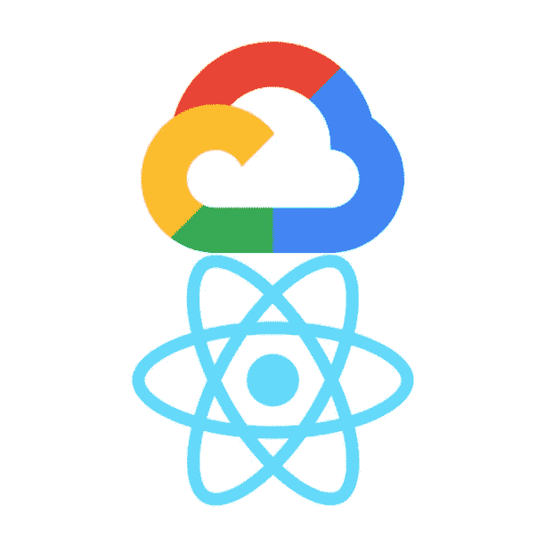

# 在不到一小时的时间内，将您的 React 应用发布到 Google Cloud 上

> 原文：<https://medium.com/google-cloud/hosting-a-react-js-app-on-google-cloud-app-engine-6d1341b75d8c?source=collection_archive---------0----------------------->

## 在谷歌云上托管 REACT 应用的指南

## 初学者教程

将服务器迁移到云已经成为当前的技术趋势，来自 **AWS** 、 **Auzre** 、 **IBM** 、 **SAP** 、 **Salesforce** 等的云服务是其中的佼佼者。在这些长期运行的云服务中，有**谷歌云**和**甲骨文云**它们拥有…