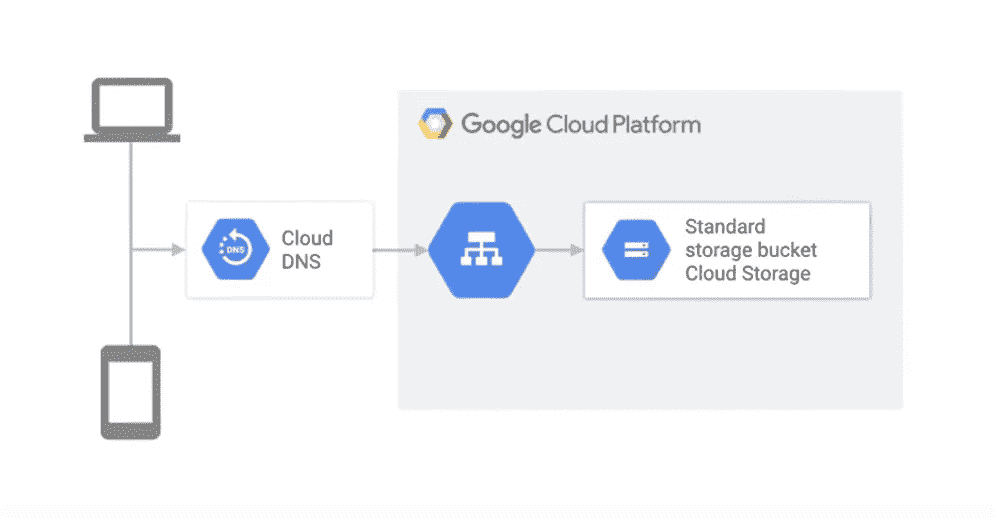

# 使用谷歌云存储在谷歌云上托管静态网站

> 原文：<https://medium.com/google-cloud/hosting-a-static-website-on-google-cloud-using-google-cloud-storage-ddebcdcc8d5b?source=collection_archive---------0----------------------->

## 在云中烹饪

# 介绍

在这个迷你系列中，我们将介绍如何在谷歌云上创建网站。这是该系列的第二篇文章。

1.  [在谷歌云上托管网络应用:概述](/@pvergadia/hosting-web-applications-on-google-cloud-an-overview-46f5605eb3a6)
2.  使用 Google 云存储在 Google Cloud 上托管一个 web 应用程序(本博客)
3.  [使用 Cloud Run 在 Google Cloud 上托管 web 应用](/google-cloud/hosting-a-website-on-google-cloud-using-cloud-run-a65343a98fce)
4.  [使用谷歌计算引擎在谷歌云上托管网络应用](/@pvergadia/hosting-a-website-on-google-cloud-using-google-compute-engine-c6fe84d76f51)
5.  [在谷歌计算引擎上扩展 web 应用](/p/d21d6ce3e837/)
6.  [案例研究](/faun/case-study-hosting-scalable-web-apps-on-google-cloud-c0bb675812c8)

假设你是一家小公司，想建立一个基本的网站。你不期望有很大的流量，也不想花很多钱来上网。因此，请继续阅读，了解如何通过部署静态网站从小处着手。

# 你会学到什么

*   在谷歌云上创建静态网站
*   将您的域名指向 GCS
*   创建存储桶，使用访问控制上传和共享文件
*   设置索引页后缀和错误页
*   测试网站

# 先决条件

*   阅读[第一篇文章](/@pvergadia/hosting-web-applications-on-google-cloud-an-overview-46f5605eb3a6)，它涵盖了关于在 Google Cloud 上建立网站的高级概念。

# 看看这个视频

# 什么是静态网站？

静态网站对于像博客这样的网站来说是一个很好的选择——页面在发布后很少改变，或者没有任何动态生成的内容。静态网页可以包含 HTML、CSS 和 JavaScript 等客户端技术。它们不能包含动态内容，如服务器端脚本，如 PHP。

# 如何在谷歌云上创建静态网站

在我们开始之前，我们需要确保我们在谷歌云控制台中设置正确。确保以下事项:

*   您已经创建了一个 GCP 项目
*   建立一个记帐帐户
*   您拥有或管理一个域名(这应该是顶级域名)。要验证您是否管理该域，请检查此处的。

既然我们已经介绍了物流，那么设置静态 web 应用程序有四个步骤。

## 步骤 1:将您的域指向 GCS

第一步是将您的域连接到云存储。为此，创建一个指向 c.storage.googleapis.com 的 CNAME 记录。您的域名注册服务可以在这方面提供帮助。

> [www.example.com](http://www.example.com)c.storage.googleapis.com**CNAME**。

## 步骤 2:创建链接到您的域的存储桶

第二步是创建一个谷歌云存储桶。要做到这一点，浏览到谷歌云控制台，点击云存储，然后点击创建桶。确保存储桶名称与为您的域创建的 CNAME 相匹配。在这种情况下，存储桶应该被命名为【www.example.com】

## 第三步:上传并分享你网站的文件

第三步是上传你希望你的网站提供的文件。我们可以用两种方法之一来做这件事。

首先，通过使用谷歌云控制台直接上传文件。

第二，使用 gsutil 命令行，这对于已经有网站的用户来说非常有用。

*gsutil****rsync****-R local-dir GS://www . example . com*

## 访问控制:

一旦文件上传，我们需要确保它们被正确共享以供访问。您可以公开存储桶中的所有文件，也可以将单个对象设置为可通过您的网站访问。一般来说，让 bucket 中的所有文件都可以访问会更容易、更快。

在这一点上，我们基本上有一个功能正常的静态网站，但建议分配一个**索引页面后缀**和一个**自定义错误页面**来更好地指导用户。

## 索引页后缀和自定义错误页:

索引页后缀

这有助于假设你的桶[www.example.com 中没有名为 *apple* 的文件。在这种情况下，如果用户请求 URL](http://www.example.com.)[http://www.example.com/apple,](http://www.example.com/apple,)云存储试图提供文件[www.example.com/apple/index.html](http://www.example.com/directory/index.html)。如果该文件也不存在，云存储将返回一个带有 404 响应的错误页面。

你可以在这里了解更多关于设置的信息[。](https://cloud.google.com/storage/docs/hosting-static-website)

## 第四步:测试网站

最后一步是测试我们的静态网站。通过在浏览器中请求域名，验证内容是从 bucket 提供的。

## 在 GCS 上提供 HTTPs 内容

通过负载平衡器在 GCS 上提供 HTTPs 内容

需要注意的一点是，GCS 只支持 HTTP。为了服务于 HTTPS，并获得所有的安全优势，我们需要使用 CNAME 重定向的直接 URIs，或者迁移到使用负载平衡器作为前端，如图所示。

# 结论

在本文中，我们学习了如何从小处着手，在 Google 云平台上部署一个静态 web 应用程序。我们使用 [Google 云存储](https://cloud.google.com/storage/)来托管静态内容，并将域名指向存储桶。

在谷歌云平台上托管静态网站

# 后续步骤

*   在[谷歌云平台媒体](https://medium.com/google-cloud)上关注这个博客系列。
*   关注[获取云端烹饪](https://www.youtube.com/watch?v=pxp7uYUjH_M&list=PLIivdWyY5sqIOyeovvRapCjXCZykZMLAe&index=1)视频系列，订阅谷歌云平台 YouTube 频道
*   想要更多的故事？查看我的[媒体](/@pvergadia/)，[在 twitter 上关注我](https://twitter.com/pvergadia)。
*   与我们一起享受这个系列的旅程，并了解更多关于 Google Cloud 的信息:)