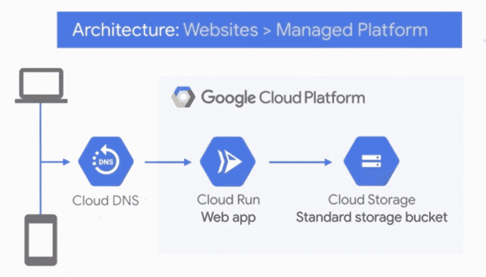

# 使用 Cloud Run 在 Google Cloud 上托管网站

> 原文：<https://medium.com/google-cloud/hosting-a-website-on-google-cloud-using-cloud-run-a65343a98fce?source=collection_archive---------1----------------------->

## 在云中烹饪


# 介绍

在这个迷你系列中，我们将介绍如何在谷歌云上创建网站。这是该系列的第三篇文章。

1.  [在谷歌云上托管网络应用:概述](/@pvergadia/hosting-web-applications-on-google-cloud-an-overview-46f5605eb3a6)
2.  [使用谷歌云存储在谷歌云上托管网络应用](/google-cloud/hosting-a-static-website-on-google-cloud-using-google-cloud-storage-ddebcdcc8d5b)
3.  使用 Cloud Run 在 Google Cloud 上托管 web 应用程序(此博客)
4.  [使用谷歌计算引擎在谷歌云上托管网络应用](/@pvergadia/hosting-a-website-on-google-cloud-using-google-compute-engine-c6fe84d76f51)
5.  [在谷歌计算引擎上缩放 web 应用。](/p/d21d6ce3e837/)
6.  [案例研究](/faun/case-study-hosting-scalable-web-apps-on-google-cloud-c0bb675812c8)

假设您是一家小公司，发展非常迅速，现在您的简单网站流量很大，但是当您可以专注于核心业务时，您不想处理基础架构设置和维护！

# 你会学到什么

*   用五个简单的步骤创建一个网站。

# 先决条件

*   阅读[第一篇文章](/@pvergadia/hosting-web-applications-on-google-cloud-an-overview-46f5605eb3a6)，它涵盖了关于在 Google Cloud 上建立网站的高级概念。

# 看看这个视频

# 什么是云跑？

[云运行](https://cloud.google.com/run/)是一个可自动扩展无状态容器的托管计算平台。“无状态”在这里很重要，因为容器实例可以随时启动或停止。web 请求或发布/订阅事件可以调用这些容器。

它建立在 Knative 的基础上，让你可以选择轻松地运行你的容器，要么完全由 Cloud Run 管理，要么在 GKE 的 Google Kubernetes 引擎集群中运行 Cloud Run。

云运行也是无服务器的:它抽象了所有的基础设施管理，因此您可以专注于最重要的事情——构建优秀的应用程序。

# 如何在云上创建网站

在我们开始之前，我们需要确保我们在谷歌云控制台中设置正确。以下是一些设置逻辑:

*   您已经创建了一个 GCP 项目
*   建立一个记帐帐户
*   启用云运行和云构建 API。
*   如果你还没有安装 Google Cloud SDK，请按照这里的说明[进行安装。](https://cloud.google.com/sdk/install)

现在我们已经讨论了物流，在 Cloud Run 上设置 web 应用程序有五个步骤。

# 步骤 1:安装 gcloud SDK 的测试版组件

注意:在这篇博文发表的时候，Cloud Run 还在测试阶段。

这要求我们使用以下命令安装 gcloud SDK 的测试版组件。

> “gcloud 组件安装测试版”——安装测试版功能
> 
> “gcloud 组件更新”——更新组件

# 步骤 2:创建要部署的示例 web 应用程序

如果您已经有一个 web 应用程序，并希望在这些步骤中进一步使用，则可以跳过此步骤。如果您选择跟随我的示例，那么让我们使用以下步骤用 python 创建一个“hello world”web 应用程序:

*   “mkdir hello world-python”——创建一个目录
*   “CD hello world-python”——更改到创建的目录
*   “VI app . py”—创建一个文件并粘贴以下代码。这将创建一个基本的 web 服务器，它监听由 port 环境变量定义的端口。

```
import os

from flask import Flask

app = Flask(__name__)

@app.route('/')
def hello_world():
    target = os.environ.get('TARGET', 'World')
    return 'Hello {}!\n'.format(target)

if __name__ == "__main__":
    app.run(debug=True,host='0.0.0.0',port=int(os.environ.get('PORT', 8080)))
```

现在，我们准备容器化我们的应用程序，并上传到容器注册！

# 步骤 3:将应用程序容器化，并上传到容器注册表

在与源文件相同的目录下创建一个名为 **Dockerfile** 的新文件。一个 **Dockerfile** 是一个文本文档，它包含用户可以在命令行上调用的所有命令，以组装一个容器映像。

您可以使用以下命令:

*   “pwd”——检查你在哪个目录。如果您不在“helloworld-python”目录中，请转到该目录。
*   “CD hello world-python”——更改到创建的目录
*   “VI docker file”——在同一目录中创建文件的命令。将下面的代码粘贴到该文件中，以创建容器图像。

```
# Use the official Python image.
# https://hub.docker.com/_/python
FROM python:3.7

# Copy local code to the container image.
ENV APP_HOME /app
WORKDIR $APP_HOME
COPY . .

# Install production dependencies.
RUN pip install Flask gunicorn

# Run the web service on container startup. Here we use the gunicorn
# webserver, with one worker process and 8 threads.
# For environments with multiple CPU cores, increase the number of workers
# to be equal to the cores available.
CMD exec gunicorn --bind :$PORT --workers 1 --threads 8 app:app
```

# 第四步:构建

现在，我们通过从包含 **Dockerfile** 的目录中运行 build 命令，准备使用 [**云构建**](https://cloud.google.com/cloud-build/) 进行构建。

*   “gcloud 构建提交—标记 gcr.io/**gcic-web**/hello world”——这将提交构建。当构建成功时，您将看到“成功”。

# 步骤 5:在云上部署

为了在云运行上部署容器映像，我们现在需要执行以下命令。确保将**项目 ID** 和**服务名称**替换为您自己的项目 ID 和服务名称。

*   “gcloud 测试版运行部署—映像 gcr.io/**项目 ID** / **服务名称** —平台托管”
*   当提示选择区域时，选择您所选择的区域。
*   提供您选择的服务名
*   用 **Yes** 来响应，以允许未经身份验证的调用。
*   如果成功，我们会看到服务 URL。您可以使用 URL 打开我们刚刚部署的 web 应用程序。

# 恭喜你！！

您刚刚在 Cloud Run 上部署了一个打包在容器映像中的 web 应用程序。

# 结论

我们在 Cloud Run 上创建并部署了一个动态 web 应用程序，并了解到如果您在 Cloud Run 上托管一个网站，您可以依赖 google cloud 来根据需求进行扩展。



部署在云上的 Web 应用程序

# 后续步骤

*   在[谷歌云平台媒体](https://medium.com/google-cloud)上关注这个博客系列。
*   关注[获取云端烹饪](https://www.youtube.com/watch?v=pxp7uYUjH_M)视频系列，订阅谷歌云平台 YouTube 频道
*   想要更多的故事？查看我的[媒体](/@pvergadia/)，[在 twitter 上关注我](https://twitter.com/pvergadia)。
*   与我们一起享受这个系列的旅程，并了解更多关于 Google Cloud 的信息:)