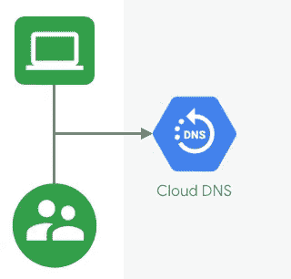
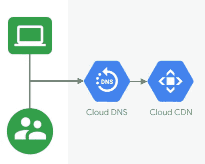
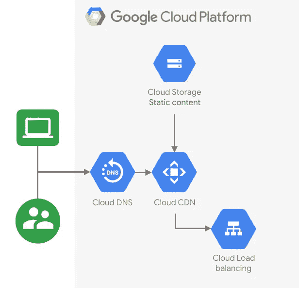
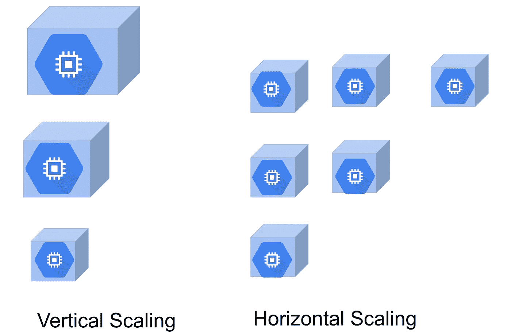

# 使用谷歌计算引擎部署网站的 5 个步骤

> 原文：<https://medium.com/google-cloud/hosting-a-website-on-google-cloud-using-google-compute-engine-c6fe84d76f51?source=collection_archive---------0----------------------->

## 在云中烹饪

# 介绍

在这个迷你系列中，我们将介绍如何在谷歌云上创建网站。这是本系列的第四篇文章。

1.  [在谷歌云上托管网络应用:概述](/@pvergadia/hosting-web-applications-on-google-cloud-an-overview-46f5605eb3a6)
2.  [使用谷歌云存储在谷歌云上托管网络应用](/google-cloud/hosting-a-static-website-on-google-cloud-using-google-cloud-storage-ddebcdcc8d5b)
3.  [使用 Cloud Run 在 Google Cloud 上托管 web 应用](/google-cloud/hosting-a-website-on-google-cloud-using-cloud-run-a65343a98fce)
4.  使用谷歌计算引擎部署网站的 5 个步骤(本博客)
5.  [在谷歌计算引擎上扩展 web 应用](/p/d21d6ce3e837/)
6.  [案例研究](/faun/case-study-hosting-scalable-web-apps-on-google-cloud-c0bb675812c8)

作为一名工程师，最大的好处之一就是我们可以完全控制我们开发的东西的很多方面。对于你们中的许多人来说，这也延伸到了你们开发的网站。如果你需要比静态网站更先进的东西，但需要比谷歌云托管服务提供的更多的控制，那么你可以使用计算引擎。

# 你会学到什么

*   创建一个网站使用计算引擎在五个简单的步骤。

# 先决条件

*   阅读[第一篇文章](/@pvergadia/hosting-web-applications-on-google-cloud-an-overview-46f5605eb3a6)，它涵盖了关于在 Google Cloud 上建立网站的高级概念。

# 看看这个视频

使用谷歌计算引擎在谷歌云上托管网络应用

# 什么是谷歌计算引擎？

[谷歌计算引擎](https://cloud.google.com/compute/)让你在谷歌基础设施上创建和运行虚拟机。计算引擎提供了规模、性能和价值，允许您在 Google 的基础设施上轻松启动大型计算集群。没有前期投资，您可以在一个系统上运行数以千计的虚拟 CPU，该系统被设计为快速，并提供强大的性能一致性。

# 如何在计算引擎上创建网站

值得注意的是，一个设计良好的 web 应用程序应该随着需求的增加和减少而无缝扩展，并且能够承受一个或多个计算资源的损失。

但是，一个真正有弹性和可伸缩的 web 应用程序需要计划。让我们看看一个网站是如何工作的，使用谷歌计算引擎。敬请关注 codelab！(即将推出)

# 步骤 1:用户请求和 DNS

用户请求登陆云 DNS

当用户在浏览器中请求您的网站时，他们的请求最终会到达您的 DNS 提供商，在本例中，我们使用的是 [Google DNS](https://developers.google.com/speed/public-dns) ，这是一种高度可用的域名服务。

网络流量被路由到运行在谷歌云上的基础设施。

如果您使用自己的 DNS 提供商，那么请求将首先到达那里，然后 DNS 提供商将流量路由到 Google Cloud。

# 步骤 2:缓存与非缓存内容

缓存与非缓存内容

然后，如果请求的是缓存的内容，则由 CDN 交付。在这个架构中，我们使用的是[云 CDN](https://cloud.google.com/cdn/) ，一个边缘位置的全球网络。请求被自动路由到最近的边缘位置，因此内容以最佳性能交付。(您也可以与您选择的任何其他第三方 CDN 集成。)

web 应用程序使用的静态内容存储在[谷歌云存储](https://cloud.google.com/storage/)上，这是一个高度耐用的存储基础设施，专为关键任务和主要数据存储而设计。

请求由云负载平衡完成的负载平衡

# 步骤 3:请求负载平衡

HTTP 请求首先由[云负载平衡](https://cloud.google.com/load-balancing/)处理，它自动在多个计算引擎实例之间分配传入的应用流量。

如果使用 HTTPS，SSL 会话将在负载平衡器处终止，并且需要至少一个签名的 SSL 证书。

# 步骤 4 : Web 和应用服务器

Google 计算引擎实例自动缩放以处理用户对 web 服务器的请求

Web 应用程序，包括应用服务器和 web 服务器，部署在 Google 计算引擎(GCE)实例上。使用[实例模板](https://cloud.google.com/compute/docs/instance-templates/)自动无缝地完成部署和扩展。实例模板是 GCE 实例的特定定制配置，它通过使用托管实例组来促进实例配置的重用。

要了解关于实例组的更多信息，请查看下一篇文章！

# 步骤 5:存储应用程序数据

要存储应用程序数据，您可以使用数据库。本例中使用的关系数据库是[云 SQL](https://cloud.google.com/sql/docs/) 。Cloud SQL 是一个完全托管的数据库服务，它使得在云中设置、维护、管理和管理关系数据变得非常容易。它自动执行所有数据备份、复制、修补和更新。

根据网站使用案例，您可能希望使用基于文档的数据库，如用于用户数据的[数据存储库](https://cloud.google.com/datastore/)，或者使用 [Bigtable](https://cloud.google.com/bigtable/) 来管理大型的、高度可扩展的全球 NoSQL 数据库。

在谷歌计算引擎上托管网络应用的架构

# 缩放网站

现在我们知道了如何为 Google Compute Engine 建立 web 应用程序架构，如果我们的网站变得非常受欢迎，流量从 100 个用户增长到数百万用户，会发生什么？我们需要确保我们的应用程序能够优雅地处理流量的高峰和低谷。

增加处理峰值的能力的一种方法是垂直扩展，向同一个实例添加更多的 CPU 和内存。这意味着垂直扩展将受到单台机器的容量及其大小的限制。

水平和垂直缩放

另一方面，水平扩展是高可用性应用程序的更好选择，因为它允许您随着需求的增加动态扩展计算资源的数量。

应用程序的资源可以增加或减少的想法要求它有一种方法，通过这种方法我们可以从服务中添加或删除实例。但是，添加或删除实例是如何自动工作的呢？看看下一篇文章就知道了！

# 后续步骤

*   在[谷歌云平台媒体](https://medium.com/google-cloud)上关注这个博客系列。
*   跟随[获取云端烹饪](https://www.youtube.com/watch?v=pxp7uYUjH_M)视频系列，订阅谷歌云平台 YouTube 频道
*   想要更多的故事？查看我的[中](/@pvergadia/)，[在 twitter 上关注我](https://twitter.com/pvergadia)。
*   与我们一起享受这个系列的旅程，并了解更多关于 Google Cloud 的信息:)