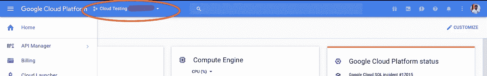

# 在单个谷歌云计算引擎上托管多个网站

> 原文：<https://medium.com/google-cloud/hosting-multiple-websites-on-single-google-cloud-compute-engine-9768e2f02c6d?source=collection_archive---------0----------------------->


虚拟主机允许在一台服务器上托管多个站点

这篇文章将是关于在使用 Apache 2 的自定义域的谷歌云计算引擎的单个虚拟机实例上托管多个网站。

# 简介:

要在“谷歌计算引擎”上托管多个网站，我们首先需要托管我们的单个网站，即服务器已经安装。现在，通过为您的其他域创建“sites-available”的“domain.conf”文件，我们将能够告诉服务器根据请求的“host”标头路由到不同的目录。这基本上是在 Apache 中创建虚拟主机。现在，使用计算引擎虚拟机的 IP 将域名指向服务器。经过一段时间(传播阶段)后，您将能够访问由谷歌云计算引擎中的单个虚拟机实例托管和服务的两个网站。

# 详细:

在裁剪之前，您需要

*   **一个激活的谷歌云平台** ( GCP ) **账号**。如果你还没有，转到 [GCP 网站](https://cloud.google.com)并点击*免费试用*，你将被要求提供信用卡/借记卡的详细信息，并可能获得 300 美元的试用信用。
*   创建了一个项目。
*   安装了 apache2 的 GCP 计算引擎的运行虚拟机实例。
*   对 DNS 有所了解

虽然我假设你已经安装了 apache 服务器，并在上面成功地托管了一个网站，但我还是会在这个博客里把它设置好，以防万一..；)因此，如果您愿意，可以跳过以下部分。

## 在 GCP 计算引擎上创建虚拟机实例:

*   迎面走向 [GCP 控制台](https://console.cloud.google.com/)。现在，如果您还没有创建项目，您将会看到一个要求创建项目的屏幕，单击该屏幕并创建一个项目。
*   导航到您的项目。通过下拉项目选择器验证它。



下拉项目选择

*   现在从侧菜单(点击汉堡图标显示)点击'**计算引擎**'。
*   导航到“虚拟机实例”并单击“**创建实例**”。
*   现在填写虚拟机的名称和配置，填写任意名称。现在选择机器类型为' *f1-micro* '，引导镜像为' *Ubuntu 16.04 LTS* '，并在防火墙部分下选中'*允许 HTTTP 流量* c '。
*   点击'**创建**'按钮，现在你就完成了。

## 托管第一个网站:

*   对于托管网站，我们需要在我们的虚拟机实例上设置一个服务器。我们将在虚拟机实例上安装 apache2 服务器。
*   导航到计算引擎中的虚拟机实例，然后单击“SSH”


正在连接到 GCP 上的虚拟机实例

*   您将被定向到一个浏览器窗口/选项卡，其中有一个终端连接到您的虚拟机实例。
*   现在在终端上执行以下命令(在浏览器中打开)

`sudo apt-get install apache2`

如果出现提示，请输入“y”。

*   现在，您可以将文件托管在位置“/var/www/html/”中。出于演示的目的，执行下面的命令，这将为我们的服务器创建一个测试页面。

```
cd /var/www/htmlsudo echo “<html><head><title>Hello</title></head><body><h1>Test Page</h1></body></html>” >> index.html
```

*   现在，导航回虚拟机维护列表页面，单击与您的虚拟机名称相对应的外部 IP 地址。它会将您重定向到一个新的选项卡，您应该会看到我们刚刚创建的测试页面。
*   在这种状态下，我们已经成功地举办了一个网站(目前只有一个网页)。如果我们希望我们的页面可以使用域名访问，那么我们需要将我们的域名指向我们实例的 IP 地址。转到你的域名卖家的账户，找到 DNS 设置，编辑 **A 记录**并填写你的虚拟机实例的外部 IP 地址。几分钟后，网站应该可以通过您的域名访问。例如下图所示。您还可以为“www”子域名添加一个 CNAME，以使用“*http://****www****. example . com*”而不是“*http://example.com*”的常规方式访问网站。


DNS 设置中的记录示例

*   您甚至可以通过在 Google Cloud DNS 中创建一个区域(在“网络”部分下提供)并指出您的域名服务器是为您的区域创建的，来选择 Google 的 DNS 服务。

## 在同一计算引擎虚拟机上托管另一个网站

要在同一台机器上托管另一个网站，您需要创建“domain.conf”文件，并在 Apache 服务器上创建虚拟主机。我们开始吧。

*   导航到虚拟机实例页面，并通过 SSH 进入虚拟机。
*   现在，在终端中，使用“cd”命令导航到 apache 的站点可用目录

`cd /etc/apache2/sites-available/`

*   现在，在这个目录中，我们将使用默认的配置文件为我们的网站创建一个。假设您有两个域' *domain1.com'* 和'*domain2.com*'，让我们为这两个域创建 conf 文件。
*   复制默认配置:

```
sudo cp 000-default.conf domain1.com.conf
sudo cp 000-default.conf domain2.com.conf
```

*   使用“nano”或“vi(m)”编辑文件以反映以下数据

```
ServerName example.com
ServerAlias www.example.com
ServerAdmin admin@example.com
DocumentRoot /var/www/example.com/html
```

其中 example.com 应在各自的文件中替换为“domain1.com”和“domain2.com”。

下面的步骤展示了如何为一个文件这样做——比如说 domain1.com

```
sudo nano domain1.com.conf
```

这将打开编辑器，现在编辑并进行更改，并根据您的操作系统使用“Cmd + C”或“Ctrl + C ”,当提示时输入“y”。将保存更改。

*   下一步是启用这些配置，并为我们的网站重新定位和添加测试页面。
*   首先让我们重新定位文件在正确的位置。

```
cd /var/www/sudo mkdir domain1.comsudo mkdir domain2.comcd domain1.comsudo mkdir htmlsudo echo “<html><head><title>Hello</title></head><body><h1>Test Page for domain1</h1></body></html>” >> index.htmlcd /var/www/domain2.com/sudo mkdir htmlsudo echo “<html><head><title>Hello</title></head><body><h1>Test Page for domain2</h1></body></html>” >> index.html
```

*   现在让我们启用配置

```
sudo a2ensite domain1.comsudo a2ensite domain2.comsudo service apache2 restart
```

现在我们已经完成了服务器端的工作。我们需要纠正以这种方式添加的所有域名的 DNS 设置。所有网站的记录都应指向此虚拟机实例 IP 地址。更改可能需要一段时间才能反映出来，但您将能够访问两个服务不同文件的域。

我就此告辞。附注:这是我的第一篇博文，请原谅我的内容质量，我也希望听到反馈。感谢阅读这篇文章。:)