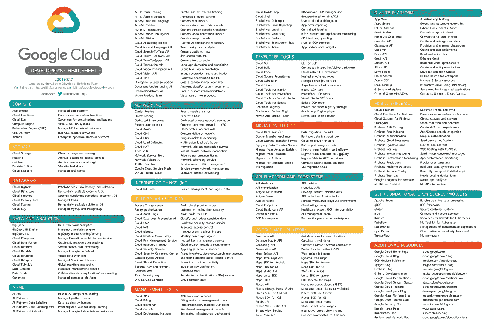

# 在 Google Cloud 上托管 Web 应用程序:概述

> 原文：<https://medium.com/google-cloud/hosting-web-applications-on-google-cloud-an-overview-46f5605eb3a6?source=collection_archive---------1----------------------->

## 在云中烹饪

# 介绍

***【在云端做饭】*** 是一个博客和视频系列，帮助企业和开发者在 Google Cloud 上构建商业解决方案。在这个系列中，我们计划确定开发人员希望在 Google cloud 上构建的特定主题。一旦确定，我们将创建一个关于该主题的迷你系列。

在这第一个迷你系列中，我们将介绍如何在谷歌云上创建网站。如果你的业务收入和客户满意度依赖于你的网站的可用性和可扩展性，那么你是在正确的地方。在接下来的几篇博客中，我们将详细阐述如何创建网站:

1.  在 Google Cloud 上托管 web 应用:概述(本文)
2.  [使用谷歌云存储在谷歌云上托管网络应用](/@pvergadia/hosting-a-static-website-on-google-cloud-using-google-cloud-storage-ddebcdcc8d5b)
3.  [使用 Cloud Run 在 Google Cloud 上托管 web 应用](/google-cloud/hosting-a-website-on-google-cloud-using-cloud-run-a65343a98fce)
4.  [使用谷歌计算引擎在谷歌云上部署网站的 5 个步骤](/p/c6fe84d76f51)
5.  [在谷歌计算引擎上扩展 web 应用](/p/d21d6ce3e837/)
6.  [案例研究](/faun/case-study-hosting-scalable-web-apps-on-google-cloud-c0bb675812c8)

在这篇文章中，我们将看到四个工具，它们可以帮助你根据需要从小网站扩展到大网站。所以，继续读下去吧！

# 你会学到什么

*   在 Google Cloud 上创建网站的不同方法概述

# 先决条件

*   谷歌云的基本概念和结构，这样你就可以识别产品的名称。
*   这张图片(由 Greg Wilson 拍摄)是一个很好的起点，可以用不到四个词来了解所有产品:

谷歌云开发者备忘单

# 看看这个视频

# 如何在谷歌云上创建网站

在高层次上，在 Google Cloud 上构建一个网站或应用程序有四种方法。根据您在 Google Cloud 旅程中所处的位置、您的业务需求以及开发和基础架构团队的成熟度，这些选项中的一个应该符合您的需求。

谷歌云存储

静态网站对于像博客这样的网站来说是一个很好的选择——页面在发布后很少改变，或者没有任何动态生成的内容。在 Google Cloud 上建立一个静态网站只需要一个[云存储桶](https://cloud.google.com/storage/)连接到你的域名就可以了！！

随着你的业务开始成熟，客户有兴趣从你的网站上买东西，你可能需要生成动态内容并实现支付。但是，如果您的公司仍然很小，您希望能够发展您的网站，而不必担心根据需求的增长来扩展网站。

应用引擎

在这种情况下，谷歌云的托管和无服务器产品，如 [App Engin](https://cloud.google.com/appengine/) e 或 [Cloud Run](https://cloud.google.com/run/) 将是合适的，这使您可以专注于提供功能，让谷歌担心运营和管理基础设施。这提供了广泛的功能，使得可伸缩性、负载平衡、日志记录、监控和安全性比您自己构建和管理网站要容易得多。

云运行

当你使用 Cloud Run 时，你可以用任何编程语言编码，因为你的应用是作为容器部署的，Google 会为你无缝地启动和扩展你的应用。所以试试吧！

对于复杂程度更高的网站，您可能想要比托管平台提供更多的选项和控制。无论是配置您的服务器或虚拟机，还是需要特定的内存、固态硬盘和 GPU，使用计算引擎都是有意义的。

计算引擎

[计算引擎](https://cloud.google.com/compute/)提供了强大的计算基础设施，但是您必须选择和配置您想要使用的平台组件。Google 确保资源是可用的、可靠的，并且随时可供您使用，但是由您来提供和管理它们。

使用 compute engine 的优势在于您可以完全控制系统和无限的灵活性。在 Compute engine 上部署完整的 web 服务堆栈的最简单方法是使用 [Google Cloud Marketplace](https://cloud.google.com/marketplace/) 。只需几次点击，您就可以部署 100 多个完全实现的解决方案中的任何一个。

谷歌云市场

关于如何设置 Compute engine 来为可伸缩且有弹性的网站提供服务的更详细解释，请关注后续文章。

库伯内特发动机

最后，对于拥有更多开发人员和更复杂问题的大型企业来说，将应用程序容器化是有意义的。你会注意到，如果网站是一个巨大的整体，那么管理功能推出就变得非常困难，这使得它很难跟上需求的增长和业务的步伐。

容器化 web 应用程序提供了三个关键优势:

*   **组件化:**随着你的应用程序设计变得越来越复杂，容器非常适合一个[面向服务的架构](https://wikipedia.org/wiki/Service-oriented_architecture)，包括[微服务](https://wikipedia.org/wiki/Microservices)。这支持可伸缩性。
*   **可移植性:**一个容器拥有运行它所需要的一切——你的应用程序和它的依赖项被捆绑在一起。这促进了可移植性，并解决了许多开发人员都有的“it-works-on-my-machine”问题。
*   **快速部署:**到了部署的时候，您的系统是根据一组定义和映像构建的，因此可以快速、可靠、自动地部署各个部分。与虚拟机相比，容器通常更小，部署更快。

使用容器在 GKE 上部署 web 应用程序有更多的优势，因为:

1.  容器编排是内置的。
2.  Google Cloud 提供了容器注册表，这是容器图像的私有存储
3.  你可以在这个架构中轻松使用谷歌云平台的其他组件。

在下列情况下使用 Kubernetes 引擎是有意义的:

*   如果你有一个复杂的网站，有多个不同的部分，为了便于管理，最好把它们放在不同的服务中。
*   如果每个服务都有独立的开发团队，那么团队可以按照自己的节奏独立工作。
*   如果您需要快速方便地发布变更。

# 结论

无论你是一个希望扩大你的社区的小博客，还是一个巨大的、多规模的电子商务网站，希望这有助于确定谷歌云平台中的哪些工具适合你的特定 web 用例。

# 后续步骤

*   在[谷歌云平台媒体](https://medium.com/google-cloud)上关注这个博客系列。
*   关注[获取云端烹饪](https://www.youtube.com/watch?v=pxp7uYUjH_M)视频系列，订阅谷歌云平台 YouTube 频道
*   想要更多的故事？查看我的[媒体](/@pvergadia/)，[在 twitter 上关注我](https://twitter.com/pvergadia)。
*   与我们一起享受这个系列的旅程，并了解更多关于 Google Cloud 的信息:)