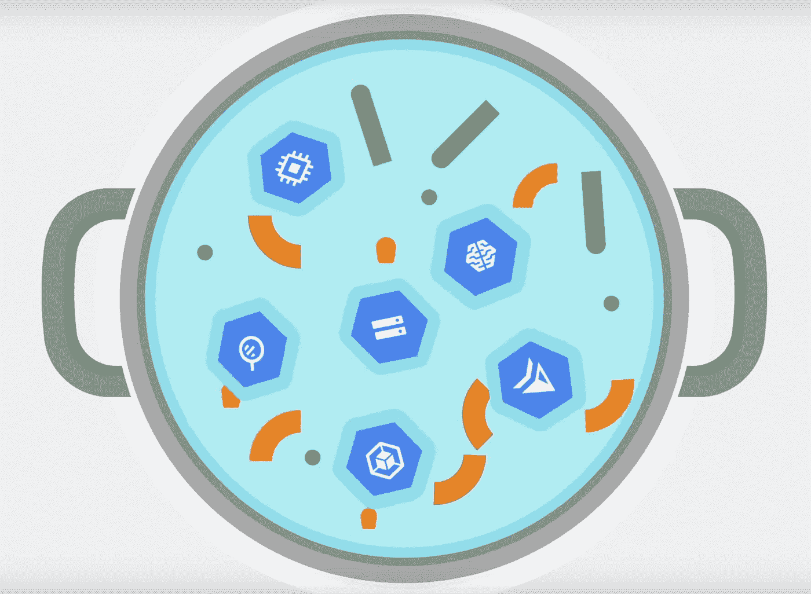
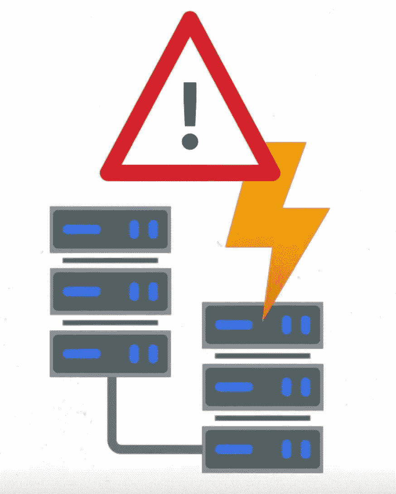
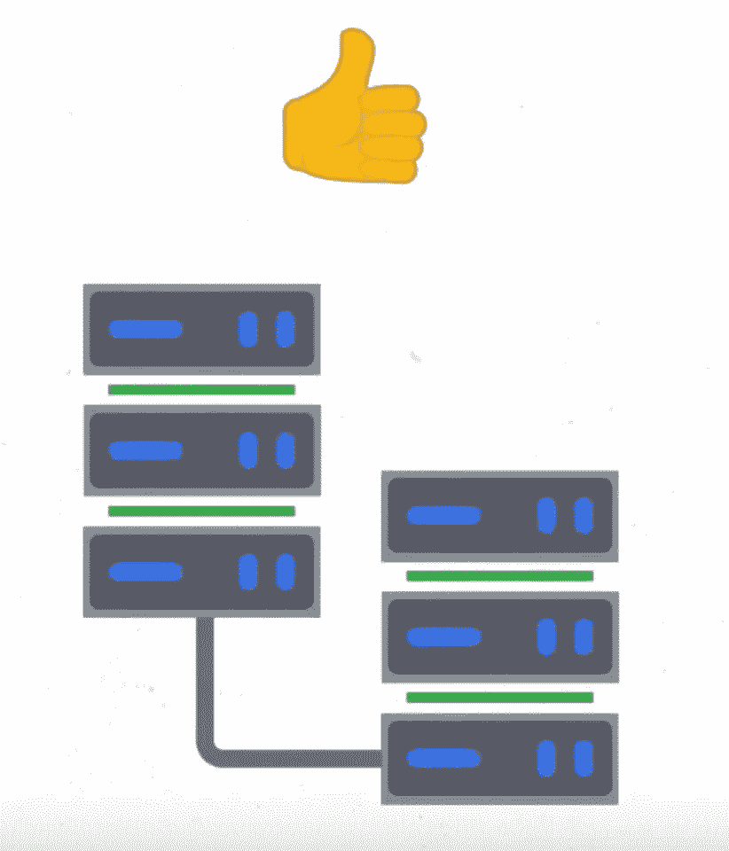
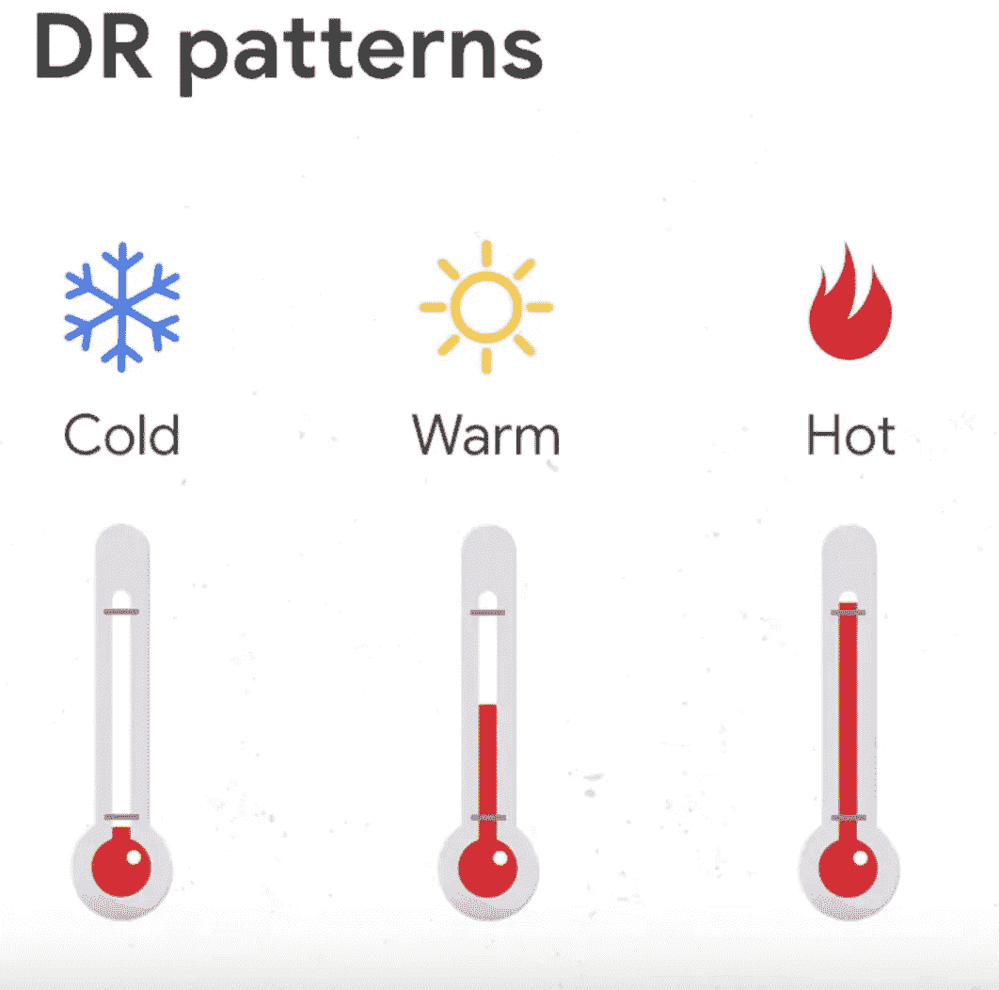

# Google 云上的灾难恢复:概述

> 原文：<https://medium.com/google-cloud/hosting-web-applications-on-google-cloud-an-overview-87d0962931a3?source=collection_archive---------0----------------------->

## 在云中烹饪

# 介绍

***【在云端做饭】*** 是一个博客和视频系列，帮助企业和开发者在 Google Cloud 上构建商业解决方案。在这个系列中，我计划确定开发人员希望在 Google cloud 上构建的特定主题。一旦确定下来，我就以此为主题创作一个迷你系列。如果你对之前的迷你系列感兴趣，请查看[的这个](/google-cloud/hosting-web-applications-on-google-cloud-an-overview-46f5605eb3a6)。

在这第二个迷你系列中，我将介绍 Google Cloud 上的灾难恢复。当你在网上的时候，灾难是很难处理的。在接下来的几篇博客中，我们将详细阐述如何应对地震、停电、洪水、火灾等灾害。这是这个系列的计划。

1.  灾难恢复概述(本文)
2.  [基于 Google Cloud 的本地应用冷灾难恢复](/@pvergadia/cold-disaster-recovery-on-google-cloud-for-applications-running-on-premises-114b31933d02)
3.  [基于 Google Cloud 的本地应用程序热灾难恢复](/google-cloud/warm-disaster-recovery-on-google-cloud-for-applications-running-on-premises-7428b0f7db72)
4.  [基于 Google Cloud 的内部应用热灾难恢复](/@pvergadia/hot-disaster-recovery-on-google-cloud-for-applications-running-on-premises-da7048d1a57b)
5.  [谷歌云中应用的冷灾难恢复](/@pvergadia/cold-disaster-recovery-for-applications-in-google-cloud-5edeb32f2fc6)
6.  [谷歌云中应用的温灾恢复](/google-cloud/warm-disaster-recovery-for-applications-in-google-cloud-9165b4ea8e2f)
7.  [谷歌云中应用的热灾难恢复](/google-cloud/hot-disaster-recovery-for-applications-on-google-cloud-958efa292c5f)
8.  [谷歌云数据灾难恢复:第 1 部分](/@pvergadia/disaster-recovery-on-google-cloud-for-data-part-1-9cf08782bac9)
9.  [谷歌云数据灾难恢复:第二部分](/@pvergadia/disaster-recovery-on-google-cloud-for-data-part-2-2523d862fbe1)

在本文中，我们将定义一些有助于灾难恢复规划的灾难恢复术语。所以，继续读下去吧！

# 你会学到什么

*   重要的灾难恢复术语
*   RTO —恢复时间目标
*   RPO —恢复点目标

# 先决条件

*   谷歌云的基本概念和结构，这样你就可以识别产品的名称。

# 看看这个视频

灾难恢复概述视频

# 什么是灾难恢复(DR)？

当自然灾害发生时，我们您需要确保对您的业务的影响最小，为此，您需要一个强大的灾难恢复(DR)计划！

灾难通常意味着服务中断事件。因此，灾难恢复是指企业在灾难中能够承受的影响。它是业务连续性规划的一个子集。

灾难恢复

# 关键灾难恢复术语

***RTO 或恢复时间目标*** 是您的应用程序可以脱机的最长时间。这通常取决于您向客户提供的 SLA。SLA 是您作为服务提供者对您的消费者做出的承诺，关于您的服务的可用性以及未能交付商定的服务级别的后果。

***RPO 或恢复点目标*** 是数据可能丢失的最长时间。

通常，较小的 RTO 和 RPO 值意味着应用程序必须从中断中快速恢复。

灾难后系统恢复的速度由 ***高可用性*** 和 ***灾难恢复*** 模式定义。**又称 HA 和 *DR 模式*和**。

# 了解灾难恢复模式

让我们考虑一个场景。我正在为一个聚会做一些蛋糕和饼干，这需要一个搅拌器。我正在吃第一批饼干，搅拌器开始发出奇怪的声音。手册上说搅拌器在这样的噪音下会失灵，所以我需要做点什么来继续派对的准备工作。我有三个选择:

***选项 1:*** 我可以给混音公司打电话，让他们来修理——这显然需要时间，而且鉴于今天是派对，也不太合适

***方案二:*** 我可以根据说明书上的说明自己试着修一下。这将意味着我的准备工作有一个小小的停顿，但会比等待调音台维修人员更快地让我回到正轨

***选项 3:*** 我可以在听不到警告噪音的情况下继续慢速混音。在这种情况下，我不得不放慢速度，但搅拌机仍在工作，所以我可以继续工作，稍后再修复它。这个选择肯定会对我的派对准备产生较小的影响。

了解这一点后，现在让我们回顾一下灾难恢复术语中的选项:

冷、暖或热灾难恢复模式

*   如果我们打电话给搅拌机公司要求修理，我们必须停止做蛋糕，直到他们来修理，这将是缓慢和耗时的，但最终我们会回来工作——所以这种情况最接近我们所说的**冷灾难恢复模式**
*   如果我们尝试自己修复它，它会比冷模式快一点，但因为我们仍然需要暂停做蛋糕来修复这种情况，所以它会比正常情况慢一些，所以这种情况最接近我们所说的**热灾难恢复模式**
*   我们继续慢速工作并决定稍后修复的选项是最有效的，因为我仍然在不停地做蛋糕，最接近我们所说的**热灾难恢复模式**。

这个故事的寓意是，我们选择了一个对当前业务有意义的灾难恢复模式，在这种情况下，这是一个非常重要的举办聚会的业务！

# 使用谷歌云进行灾难恢复

如果您使用 Google Cloud 进行灾难恢复，与在内部满足这些要求相比，它可以大大降低与实现 RTO 和 RPO 价值相关的成本。例如:传统的灾难恢复规划要求您考虑许多要求，包括容量、安全性、网络基础设施、支持和带宽。

Google cloud 有几个功能可以帮助绕过这些复杂的因素，并降低管理灾难恢复解决方案的成本。全球网络、冗余、可扩展性、安全性和合规性是其中的几个因素。请继续关注本系列，了解更多相关信息！

# **规划灾难恢复战略的最佳实践**

*   第一步也是最重要的一步，您需要定义我们的 RTO 和 RPO 值，因为这些值将指示合适的灾难恢复模式。
*   然后，确保您有一个完整的端到端恢复计划。仅仅备份和归档数据是不够的。
*   让任务**尽可能地具体**，这样到时候，要执行计划，就不只是说“运行恢复脚本”。从哪里？命令是什么？这些信息应该在说明书中。
*   实施控制措施
*   监控并在发生破坏性事件时发送警报，如流量峰值或数据删除。
*   准备您的软件
*   验证您可以从源代码或预配置的映像安装我们的软件。
*   确保您拥有适当的部署许可证。
*   您的持续部署工具集是您的应用程序部署不可或缺的一部分，请确保它在发生灾难时可用于恢复我们的环境。
*   您不应该忘记安全性和合规性！为灾难恢复和生产环境配置相同的安全性。
*   最后也是最重要的一步，确保您的灾难恢复计划能够奏效！维护多条数据恢复路径，并定期测试。

# 结论

无论您是一个希望扩大社区的小型博客作者，还是一个大型的、多规模的应用程序，您都需要保护您的应用程序在灾难期间不会宕机。希望这是对灾难恢复的有益概述。无论您的应用程序是部署在内部还是 Google Cloud 上，也无论您的 RTO 和 RPO 值是大是小，请继续关注即将发布的文章，在这些文章中，您将了解如何设置对您的业务有意义的灾难恢复模式。

# 后续步骤

*   在[谷歌云平台媒体](https://medium.com/google-cloud)上关注这个博客系列。
*   参考[灾难恢复解决方案](https://cloud.google.com/solutions/dr-scenarios-planning-guide)。
*   关注[获取云端烹饪](https://www.youtube.com/watch?v=pxp7uYUjH_M)视频系列，订阅谷歌云平台 YouTube 频道
*   想要更多的故事？查看我的[媒体](/@pvergadia/)，[在 twitter 上关注我](https://twitter.com/pvergadia)。
*   请和我们一起欣赏这部迷你剧，并了解更多类似的谷歌云解决方案:)