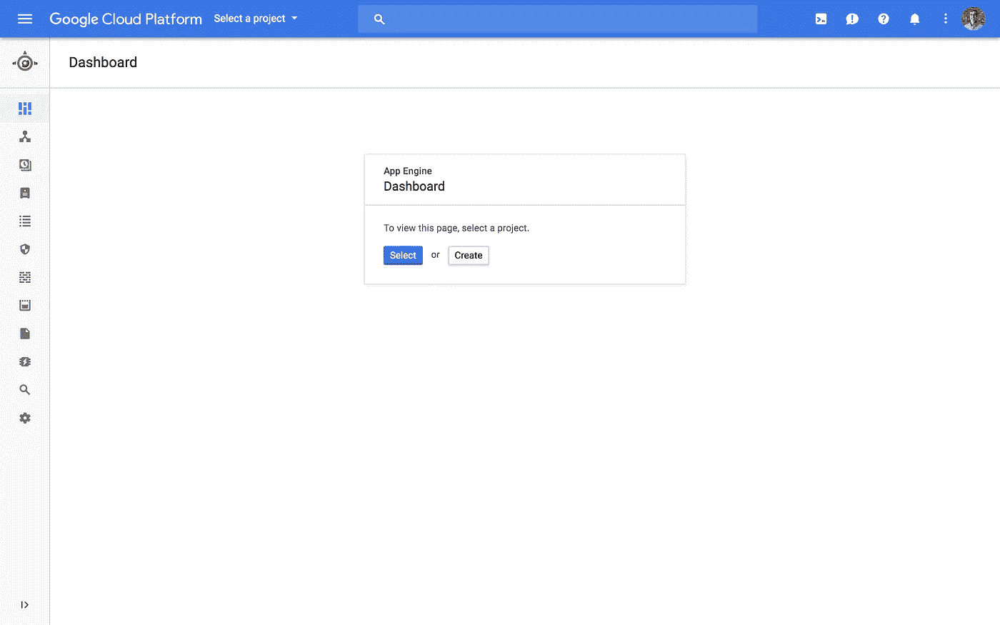
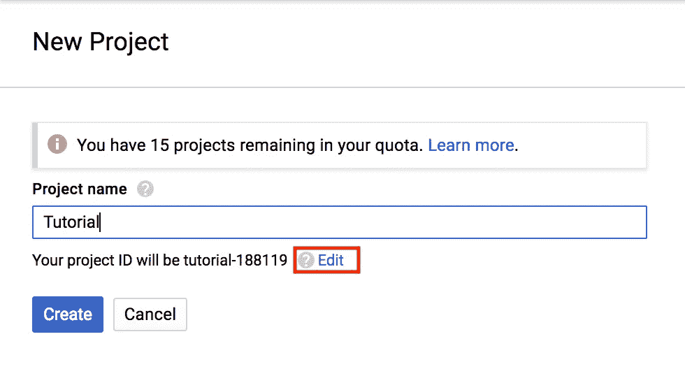
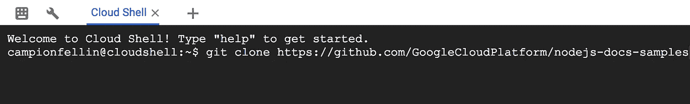
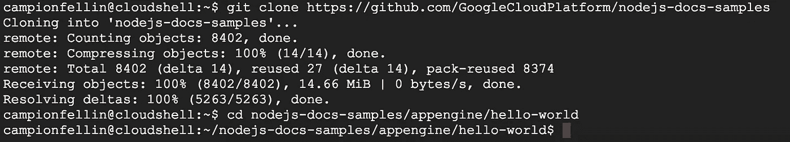
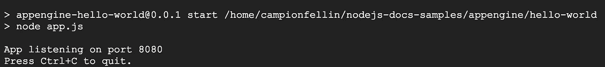
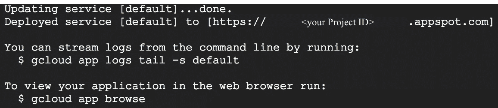

# 为初学者在谷歌云平台上托管你的网站

> 原文：<https://medium.com/google-cloud/hosting-your-personal-website-on-google-cloud-platform-for-beginners-278543eaaa67?source=collection_archive---------0----------------------->

谷歌云平台

*4 行代码，不需要任何经验！*

H ey 各位！对于我的第一篇文章，我将根据我 2017 年 11 月 20 日在华盛顿大学的演讲写一篇快速教程。

# 开始之前

首先，你应该注册 [GCP 免费等级](https://cloud.google.com/free/)，在那里你将获得 300 美元的积分(💰💰💰)12 个月以及其他**始终免费**产品的负载。

## 创建新项目

转到 App Engine 并创建一个新项目。我们将使用 [Node.js](https://nodejs.org/en/) 来完成这项工作，所以单击[这里的](https://console.cloud.google.com/projectselector/appengine/create?lang=nodejs)来创建一个新项目！当页面加载时，您应该会看到类似这样的内容:

GCP 应用引擎

继续点击“创建”,然后选择一个项目名称。

新项目

*提示:点击编辑并更改你的项目 ID。该网站的网址是基于 ID，所以明智地选择！*

然后，它会要求您选择一个地区(继续并选择美国中部)。

您将必须启用计费(他们要求信用卡进行验证，别担心，您仍然有您的 **$300 免费信用点数**)。

# 我们开始吧

我们将要写代码，所以我们需要一个代码编辑器，*对吗？*

> 不，我们所有的代码都将在谷歌云外壳编辑器中编写

一旦你的应用程序被创建，你应该会在你的谷歌账户照片的右上角看到类似这样的东西

继续点击最左边的图标打开 Google Cloud Shell，您应该会看到一个终端 Shell 从底部弹出。您应该会在终端窗口的右上角看到这些图标

继续并再次单击最左边的一个，看起来像✏️的那个，以启动云壳编辑器(它将在一个新的选项卡中打开)。

## 是时候写一些代码了！

在底部的 shell 终端中，继续前进并输入

`git clone [https://github.com/GoogleCloudPlatform/nodejs-docs-samples](https://github.com/GoogleCloudPlatform/nodejs-docs-samples)`

这将从 [Github](https://github.com/GoogleCloudPlatform/nodejs-docs-samples) 下载我们将要使用的样本。

> 这是一行代码。

现在，继续将目录更改为我们将使用的目录:

`cd nodejs-docs-samples/appengine/hello-world`

> 两行代码。

此时，您的终端应该看起来像这样

第三行代码的时间:`npm install && npm start`

现在你应该看看这个

正如你所看到的，它说`App listening on port 8080`这意味着你的网站已经准备好了！在右上角你会看到这个

继续点击第三个按钮，然后点击“在端口 8080 上预览”，这将在另一个选项卡中打开一个 Web 预览。

**吼吼！你应该看到“你好，世界！”在您的浏览器中。**

这太棒了，三行代码就搞定了！然而，全世界还看不到。

> 《Hello World》在 localhost 上有什么意义？

# 让我们部署

回到你的外壳，点击`Ctrl+C`退出。

接下来是我们的第四行也是最后一行代码:`gcloud app deploy`

继续输入并按回车键。你可能会被问到`Do you want to continue (Y/n)?`只需键入`Y`并按回车键。

你可能要等几分钟才能让它展开，所以去做点☕️，放松一下，也许听听音乐🎶

一旦完成，你应该会看到这样的东西

# 你完了！

打开一个新标签页，进入[https://your-Project-ID.appspot.com](https://your-Project-ID.appspot.com)

与你所有的朋友分享你的网站！

# 摘要

今天我们了解到在 GCP 建立一个网站是多么容易。

你根本不需要下载任何程序或者设置你的电脑。

它是免费的。

> 你写了 **4(！！！)**多行代码

谷歌云平台就是这么简单。

## 继续前进

在下一篇博客文章中，我们将深入探讨更多细节，并学习如何定制你的网站，敬请期待！

在此之前，如果你有任何问题或意见，请在下方留言！