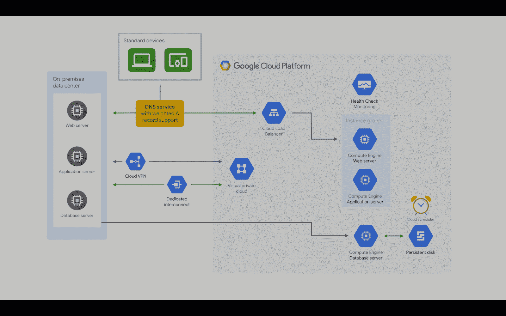
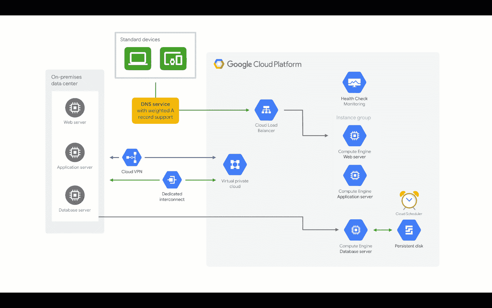

# 在 Google Cloud 上为内部运行的应用程序进行热灾难恢复

> 原文：<https://medium.com/google-cloud/hot-disaster-recovery-on-google-cloud-for-applications-running-on-premises-da7048d1a57b?source=collection_archive---------1----------------------->

## 在云中烹饪

# 介绍

***【在云端做饭】*** 是一个博客和视频系列，帮助企业和开发者在 Google Cloud 上构建商业解决方案。在这第二个迷你系列中，我将介绍 Google Cloud 上的灾难恢复。当你在网上的时候，灾难是很难处理的。在这一系列的博客中，我们将详细阐述如何应对地震、停电、洪水、火灾等灾害。如果你对之前的迷你系列感兴趣，请查看[的这个](/google-cloud/hosting-web-applications-on-google-cloud-an-overview-46f5605eb3a6)。

这是这个系列的计划。

1.  [灾难恢复概述](/google-cloud/hosting-web-applications-on-google-cloud-an-overview-87d0962931a3)
2.  [基于 Google Cloud 的本地应用冷灾难恢复](/@pvergadia/cold-disaster-recovery-on-google-cloud-for-applications-running-on-premises-114b31933d02)
3.  [在 Google Cloud 上为本地应用程序提供热灾难恢复](/google-cloud/warm-disaster-recovery-on-google-cloud-for-applications-running-on-premises-7428b0f7db72)
4.  针对本地应用程序的 Google Cloud 热灾难恢复(本文)
5.  Google 云中应用程序的冷灾难恢复
6.  Google 云中应用程序的热灾难恢复
7.  Google 云中应用程序的热灾难恢复
8.  Google Cloud 上的数据灾难恢复:第 1 部分
9.  Google Cloud 上的数据灾难恢复:第 2 部分

在本文中，您将学习为部署在本地的应用程序设置一个**热灾难恢复模式**。所以，继续读下去吧！

# 你会学到什么

*   热灾难恢复模式及示例
*   灾难来袭前需要采取的步骤
*   灾难发生时需要采取的步骤
*   灾难发生后需要采取的步骤

# 先决条件

*   谷歌云的基本概念和结构，这样你就可以识别产品的名称。
*   继续之前，请阅读[概述文章](/google-cloud/hosting-web-applications-on-google-cloud-an-overview-87d0962931a3)。

# 看看这个视频

# 让我们通过一个例子来学习 Warm DR 模式

在前两篇文章中，我们讨论了在内部运行应用程序并在 Google Cloud 上构建灾难恢复基础架构的 Mane-street Art。我们看到，由于需要更低的 RTO 和 RPO 值，他们从冷灾难恢复计划开始，并转移到热备用。

现在，**街头艺术**已经变得非常受欢迎，在**甚至**秒都不能停下来。由于他们的要求是实现接近零的 RTO 和 RPO 值，唯一的方法是跨生产环境和 google 云同时运行 HA 架构。

*注意:如果您不熟悉这里使用的术语(RTO、RPO、灾难恢复模式),请查看之前的博客以获得概述。*

在任何灾难恢复模式中，您都需要了解在灾难发生前需要采取什么步骤，灾难发生时会发生什么，以及灾难过去后需要发生什么。

# 热灾难恢复模式—它是如何工作的？

## 灾难来袭前应采取的步骤

灾难降临前需要采取的措施

*   创建一个 VPC 网络
*   配置内部网络和 Google Cloud 网络之间的连接
*   使用与内部完全相同的配置在 google cloud 中创建服务器的自定义映像。
*   在我们的内部数据库服务器和 Google cloud 上的服务器之间配置复制。请记住，如果您的数据库系统在配置复制时只允许单个可写数据库实例，那么您可能需要确保其中一个数据库副本充当只读服务器。
*   创建单独的实例模板，这些模板使用应用服务器和 web 服务器的映像。
*   为应用程序和 web 服务器配置区域托管实例组。
*   使用 stackdriver 监控配置运行状况检查。
*   使用我们配置的区域托管实例组来配置负载平衡。
*   配置一个计划任务来创建持久磁盘的常规快照。
*   最后，配置一个 DNS 服务，在您的内部环境和 GCP 环境之间分配流量。

使用这种混合方法，您需要使用一个支持加权路由到两个生产环境的 DNS 服务，这样您就可以从两个环境中为相同的应用程序提供服务。

## 灾难来袭时应采取的措施

灾难来袭时应采取的措施

如果本地发生故障，您只需禁用到本地 web 服务器的 DNS 路由即可！在大多数情况下，DNS 服务支持健康检查，并将所有流量自动路由到 Google Cloud 上的健康服务器。

## 灾难过去后应采取的步骤

灾难来袭时应采取的措施

当生产环境再次在内部运行并能够支持生产工作负载时，Mane-street art 必须做到以下几点:

*   重新同步数据库。
*   如果数据库系统在出现故障时没有自动将只读复制副本提升为可写主副本，您需要干预以确保复制副本得到提升。
*   在确保这一点后，只需启用 DNS 路由，将流量分发到内部和 Google cloud。

# 结论

如果您正在本地运行您的应用程序，并且希望实现非常小的 RTO 和 RPO 值，那么希望您已经了解了如何在两种环境中使用 Google Cloud hot HA 从故障中恢复环境。敬请关注即将发布的文章，在这些文章中，您将了解如何建立更多对您的业务有意义的灾难恢复模式。

# 后续步骤

*   在[谷歌云平台媒体](https://medium.com/google-cloud)上关注这个博客系列。
*   参考[灾难恢复解决方案](https://cloud.google.com/solutions/dr-scenarios-planning-guide)。
*   关注[获取云端烹饪](https://www.youtube.com/watch?v=pxp7uYUjH_M)视频系列，订阅谷歌云平台 YouTube 频道
*   想要更多的故事？查看我的[媒体](/@pvergadia/)，[在 twitter 上关注我](https://twitter.com/pvergadia)。
*   请和我们一起欣赏这部迷你剧，并了解更多类似的谷歌云解决方案:)