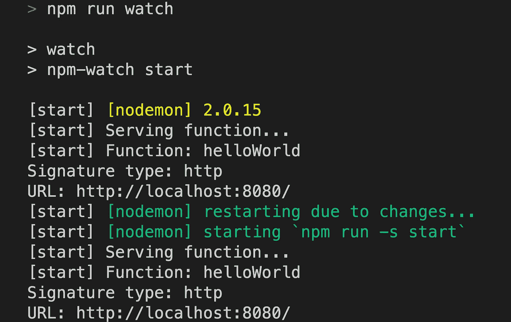

# 热重装节点云功能

> 原文：<https://medium.com/google-cloud/hot-reload-node-cloud-functions-64ffdb095a00?source=collection_archive---------0----------------------->

Google Cloud Function Framework for Node 允许您在您的计算机上本地开发无服务器功能**，方法是以与 Google Cloud Functions 上运行的*相同的方式*旋转 web 服务器。正如您可能知道的，本地开发大大提高了开发速度，而不是必须等待 1-2 分钟来部署您的功能。**

*然而，*一个常见的开发者问题是，一旦你的函数在函数框架中运行，任何对你的源代码**的**更新**都不会在运行的 HTTP 服务器中得到反映**。

在这篇博文中，我将简要介绍如何**将** **热重装**添加到**节点云函数开发者工作流**中。

这是一张我在南卡罗来纳州纳塔莱斯港喝拿铁热负荷休息的照片。我从来没有在编码的时候对另一杯拿铁说“不”。

Node Functions 框架是一个轻量级的库，它包装了流行而熟悉的 TJ Holowaychuk 的 *Express.js* 框架。该框架允许您编写一个简单的服务器，在收到 HTTP 请求时调用您的函数:

> [https://github . com/Google cloud platform/functions-framework-nodejs/](https://github.com/GoogleCloudPlatform/functions-framework-nodejs/)

## 运行简单的云函数

在`index.js`有一个简单的函数:

这里有一个最小的`package.json`:

要测试此功能:

*   运行`npm i`来安装函数框架
*   运行`npm start`启动功能框架

然后，您可以转到`[http://localhost:8080/](http://localhost:8080/)`并看到该函数被调用，其响应为:`Hot-reload me?`。

然而，如果您将`'Hot-reload me?'`更改为`'Why isn't it working???¿?'`并刷新页面，您仍然会看到旧的响应。:(

这个结果是因为节点程序只在启动框架(用`npm start`)和启动 web 服务器时加载一次函数。

我们如何解决这个问题？

## 介绍国家预防机制观察

理想情况下，无论何时我们的源代码发生变化，我们都希望*自动*重启函数框架。

为了实现这一点，我们可以添加方便的`npm-watch`包:

这样，我们就可以在`*.js`文件发生任何变化时，运行`npm run watch`来重新运行`start`命令:

通过 nodemon 重新加载函数

感谢阅读！

如果你喜欢这个，一定要鼓掌👏，或者写一篇✏️的评论，可能会出现在以后的帖子里！).我不再写那么多博客了，但是让我知道它们是否令人愉快，我可能会改变这一点:)

> 感谢 Preston Holmes 对 GitHub 问题的关注和开源社区的热烈讨论:[https://GitHub . com/Google cloud platform/functions-framework-nodejs/issues/24](https://github.com/GoogleCloudPlatform/functions-framework-nodejs/issues/24)