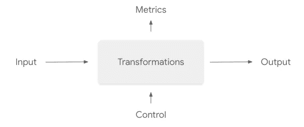
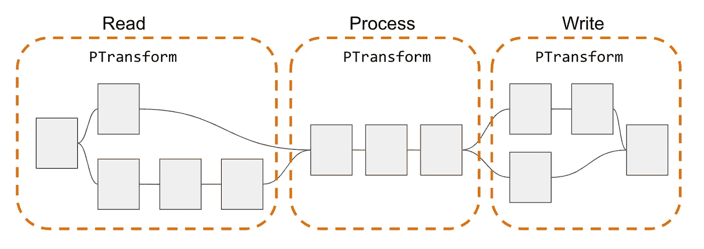
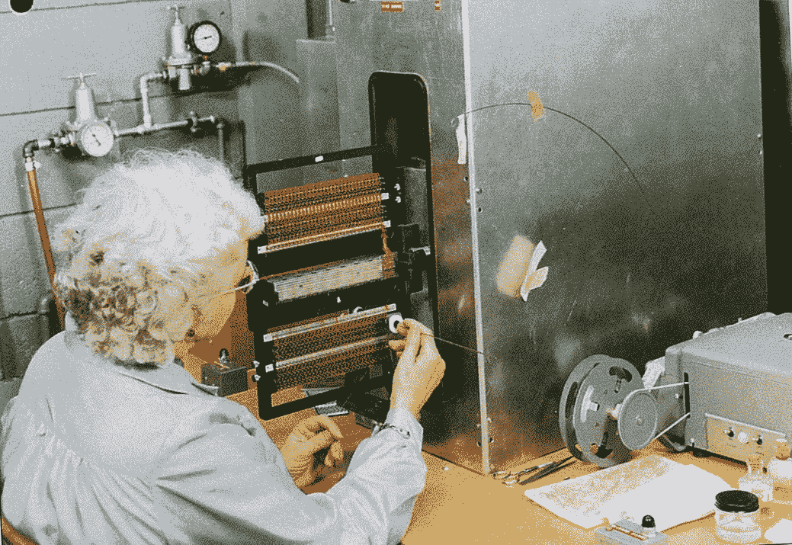
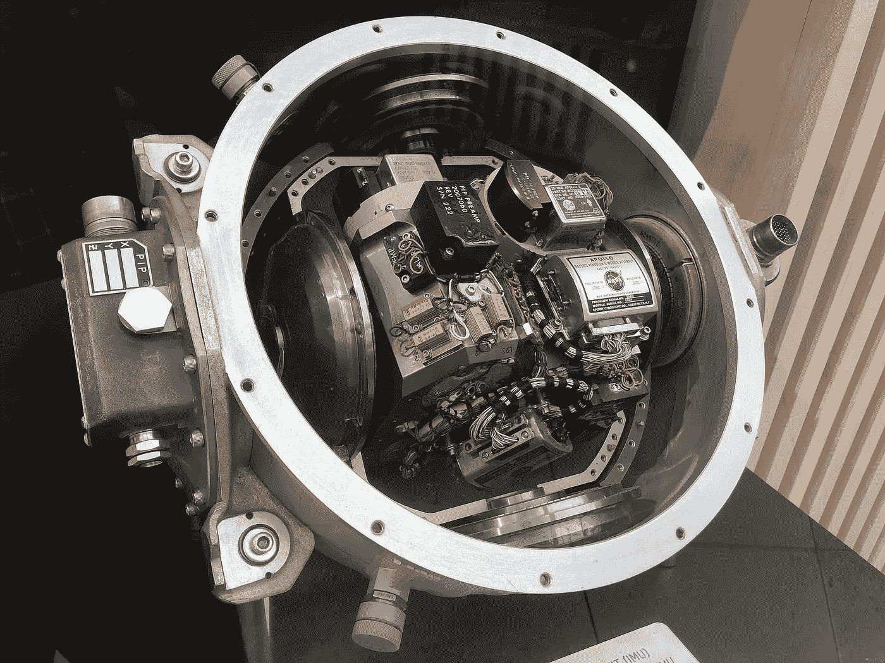
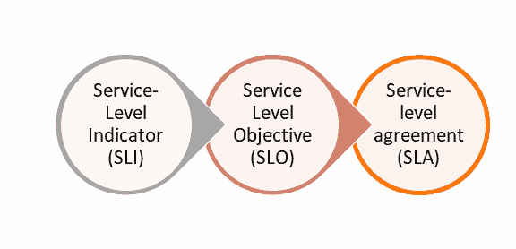

# 休斯顿，我们有一个问题:管道设计的六项阿波罗任务原则

> 原文：<https://medium.com/google-cloud/houston-we-have-a-problem-six-apollo-mission-principles-for-pipeline-design-20f3d0e0760c?source=collection_archive---------2----------------------->

阿波罗 11 号任务于 1969 年 7 月 20 日登陆月球。尽管普遍的说法是阿姆斯特朗指挥官在着陆过程中勇敢地抓住了飞船的手动控制，但事实是阿波罗导航计算机自始至终都在控制之中，并且运行良好。

阿波罗导航计算机能够在不可预测的环境中通过复杂的程序引导航天器，并将两名宇航员送上月球。它能够做到这一点，因为它是根据 6 个原则设计的，这些原则允许在不可预测的环境中，不是在我们的笔记本电脑上，而是在我们无法直接访问的工作人员上进行复杂的计算。它能够非常非常可靠地做到这一点。

阿波罗导航计算机具有我们今天的数据处理管道所需要的特性，我们可以通过应用使巴兹·奥德林和尼尔·阿姆斯特朗登上月球表面，也许更令人印象深刻的是安全返回地球的相同设计原则来更接近我们的理想。

阿帕奇光束吉祥物

罗伯特·威利斯在他题为“光年未来——1969 年阿波罗制导计算机”的有趣演讲中，最精彩地讲述了这个故事。

罗伯特·威利斯:光年之后——阿波罗制导计算机

在本帖中，我们将使用 [Apache Beam](https://beam.apache.org/) 将他演讲中的原则应用于现代数据处理流水线设计。如果您更喜欢视频，我们已经在 2022 年 Beam Summit 上展示了这些信息。

我们已经在 2022 年光束峰会上提出了这个建议。

# 什么是数据处理管道？

在云端运行数据处理管道就像发射到太空一样。发射后的控制是有限的，你只能观察会发生什么，并期待最好的结果。如果你在你的管道中犯了一个错误，影响会很大。折衷的可靠性、弹性、可维护性和易操作性的操作成本很容易盖过开发成本。

就像在发射航天器之前，我们需要通过应用一些相同的设计原则来为管道的发射做准备。

数据处理管道的接口

这是管道的“接口”,和宇宙飞船的“接口”有相似之处。一旦启动，管道将自动运行。我们可以通过输入数据进行干预，作为探测或测试管道行为的一种方式，并且我们可以观察其输出以及指标。我们还可以控制作业，但这主要是开/关，在一些非常特殊的情况下，还有其他功能，如“排出”或“更新”。

除此之外，一旦启动，管道就靠自己了。我们可以抱最好的希望。但是希望不是策略。我们需要一些设计原则来增加我们成功的机会。

# 原则 1:使用高级语言

阿波罗制导计算机使用自己的汇编语言编程。在汇编语言中，你需要使用计算机提供的指令集，并考虑你正在使用的机器的所有特性。

在登月程序的制动阶段，阿波罗制导计算机需要在正确的时间启动火箭发动机，以减慢登月舱的速度，使其降落在指定的地点。如何在汇编中实现这些轨道计算所需的向量和矩阵运算？

你没有，即使在 20 世纪 60 年代也没有。阿波罗团队建造了一个解释器，它可以由能够进行向量和矩阵运算的高级语言编程，并且可以实时“编译”成汇编。

让我们将这一原则应用于数据处理管道的设计。

Apache Beam 有几种不同语言的实现，使用更适合您情况的语言，不要担心 Beam 的特定功能在一种或另一种语言中可用，但要注意 I/O 连接器，不是所有语言都有相同的支持。**跨语言管道**可以帮上忙。例如，参见关于 [Scio](https://spotify.github.io/scio/) 的研讨会，Spotify 的 Scala SDK for Beam:

# 原则 2:将你的程序分成几个任务

将您的程序划分为多个作业简化了程序，增强了代码的可重用性、可靠性和灵活性。这些在 1969 年是理想的房产，就像今天一样。

阿波罗制导计算机(AGC)运行的是一个“协作实时”的操作系统，这与现代操作系统完全不同，现代操作系统可以同时运行多个程序。在 AGC 中，要求每个正在运行的作业每 20 ms 检查是否有新的作业准备好运行。如果有，它必须放弃控制权，让另一个作业运行。这要求所有作业都包含定期检查该寄存器的代码。这很容易出错，但却是可管理的，因为整个系统是由一个团队编写的，他们不允许 WFH。

当意想不到的问题出现时，如果把所有的工作分成几个任务，它们的爆炸半径是有限的，而不是用一个单一的程序来处理所有的事情。如果我们查看每个作业或管道的结构，那么 Beam 提供了 [PTransform](https://beam.apache.org/releases/pydoc/2.2.0/apache_beam.transforms.ptransform.html) 来对不同的操作进行分组，这些操作共同实现了一个更高级别的操作。例如，不同文件的两个 I/O 操作和一个连接可以是一个名为“准备输入数据”的转换。作为一项设计原则，我们建议使用更高级的 PTransforms 来实现更简单的管道。

使用 PTransforms 对单个转换进行分组，使您的管道更容易理解和维护。

更一般地说，看看工作图表，看看是否有更简单的方法来实现目标。如果你能简化，这将使工作更容易理解和维护。Apache Beam 文档 as 对管道设计的这一方面有更多的[指导。](https://beam.apache.org/documentation/pipelines/design-your-pipeline/)

# 原则 3:失败时重启

在著名的阿波罗 11 号任务中，失败比你想象的要多。这项任务最关键的阶段之一是最终接近月球。据推测，这是阿姆斯特朗指挥官夺取手动控制并拯救任务的阶段。这个故事是从哪里来的？

在最后阶段，由于登月舱向表面下降时不断的轨道重新计算，计算机处于相当重的 80%的负荷之下。飞行员巴兹·奥德林当时决定请求计算机也计算出预测的着陆点，并不断更新这一信息，将其显示在屏幕上。这给计算机增加了 10%的额外负载，所以我们现在的负载是 90%。不幸的是，由于航天器某个部分的硬件缺陷，出现了 15%的意外额外负载，计算机超载，引发了错误。计算机处理这种情况的方法是终止所有作业，并重新启动必要的作业。这奏效了。

但是在最后的下降阶段，自动驾驶系统实际上产生了 85%的负载。由于 15%的负载来自硬件故障，即使巴兹·奥德林没有请求更新登陆点，计算机也超载了。但是当阿姆斯特朗关闭自动驾驶系统，转到更加手动的操作模式时，这个问题就消失了。我们说“更手动”是因为即使在这种模式下，阿姆斯特朗的手动控制器和推进器之间也绝对没有硬连线连接，手动控制器(操纵杆)和推进器之间总是有代码来移动航天器。

阿波罗制导计算机磁绳存储器编程。给计算机编程是通过在它的存储器中存储 1 和 0 来完成的，这是通过将一根电线穿过一个环来实现的，否则就是 0。来源:[国家航空航天博物馆](https://airandspace.si.edu/multimedia-gallery/13006hjpg)

在数据处理管道中，我们希望在失败时重新启动完整的作业，以及各个管道步骤。尤其是在当前许多工作负载运行在公共云上的情况下，环境是不可预测的。您应该预料到工作人员会消失，因为物理节点出现故障，或者因为数据中心操作员决定需要离线，或者任何其他原因。您不能每次都让整个工作负载失败。

管道的建设需要考虑到对故障的恢复能力。由于运行时间通常很长，这个问题在流式管道中非常严重。具体来说，我们需要考虑我们是否会耗尽我们的流管道，并处理我们在飞行中的数据，或者我们是否会取消管道并杀死工人。取消的情况下会更快，但可能会导致部分数据丢失。如果我们清空管道，我们将不会丢失数据，但是由于我们需要触发打开窗口的处理，我们的输出中可能会有不完整的窗口，我们将不得不在稍后对此进行说明。谷歌云架构中心也有一些关于这个主题的 T2 指南。

在 2022 年的 Beam 峰会上， [Mazlum Tosun](https://twitter.com/MazlumTosun3) 展示了一个有趣的工具，使用 [Asgarde 库](https://github.com/tosun-si/asgarde)来简化来自流水线的错误报告。

# 原则 4:检查点良好状态

在向月球表面下降的最后阶段，我们解释说，由于硬件问题，问题开始出现，工作正在重新启动。这是从地表以上大约 10 英里处开始的。当奥尔德林和阿姆斯特朗接近月球表面时，这种情况继续发生。警报是由于缺乏运行计算机需要运行的作业的能力，如重新计算着陆点位置。计算机可以通过取消作业并重新启动它们来安全地处理这个问题，但是它需要做得很快！这就是检查点现有良好状态的用武之地。

阿波罗惯性测量装置允许计算机通过读出传感器并进行计算来知道航天器的方位。可以对计算结果进行检查点检查，以加快恢复速度。来源: [ArnoldReinhold —自己的作品](https://commons.wikimedia.org/w/index.php?curid=82248569)，CC BY-SA 4.0。

类似地，在云环境中，当您的数据处理作业重启时，您希望代码从它停止的地方继续运行。我们建议在管道中使用检查点，以便失败的步骤可以从该点恢复，并且您不需要重新运行整个管道。

如何设置或触发检查点取决于光束运行器的实现。可移植的运行程序，如[数据流](https://cloud.google.com/dataflow)和 [Flink](https://flink.apache.org/) ，会在 I/O 操作中设置检查点。这很方便，因为当错误发生时，您不必再次从数据源提取数据。当洗牌开始时，它们还设置一个检查点。洗牌会发生在“按键分组”和合并步骤之前，但有时你没有理由开始洗牌。在这种情况下，您可以通过添加[重排操作](https://beam.apache.org/releases/javadoc/2.5.0/org/apache/beam/sdk/transforms/Reshuffle.html)来强制设置检查点。这个操作在 Java API 中被标记为不推荐使用，但并不是因为它会消失。这是已经泄漏到射束编程模型中的依赖于流道的行为。

I/O 连接器中也可能发生混洗，可分离 DoFn 中保证会发生混洗，这在 Beam Summit 2022 的实践研讨会中进行了广泛讨论。

# 原则 5:硬件监控软件

如前所述，阿波罗制导计算机正在运行自己的定制操作系统，实现“协作多任务处理”。这要求作业是“协作的”，这意味着它们定期检查其他作业的存在(每 20 毫秒一次)，如果有，就让它们来控制。它工作得很好，但是如果一个作业陷入了一个无限循环并且再也没有检查过呢？硬件正在对此进行监控，经过一段时间后，硬件将触发系统重新启动。有点激进，但往往能解决问题。

1969 年左右，玛格丽特·汉密尔顿拿着一摞装有阿波罗电脑软件的书。由于她的贡献，她在 2016 年被授予总统自由勋章。来源:[麻省理工博物馆](https://mitmuseum.mit.edu/collections/object/GCP-00009689)

在我们基于云的数据处理管道中，我们需要类似的健壮性。在某种程度上，我们可以通过运行者默认提供的度量来实现这种可观察性。谷歌云架构对如何使用数据流来做这件事有广泛的指导。

Dataflow 还对“服务水平目标”(T3)(SLO 的)的监控提供了强大的[支持，您可以使用它与流程的业务所有者就 SLA 达成一致。在大多数情况下，企业所有者是最终决策者，他们必须在较高的 SLO 与较高的运营成本以及其他成本(如降低更新频率)之间进行权衡。谷歌提供了一些非常有趣的](https://cloud.google.com/architecture/building-production-ready-data-pipelines-using-dataflow-planning#defining_and_measuring_slos)[关于 SLO 环境的免费培训材料](https://sre.google/resources/practices-and-processes/art-of-slos/)，与商业和技术利益相关者一起解决这些问题。

服务水平指标 SLI 是一种描述管道性能的指标。SLO 是这个 SLI 的门槛，而 SLA 是定义违反 SLO 的后果的合同。来源:[谷歌](http://sre.google)

# 原则 6:发送遥测数据

登月小艇中宇航员的计算机用户界面是 DSKY(发音为“disky”)。这将显示一个动词的两位数代码和一个名词的两位数代码，允许计算机传达它正在“思考”的内容，同样，宇航员也可以向计算机输入命令。还有大约 4 个额外的数字，计算机可以用来提供信息，比如如果你问速度，或者高度，或者预测着陆点的坐标，它可以给你这些数字。即使在当时，这也是一个低带宽的通信渠道。

当计算机开始显示错误代码时，宇航员无法找到太多的原因。他们怎么知道继续下去是安全的，他们不必中止任务？

计算机将一个更加完整的数据集发送到地球，发送到休斯顿的任务控制中心，供那里的不同专家进行实时分析。这个数据集，遥测技术，允许他们验证计算机运行正常，宇航员可以安全前进。

1969 年阿波罗任务控制室。来源:TRW/PHOTOQUEST/GETTY IMAGES

我们如何从波束管道发送这种遥测数据？Beam 实现了三种度量:[计数器、分配和计量器](https://beam.apache.org/releases/pydoc/2.6.0/apache_beam.metrics.metric.html)。不是所有的跑步者都实现了所有这些，所以检查一下[能力矩阵](https://beam.apache.org/documentation/runners/capability-matrix/what-is-being-computed/)(在“度量”下面)。我们可以使用这些指标来传达关于管道中正在发生的事情的信息。例如，从一个源提取数据的延迟可以用它的最小值和最大值、平均值等来报告。我们还可以通过定义“业务级别”指标，而不仅仅是硬件和系统指标，来提供更多的洞察力。

# 结论

向云中发射光束管道与向月球发射载人宇宙飞船不太一样，但我们希望两者都能成功地自主执行任务。让他们成功的要求当然有相似之处。

在这篇文章中，我们采用了应用于阿波罗登月任务的 6 个设计原则，并将其应用于使用 Apache Beam 的数据处理管道的设计。还有许多其他准则可以用来提高数据处理管道的质量，例如:

*   [使用数据流构建生产就绪数据管道:规划数据管道](https://cloud.google.com/architecture/building-production-ready-data-pipelines-using-dataflow-planning)(谷歌云架构中心)
*   Apache Beam 文档有[设计您的管道](https://beam.apache.org/documentation/pipelines/design-your-pipeline/)、[创建您的管道](https://beam.apache.org/documentation/pipelines/create-your-pipeline/)和[测试您的管道](https://beam.apache.org/documentation/pipelines/test-your-pipeline/)
*   谷歌的[网站可靠性工程页面](http://sre.google)有丰富的信息，包括免费书籍、培训材料和用例。

一点一点地应用这些原则，我们向您保证，随着时间的推移，您的管道的可靠性和运营成本将会下降。