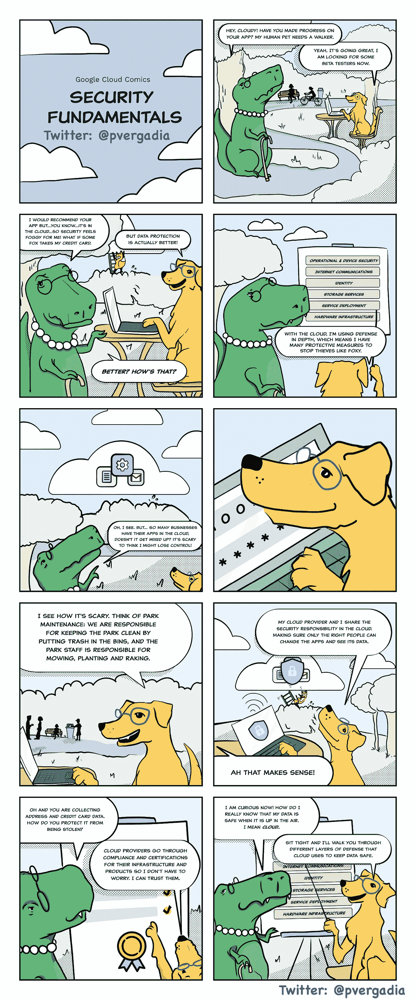

# 谷歌云如何帮助你的应用安全？

> 原文：<https://medium.com/google-cloud/how-can-google-cloud-help-with-security-of-your-apps-8f5692f56177?source=collection_archive---------2----------------------->

## 云中的应用程序安全性:权威指南

## [GCP 漫画#2:安全基础](https://gcpcomics.com/)

 [## GCP 漫画

### 谷歌云漫画(GCP 漫画)

gcpcomics.com](https://gcpcomics.com/) 

在云计算发展的这一点上，公平地说，你在云中至少有一些应用，或者计划在不久的将来有一些应用。因此，您可能想知道您可以使用哪种安全措施。在这一期的 [**GCP 漫画**](https://gcpcomics.com/) 中，我们正在报道这一点！

我们将回顾**云安全基础知识**，包括三个非常简单的安全概念。

给你！请继续阅读，并在下面的评论中分享你的想法。

GCP 漫画#2:云安全——谷歌云基础

# 三个安全基础

## 第一保护

Google Cloud 通过一个安全的基础提供免受威胁的保护。它提供了设计、构建和运行的核心基础架构来帮助防范威胁。是怎么做到的？以下是几种方法！

**纵深防御**

> 谷歌的基础设施并不依赖任何单一技术来保证安全。而是通过提供真正深度防御的渐进层来构建安全性。

其他云提供商可能会描述类似的功能，但谷歌云处理其中许多功能的方式是独特的。以下是方法:

*   硬件由谷歌控制、制造和加固。
*   任何运行在 Google 基础设施上的应用程序二进制文件都是安全部署的。
*   服务之间不存在任何信任假设，并且使用多种机制来建立和维护信任—基础架构从一开始就被设计为多租户。
*   所有身份、用户和服务都经过了严格的身份验证。
*   存储在谷歌基础设施上的数据在静态时会自动加密，并为了可用性和可靠性而分发。
*   通过互联网与谷歌云服务的通信是加密的。
*   基础设施的规模允许吸收许多拒绝服务(DoS)攻击，并且有多层保护进一步降低任何 DDoS 影响的风险。
*   运营团队 24 x 7 x 365 全天候检测威胁并响应事件。

如果这很有趣的话，这里有一份关于谷歌基础设施设计的白皮书，详细介绍了所有这些领域。

**端到端出处&证明**

> 谷歌的硬件基础设施是由谷歌“从芯片到冷却器”定制设计的，以精确满足他们的要求，包括安全性。

谷歌的服务器和操作系统(OS)是专为提供谷歌服务而设计的。

*   这些服务器都是定制的，不包含显卡或外围互连等会引入漏洞的不必要组件。
*   软件也是如此，包括低级软件和 OS，OS 是 Linux 的精简、强化版本。
*   此外，谷歌设计并包含了专门用于安全的硬件，如用于在服务器和外围设备中建立硬件信任根的定制安全芯片。
*   网络硬件和软件也是专门为提高性能和安全性而构建的。
*   所有这些都归结为定制数据中心设计，其中包括多层物理和逻辑保护。

> 从硬件栈的底层到顶层理解起源允许谷歌云控制安全态势的基础。与其他云提供商不同，谷歌大大减少了“中间问题供应商”——如果发现漏洞，可以立即采取措施开发和推出修复程序。这种级别的控制大大减少了暴露。

**民营骨干**

谷歌运营着世界上最大的主干网络之一。在 35 个国家/地区有 130 多个销售点，并且还在不断增加更多的区域和地区，以满足客户的偏好和政策要求。

> 谷歌的网络提供了低延迟，但也提高了安全性。一旦客户的流量进入谷歌的网络，它就不再通过公共互联网传输，这使得它不太可能被攻击、拦截或操纵。

**默认静止加密**

我们将在接下来的漫画中更详细地介绍这一点，但简而言之，谷歌网络上所有静止或运动的数据都是默认加密的。有些服务提供提供或管理您自己的密钥的选项。

**无中断大规模更新**

> 谷歌有能力使用一种名为*实时迁移*的技术来更新云基础设施，而不会干扰客户。

更新增加了功能，但从安全角度来看，它们也是修补软件漏洞所必需的。没有人能写出完美的软件，所以这是一个不变的要求。

**领先于威胁**

安全形势发展迅速，许多组织都在努力跟上步伐。因为谷歌运行的基础设施与客户可用的基础设施相同，所以客户可以直接从这些投资中受益。

> 企业和消费者的全球足迹让谷歌对威胁和攻击有了前所未有的了解。因此，可以在许多其他组织发现威胁之前开发出解决方案，从而减少暴露风险。

## **#2 控制**

在云中，可以有许多控制选项来确保您部署的应用程序、数据和服务是安全的。最重要的是要理解"**云安全需要协作**"

> 您的云提供商(Google Cloud)负责保护基础设施。
> 
> 您有责任保护您的数据。
> 
> 和..Google Cloud 提供最佳实践、模板、产品和解决方案来帮助您保护您的数据和服务。

保持这一节的简短，因为我正计划做另一期关于这个主题的漫画，这里还有很多东西要学，所以请继续关注！😊

## #3 合规性

为了保护您存储在 Google Cloud 中的敏感数据，Google Cloud 维护并检查合规性，包括复杂的监管、框架和准则。例如 HIPPA、FedRAMP、SOC 等。

点击阅读详细的合规标准和认证[。](https://cloud.google.com/security/compliance)

# 资源

要了解更多关于谷歌云的安全基础知识，请点击[链接](https://cloud.google.com/security/overview/whitepaper)查看详细的安全白皮书。

想要更多的 GCP 漫画吗？访问[gcpcomics.com](https://gcpcomics.com/)&跟着我上[中](/@pvergadia/)，上[维特](https://twitter.com/pvergadia)别错过下一期！