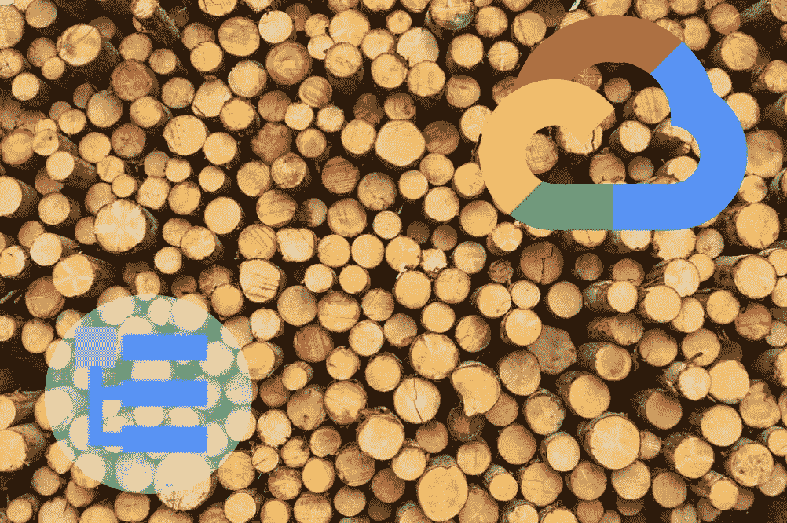
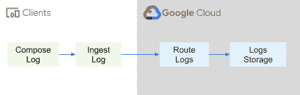

# 云日志如何工作(系列)

> 原文：<https://medium.com/google-cloud/how-cloud-logging-works-series-3aab7e7a1eed?source=collection_archive---------4----------------------->

艾蒂安·吉拉尔代在 [Unsplash](https://unsplash.com/s/photos/logging?utm_source=unsplash&utm_medium=referral&utm_content=creditCopyText) 上拍摄的照片

我计划为软件和开发工程师写一些关于[谷歌云日志](https://cloud.google.com/logging)技术细节的小帖子。这将是一个开始的帖子，我也将把它作为其他博客帖子的索引。

# 系列索引

最后更新日期:2 月 21 日至 23 日

*   [高级日志摄取](https://minherz.medium.com/how-cloud-logging-works-series-3aab7e7a1eed)
*   [日志如何存储在云日志中](https://minherz.medium.com/how-logs-are-stored-in-cloud-logging-b6869ced0fa)
*   [在 CloudSQL for Postgres 中匹配会话日志和 SQL 语句日志的小技巧](https://minherz.medium.com/correlate-statement-logs-in-cloudsql-for-postgres-with-connection-sessions-5bae4ade38f5)
*   [关于 Google Cloud 中结构化日志记录的更多信息](https://minherz.medium.com/structured-logging-in-google-cloud-61ee08898888)
*   [使用 Java 中的日志客户端库摄取丰富的日志](https://cloud.google.com/blog/products/devops-sre/google-cloud-logging-java-client-library-new-features)
*   [日志名称、桶和范围](https://minherz.medium.com/log-names-buckets-and-scopes-75aa1f2514ac)

# 从数英里外的 10K 摄取原木

日志摄取的过程在任何地方(几乎)都是相似的。抛开工作流的基础架构特定细节不谈，日志接收过程由四个步骤组成:

前两步由开发人员自行决定。在许多情况下，开发人员使用日志框架，如 slf4j 或 Java 中的 logback 或 NodeJS 中的 Bunyan 或 Winston。这些框架基于调用者提供的严重性和有效负载来构建日志。此外，该框架调用一组导出器(也称为 appenders 或 handlers ),这些导出器将日志条目发送到各个目的地。如果一个框架不支持一个特定的目标，它为开发人员提供了一个实现目标的方法。例如，要使用 slf4j 或 logback 解决方案并将日志接收到云日志中，开发人员可以使用[Google-Cloud-Logging-log back](https://cloud.google.com/logging/docs/setup/java#logback_appender_for)appender。

最后两步包括在后端处理和存储接收到的日志。在 Google Cloud 中，有一个[日志路由器](https://cloud.google.com/logging/docs/routing/overview#log-router)，它根据包含和排除过滤器处理摄取的日志条目，并将日志转发到默认或自定义的[日志桶](https://cloud.google.com/logging/docs/routing/overview#buckets)进行存储。