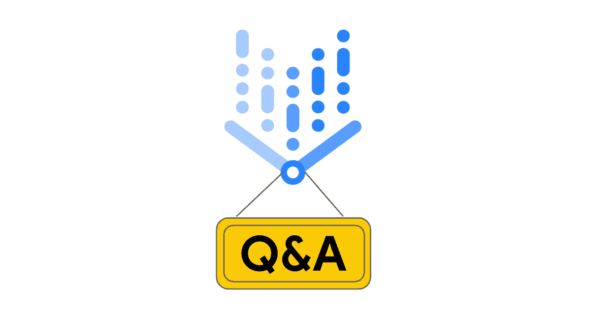
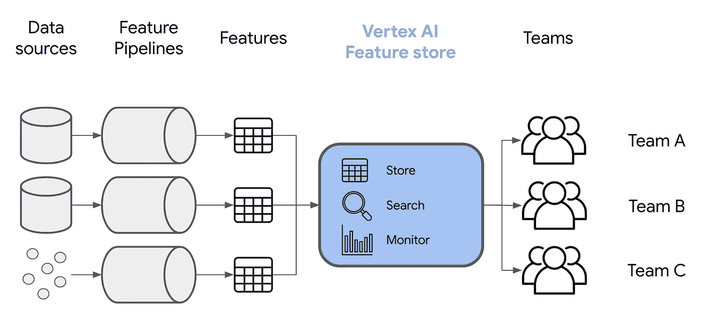
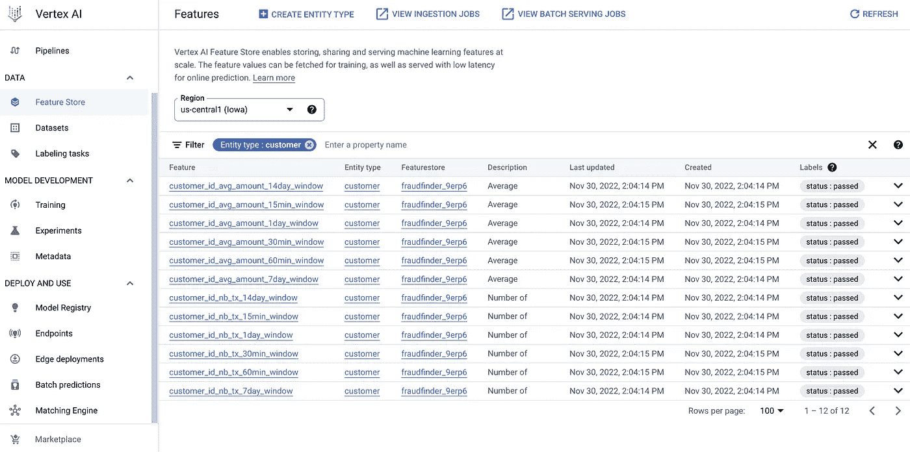
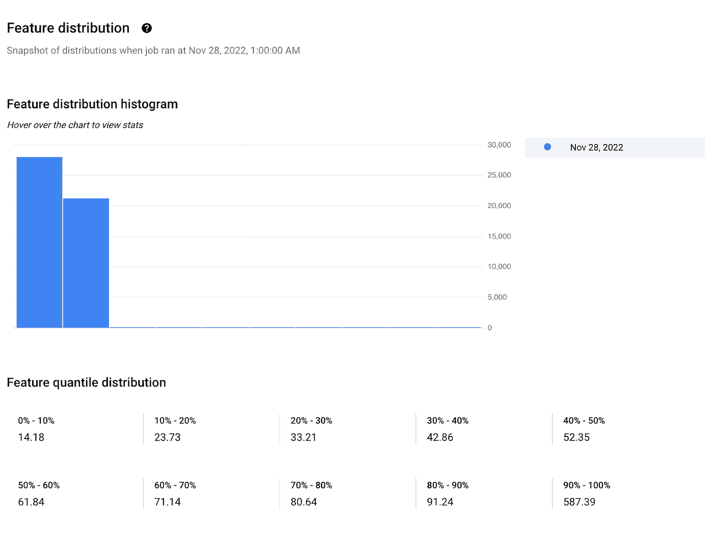
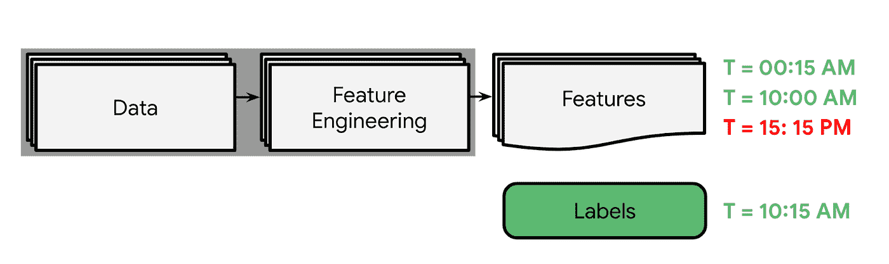
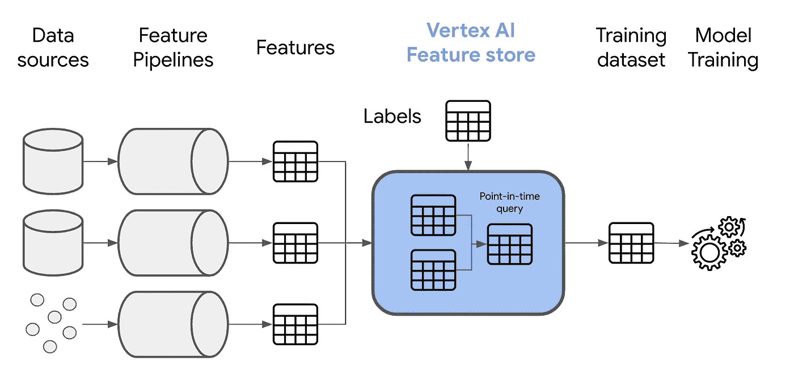
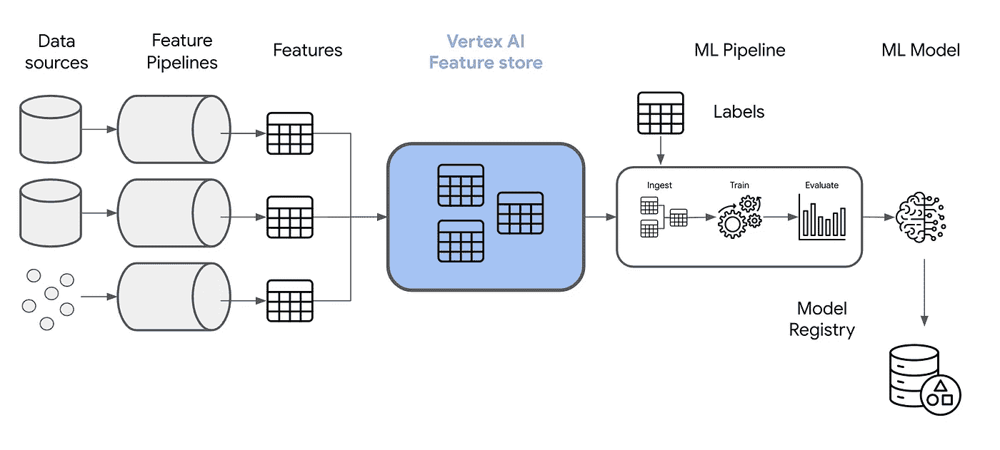
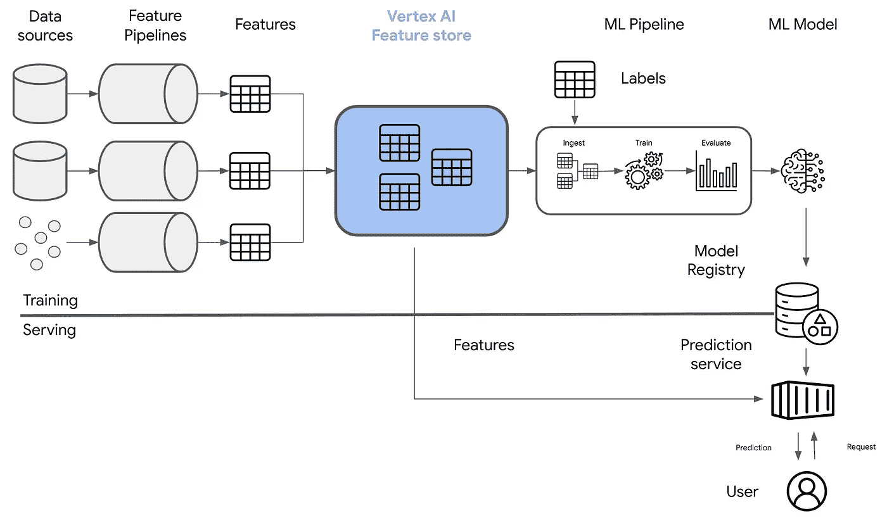
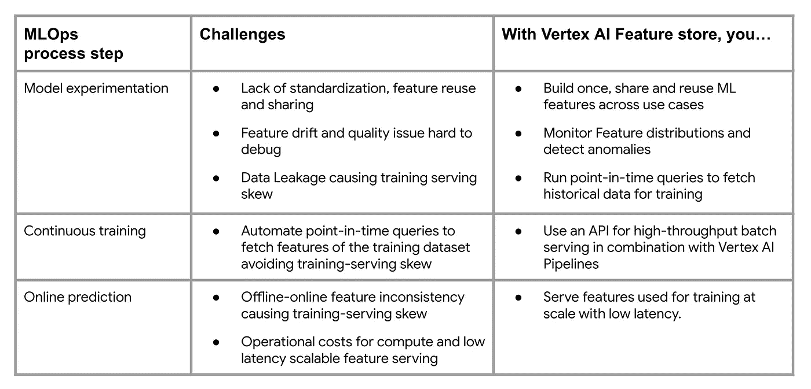

# 如何在 Vertex AI 上的 MLOps 过程中使用特征存储？

> 原文：<https://medium.com/google-cloud/how-do-you-use-feature-store-in-the-mlops-process-on-vertex-ai-802ddca2cac4?source=collection_archive---------0----------------------->



图 1 — Vertex AI 问答系列徽标

Google Cloud CloudAir 网络研讨会上@ MLOps 的一个问题是:

> 如何在 Vertex AI 上的 MLOps 过程中使用特征存储？

因为不是第一次收到这个问题，所以以此为契机，写[顶点 AI Q & A 系列](/@ivannardini/got-a-vertex-ai-question-ask-and-ill-try-to-help-724e69513519)第 1 篇，说说 Vertex AI 上沿着 MLOps 进程的特征库的作用。根据[这份白皮书](https://cloud.google.com/resources/mlops-whitepaper)，MLOps 流程中可能涉及到功能商店的步骤如下:

*   模型实验，包括特征工程和模型训练
*   持续培训
*   在线预测

在本文中，我将详细讨论特征商店如何在银行场景中预测欺诈交易的每个步骤[中发挥作用。而且我会使用](https://github.com/GoogleCloudPlatform/fraudfinder/tree/main) [Vertex AI 功能商店](https://cloud.google.com/vertex-ai/docs/featurestore)，Google Cloud 上完全托管的功能商店服务。有了它，我将能够提供代码样本，并利用它与 Vertex AI 服务的集成来说明一些概念，并演示功能商店如何支持和改进您在 Google Cloud 上的 MLOps 流程。

# 模型实验和功能存储:存储、监控和消费您的功能

# 特征工程和特征存储

通常，在开发 ML 模型之前，您需要构建特征。

**在规模上，您可能在几个团队中为许多不同的 ML 应用程序拥有相同的特性**。

例如，**在一家银行公司**中，您可能拥有*customer _ nb _ tx _ last _ month*特性，了解每个客户上个月的交易数量。该功能可用于构建 FraudFinder 团队的欺诈检测 ML 模型和 LoanAnalyzer 团队的贷款资格 ML 模型

不同的团队也可能构建不同的特性来表达相同的属性或特征。

**在我们的银行公司**，您可能有不同的数据科学家使用不同的公式计算*终端 _ 风险 _ 指数 _ 上月*特征，该特征是关于终端暴露于欺诈交易的风险指数。

为了避免在不同的团队中多次计算相同的特性，并保证特性的一致性，你可以决定引入一个特性库。功能存储是存储、组织和共享这些功能的存储库。该存储库从数据管道(批处理和流)中获取特征，每次原始数据可用时，数据管道都会计算特征。它使你的特性可以被不同的团队发现和重用。一旦摄入，特征库允许您搜索和过滤特征，更重要的是，**特征库允许您通过监控特征的分布来跟踪特征，并随着时间的推移检测异常**。

事实上，一旦你有了新的数据，你就可以计算新的特征。但是因为数据可能会随着时间发生显著变化([漂移](https://cloud.google.com/vertex-ai/docs/featurestore/overview#detect_drift))，所以您需要监控特性分布，并识别潜在的特性分布变化，这些变化会影响使用这些特性的下游模型的性能。

**在欺诈检测场景中，**想象一下，如果银行由于新的营销活动而在一个地区收集新客户，导致*地区*特征分布发生变化。现在，让我们假设您训练了一个 ML 模型，由于示例数量有限，该模型在该地区表现不佳。但是整体性能足够好，足以说服您的团队将其投入生产。在这种情况下，当新的欺诈交易在该地区发生时，您和您的团队需要一些时间来澄清为什么在没有要素存储的情况下整体模型性能会显著下降，该要素存储允许您快速监控要素分布，例如在这种情况下的地区。

下面，您将看到功能商店如何跨多个团队提供存储、搜索和监控功能。



图 2 —模型开发和特性存储

根据您的组织，您可能具有以下使用功能存储的角色:

*   平台管理员，负责管理功能存储及其操作，如创建数据模型、定义功能访问或监控策略
*   数据工程师负责通过数据管道创建要素并将其发布到要素存储中
*   数据分析师、数据科学家和机器学习工程师，他们从特征存储中定义和使用特征，用于训练和服务 ML 模型

如果你是一名数据科学家，你可以很容易地从谷歌云上 Vertex AI 特征商店中的熊猫数据帧中提取你的特征。事实上，一旦新的要素存储资源可用，您就可以使用 Vertex AI Python SDK 中的以下代码:

```
from typing import List
from pandas import DataFrame
from google.cloud import aiplatform

def ingest_features_df(
    project: str,
    location: str,
    featurestore_id: str,
    entity_type_id: str,
    features_ids: List[str],
    feature_time: str,
    features_df: DataFrame,
    entity_id_field: str
) -> aiplatform.featurestore.EntityType:
    """
    Ingests features into a Featurestore from a Pandas DataFrame.
    Args:
        project: The Google Cloud project ID.
        location: The Google Cloud location.
        featurestore_id: The Featurestore ID.
        entity_type_id: The Entity Type ID.
        features_ids: The list of Feature IDs.
        feature_time: The Feature timestamp.
        features_df: The Pandas DataFrame containing the features.
        entity_id_field: The Entity ID field.
    Returns:
        None
    """
    # Initialize the Vertex SDK for Python
    aiplatform.init(project=project, location=location)

    # Get the entity type from an existing Featurestore
    entity_type = aiplatform.featurestore.EntityType(entity_type_id=entity_type_id,
                                                     featurestore_id=featurestore_id)
    # Ingest the features
    entity_type.ingest_from_df(
        feature_ids=features_ids,
        feature_time=feature_time,
        df_source=features_df,
        entity_id_field=entity_id_field
    )

    return entity_type
```

在哪里

*   *feature _ id*是您想要导入值的特性的唯一标识符
*   *feature_time* 是保存每个实体的特征时间戳的列
*   *features_df* 是包含你特征的熊猫数据框
*   *entity_id_field* 是保存相关功能组的唯一标识符的列

下面你可以看到在我们的欺诈检测场景中，Vertex AI 功能商店中的功能是什么样子的。



图 3 —按实体类型过滤的特征存储和特征视图

请注意，如果启用了特征值监控，顶点 AI 功能还将允许跟踪特征值分布随时间变化的程度，如[文档](https://cloud.google.com/vertex-ai/docs/featurestore/monitoring#feature)中所述。

请注意，如果启用了特征值监控，顶点 AI 功能还将允许跟踪特征值分布随时间变化的程度，如[文档](https://cloud.google.com/vertex-ai/docs/featurestore/monitoring#feature)中所述。



现在，您知道了功能存储使功能可重用，并且有助于监控它们。但是你可能会问:

> *“你提到过，当我需要将功能扩展到许多用例时，可以使用功能库。* ***然而，如果不是这样呢？一个特征库还能对训练 ML 模型有用吗？”***

是的，会的。事实上，特征库解决的另一个挑战是可能影响模型的数据泄漏或目标泄漏。

# 模型训练和特征存储

在实时场景中，您会不断获得新数据来重构要素，但在收集您想要预测的标注之前需要一些时间。

**回到欺诈检测场景**，假设您有每个终端每小时的交易数量*terminal _ nb _ tx _ last _ month*作为特征。您可以每小时收集一次新的交易，并因此每天计算 24 次新的特征值。但是，在您建立的模型预测到某项交易是欺诈性的之后，调查将会开始，这将需要时间来确认该交易是否确实是欺诈。

在这些情况下，**用于训练模型的训练数据集只有在包含根据观察标签之前而非之后的可用数据计算的特征时才有效。**根据收集目标后的可用数据计算的任何特征都不能正确表示预测目标变量的特征值。这是因为您将使用仅在采集标注后才可用的特征值来构建模型。换句话说，你可以用[【未来预测现在】](https://cloud.google.com/blog/topics/developers-practitioners/kickstart-your-organizations-ml-application-development-flywheel-vertex-feature-store)。因此，可能会出现这样的情况:您的模型在培训期间表现良好，但在投入生产时表现不佳，从而产生[培训服务偏差](https://developers.google.com/machine-learning/guides/rules-of-ml#:~:text=Training%2Dserving%20skew%20is%20a,train%20and%20when%20you%20serve.)。



图 4 —图片中的数据泄漏

**在我们使用*terminal _ nb _ tx _ last _ month*功能的欺诈检测场景**中，如果我们假设它与我们的 *is_fraud* 目标高度正相关，那么在生产中，模型将倾向于预测更多的欺诈交易，而不仅仅是因为我们将错误的特征值与我们的标签相关联。这就是生产数据泄漏会导致模型精度下降的原因。

**有了特征库，你就可以防止训练和发球偏斜。要素存储允许您通过使用时间点查询在标注变得可用之前获取随时间计算的要素的最新视图。时间点查询通过防止未来特征值的泄漏来检索到您收集标签时为止的每个记录的特征值。因此，生成的训练数据集将包含观察到的标注的代表性特征值。**

下面，您将了解功能存储如何允许您使用时间点查询生成训练数据集。



图 5 —模型训练和特征存储

**用** [**顶点 AI 特征库**](https://cloud.google.com/vertex-ai/docs/featurestore) **做时间点查询相当简单。**当你需要训练你的模型时，你可以使用[特征库 SDK](https://cloud.google.com/vertex-ai/docs/featurestore#use-vertex-ai-feature-store) 来[获取](https://cloud.google.com/vertex-ai/docs/featurestore/serving-batch)特征，并将它们物化在一个数据帧中。下面是示例代码。

```
 from typing import Dict, List
from pandas import DataFrame
from google.cloud import aiplatform

def batch_serve_features_df(
        project: str,
        location: str,
        featurestore_id: str,
        serving_feature_ids: Dict[str, List[str]],
        read_instances_df: DataFrame,
        pass_through_fields: List[str]) -> DataFrame:
    """
    Retrieves batch feature values from a Featurestore and writes them to a GCS bucket.
    Args:
        project: The Google Cloud project ID.
        location: The Google Cloud location.
        featurestore_id: The Featurestore ID.
        serving_feature_ids: The dictionary of Entity Type IDs and Feature IDs to retrieve.
        read_instances_df: The Pandas DataFrame containing entities and feature values.
        pass_through_fields: The list of fields to pass through extra to the label column.
    Returns:
        The Pandas DataFrame containing the dataset.
    """

    # Initialize the Vertex SDK for Python
    aiplatform.init(project=project, location=location)

    # Get an existing Featurestore
    featurestore = aiplatform.featurestore.Featurestore(featurestore_name=featurestore_id)

    # Get data with a point-in-time query from the Featurestore
    df = featurestore.batch_serve_to_df(
        serving_feature_ids=serving_feature_ids,
        read_instances_df=read_instances_df,
        pass_through_fields=pass_through_fields
    )

    return df
```

在哪里

*   *serving _ feature _ id*是要从特征库中获取的特征，
*   *read_instances_df* 是 Pandas 数据帧，带有目标变量、服务时间戳和您要用来读取的实体。
*   *pass_through_fields* 是你想从实例数据帧中读取的任何其他变量。

使用这种方法，您可以执行高效的时间点查找，并将要素存储中所有必需的要素值连接到标注(和其他变量)以创建正确的数据集来训练您的模型。

# 持续培训和功能商店:满足您的培训需求

训练 ML 模型是一项重复的任务。为了自动化该任务并持续训练您的模型，您构建 ML 管道。ML 管道允许您结合一些触发器来编排和自动化您的模型训练。

**每次 ML 管道被触发时，它需要接收新的训练数据。在拥有要素存储的情况下，您可以通过运行时间点查询来创建训练数据集，该时间点查询将根据您收集标注的时间来检索要素。**

根据您将如何自动化您的训练，一种可能性是在您的 ML 管道中创建一个摄取组件，它将从特征存储中获取特征并使用它们来训练您的 ML 模型。下面您可以看到如何触发新的 ML 管道，该管道使用由功能存储中的时间点查询创建的训练数据集。



图 6 —持续培训和特征库

在 Vertex AI 上，你使用 [Vertex AI Pipelines](https://cloud.google.com/vertex-ai/docs/pipelines/introduction) 使用 Kubeflow Pipelines (KFP)或 Tensorflow Extended (TFX) DSL 以无服务器方式运行 ML 管道。这些框架允许您构建一个摄取组件来实现时间点逻辑。下面您可以看到摄取管道组件的伪代码，您可以在我们的欺诈检测场景中使用 KFP 构建该组件。

```
from kfp.v2.dsl import component
from typing import NamedTuple

@component(output_component_file="batch_serve_features_gcs.yaml",
           base_image="python:3.9",
           packages_to_install=["google-cloud-aiplatform"])
def batch_serve_features_gcs(feature_store_id: str,
                             gcs_destination_output_uri_prefix: str,
                             gcs_destination_type: str,
                             serving_feature_ids: str,
                             read_instances_uri: str,
                             project: str,
                             location: str) -> NamedTuple("Outputs", [("gcs_destination_output_uri_paths", str)]):
    # Import libraries
    import os
    from json import loads
    from google.cloud import aiplatform
    from google.cloud.aiplatform.featurestore import Featurestore

    # Initialize Vertex AI client
    aiplatform.init(project=project, location=location)

    # Initiate feature store and run batch serve request
    featurestore = Featurestore(featurestore_name=feature_store_id)

    # Serve features in batch on GCS
    serving_feature_ids = loads(serving_feature_ids)
    featurestore.batch_serve_to_gcs(
        gcs_destination_output_uri_prefix=gcs_destination_output_uri_prefix,
        gcs_destination_type=gcs_destination_type,
        serving_feature_ids=serving_feature_ids,
        read_instances_uri=read_instances_uri
    )

    # Store metadata
    gcs_destination_output_path_prefix = gcs_destination_output_uri_prefix.replace("gcs://", "/gcs/")
    gcs_destination_output_paths = os.path.join(gcs_destination_output_path_prefix, "*.csv")
    component_outputs = NamedTuple("Outputs",
                                   [("gcs_destination_output_uri_paths", str), ], )

    return component_outputs(gcs_destination_output_paths)
```

该组件利用 [Vertex AI Python SDK](https://cloud.google.com/vertex-ai/docs/featurestore/serving-batch#batch_serve_feature_values) 从 Vertex AI 特征存储中批量提供特征值以获取数据。作为输入，它采用包含新标签的表的 BigQuery URI，作为输出，它返回可用于创建顶点 AI 数据集资源的 URIs 列表。通过这种方式，您可以将与新训练数据相关联的所有元数据存储在 Vertex AI ML 元数据中，以实现可再现性。

# 在线预测和特征存储:为您的特征服务

让我们假设您有一个 ML 管道，它从一个特征库中获取特征并训练您的模型。现在您已经有了模型，您想部署它来生成实时预测。可以想象，每次新的预测请求到来时，您都需要传递模型期望接收的特征值作为输入，以生成实时预测。

在某些情况下，[可能希望计算、存储特性并使其可用于低延迟的传入预测请求，而不是创建实时特性管道](https://learning.oreilly.com/library/view/machine-learning-design/9781098115777/ch06.html)、**。**例如，FraudFinder 团队会考虑在数据仓库而不是流数据管道中计算 *customer_nb_tx_last_day* 特征(过去一整天的交易数量)。在那些在服务器端计算特性的场景中，BigQuery 之类的数据仓库没有经过优化，无法大规模地实时提供服务。这就是为什么您需要一个不同的服务，该服务允许功能查找，并为每个数据实体(如欺诈检测用例中的客户或终端)返回一个包含许多列的单行。

最后，[即使您可以在部署模型](https://towardsdatascience.com/do-you-really-need-a-feature-store-e59e3cc666d3)时计算特性，您也需要确保重现您在训练模型时的相同预处理步骤。如果您不能做到这一点，训练数据和服务数据之间可能会再次出现偏差，这可能会严重影响您的模型性能。为了减轻这种偏差，您可以在线消除预处理步骤，并且**提供您在训练期间已经拥有的相同聚合特征来生成在线预测。**

**这两种场景都为引入功能商店提供了有价值的理由，在功能商店中，您拥有一项服务，可帮助您以低延迟的规模提供培训时可用的相同聚合功能。因为它提供了与你训练你的 ML 模型相同的特性，它有助于减轻可能的训练服务偏差。**

在下图中，您可以看到要素存储如何允许用户提供用于生成在线预测的要素。



图 7 —预测服务和特征存储

通过使用 Vertex AI Python SDK，您可以轻松地将要素服务集成到服务中。以下是如何应用 read 方法从 Vertex AI 要素库中检索要素的简单示例。

```
from typing import List
from pandas import DataFrame
from google.cloud import aiplatform

def online_serve_feature_values(
        project: str,
        location: str,
        featurestore_id: str,
        entity_type_id: str,
        entity_ids: List[str],
        feature_ids: List[str]) -> DataFrame:
    """
    Retrieves online feature values from a Featurestore.
    Args:
        project: The Google Cloud project ID.
        location: The Google Cloud location.
        featurestore_id: The Featurestore ID.
        entity_type_id: The Entity Type ID.
        entity_ids: The list of Entity IDs.
        feature_ids: The list of Feature IDs.
    Returns:
        A Pandas DataFrame containing the feature values.
    """

    # Initialize the Vertex SDK for Python
    aiplatform.init(project=project, location=location)

    # Get the entity type from an existing Featurestore
    entity_type = aiplatform.featurestore.EntityType(entity_type_id=entity_type_id,
                                                     featurestore_id=featurestore_id)
    # Retrieve the feature values
    feature_values = entity_type.read(entity_ids=entity_ids, feature_ids=feature_ids)

    return feature_values
```

在哪里

*   *entity_ids* 是相关特征组的标识符列表
*   *features_ids* 是您想要检索的特征标识符的列表

该方法返回每个要素的最新值，这意味着默认情况下会返回具有最新时间戳的要素值。

# 摘要

在 [Google Cloud CloudAir 网络研讨会](https://cloudonair.withgoogle.com/events/innovators-mlops-on-google-cloud)上，有一个问题是:

> 如何在 Vertex AI 上的 MLOps 过程中使用特征存储？

根据我的学习和经验，我认为以下是 MLOps 流程中可能涉及到功能库的步骤:



图 8-如何在 Vertex AI 上的 MLOps 过程中使用特征库？

重要的是，并不是所有的 ML 场景都需要一个特性库。我建议参考 Lak Lakshmanan 的这篇文章来评估你是否真的需要一个功能商店。

# 下一步是什么

我希望你能更好地理解 Google Cloud 上的 MLOps 过程中特性商店的作用。如果是这样，你可能想在 Vertex AI 上开始使用它。查看[文档](https://cloud.google.com/vertex-ai/docs/featurestore/overview)和这个[库](https://github.com/GoogleCloudPlatform/vertex-ai-samples/tree/main/notebooks/official/feature_store)以了解更多信息。如果你对 Vertex AI 的功能商店和任何其他服务有进一步的问题，请随时发表评论或在 [Linkedin](https://www.linkedin.com/in/ivan-nardini/) 或 [Twitter](https://twitter.com/IlNardo92) 上联系。

感谢 [Kaz Sato](https://medium.com/u/4b21e207ea2c?source=post_page-----802ddca2cac4--------------------------------) 、[Rajesh thal am](https://medium.com/u/ac26de3bc89e?source=post_page-----802ddca2cac4--------------------------------)、 [Gabriele Randelli](https://medium.com/u/8f61f3a4e09c?source=post_page-----802ddca2cac4--------------------------------) 以及所有同事的反馈和建议。