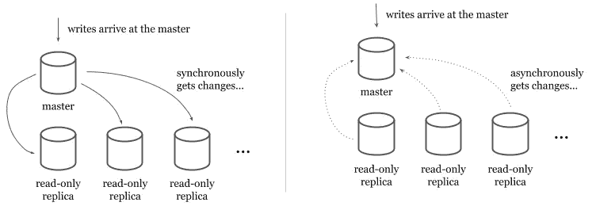
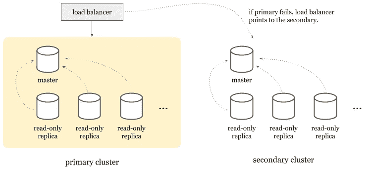
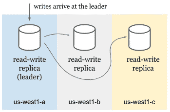
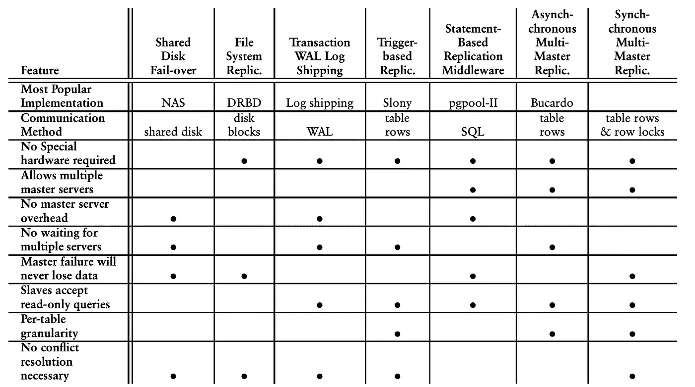
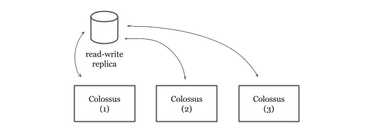

# Spanner 如何避免写操作中的单点故障？

> 原文：<https://medium.com/google-cloud/how-does-spanner-avoid-single-point-of-failures-in-writes-4f7765cd894?source=collection_archive---------0----------------------->

谷歌的[扳手](https://cloud.google.com/spanner)是一个具有 99.999%可用性的关系数据库，相当于一年 5 分钟的停机时间。Spanner 是一个分布式系统，可以跨越多台机器、多个数据中心(如果配置好的话，甚至可以跨越地理区域)。它在副本之间自动分割记录，并提供自动故障转移。与传统的故障转移模型不同，Spanner 不会故障转移到辅助集群，而是可以选择一个可用的读写副本作为新的领导者。

在关系数据库中，提供高可用性和高一致性是一个非常困难的问题。Spanner 的同步复制、专用网络和 [Paxos](https://en.wikipedia.org/wiki/Paxos_(computer_science)) 投票的使用提供了高可用性，而不影响一致性。

## 读取与写入的高可用性

在传统的关系数据库(如 MySQL 或 PostgreSQL)中，扩展和提供更高的读取可用性比写入更容易。只读副本提供只读事务可以从中检索的数据的副本。数据从读写主机同步或异步复制到只读副本。

在同步模式中，主服务器在每次写入时同步写入读取副本。尽管这种模式可以确保只读副本总是拥有最新的数据，但它会使写入成本非常高(并导致写入的可用性问题)，因为主服务器必须在返回之前写入所有可用的副本。

在异步模型中，只读副本从流或复制日志中获取数据。异步模式使写入速度更快，但会在主副本和只读副本之间引入延迟。用户必须忍受这种延迟，并且应该对其进行监控，以发现复制中断。异步写入会使系统不一致，因为在异步同步完成之前，并非所有复制副本都具有的最新版本。同步写入通过确保所有副本在写入成功之前获得更改，使数据保持一致。



只读副本的同步与异步复制。

通过添加更多读取副本来水平扩展读取只是问题的一部分。**扩展写入是一个更困难的问题**。拥有一个以上的主设备会带来额外的问题。如果一个主服务器发生宕机，其他服务器可以继续提供写入服务，而不会让用户经历宕机。这种模式需要在主机之间复制写入。与读取复制类似，[多主复制](https://en.wikipedia.org/wiki/Multi-master_replication)可以异步实现，也可以同步实现。如果同步实现，这通常意味着写操作的可用性较低，因为写操作应该在所有主机中复制，并且在成功之前它们都应该可用。作为一种权衡，多主复制通常与异步复制一起实现，但它会对整个系统产生负面影响，因为它会引入:

*   违背 ACID 承诺的松散一致性特征。
*   超时和通信延迟的风险增加。
*   如果发生了冲突更新但没有进行通信，则需要在两个或多个主设备之间解决冲突。

由于多主复制带来的复杂性和故障模式，它在实践中并不是提供高可用性的常用方法。

作为替代，[高可用性集群](https://en.wikipedia.org/wiki/High-availability_cluster)是更受欢迎的选择。在这种模式下，当主服务器出现故障时，您将拥有一个可以接管的整个集群。如今，云提供商实施这种模式来为其托管的传统关系数据库产品提供高可用性特性。



在一个示例模型中，如果主群集发生故障，辅助群集可以接管，负载平衡器将指向辅助群集，所有读写操作都将由辅助群集提供服务。

## 拓扑学

Spanner 不使用高可用性集群，而是从不同的角度来处理这个问题。一个扳手簇* [包含](https://cloud.google.com/spanner/docs/replication#replica_types)多个读写，可能包含一些只读和一些见证副本。

*   读写副本服务于读取和写入。
*   只读副本用于读取。
*   见证人不服务数据但参与领袖选举。

只读副本和见证副本仅用于跨多个地理区域的多区域 Spanner 集群。单区域集群只使用读写副本。每个副本都位于该区域的不同分区中，以避免因分区中断而出现单点故障。



该写被路由到领导者**。然后，该写入被同步复制到其他复制副本。

## 分裂

Spanner 的复制和分片能力来自于它的拆分。Spanner 分割数据以进行复制并在副本之间分发。当 Spanner 在记录中检测到高读取或高写入负载时，拆分自动发生。每个分割都被复制，并且有一个**主副本**。

当一个写操作到达时，Spanner 会找到该行所在的拆分。然后，我们查找该拆分的领导者，并将写入路由到领导者。这是*的真理*，即使在多区域设置中，用户在地理上更接近另一个非领导读写副本。在主服务器中断的情况下，一个可用的读写复制副本将被选为主服务器，并从那里为用户的写入提供服务。


每个剥离都复制三次，其中只有一个副本是剥离的先导。每个拆分可能位于不同的机器上，参见[https://cloud . Google . com/spanner/docs/white papers/life-of-read-and-writes](https://cloud.google.com/spanner/docs/whitepapers/life-of-reads-and-writes#practical_example)。

为了使写入成功，领导者需要将更改同步复制到其他副本。但是，这难道不会对写入的可用性产生负面影响吗？如果写入需要等待所有副本都成功，则副本可能会成为单点故障，因为直到所有副本都复制了更改，写入才会成功。

这是扳手做得更好的地方。Spanner 只需要*Pax OS 投票者的多数就能成功写出*。这使得即使读写复制副本出现故障，写入也能成功。只有大多数投票者需要而不是所有的读写副本。

## 同步复制

如上所述，同步复制很难，并且会对写入的可用性产生负面影响。另一方面，当异步复制时，它们会导致不一致、冲突，有时还会导致数据丢失。例如，当主服务器由于网络问题而变得不可用时，它可能仍然有已提交的更改，但可能没有将它们传递给辅助服务器。如果辅助主服务器在故障转移后更新相同的记录，可能会发生数据丢失或需要解决冲突。PostgreSQL 提供了各种具有不同权衡的复制模型。下面的权衡总结可以给你一个非常高层次的概念，让你知道在设计复制模型时需要考虑多少不同的问题。



各种 PostgreSQL 复制模型及其权衡的[摘要](https://momjian.us/main/writings/pgsql/replication.pdf)。

扳手的[复制](https://cloud.google.com/spanner/docs/replication)是*同步*。领导者必须与其他读/写复制副本同步通信并确认更改，以使写操作成功。

## 两阶段提交(2PC)

虽然只影响单次分割的写入使用更简单、更快速的协议，但如果一个写入事务需要两次或更多次分割，则会执行[两阶段提交](https://en.wikipedia.org/wiki/Two-phase_commit_protocol) (2PC)。2PC 以“反可用性协议”而闻名，因为它需要所有副本的参与，任何副本都可能是单点故障。即使某些副本不可用，Spanner 仍会提供写入服务，因为提交写入只需要大多数投票副本。

## 网络

Spanner 是一个分布式系统，通常会受到影响分布式系统的问题的影响。网络本身是分布式系统中断的一个因素。另一方面，谷歌只提到了 7.6%的扳手故障与网络有关。这主要是因为它运行在谷歌的私有网络上。多年的运营成熟度、保留的资源、对升级和硬件的控制使网络不再是停机的重要原因。埃里克·布鲁尔的早期文章更详细地解释了网络在这种情况下的作用。

## 巨人

Spanner 的耐久性保证来自于 Google 的分布式文件系统，Colossus。扳手也减轻了一些依赖巨像的风险。使用 Colossus 允许我们将文件存储从数据库服务中分离出来。Spanner 是一种“无共享”架构，因为集群中的任何服务器都可以从 Colossus 读取数据，所以副本可以从整台机器的故障中快速恢复。

巨像还提供复制和加密。如果一个巨像实例崩溃，Spanner 仍然可以通过可用的巨像实例处理数据。巨像加密数据，这就是为什么 Spanner 默认提供开箱即用的静态加密。



扳手读写副本将数据交给巨像，在巨像中数据被复制 3 次。假设 Spanner 集群中有三个读写副本，这意味着数据被复制了 9 次。

## 自动重试

正如上面反复提到的，Spanner 是一个分布式系统，并不神奇。在写入时，它比传统数据库经历更多的内部中止和超时。分布式系统中处理部分和临时故障的一个常用策略是重试。Spanner 客户端库*为读/写事务*提供自动重试。在下面的 Go 代码片段中，您可以看到创建读写事务的 API。如果由于中止或冲突而失败，客户端会自动重试主体:

```
import "cloud.google.com/go/spanner"_, err := client.ReadWriteTransaction(ctx, func(ctx context.Context, txn *spanner.ReadWriteTransaction) error {
    **// User code here.**
})
```

为 Google Cloud Spanner 开发 ORM 框架支持的挑战之一是，大多数 ORM 没有自动重试功能，因此它们的 API 没有给开发人员一种不应在事务范围内维护任何应用程序状态的感觉。相比之下，Spanner 库关心大量的重试，并努力自动交付它们，而不会给用户带来额外的负担。

—

Spanner 处理分片和复制的方法不同于传统的关系数据库。它利用谷歌的基础设施，并微调几个传统的难题，以提供高可用性，而不损害一致性。

**脚注:**
(*) Google Cloud Spanner 对集群的术语是实例。我避免使用“实例”,因为它是一个重载的术语，对本文的大多数读者来说可能意味着“复制品”。
(**)写被路由到*分割*头。请阅读“拆分”部分了解更多信息。

本文存档于[spanner.fyi/ha-writes](https://spanner.fyi/ha-writes/)。