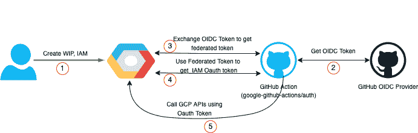

# GCP 工作负载身份联盟如何与 Github 提供商合作？

> 原文：<https://medium.com/google-cloud/how-does-the-gcp-workload-identity-federation-work-with-github-provider-a9397efd7158?source=collection_archive---------1----------------------->



一些用户可能想要运行 terraform 代码，以便通过他们的 Github CI/CD 管道在 Google 云平台上创建资源。而其他人可能希望运行“gcloud”命令来进行某些配置。这两个选项都需要调用 GCP API。当您调用 GCP API 时，它们需要认证和授权。一种可能(但不推荐)的方法是下载 GCP 服务账户密钥，并将其作为秘密存储在 Github repos 中，或者作为文件存储在 Github private runners 中。然后，这些服务帐户密钥可以用于进行 GCP API 调用。在 Github 环境中保护、存储、分发、轮换和监控这些密钥本身就是一项非常具有挑战性和令人兴奋的任务。所以不推荐。GCP 提供了一种更安全的方法来实现相同的使用工作负载身份联邦。在这篇文章中，我将尝试描述 GCP·WIF 如何使用一步一步的方法与 Github 提供商合作。

# 第一步

在此，用户要求 GCP 信任 Github 提供商。这是通过创建工作负载标识池、工作负载标识提供者和 IAMs 来实现的。让我们分别来看看这些。

**工作负载身份池:**工作负载身份池用于组织和管理外部身份。建议为不同的非 google 云环境创建一个新池。下面的命令可以用来创建相同的:

```
gcloud iam workload-identity-pools create github-wif-pool --location="global" --project <project_id>
```

**工作负载身份提供者:**工作负载身份提供者描述了外部身份(如 Github 和 Google Cloud)之间的关系。它基本上建立了外部身份和 GCP 之间的信任。它提供了将外部令牌的属性应用到 Google 令牌的属性映射。这使得 IAM 可以使用来自外部提供商的令牌来授权对 Google 云资源的访问。这基本上是一种将外部令牌转换成 GCP 等价令牌的方法。下面的命令可以用来创建相同的:

```
gcloud iam workload-identity-pools providers create-oidc githubwif \
--location="global" --workload-identity-pool="github-wif-pool"  \
--issuer-uri="https://token.actions.githubusercontent.com" \
--attribute-mapping="attribute.actor=assertion.actor,google.subject=assertion.sub,attribute.repository=assertion.repository" \
--project <project_id>
```

**服务帐户和 IAMs:** 我们需要一个分配了相关权限的服务帐户。WIF 将模拟此服务帐户。我们还添加了权限，允许来自工作负载身份提供者提供的身份的身份验证模拟所需的服务帐户。它允许 Github action 模拟服务帐户并获取令牌。请注意在成员名称中使用了属性“repository”。它允许 IAM 仅对来自存储库“PradeepSingh1988/gcp-wif”的请求进行身份验证。如果我们没有使用它，那么所有使用特定工作负载身份提供者的 github repos 都可以根据 IAM 进行身份验证。下面的命令可以用来创建相同的:

```
gcloud iam service-accounts create test-wif \
--display-name="Service account used by WIF POC" \
--project <project_id>

gcloud projects add-iam-policy-binding <project_id> \
--member='serviceAccount:test-wif@<project_id>.iam.gserviceaccount.com' \
--role="roles/compute.viewer"gcloud iam service-accounts add-iam-policy-binding test-wif@<project_id>.iam.gserviceaccount.com \
--project=<project_id> \
--role="roles/iam.workloadIdentityUser" \
--member="principalSet://iam.googleapis.com/projects/<project_number>/locations/global/workloadIdentityPools/github-wif-pool/attribute.repository/PradeepSingh1988/gcp-wif"
```

还有一些选项可以限制来自特定分支的身份验证。为此，我们需要使用如下的原则。

```
principal://iam.googleapis.com/projects/<project_number>/locations/global/workloadIdentityPools/POOL_ID/subject/repo:PradeepSingh1988/gcp-wif:ref:refs/heads/main
```

这确保了只有 repo PradeepSingh1988/gcp-wif 的主分支可以进行身份验证。

# 第二步

对于这一步，我想给一个简单的 github 工作流在我的回购有以下步骤的例子。

```
name: **wif-ci**
on:
  push:
    branches:- **'main'**
jobs:
  build:
    name: **"Test WIF"**
    runs-on: **ubuntu-latest**
    timeout-minutes: 90
    permissions:
      contents: **'read'**
      id-token: **'write'**
    steps:
      - name: **Checkout**
        uses: **actions/checkout@v2**
      - id: **auth**
        uses: **google-github-actions/auth@v0.4.0**
        with:
          token_format: **"access_token"**
          create_credentials_file: **true**
          activate_credentials_file: **true**
          workload_identity_provider: **${{** **secrets.WORKLOAD_IDENTITY_PROVIDER_ID** **}}**
          service_account: **${{** **secrets.SERVICE_ACCOUNT** **}}**
          access_token_lifetime: **'100s'
**      - name: **Set** **up** **Cloud** **SDK**
        uses: **google-github-actions/setup-gcloud@v0.3.0
**      - name: **set** **crdential_file**
        run: **gcloud auth login --cred-file=${{steps.auth.outputs.credentials_file_path}}
**      - name: **Run** **gcloud**
        run: gcloud compute instances list --zones us-east4-c
```

这里我们使用了一些秘密，如**WORKLOAD _ IDENTITY _ PROVIDER _ ID**和 **SERVICE_ACCOUNT** 我们需要在 github repo 中创建这两个秘密。我们可以从步骤 1 中获得它们的值。

在此步骤中，Github 操作' google-github-actions/auth '首先调用 Github OIDC 提供程序来获取 OIDC 令牌。要获得 OIDC 令牌，它必须拥有针对 OIDC 提供者进行 API 调用的权限。这就是' id-token: **'write'** '行变得必要的地方。它提供了**‘Google-github-actions/auth’动作对 OIDC 提供者进行 API 调用的必要权限。**

**Github action 调用 Github OIDC 提供商。该调用相当于下面的 curl 请求。**

```
OIDC_TOKEN=$(curl -H **"Authorization: bearer $ACTIONS_ID_TOKEN_REQUEST_TOKEN"** **"$ACTIONS_ID_TOKEN_REQUEST_URL&audience=https://iam.googleapis.com/${{ secrets.WORKLOAD_IDENTITY_PROVIDER_ID }}"** | jq **'.value'**)
```

**OIDC 提供者返回令牌，它是 jwt 格式的，如果解码成功，看起来如下所示:**

```
{
"typ": "JWT",
"alg": "RS256",
"x5t": "example-thumbprint",
"kid": "example-key-id"
}{
"jti": "example-id",
"sub": "repo:PradeepSingh1988/gcp-wif:ref:refs/heads/main"
"environment": "",
"aud": "https://iam.googleapis.com/projects/<project_number>/locations/global/workloadIdentityPools/<pool_id>/providers/<provider_id>",
"ref": "refs/heads/main",
"sha": "example-sha",
"repository": "PradeepSingh1988/gcp-wif",
"repository_owner": "PradeepSingh1988",
"actor_id": "23",
"repository_id": "45",
"repository_owner_id": "67",
"run_id": "example-run-id",
"run_number": "101",
"run_attempt": "21",
"actor": "PradeepSingh1988",
"workflow": "example-workflow",
"head_ref": "",
"base_ref": "",
"event_name": "workflow_dispatch",
"ref_type": "branch",
"job_workflow_ref":"PradeepSingh1988/gcp-wif/.github/workflows/ci.yml@refs/heads/main",
"iss": "https://token.actions.githubusercontent.com",
"nbf": 1632494000,
"exp": 1632494900,
"iat": 1632494600
}
```

# **第三步**

**在此步骤中，Github 操作' google-github-actions/auth '将 OIDC 提供 jwt 令牌与 GCP 安全令牌服务进行交换，以获得联合访问令牌。Github action 发出的 HTTPs 调用相当于下面的 curl 请求。**

```
STS_RESPONSE=$(curl -0 -X POST https://sts.googleapis.com/v1/token \
 -H **'Accept: application/json'** -H **'Content-Type: application/json'** -d **"$(cat <<EOF
 {
     "audience": "//iam.googleapis.com/${{ secrets.WORKLOAD_IDENTITY_PROVIDER_ID }}",
     "grantType": "urn:ietf:params:oauth:grant-type:token-exchange",
     "requestedTokenType" : "urn:ietf:params:oauth:token-type:access_token",
     "scope": "https://www.googleapis.com/auth/cloud-platform",
     "subjectTokenType": "urn:ietf:params:oauth:token-type:jwt",
     "subjectToken": $OIDC_TOKEN
 }
 EOF
 )"**
 )
 STS_TOKEN=$(jq **'.access_token'** <<< **"$STS_RESPONSE"**)
```

**这里它传递了两个重要的信息，受众和 subjectToken。收到请求后，STS 在工作负载身份提供者的帮助下验证令牌。Workload Identity Provider 执行所有条件检查，以及在创建提供程序期间指定的属性映射。它检查令牌中的“iss”字段是否与创建工作负荷身份提供者期间传递的“issuer-uri”相同。令牌中的“aud”字段等于*"*[*https://iam.googleapis.com/projects/*](https://iam.googleapis.com/projects/)*<项目 _ 编号>/locations/global/workloadIdentityPools/<pool _ id>/providers/<provider _ id>"*或不等于等等。所有的步骤都在[这里](https://cloud.google.com/iam/docs/using-workload-identity-federation#verification_of_external_credentials)详细描述。**

**一旦请求验证成功，STS 就会返回一个联邦令牌。这个令牌是一种 GCP 身份，具有模拟服务帐户所需的所有必要信息。**

# **第四步**

**在此步骤中，Github 操作' google-github-actions/auth '交换在上一步骤中收到联合令牌，以获取 IAM 访问令牌。Github action 发出的 HTTPs 调用相当于下面的 curl 请求。**

```
IAM_RESPONSE=$(curl -0 -X POST   \
https://iamcredentials.googleapis.com/v1/projects/-/serviceAccounts/${{ \
secrets.SERVICE_ACCOUNT }}:generateAccessToken \
-H **"Authorization: Bearer $STS_TOKEN"** \
-H **'Accept: application/json'** \
-H **'Content-Type: application/json'** -d **"$(cat <<EOF
{
  "scope": [ "https://www.googleapis.com/auth/cloud-platform" ]
}
EOF
)"**
)
ACCESS_TOKEN=$(jq **'.accessToken'** <<< **"$IAM_RESPONSE"**)
```

**IAM 验证联邦令牌，并检查它是否属于正确的主体，如果是，那么它发出一个 oauth 令牌，该令牌可用于进行 GCP api 调用。**

# **第五步**

**使用在步骤 4 中接收的访问令牌，工作流向 GCP 发出列出实例的 API 请求。这个令牌的寿命很短。一旦过期，我们需要再次刷新它。**

**其他 OIDC 身份提供商的流程也是一样的。我希望这篇文章对你有用。这里还有一篇非常好的文章，提供了更多的细节。请检查一下。**

**快乐阅读！！欢迎评论和建议！！**