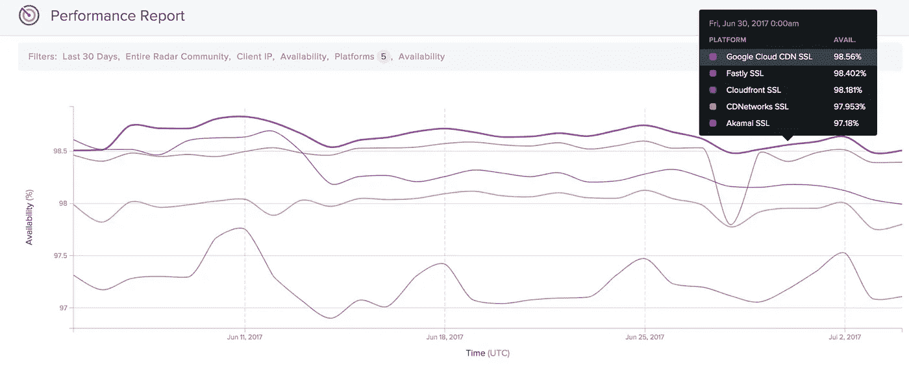

# 谷歌云的 CDN 到底有多好？

> 原文：<https://medium.com/google-cloud/how-good-is-google-clouds-cdn-e181a16f0404?source=collection_archive---------0----------------------->

在之前，我们讨论过[如何扩展负载均衡器，以利用](/@duhroach/removing-the-need-for-caching-servers-with-gcps-load-balancers-ae516497c7fb)[谷歌的 CDN](https://cloud.google.com/cdn/) 。其结果是减少了您的麻烦，并为最终用户提供了更快的读取速度。

一些社交媒体朋友伸出手来说“*这很好，但是谷歌的 CDN 到底有多好呢？*

那是…...事实上，这是一个很好的问题。让我们来看看如何侧写谷歌的 CDN。

忙到没时间看书？看看上面的视频！

# CDN 传输时间

当 CDN 能够在尽可能靠近请求者的地方缓存所请求的资产时，它工作正常。这有两个主要因素:A)是否有效，B)是否在任何地方都有效？

*有用吗*很容易测试。我们简单地在 CDN 上设置一个资产，带有缓存头，并对它发出 500 次左右的 cURL 命令。

当该请求的延迟看起来像下图时，您知道您的 CDN 工作正常。在时间轴的前端有一堆标准请求，(其中延迟与请求者和服务器之间的物理距离有关)，一旦发生缓存，延迟就会显著下降。在这种情况下，缓存结果几乎是即时的:

或许最重要的是，cdn 最大限度地减少了地理差异对获取的影响。这就是为什么“它是否在任何地方都有效”部分同样重要，并且对于我们的目的来说，同样容易测试。

首先，把一个资产放在一个服务器上，比如说，在北美，(可能在一个烧烤餐馆附近)，然后从世界各地的一堆机器上获取这个资产。

下图显示了我们从亚洲、澳大利亚和欧洲的一台机器上获取的资产。

这张图显示了谷歌的 CDN 工作正常，尽管从请求者到服务器的地理距离很远。从这个测试中，我们可以看到性能正在利用 [Google 的 Edge 网络](https://peering.google.com/#/infrastructure)的能力，其中资产被移动到更近的存在点，以供以后读取。

# 获取更多详细信息

对于大多数开发者来说，测试可以止步于上述数据。除了功能上的细微差别之外，大多数公司选择 CDN 是因为它的性能、成本和正常运行时间。但是，由于 cdn 的行为可能会有所不同，我们希望分解我们的请求延迟，并单独查看每个阶段。具体来说，我希望看到 DNS 时间、连接时间和等待时间。

为什么这些事情很重要？

**DNS 时间**:解析主机名所需的时间。DNS 解析对于理解用户性能非常重要，因为最终用户在最后一英里依赖其 ISP 的 DNS 解析器。一些 cdn 的 DNs 设置比其他 cdn 更复杂，这意味着等待时间中获得的时间被较慢的 DNS 响应时间冲淡了。

**连接时间** : Connect 是建立 TCP 连接所需的时间。这取决于网络(端到端延迟)。对于 SSL，还要加上建立加密隧道所需的时间。这里很重要的一点是，如果你的 CDN 容易受到高峰时段的限制，连接时间会显示出来。

**等待时间**:远程服务器处理请求所花费的时间。如果您的内容位于网络边缘(离您很近)，那么这个时间应该非常短，但是，如果内容需要从源服务器获取，这个时间可能会更长。由于其受欢迎程度，如果资产被缓存，CDN 将提供良好的性能。

通过一个方便的 cURL 命令，我们可以获得所有这些数据:

*(注意，这些时间是从连接开始起的绝对时间。为了计算出每个阶段持续的时间，你需要对它们进行适当的排序，然后减去它们！)*

这里真正好的是，我们可以看到，首先，时间与非分离版本相当一致(这意味着我们的分离似乎没有给测试增加太多开销)，其次，总体而言，DNS、连接和预迁移阶段非常快，并且非常一致。这正是我们想要的内容分发网络。

# 我们需要一个更大的测试

现在，一些人指出，我的测试可能不会产生最准确的结果，因为只有一个起始点多次请求相同的资产。没问题，让我们建立一个更大的测试。

为此，一个团队使用了[贝吉塔](https://github.com/tsenart/vegeta)，在[谷歌容器引擎](https://cloud.google.com/container-engine/)上运行，它允许每个 pod 每秒创建 1000 个请求(RPS)，然后迅速扩展到 50，000 个 RPS。以下 Stackdriver 仪表盘显示了云 CDN 如何处理负载:

*   缓存命中率图表紧跟请求图表。
*   延迟持续减少，并在达到其平均后端最小值后保持不变。

注:参见 [Github](https://github.com/GoogleCloudPlatform/serverless-pixel-tracking) 上的类似用例，对[无服务器像素跟踪解决方案](https://cloud.google.com/solutions/serverless-pixel-tracking)进行负载测试。

# 不，不够大。变大。

这很好，但你可能会再次争辩说，这还不够，要真正测试 CDN 的能力，每天需要有数十亿个请求通过它。遗憾的是，我没有一个这么受欢迎的网站，我也没有访问世界上所有其他网站的权限(还没有)，但谢天谢地，Cedexis 的人有。

[Cedexis 雷达社区](https://www.cedexis.com/products/radar/)每天从世界各地的用户那里收集超过 140 亿次真实用户测量。这些数据被聚合并免费提供给雷达社区的所有成员，他们可以近乎实时地看到互联网的状态:全球 cdn、ISP、云的可用性、延迟和吞吐量，以及他们自己的 web 属性。

他们的[报告](https://www.cedexis.com/google-reports/)让你很容易看到你最喜欢的 CDN 在延迟、正常运行时间和吞吐量方面的表现

# 好了，够大了

因此，我们提出了一些方法，你可以向前测试谷歌的 CDN。您不仅可以自己用一个小测试来运行它，还可以扩展到一个 50k 的 RPS 系统，或者只看几个收集 RUM 统计数据的不同小组的性能数据。

找出你的需求，启动测试，看看谷歌的 CDN 是否能帮助你提高终端用户的性能！

# 嘿！听着！

有一些很棒的[工具可以帮助你描述你的网络性能](/@duhroach/tools-to-profile-networking-performance-3141870d5233)。

不要忘记检查您是否为您的 GCP 实例使用了[右区域。](/@duhroach/fixing-regional-networking-performance-ee069a7ae066)

并确保针对您的网络性能使用正确的 [CPU 数量](/@duhroach/core-count-and-the-egress-problem-607fb6b51fa9)。