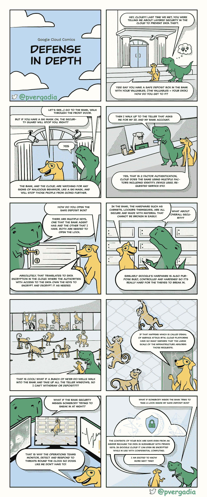
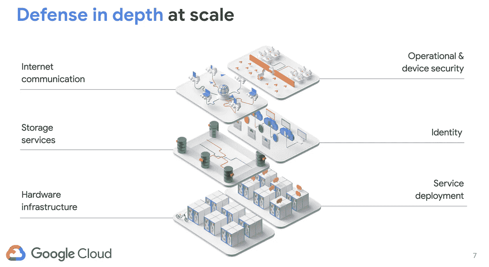

# 谷歌如何提供深度防御？

> 原文：<https://medium.com/google-cloud/how-google-delivers-defense-in-depth-959b97ca782c?source=collection_archive---------2----------------------->

## 什么是纵深防御？

## [GCP 漫画#3:纵深防御](https://gcpcomics.com)

 [## GCP 漫画

### 谷歌云漫画(GCP 漫画)

gcpcomics.com](https://gcpcomics.com/) 

安全是我们时代最大的挑战之一。想象一下，作为谷歌的一部分，服务和保护八个应用程序，每个都有超过 10 亿的用户。谷歌每分钟过滤数以百万计的垃圾信息，每天发现数以千计的可疑网页，并通过可能是世界上最大的专有网络提供几乎难以想象的加密流量。有了谷歌云，你就可以在你的业务和应用中使用这种复杂的安全性。

> 为了帮助创建一个安全的基础，谷歌云采取了深度防御的方法。

在这一期的 [**GCP 漫画**](https://gcpcomics.com/) 中，我们正在报道这一点！我们将深入探讨**防御**，了解谷歌云如何在基础设施中构建多层保护。

给你！请继续阅读，并在下面的评论中分享你的想法。

# 谷歌云的多层防御是如何工作的？

*   硬件由谷歌控制、制造和加固。
*   任何运行在 Google 基础设施上的应用程序二进制文件都是安全部署的。
*   服务之间不存在任何信任假设，并且使用多种机制来建立和维护信任—基础架构从一开始就被设计为多租户。
*   所有身份、用户和服务都经过了严格的身份验证。
*   存储在谷歌基础设施上的数据在静态时会自动加密，并为了可用性和可靠性而分发。
*   通过互联网与谷歌云服务的通信是加密的。
*   基础设施的规模允许吸收许多拒绝服务(DoS)攻击，并且有多层保护进一步降低任何 DDoS 影响的风险。
*   运营团队 24 x 7 x 365 全天候检测威胁并响应事件。

好奇吗？这是一份关于 Google 基础设施设计的白皮书，它非常详细地介绍了所有这些领域。

谷歌如何提供深度防御？

# beyond corp——谷歌应用程序的零信任安全模型

现在，您已经知道 Google Cloud 如何为其基础设施实施深度分层防御，让我们来看看如何在 Google Cloud 上为您自己的应用程序创建相同的零信任模型。

对于你在 Google Cloud 上的应用，可以应用 [BeyondCorp](https://cloud.google.com/beyondcorp) ，这是 Google 对零信任安全模型的实现。其思想是将访问控制从网络边界转移到单个用户和设备。BeyondCorp 允许员工、承包商和其他用户从几乎任何位置更安全地工作，而不需要传统的 VPN。这提供了保护环境中的应用程序和数据所需的访问控制。

# 结论

防御即深度是一个保护您的数据和应用程序的概念。在本文中，我们看到了 Google 如何使用多层防御和在每层应用零信任模型来保护其基础设施。此外，通过应用 BeyondCorp 原则，您可以将访问控制转移到用户而不是网络边界，并保护您的应用和数据。

# 资源

要了解更多关于谷歌云安全的信息，请点击[链接](https://cloud.google.com/security/overview/whitepaper)查看详细的安全白皮书。

想要更多的 GCP 漫画吗？访问 gcpcomics.com&[跟我上](https://gcpcomics.com/)[中](/@pvergadia/)，上[维特](https://twitter.com/pvergadia)别错过下一期！