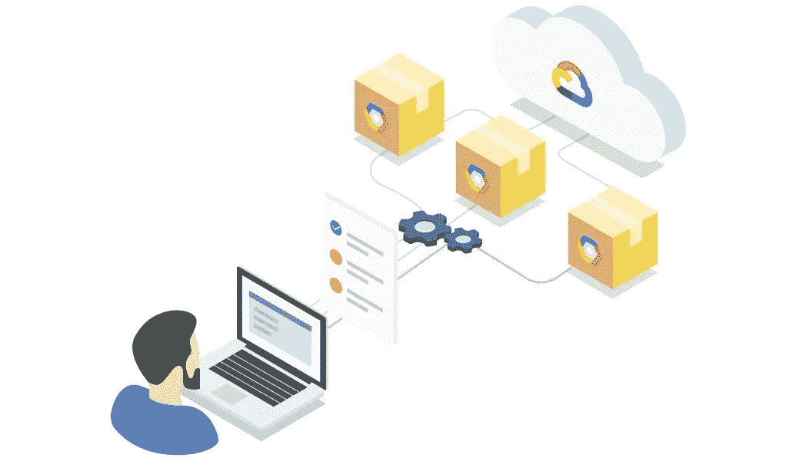
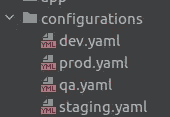
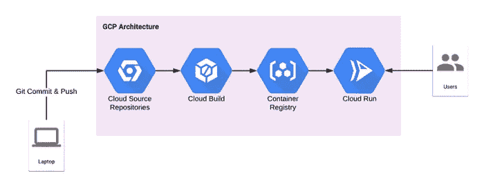

# 我如何在 GCP 上设计 12 因子云原生应用？

> 原文：<https://medium.com/google-cloud/how-i-design-12-factor-cloud-native-app-on-gcp-e0af4fccb1b0?source=collection_archive---------2----------------------->

[12 因素应用](https://12factor.net/)定义了开发和部署 web 应用的方法，尤其是 SaaS(软件即服务)应用。

这些最佳实践基于部署云原生应用程序的几个特定参数:

*   它使用声明式格式来实现安装自动化
*   它与操作系统签订了明确的合同，以便在不同环境之间实现更好的可移植性
*   对于持续部署，它限制了开发和生产之间的差异
*   它允许在不对工具、架构或开发实践进行重大更改的情况下进行伸缩。

12 因素方法与编程语言无关，可以与任何支持服务组合一起使用。

查看 12 因素应用程序的参数，我选择微服务架构来使用 Python、Docker、Git、Cloud Build、Terraform、Pytest、Sphinx 等构建应用程序。因此它将易于扩展、移植和部署。

# 1.代码库

> *在版本控制中跟踪一个代码库，多个部署*

12 因子 app 主张每个应用都应该有自己的代码库。必须避免多个版本的多个代码库，多个应用程序共享相同的代码也违反了 12 因素。

我在 [Git](https://github.com/vikramshinde12/twelve-factor-app) 中维护了代码，也推荐使用 [Gitflow](https://www.atlassian.com/git/tutorials/comparing-workflows/gitflow-workflow) 。

# 2.属国

> 显式声明和隔离依赖项

这个原则认为你永远不应该依赖于系统范围的包的隐含存在。完整和明确的依赖关系规范统一应用于开发和生产。

我在 requirements.txt 文件中维护 python 库依赖关系。当构建代码时，它使用`pip install -r requirements.txt`命令从 pypi 服务器部署 python 库。

# 3.配置

> 在环境中存储配置

应用程序及其配置应该是完全独立的。它因部署(开发、qa、试运行、生产等)而异
配置包括数据库详细信息、连接到外部服务的凭据、主机名等。
这些配置应该与代码分开存储。
**12 因素应用程序将配置存储在环境变量中。**

我在 config/ <environment>文件夹中维护了环境配置。yaml，并在部署时将其设置为环境变量。</environment>

*请注意，不要在代码库中存储凭证和敏感信息。*

# 4.后勤服务

> 将后台服务视为附属资源

后台服务需要网络连接才能像云 SQL、memcached 一样运行。如果此类服务的位置或连接细节发生变化，您不必更改代码。相反，这些细节应该在配置中可用。

*后台服务的附加/分离使得 12 因子 app 松散耦合。*

我在配置中维护了数据库和 Memcached 细节。

# 5.构建、发布、运行

> 严格分离构建和运行阶段

应用程序必须严格区分构建、发布和运行阶段。

*   构建阶段:将代码转换成可执行的包。
*   发布阶段:从构建阶段获取构建包，并与部署的配置相结合，使您的应用程序准备好运行
*   运行阶段:这就像在执行环境中运行你的应用程序。

CI/CD 管道

我在云构建中使用过 Google Cloud 的 CI/CD 管道。
1。基于应用程序代码
2 构建 Docker 映像。将 docker 图像推送到谷歌云储存库
3。将代码部署到云运行中。

# 6.处理

> 将应用程序作为一个或多个无状态进程执行

*所有 12 因素应用都必须是无状态的*这意味着我们想要存储/保存的任何信息都必须通过后端资源来完成，这些资源在运行时附加到应用上。粘性会话，在应用程序进程的内存中缓存用户会话，违反了 12 因素原则。
会话数据应存储在 Memcached 或 Redis 等数据库中。

我使用 GCP memcached 进行缓存。

# 7.端口绑定

> 通过端口绑定导出服务

12 因素应用程序是完全独立的，可以独立运行。web 服务器被打包成一个库，与应用程序捆绑在一起，不需要像 Apache 那样单独的服务器

web 应用程序**通过绑定到端口**将 HTTP 导出为一个服务，并监听来自该端口的请求。

我使用 flask web 框架，它有一个在 5000 端口监听的 gunicorn web 服务器。

# 8.并发

> 通过流程模型向外扩展

12 因素应用原则主张选择水平扩展，而不是垂直扩展。

通过采用容器化，应用程序可以根据需要进行水平扩展。

# 9.一次性

> 快速启动和平稳关闭，最大限度地提高稳定性

在自动化部署环境中，应用程序应该尽可能快地启动和关闭。

启动时间:当您部署新代码时，您希望新版本立即启动，并能够立即处理流量。
正常关闭:如果有任何问题，它应该从进程管理器发送 SIGTERM 信号以正常关闭。

12 因子 app 反对猝死。

*在微服务的部署过程中采用容器化，docker 容器的启动和停止可以瞬间完成。*

我用的是 Cloud Run(无服务器的容器化应用)。

# 10.开发/生产平价

> 让开发、试运行和生产尽可能相似

12 因素应用程序旨在通过缩小开发和生产之间的差距来实现持续部署。

制造的容器可以一次制造并运送到多个目标环境。

此外，我使用 Terraform 作为 IaC 工具来构建基础设施，以便在开发和测试中使用与生产中相同的环境。

# 11.日志

> 将日志视为事件流

日志提供了应用程序的健康状况。将日志的收集处理和分析从应用程序的核心逻辑中分离出来是很重要的。您的应用程序不应该关心这些日志的存储和管理。

通常，日志被写入磁盘上的一个文件中。它应该被视为一个事件流。

我已经使用 google-cloud-logging 库将日志添加到容器化的应用程序中。写入这些受支持位置的容器日志会自动与云运行服务、版本和位置相关联。

# 12.管理流程

每个应用程序在部署时都有一些要运行的管理进程。所有这些过程都应该被签入到源代码库中，以保持跨环境的一致性。

这些通常是一次性的过程，应该与应用程序分离。这些应该是自动化和可重复的，而不是手动的过程。

我们设置了云调度程序，以便定期将数据存储实体备份到云存储中。

这些 12 因素原则成为所有云原生应用的一套通用原则。

**其他未提及但我想补充的因素有**

# 13.自动化测试

自动化测试是 DevOps 方法的重要组成部分。在部署到生产环境之前，它会测试所有的候选版本。建议采用 TDD 方法。

我使用 pytest 来自动化单元测试。

# 14.文件

文档也是开发人员经常忽略的重要部分。代码写一次，多次阅读，所以我们记录的代码是非常需要的。

我将 sphinx 与 GitHub 集成在一起，根据文档字符串自动生成文档。

文件样本【https://twelve-factor-app.readthedocs.io/en/latest/ 

# 15.系统监控

使用 Prometheus、ELK 等工具获取性能指标、系统日志和运行状况检查。
创建监控仪表板并在阈值时获得警报。

这是云原生应用监控系统健康的重要部分。

我使用云操作工具进行监控、警报、调试..

# 16.安全性

安全性也是构建/维护云原生应用的重要方面。保持基于角色的应用程序访问控制，并遵循

***最小特权原则***

还要获取安全审计跟踪。

> 我使用云审计日志来监控“谁在何时访问了什么数据”。

# 结论

12 因素设计帮助您分离应用程序的组件，以便每个组件都可以使用连续部署部署到云，并无缝地扩展或缩减。这些设计原则还有助于最大限度地提高不同环境的可移植性。由于这些因素独立于任何编程语言或软件堆栈，12 因素设计可以应用于各种各样的应用程序，以实现可扩展性、可维护性和可移植性。

# 参考

 [## 十二因素应用程序

### 在现代，软件通常作为服务交付:称为 web 应用程序，或软件即服务。

12factor.net](https://12factor.net/)  [## vikramshinde 12/十二因子 app

### 使用十二因素应用程序方法实现的示例应用程序。GitHub 是超过 5000 万开发者的家园…

github.com](https://github.com/vikramshinde12/twelve-factor-app)  [## 十二因子 app

### 使用十二因素应用程序方法实现的示例应用程序。

十二因子 app.readthedocs.io](https://twelve-factor-app.readthedocs.io/en/latest/)