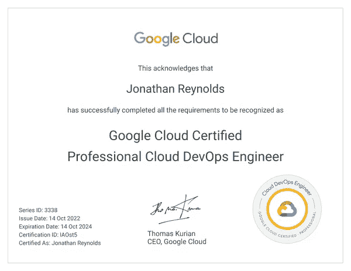
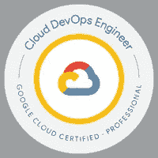

# 我是如何通过谷歌云专业云 DevOps 工程师考试的

> 原文：<https://medium.com/google-cloud/how-i-passed-the-google-cloud-professional-cloud-devops-engineer-exam-44cc6514768c?source=collection_archive---------1----------------------->

照片由[米切尔罗](https://unsplash.com/@mitchel3uo?utm_source=medium&utm_medium=referral)在 [Unsplash](https://unsplash.com?utm_source=medium&utm_medium=referral)

**TL；博士** — *如果你不熟悉谷歌 SRE 原则和云操作套件，你就没有为这次考试做好准备。*

## 为什么我决定获得认证？

正如在[之前的一篇博客文章](/@jreynolds/2022-google-cloud-professional-cloud-developer-certification-review-c6a1e27767dc)中提到的，我已经建立了获得所有可用的 GCP 认证 [11 的个人目标，作为获得更多 GCP 知识的一种方式。虽然我知道证书只是证书，不能代替经验，但我相信它为积累额外的知识提供了坚实的基础。](https://cloud.google.com/certification#why-get-google-cloud-certified)

通过专业云开发人员考试后，专业云开发工程师(PCDE)认证似乎是顺理成章的下一步。我听说 PCDE 实际上是专业的云开发者+ SRE。我也同意这一点。在参加 PCD/PCDE 实践考试时，我注意到两个认证之间有很多重叠。对于已经获得 PCDE 认证的人，我建议他们也尝试 PCD 认证。另一方面，在获得 PCD 后，学习 PCDE 认证也是值得的。

我在一周内参加并通过了这两项考试。

完全透明——我参加 DevOps 认证的尝试是一个月前的重考。

## 我的考试经历

考试形式与其他 GCP 考试相当标准。有 50 个问题需要在 2 小时内完成。每个问题大概有 2 分 24 秒。我提交了考试，大约还有 20 分钟。

我建议不要花太长时间来回答任何特定的问题。如果你发现自己花的时间太长，就把它标记为审阅，然后在提交之前再回来看。通过排除过程，你通常可以在多项选择和多项回答问题中排除至少两个可能的选项。

我对学习的建议是看一看[考试指南](https://cloud.google.com/certification/guides/cloud-devops-engineer),这是对考试内容的一个很好的高层次概述。由于我来自 AWS 背景，参加为 AWS 专业人员设计的[介绍性谷歌云课程](https://www.cloudskillsboost.google/course_templates/38)很有帮助。就我而言，我也会关注下面列出的主题，因为这些都是我在考试中遇到的。你也会想确保阅读免费的谷歌 SRE 在线书籍。对于那些喜欢通过观看视频来学习的人，我**强烈**推荐谷歌云技术 Youtube 页面作为一个完美的起点。

## 远程监考考试提示

就我个人而言，我更喜欢在线参加这些认证考试，而不是去考试中心。我喜欢在自己的空间里的私密性(没有干扰)，喜欢在考试的时候有一个水瓶。我在远程考试中遇到过一些小问题，但是支持团队很棒，我遇到的任何问题都没有影响我考试的剩余时间。我建议您在安排考试前，确保您的麦克风、摄像头和互联网连接都符合必要的系统要求。

## 涵盖的主要主题

对于下面列出的每个主题，我建议对每个项目及其主要特征有一个扎实的理解。

**谷歌云运营套件**

*   **云日志**
*   **云迹**
*   **云廓线仪**
*   **云监控**

**SRE 原则**

*   **设置 SLOs / SLIs**
*   **优化 SLO**

**事故管理及其相关的各种角色**

**使用 GCP 工具实施 CI/CD**

*   **云搭**
*   **二进制授权**
*   **Spinnaker* —** *严格来说不是 GCP 的产品，但你应该明白它的含义*
*   **谷歌 Kubernetes 引擎(GKE)**

**配置日志代理**

*   **Fluentd 插件(它是什么以及如何使用)**

**保护 CI/CD 管道和最小特权原则(IAM)**

**优化应用性能**

**部署策略**

## 资源/学习材料

*   谷歌云技术 Youtube 播放列表— [SRE 实施 DevOps](https://www.youtube.com/watch?v=uTEL8Ff1Zvk&list=PLIivdWyY5sqJrKl7D2u-gmis8h9K66qoj)
*   经由 medium.com 的 [DevOps 考试笔记](https://sathishvj.medium.com/notes-from-my-google-cloud-professional-devops-engineer-certification-exam-60d23aca37f5)
*   谷歌 SRE 圣经—【https://sre.google/books/ 
*   https://grumpygrace.dev/posts/gcp-flowcharts/ GCP 流程图—
*   Google Cloud DevOps 页面—[https://cloud.google.com/devops](https://cloud.google.com/devops)
*   云大师实践考试
*   Whiz 实验室练习考试
*   [面向 AWS 专业人员的谷歌云基础知识](https://www.cloudskillsboost.google/course_templates/38)
*   [可视化谷歌云:云工程师和架构师的 101 个图解参考](https://www.amazon.com/Visualizing-Google-Cloud-Illustrated-References/dp/1119816327)
*   [谷歌云技术 Youtube 页面](https://www.youtube.com/user/googlecloudplatform/videos)
*   [GCP 产品文档](https://cloud.google.com/products)