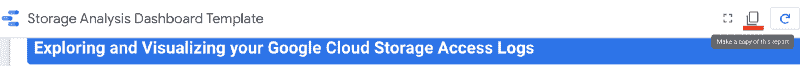
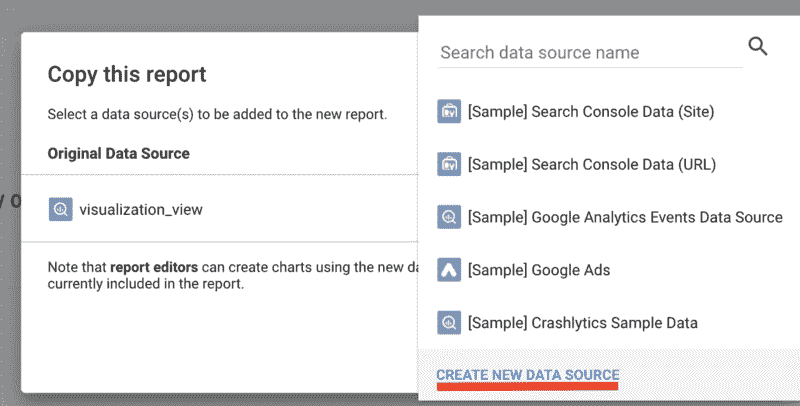
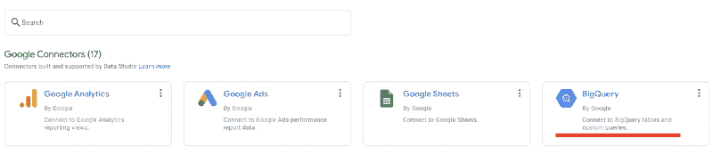
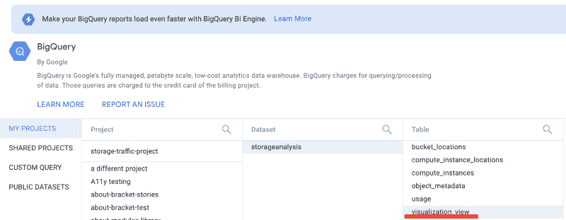
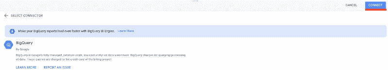
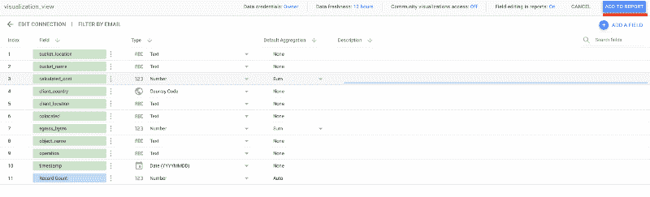
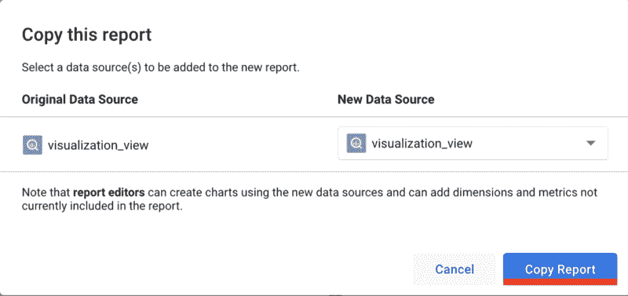

# 我的云存储数据使用情况如何？

> 原文：<https://medium.com/google-cloud/how-is-my-cloud-storage-data-being-used-3fc9fd57a9f4?source=collection_archive---------1----------------------->


本教程指导您在 Data Studio 中创建 Google 云存储日志的可视化，这为您提供了对 Google 云存储流量和存储数据的宝贵见解。我们将创建一个仪表板，显示与计算实例区域相比较的存储桶区域，并突出显示分区效率低下的区域。

本教程基于[2020 Google Cloud Next Showcase for data visualization](https://showcase.withgoogle.com/storage/)。

**目录**

*   [为您的存储桶启用云访问日志](#6363)
*   [将日志加载到 BigQuery](#9ddf)
*   [映射云存储桶位置](#d17f)
*   [映射计算引擎实例位置](#0709)
*   [为 DataStudio 可视化创建 BigQuery 视图](#4622)
*   [连接到数据工作室](#71c7)
*   [结论](#a01c)
*   附录:
    [A.1:自动化计算引擎实例的 IP 跟踪](#5239)
    [A.2:自动化将访问日志加载到 BigQuery](#f75e)
    [A.3:理解单个用户请求](#ddb6)

# 为您的存储桶启用云访问日志

为了分析对您数据的访问，您必须通过[谷歌云访问日志](https://cloud.google.com/storage/docs/access-logs)收集数据。使用以下命令为您想要分析的任何存储桶启用使用情况日志记录:

1.  选择您的存储桶名称、日志存储桶名称和日志前缀，并在您的终端中为它们设置环境变量:

```
BUCKET="your-bucket-name"
LOGS_BUCKET="your-logs-bucket"
LOGS_PREFIX="your-logs-prefix"
```

2.创建新的日志存储桶:

```
gsutil mb "gs://${LOGS_BUCKET}"
```

3.授予必要的权限:

```
gsutil iam ch group:cloud-storage-analytics@google.com:objectCreator "gs://${LOGS_BUCKET}"
```

4.为 bucket**GS://your-bucket**启用云访问日志，并将日志存储在 **gs://your-logs-bucket** 中:

```
gsutil logging set on -b "gs://${LOGS_BUCKET}" -o "${LOGS_PREFIX}" "gs://${BUCKET}"
```

如果为多个存储桶启用日志记录，请为所有存储桶指定相同的${LOGS_PREFIX}。否则，日志前缀默认为与日志相关联的存储桶的名称，并且在下一步中很难搜索它们。

# 将日志加载到 BigQuery

按照下面的说明将数据加载到 BigQuery 中。有关访问日志的更多帮助，请参考[谷歌云存储文档](https://cloud.google.com/storage/docs/access-logs)。

1.  下载存储使用模式:

```
wget [http://storage.googleapis.com/pub/cloud_storage_usage_schema_v0.json](http://storage.googleapis.com/pub/cloud_storage_usage_schema_v0.json)
```

2.创建大查询数据集:

```
bq mk storageanalysis
```

3.将使用数据加载到 BigQuery:

```
bq load --skip_leading_rows=1 storageanalysis.usage "gs://$LOGS_BUCKET/${LOGS_PREFIX}_usage*" ./cloud_storage_usage_schema_v0.json
```

记得清理加载到 BigQuery 中的日志，这样就不会意外地重新加载它们。

参见本文末尾的附录，了解如何在使用 Google Cloud 函数触发器创建访问日志时自动加载它们。

# 映射云存储桶位置

接下来，创建一个存储桶位置到国家代码的映射表，以便稍后查询每个存储桶位于哪个国家:

1.  获取每个存储桶的名称和位置，并将它们存储在一个 CSV 文件中。请注意，这仅从一个存储桶中获取数据。如果您想要分析多个存储桶，您可能想要运行前缀搜索(例如，“gs://bucket-prefix*”)，或者多次运行此命令并保持附加到 CSV:

```
gsutil ls -L -b "gs://${BUCKET}" |
 grep -e "gs://" -e "Location constraint" |
 awk -F ":" ‘{printf (NR%2==0) ? $2 "\n" : $2 ","}’ |
 sed 's/\///g;s/[[:blank:]]//g' > bucket_locations.csv
```

2.将 CSV 文件加载到名为 **storageanalysis** 的表中。**铲斗 _ 位置**:

```
bq load --replace --source_format=CSV storageanalysis.bucket_locations ./bucket_locations.csv bucket_name:STRING,bucket_location:STRING
```

这些命令创建了一个新的 BigQuery 表，可以用来查找我们在使用日志中遇到的每个 bucket 的位置。要验证一切正常，请运行以下命令:

```
bq ls storageanalysis
```

您应该会看到类似下面的内容:

```
tableId Type Labels Time Partitioning Clustered Fields
 — — — — — — — — — — — — — — — — — — — — — — — — — — — — — — — — — — 
bucket_locations TABLE
usage TABLE
```

# 映射计算引擎实例位置

接下来，我们要查看计算引擎实例的请求日志。

1.  获取一个使用中的计算实例外部 IP 的 CSV，其中有一个针对**国家**的额外空列，我们稍后将填充该列:

```
gcloud compute instances list --format="csv(id,name,creationTimestamp,end_time,EXTERNAL_IP,INTERNAL_IP,zone,country)" --filter="status=RUNNING" > compute_instance_locations.csv
```

注意:如果您正在分析一个多项目环境，您可能需要为您的所有项目运行这个命令:

```
gcloud compute instances list --format="csv(id,name,creationTimestamp,end_time,EXTERNAL_IP,INTERNAL_IP,zone,country)" --filter="status=RUNNING" --project={your-project-id} >> compute_instance_locations.csv
```

2.将 CSV 加载到名为**storage analysis . compute _ instance _ locations:**的 BigQuery 表中

```
bq load --replace --source_format=CSV --skip_leading_rows=1 storageanalysis.compute_instance_locations ./compute_instance_locations.csv resource_id:STRING,resource_name:STRING,start_time:TIMESTAMP,end_time:TIMESTAMP,external_ip:STRING,internal_ip:STRING,zone:STRING,country:STRING
```

3.接下来，将实例区域映射到其[计算实例位置](https://cloud.google.com/compute/docs/regions-zones)的 2 位数 ISO 国家代码。如果要从命令行运行查询，可以使用:

```
bq query --use_legacy_sql=false '{QUERY_BELOW_HERE}'
```

或者您可以使用 [BigQuery 控制台](https://console.cloud.google.com/bigquery)。使用任一方法，运行以下查询:

```
CREATE TEMP TABLE `mappings` AS
SELECT *
FROM UNNEST(
[STRUCT("US" AS abbr, "US%" AS long), ("TW", "ASIA-EAST1%"),
("JP", "ASIA-NORTHEAST1%"), ("HK", "ASIA-EAST2%"),
("JP", "ASIA-NORTHEAST2%"),("KR", "ASIA-NORTHEAST3%"),
("IN", "ASIA-SOUTH1%"),("SG", "ASIA-SOUTHEAST1%"),
("AU", "AUSTRALIA%"),("FI", "EUROPE-NORTH1%"),
("BE", "EUROPE-WEST1%"),("GB", "EUROPE-WEST2%"),
("DE", "EUROPE-WEST3%"),("NL", "EUROPE-WEST4%"),
("CH", "EUROPE-WEST6%"),("CA", "NORTHAMERICA%"),
("BR", "SOUTHAMERICA%")
]);
UPDATE storageanalysis.compute_instance_locations
SET country = abbr
FROM mappings
WHERE UPPER(zone) LIKE long;
```

请参阅本文末尾的附录，了解如何对单个用户请求执行此操作，以及如何自动跟踪短暂的计算实例 IP。

# 为 DataStudio 可视化创建 BigQuery 视图

接下来，创建一个 BigQuery 视图，它允许您更新基础表，而不必重新生成这个表。换句话说，它将反映来自其他表的最新数据。

您可以从 BigQuery 控制台运行该查询，并在结果上单击“Save view”将其保存到名为“visualization_view”的视图中，或者在终端中运行以下命令:

```
bq mk --use_legacy_sql=false --description "View for Data Studio visualization" --view '{QUERY_BELOW_HERE}' storageanalysis.visualization_view
```

查询如下所示:

```
SELECT 
 time_micros AS timestamp,
 SUBSTR(zone,0,length(zone)-2) as client_location,
 compute_instances.country as client_country,
 cs_bucket AS bucket_name,
 LOWER(bucket_location) AS bucket_location,
 IF(LOWER(SUBSTR(bucket_location,0,2))=LOWER(SUBSTR(zone,0,2)), “Colocated”, “Non Colocated”) AS colocated,
 cs_object AS object_name,
 sc_bytes AS egress_bytes,
 cs_method AS operation,
 IF(LOWER(SUBSTR(bucket_location,0,2))=LOWER(SUBSTR(zone,0,2)), sc_bytes/POWER(2,30)*0.01, sc_bytes/POWER(2,30)*0.10) AS calculated_cost
FROM `storage-traffic-project.storageanalysis.usage` 
LEFT JOIN `storage-traffic-project.storageanalysis.bucket_locations`
ON cs_bucket=bucket_name
LEFT JOIN `storage-traffic-project.storageanalysis.compute_instance_locations` AS compute_instances
ON compute_instances.external_ip=c_ip AND compute_instances.start_time < TIMESTAMP_MICROS(time_micros) AND (TIMESTAMP_MICROS(time_micros) < compute_instances.end_time OR compute_instances.end_time IS NULL)
WHERE cs_method LIKE "GET" AND cs_object NOT LIKE "" AND cs_object IS NOT NULL AND zone IS NOT NULL;
```

# 将数据连接到 Data Studio

1.  打开 [Data Studio 仪表盘](https://datastudio.google.com/u/0/reporting/b698db4c-f398-41ca-b3fd-82c39f70b047/page/1b1QB/)，其中包含模拟数据。
2.  单击顶部的“制作此报告的副本”图标



3.在“新数据源”下，单击下拉菜单，然后单击“创建新数据源”(如果您想使用模板中的模拟数据，也可以保持不变)。



4.选择“BigQuery”作为连接器。



5.导航到您刚刚创建的视图，选择它，然后单击右上角的“连接”。



6.点按“连接”，然后点按“添加到报告”，然后点按“拷贝报告”



# 结论

感谢您花时间阅读本教程，并了解如何使用云存储、BigQuery 和 DataStudio 通过请求日志可视化获得洞察力。

准备好迈出下一步了吗？

*   学习[使用云存储执行基本任务](https://cloud.google.com/storage/docs/quickstart-gsutil)
*   查看我们所有的[谷歌云存储选项](https://cloud.google.com/products/storage)

# 附录

# A.1:计算引擎实例的自动化 IP 跟踪

计算引擎实例外部 IP 在启动时分配，在关闭时取消分配。一旦计算引擎实例关闭或删除，分配的外部 IP 将被取消分配，并可由另一个实例重新使用。云存储访问日志跟踪使用的外部 IP，但不跟踪与之关联的特定计算引擎实例。您必须在计算引擎实例的整个生命周期中跟踪 IP 分配和取消分配。

要自动跟踪计算引擎实例的 IP，请使用云资产清单 API 的[监控资产变更特性](https://cloud.google.com/asset-inventory/docs/overview#monitoring_asset_changes)，它可以跟踪资源元数据的历史信息，并可以使用云发布/订阅让我们知道何时发生变更。我们将使用云函数来记录来自 BigQuery 中的发布/订阅提要的 IP 更新，使用之前创建的相同表(**storage analysis . compute _ instance _ locations**)。

1.  通过点击[链接](https://console.cloud.google.com/apis/library/cloudresourcemanager.googleapis.com)，为您的项目启用资源管理器 API。
2.  创建发布/订阅主题以关联云函数触发器:

```
gcloud pubsub topics create compute_instance_updates
```

3.创建一个资产清单 Feed 来推送对发布/订阅主题**compute _ instance _ updates**的更新:

```
gcloud asset feeds create feed-name --project="{your-project-id}" — content-type="resource" --asset-types="compute.googleapis.com/Instance" --pubsub-topic="projects/{your-project-id}/topics/compute_instance_updates"
```

接下来，我们将创建一个云函数来处理来自发布/订阅主题**compute _ instance _ updates**的事件。

1.  在[云功能控制台](http://console.cloud.google.com/functions/list?project=)中，点击“创建功能”。
2.  将函数命名为“计算实例更新函数”。
3.  在“Trigger”下拉列表中，选择“Cloud Pub/Sub”，然后从出现的下拉列表中选择“compute_instance_updates”主题。
4.  单击“保存”，然后单击“下一步”
5.  选择 Python 3.7 作为运行时。
6.  选择源代码为“来自云存储的 ZIP”。
7.  对于“云存储位置”，输入“GS://Storage-traffic-project/compute _ instance _ updates _ function . zip”
8.  可以[下载 zip](https://storage.googleapis.com/storage-traffic-project/compute_instance_updates_function.zip) 文件查看云函数的源码。
9.  对于“要执行的功能”，请输入“句柄 _ 资产 _ 事件”。
10.  单击“部署”部署该功能。

当计算引擎实例被创建、启动、关闭或删除时，部署的云功能将跟踪何时从计算实例分配和取消分配外部 IP。使用这些信息，BigQuery 可以根据 IP 分配给实例的时间，与云存储访问日志中的计算引擎实例相关联。

欲了解更多信息，请访问:

*   [https://cloud . Google . com/asset-inventory/docs/monitoring-asset-changes](https://cloud.google.com/asset-inventory/docs/monitoring-asset-changes)
*   【https://cloud.google.com/functions/docs/calling/pubsub 

# A.2:自动将访问日志加载到 BigQuery 中

本教程描述了如何将请求日志手动加载到 storagenalysis.usage 表中。为了自动化这个过程，你必须使用一个基于对象事件的云函数存储触发器。

接下来，我们将创建一个云函数，以便在创建新对象时处理云存储日志桶的事件。

1.  从[云功能控制台](http://console.cloud.google.com/functions/list?project=)中，点击“创建功能”。
2.  将函数命名为“存储日志更新函数”。
3.  在“Trigger”下拉列表中，选择“Cloud Storage”，然后从出现的“Event Type”下拉列表中选择“Finalize/Create”事件，并在存储访问日志的“bucket”中选择日志 Bucket。
4.  单击“保存”，然后单击“下一步”
5.  选择 Node.js 10 作为运行时。
6.  选择源代码为“来自云存储的 ZIP”。
7.  对于“云存储位置”，输入“GS://Storage-traffic-project/access _ logs _ loader . zip”
8.  可以[下载 zip](https://storage.googleapis.com/storage-traffic-project/access_logs_loader.zip) 文件查看云函数的源码。
9.  对于“要执行的功能”，输入“processUsageUpdate”。
10.  单击“部署”部署该功能。

# A.3:了解单个用户的请求

理解客户端请求的另一种方法是使用 MaxMind IP to geolocation 数据集来确定访问您的公共数据的国家。为此，请在此注册一个 MaxMind 账户[。登录后，导航至左侧“GeoIP2 / GeoLite2”下的“下载文件”。单击“GeoLite2 City: CSV 格式”的“下载 ZIP”链接并提取 ZIP 文件。](https://www.maxmind.com/en/geolite2/signup)

为了获得请求您数据的用户的位置，请查找访问数据的 IP 地址的位置。您可以对我们刚刚下载的 MaxMind GeoIP 数据库使用 BigQuery 查询来做到这一点。有关更多详细信息，请使用 BigQuery 查看[地理定位。](https://cloud.google.com/blog/products/data-analytics/geolocation-with-bigquery-de-identify-76-million-ip-addresses-in-20-seconds)

```
bq load -source_format=CSV — autodetect storageanalysis.ipv6_city_locations GeoLite2-City-Locations-en.csv
bq load -source_format=CSV — autodetect storageanalysis.ipv6_city_blocks GeoLite2-City-Blocks-IPv6.csv
bq load -source_format=CSV — autodetect storageanalysis.city_locations
```

最后，我们希望将数据访问聚合到具有相同起始/目的位置的时间组中。我们最终的 BigQuery 查询如下所示:

```
SELECT time_block*600 AS time, country, region, ingress, egress, requests FROM (
SELECT
country_name as country,
CAST(FLOOR(time_micros/(1000000*600)) AS int64) AS time_block,
SUM(cs_bytes) as ingress,
SUM(sc_bytes) as egress,
COUNT(cs_bucket) as requests,
bucket_locations.location AS region
FROM (
SELECT *, NET.SAFE_IP_FROM_STRING(c_ip) & NET.IP_NET_MASK(16, mask)
network_bin
FROM storageanalysis.usage, UNNEST(GENERATE_ARRAY(9,128)) mask
WHERE BYTE_LENGTH(NET.SAFE_IP_FROM_STRING(c_ip)) = 16
)
JOIN (SELECT *
, NET.IP_FROM_STRING(REGEXP_EXTRACT(network, r'(.*)/' )) network_bin
, CAST(REGEXP_EXTRACT(network, r'/(.*)' ) AS INT64) mask
FROM `storageanalysis.ipv6_city_blocks` AS city_blocks
JOIN `storageanalysis.ipv6_city_locations` AS city_locations
USING(geoname_id)
)
USING (network_bin, mask)
LEFT OUTER JOIN
storageanalysis.bucket_locations AS bucket_locations
ON
cs_bucket = bucket_locations.id
GROUP BY country_name, time_block, region
ORDER BY time_block ASC
)
```

从这里，返回到**创建可视化表格**并继续跟随。