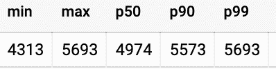

# Google Dataflow“实时”挑选和处理发布/订阅消息需要多长时间？

> 原文：<https://medium.com/google-cloud/how-long-does-google-dataflow-pick-and-process-pub-sub-messages-in-real-time-8ac19da774a2?source=collection_archive---------1----------------------->

**(一项测试及其结果)**

**简介**

组织使用 Google Dataflow 来处理数据并将其提供给物联网设备，以控制或监控设备。不同的用例需要不同的延迟。这个测试试图了解在给定的测试环境中，Google Dataflow 选择并开始处理每个 Pub/Sub 元素需要多长时间。

*快速声明:这绝不是基线评估。*

**测试概述**

测试步骤:

1.  创建一个发布/订阅主题，并将数据作为模拟流数据发送到该主题。数据内容是消息发布时的时间戳。
2.  数据流从发布/订阅中读取，处理每个元素，将处理时间戳写入 BigQuery。如果不想直接写入 BigQuery，可以写入 StackDriver 日志，稍后为日志创建一个 sink。
3.  对于延迟计算，请在 BigQuery 中运行时差查询。

测试环境:Python。

测试架构:


测试详细步骤:

1.  如果您还没有设置 python 运行环境来运行数据流作业，请参考此[链接](https://cloud.google.com/dataflow/docs/quickstarts/quickstart-python)并进行设置。

2.向发布/订阅主题发送模拟流数据:

```
# create a test topic
gcloud pubsub topics create TOPIC_NAME# use gcloud scheduler to run publisher job every second (mock stream data) that contains the timestamp when publish job run
gcloud scheduler jobs create pubsub publisher-job \
- schedule="* * * * *" \
- topic=TOPIC_NAME - message-body=`date +%s`
```

3.数据流处理并将信息记录到 BigQuery 中:

为了记录获取发布/订阅数据元素的时间，我们保存了*光束。DoFn.TimestampParam* 值。

```
class LatencyFn(beam.DoFn):
  def process(self, element, publish_time=beam.DoFn.TimestampParam):
    yield {
      "msg_publish_time": json.loads(element),
      "msg_process_time": round(time.mktime(dt.datetime.now().timetuple()))
  }
```

然后将时间信息写入 BigQuery 表。片段如下:

```
def run(input_topic, output_topic, pipeline_args=None):    
    pipeline_options = PipelineOptions(
        pipeline_args, streaming=True, save_main_session=True
    )
    with beam.Pipeline(options=pipeline_options) as p:
        msg = (p | "ReadPubSubMsg" >>        
                     beam.io.ReadFromPubSub(topic=input_topic)
                 | "GetMsgInfo" >> beam.ParDo(LatencyFn())
        )
        msg | 'WriteBQ' >> beam.io.WriteToBigQuery(                                
          table = 'test.test_latency_info',
          schema = 'msg_publish_time:STRING, 
                    msg_process_time:STRING',          
          create_disposition =
              beam.io.BigQueryDisposition.CREATE_IF_NEEDED,   
          write_disposition = 
              beam.io.BigQueryDisposition.WRITE_APPEND
        )
    ...
```

4.从控制台部署数据流作业。

```
python test.py - project=PROJECT_NAME - job_name=test - input_topic=projects/PROJECT_NAME/topics/TOPIC_NAME - runner=DirectRunner
```

5.一旦数据流开始运行，它将读取每个发布/订阅消息，并将时间信息写入 BigQuery 表。

6.转到 BigQuery 并分析查询中记录的数据，如:

```
SELECT
  MIN(latency) as min,
  MAX(latency) as max,
  approx_quantiles(latency, 100)[offset(50)] as p50,
  approx_quantiles(latency, 100)[offset(90)] as p90,
  approx_quantiles(latency, 100)[offset(99)] as p99
FROM
  (SELECT cast(msg_process_time as int64) - cast(msg_publish_time as int64) AS latency
  FROM `PROJECT_ID.DATASET_ID.TABLE_ID`)
```

**测试结果:**

从云调度程序向发布/订阅发送数据的时间，到发布/订阅处理数据元素的时间，上述查询以毫秒为单位显示了以下结果:



为了呈现信息，我们可以将延迟信息添加到(比如说)Data Studio 中，以便可视化和进一步深入。它有助于直观地识别异常的延迟峰值。

这个流程可以扩展到尽可能多的数据流处理步骤。