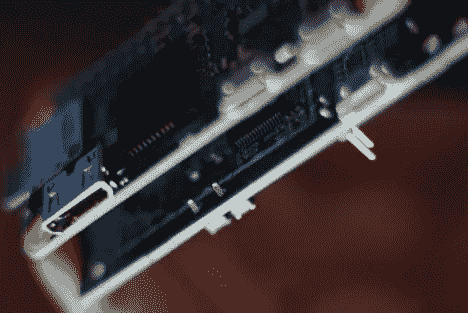
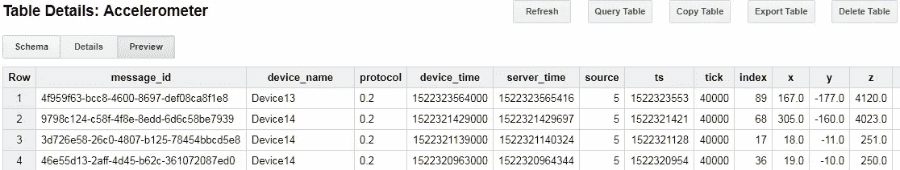

# 谷歌云上的大规模物联网

> 原文：<https://medium.com/google-cloud/how-much-does-iot-on-google-cloud-cost-at-scale-58d7227b1bba?source=collection_archive---------2----------------------->

# **如何在重大投资前核实物联网成本**

1.10 美元的硬件？

2.安全 TLS 1.2 还是 1.3？

3.Unix 时间戳& PTP 原子钟？

4.云 OPEX 低于 10 美分/月？

## 迭代 1

从工业设施中获取干净数据所需的*绝对值*最小值*云和硬件是多少？*

ARM M3 是可行的(见图)，但我们需要消除闪存(背面的跳线)，并重新在 C 和汇编代码。TLS 1.2 可以，但联系了 ARM Holdings，以便将 TLS 1.3 纳入 M3 Cortex 产品组合。

没有空间留给边缘分析——但 3 个哑传感器工作正常。遗留 WiFi 芯片没有 SNI；超时连接到现场的热点是没有用的。用于**1 个 io 设备；总云 OPEX 每台设备每月 5 美分。**

第一次迭代 ARM M3 设备，第二次迭代 ARM M4 传感器和 R Pi 零

## 迭代 2

**建设工业物联网数据科学实验室**

大多数传感器位于蓝色电路板的顶部，大约火柴盒大小

12 个带滤波器的传感器(FFT、FiR、LMS)可以奈奎斯特采样速率测量三相电。80 亿行数据(n1-highmem-96)，每个数据点都经过哈希处理。

**在实验室的工作台上:** ST Micro，松下，Silicon Labs，Bosch，AMS，Microchip 然后缩小成一块板叠在 R Pi Zero 上。

OPEX 云成本

## 费用

BigQuery 每月 570 美元。在数据科学阶段之后，BigQuery 只是为了实验室使用而缩小规模。Prod 每月花费 410 美元。成本证明是线性的或更低(2 个虚拟机可以很好地处理 2000 块板)。马尔可夫，k-Means 以后可以直接在管道中运行(不需要存储)，只需要在源头提取数据值。

***数据科学家:“它就像一台数码联合收割机！”***

数据科学的关键是延迟-每条消息都有 3 个时间戳，与同一时刻世界不同地方的其他传感器或设备集群相关联

在几周内，从美国、欧盟和亚洲的站点收集了 830 兆行加速度计数据点

[数据科学家以低廉的成本按需获得海量计算能力](https://www.youtube.com/watch?v=rOOQ-A22TBU)而且永远不需要下载数据。设备从世界各地以低延迟传输，同步到 NTP 或 PTP。

压力测试下物联网的 1 天数据

# 迭代 3

移除 R Pi Zero，将微服务器集成到 SoC 上，进行[系统加固](https://www.youtube.com/watch?v=ni8SAEhzbDs)。扩展到每天 1 亿兆数据点。添加硬件安全加速器。

## 在第二次迭代中吸取的经验教训:

1.每月使用 90 亿行数据进行数据科学研究*需要分析能力——即使使用高内存 GPU 虚拟机。收集机器学习标签，以便稍后转移到 Edge TPUs。*

*2.尝试[供应](https://cloud.google.com/iot/docs/how-tos/credentials/verifying-credentials)像[这个](https://cloud.google.com/iot/docs/how-tos/credentials/keys)用于密钥和[这个](https://cloud.google.com/iot/docs/how-tos/credentials/jwts)用于代币。[数据编辑和标记化](https://www.youtube.com/watch?v=GArEb2e9jGk)可以提前计划。*

*3.验证每个业务案例在第一年的每单位利润是否超过 5 美元。工厂的预测性维护，工业场所的实时保险调整。*

*4.经过认证的工业模块的生产成本为 110 美元，允许在不到五分钟的时间内对工厂和其他设施进行改造。他们可以很快适应接受来自 OEM 产品的接口，对云几乎没有改变*(云“发布”它得到的任何东西；你可以在 AWS 上使用 Kafka / Lambda，但是它的配置和安全要复杂得多。**

*5.一旦机器学习迁移到边缘，数据速率会下降到 10kbps 的上行链路。现场测试装置[的更多细节请点击](/@nickord/eon-blockchain-patent-ep3512228-6b403ad0b1dd)。*

**

**我可以推荐实验室方法:制药公司多年来一直在研究丛林中的原材料，却不知道它们究竟能合成什么样的医药产品。**

**对于数据来说也是如此——然而，行业仍然期待前期商业案例中的坏数据能创造奇迹。如果 3 星厨师有很棒的厨房(平台)但原料是垃圾，他们就不会做饭。**

****“看来行业级别的硬件工程师不包括未来的客户——数据科学家”*** *高级数据科学家。**

*在 Azure / AWS 上试过这个——成本失败 [*(另见 HFT 盖伊观点*](https://thehftguy.com/2016/11/18/google-cloud-is-50-cheaper-than-aws/) *)* 延迟，易于实现，缺乏机器学习，安全性。谷歌以 30 亿安卓手机实时做数据为核心业务。也许这就是原因？*