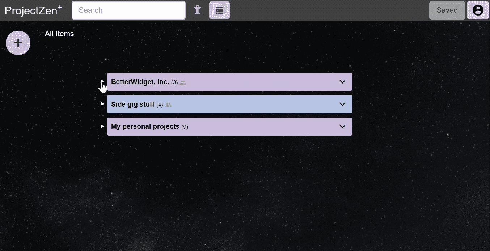
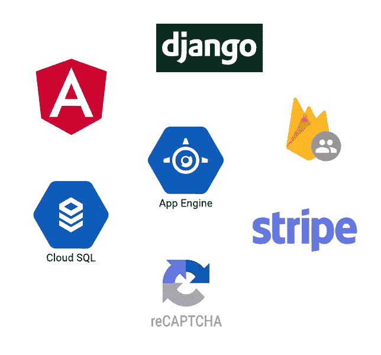

# 优雅的协作工具 ProjectZen 如何使用谷歌云平台

> 原文：<https://medium.com/google-cloud/how-projectzen-an-open-source-collaboration-tool-uses-gcp-c806e5ead54d?source=collection_archive---------5----------------------->

ProjectZen 将简单放在首位。该工具将稀疏极简主义与无限嵌套相结合，使团队能够管理复杂的项目，同时保持快速和敏捷。ProjectZen 倡导简单性和清晰模块化的目标使谷歌云平台成为基础设施的自然选择。在这里，我将描述一些使用 GCP 从零开始构建这个 SaaS 产品的工具。

为 ProjectZen 开发一个初始 MVP 涉及到许多关键的决策。重点是尽可能选择 GCP 生态系统中最受欢迎的工具。PZ 的栈包括 Google Cloud SQL，Django 用 Python 2.7 做后端，Angular 4 做前端 JavaScript 框架，Firebase 认证，Google App Engine/Python 做部署。此外，Stripe 还被用作支付系统，Google reCAPTCHA 用于创建安全账户。

之所以选择 GCP，很大程度上是因为它有一个干净的、相对直观的工具生态系统，这些工具能够正常工作。在资源有限的情况下，当组件莫名其妙地出现故障或无法直观启动和运行时，花费在支持上的时间所带来的持续高成本是不可能的。使用 Django 作为后端的 Cloud SQL 和 App Engine/Python 2.7 之所以被选中，主要是因为这两个工具都很受欢迎，Angular 是基于对第三方树库的需求而添加的，用于动画显示应用程序中的嵌套结构。Angular 之所以被选中，部分原因是因为它决定致力于谷歌生态系统，但也是因为 Angular 强调模块化是一个核心组织原则。Stripe 作为支付系统是一个容易的选择；它经过了很好的评审、润色，并且集成起来很快。

在一个快速产品开发和昂贵工程师的世界里，工程时间成本和发布延迟必须被认真对待。在我看来，有时比采用特定解决方案的可量化前期成本更重要。总的来说，我很高兴在 PZ 的开发中贯彻这一理念，因为这有助于快速构建客户可以看到和使用的功能性端到端产品。

尽管集成不同的基础设施组件(即使是在云中)既是一门科学，也是一门艺术，但 GCP 相对快速的设置和高质量的教程还是帮了大忙。这不仅改进了我们自己的开发，也帮助 PZ 为我们的用户提供了类似的体验。

总的来说，使用 GCP 的生态系统建立一个动态的应用程序绝对是一次学习的经历，但最终也是一次成功和富有成效的经历。我们希望我们的投资不仅能激励我们的用户和贡献者，还能激励其他希望创建自己激动人心的项目的开发者。