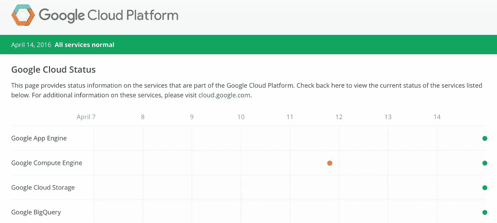

# 谷歌云有多可靠？

> 原文：<https://medium.com/google-cloud/how-reliable-is-google-cloud-4d219a4f7e56?source=collection_archive---------0----------------------->

没有什么是 100%可靠的。在设计应用程序架构时，您必须假设会有失败。过去，这意味着跨机架、房间和数据中心进行部署，以确保本地交换机、电源和地理事故不会影响您的整个基础架构。

在云上部署时，这意味着跨区域和地区部署。一个区域应该与…