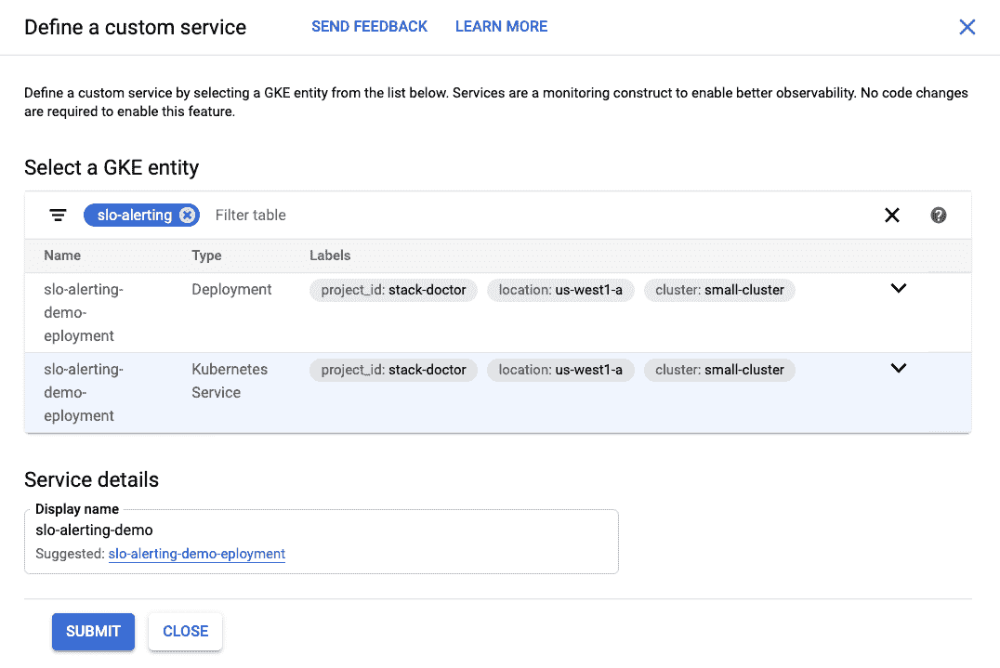
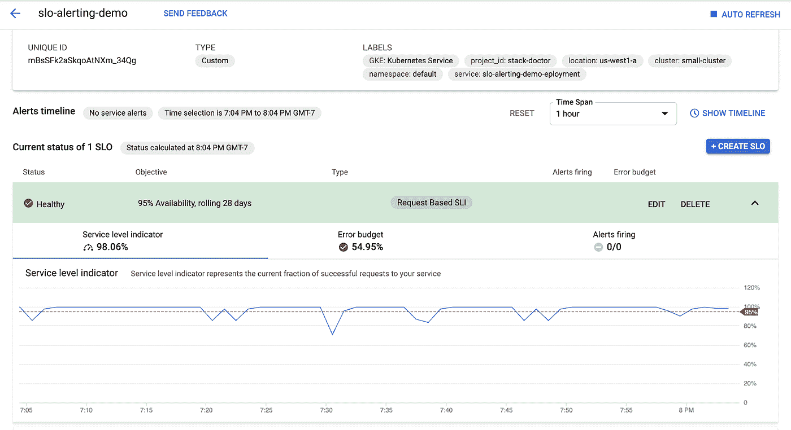
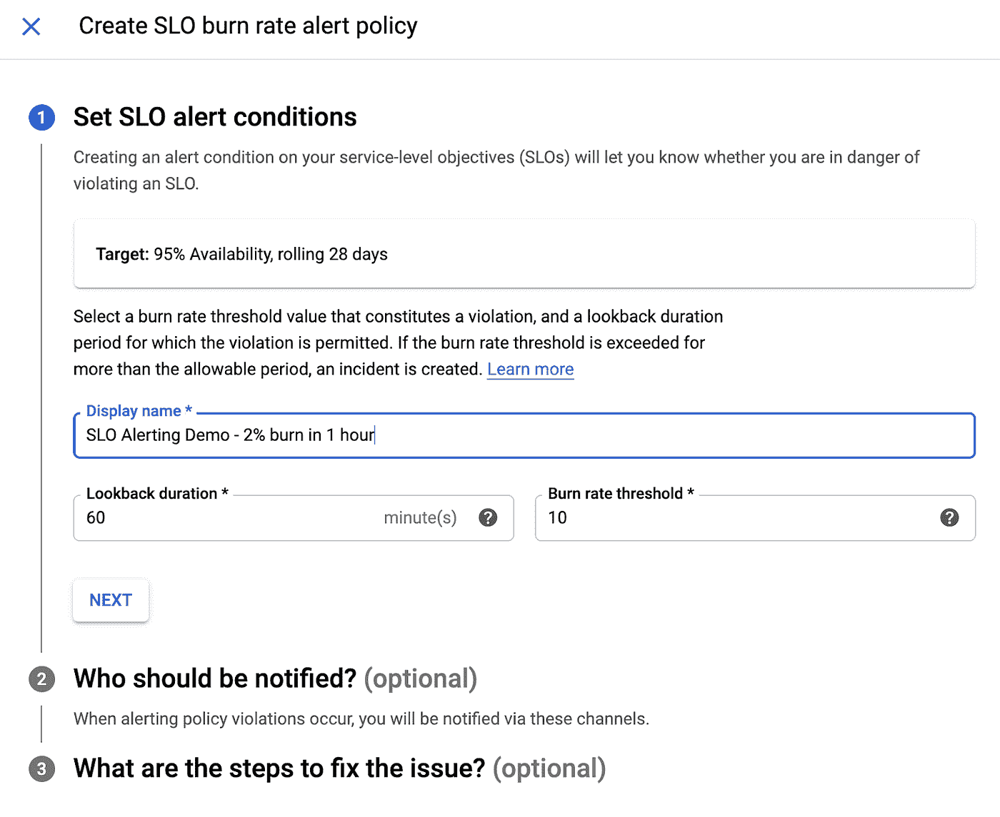
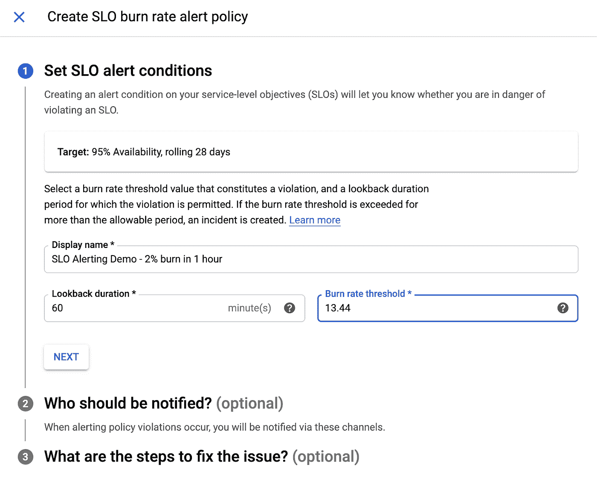
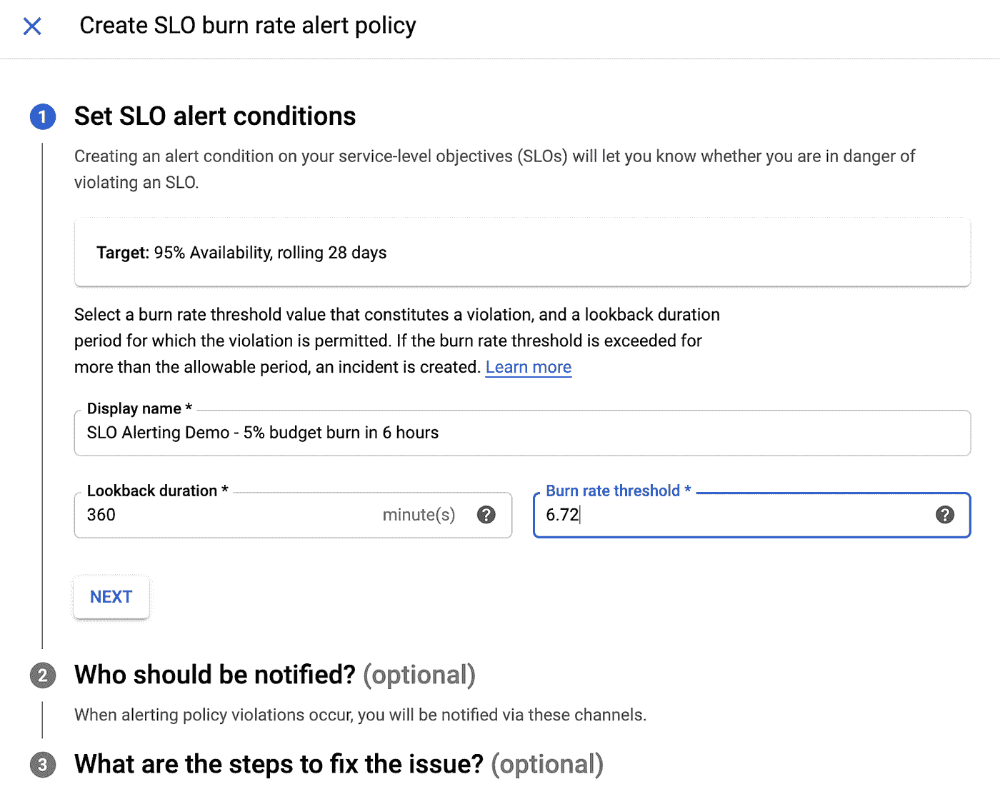
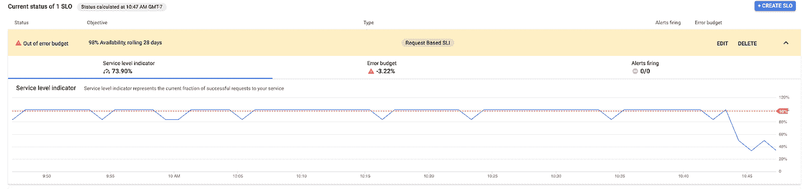
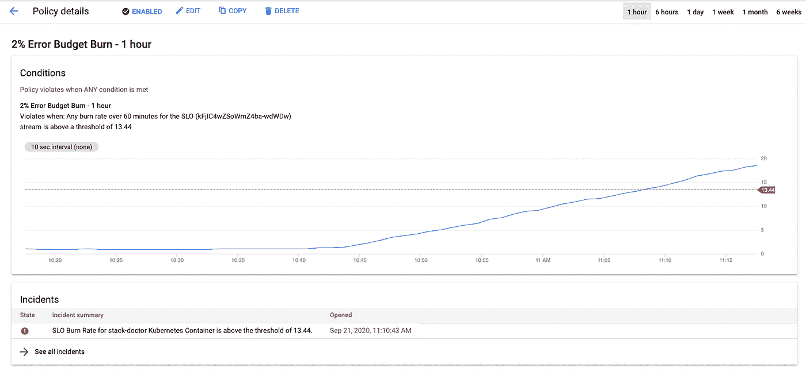
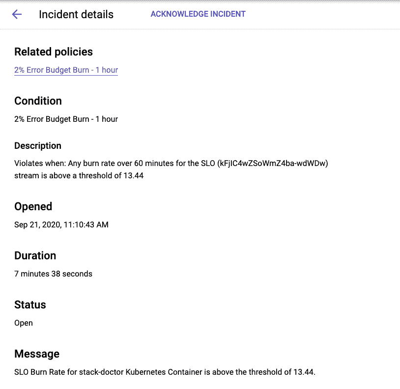

# 如何提醒 SLO

> 原文：<https://medium.com/google-cloud/how-to-alert-on-slos-2a5ce8c4e7dd?source=collection_archive---------0----------------------->

我花了相当多的时间来研究在服务监控中定义和配置 SLO。最近，我收到了许多关于接下来会发生什么的问题-一旦配置了 SLO，人们想知道如何使用警报来通知潜在的、即将发生的和正在发生的 SLO 违规。服务监控提供了 SLO 错误预算消耗[警报](https://cloud.google.com/stackdriver/docs/solutions/slo-monitoring/alerting-on-budget-burn-rate)来实现这一点，但是使用这些警报并不总是直观的。我开始尝试这些方法，并记录下我一路上的发现。让我们看看会发生什么！

# 理论上…

SRE 工作手册有整整一章[专门讲述 SLO 警报。我不认为我需要在这里重复它，但有两类考虑是非常重要的:](https://landing.google.com/sre/workbook/chapters/alerting-on-slos/)

*   您的警报和您的服务经历的 SLO 事件的数量之间有什么关系？

**— Precision** 是您的真实阳性率——您的警报中有多少会真正表明您需要了解的事件？

**—回想一下**是你的“敏感度”——你的事件中有多少部分实际上会引发警报？

*   警报和触发它的事件之间有什么关系？

**—检测时间**是事件开始和警报触发之间的时间

**—复位时间**是事件结束和报警复位之间的时间

可以想象，您的 SLO 本身和您配置的警报会影响所有这些。不可能优化所有这些(将精度和召回率提高到 100%，将检测时间和重置时间设置为零)而不淹没在警报中，其中大部分是不可操作的。同时，等到超出错误预算时才发出警报是不现实的，提前通知是必要的，以便能够采取适当的措施来确保服务保持在每日/每周/每月的错误预算内。提醒**错误预算消耗**，而不是提醒你的服务是否在某个特定的短时间内位于 SLO 境内，才是达到目的的方法。

下一个显而易见的问题是，在触发警报之前，应该消耗多少误差预算？SRE 工作手册第[章](https://landing.google.com/sre/workbook/chapters/alerting-on-slos/)中推荐的最先进的方法是使用多窗口、多燃烧速率警报(见第 6 节)。但是首先，我非常喜欢按照“1 小时内 2%烧伤和 6 小时内 5%烧伤”的建议，使用不同烧伤率的两个独立警报的想法。

最后，这也是难点，您如何确定准确的烧钱速率和警报窗口，以达到所需的精确度和重置时间，同时将服务的运营开销(响应不需要的警报)降至最低？书中写道:

> “对于基于燃烧速率的警报，警报触发所需的时间为:
> 
> 触发时间= (1-SLO) /错误率*警报窗口大小*燃烧率
> 
> 触发警报时消耗的错误预算为:
> 
> 消耗的预算=燃烧速率*警报窗口大小/周期”

让我们看一个例子来阐明这一点。假设您在一个滚动的 28 天窗口内拥有 99.9%的可用性 SLO。如果您在上一个小时内消耗了 1%的错误预算，则需要发出警报。这意味着，如果过去一小时内的错误率大于目标预算* (1-SLO) *(期间/窗口)，则需要触发警报。

但是，Service Monitoring 不允许您指定错误率—相反，您必须提供[烧损率阈值](https://cloud.google.com/stackdriver/docs/solutions/slo-monitoring/alerting-on-budget-burn-rate)。烧钱速率是服务消耗错误预算的速率。如果烧损率为 1.0，则在 SLO 评估期结束时，您将完全消耗 100%的错误预算。如果烧损率为 2.0，则在期末时，您将消耗 200%的错误预算(或在评估期间的中途消耗了所有错误预算)，依此类推。使用上面的等式来计算燃烧速率，我们得到

`*burn rate = budget consumed * period / alerting window*`

在我们的示例中:

*   SLO = 99.9%，或. 999
*   警报窗口大小= 1 小时
*   消耗的预算= 1%或. 01
*   周期= 28 天或 672 小时

这意味着

`burn rate = .01 * 672 / 1= 6.72`

如果我们将我们的警报配置为具有 60 分钟的回看周期和 6.72 的烧损率阈值，那么我们可以基于我们的服务体验的错误率来计算我们获得警报的速度。例如，如果我们的错误率上升到 1%`time to fire = (1-.999) / .01 * 1 * 672 = 67.2 hours`，这几乎是 3 天—这是召回率低的警报！

如果我们希望提高召回率并在 1 小时内发出正确的警报，我们使用`1 = (1-.999) / .01 * 1 * burn rate`计算燃烧速率，这意味着`burn rate = 10`。确认— `time to fire = (1-.999) / .01 * 1 * 6.72 = 1`！我们的警报将在一小时内发出。

# 实际上……

我希望了解如何使用 Service Monitoring 来实现一种更简单的方法(如第 5 节中所述)—按照“1 小时内 2%燃烧和 6 小时内 5%燃烧”的建议，使用不同的燃烧速率发出两个单独的警报。

# 设置

# 服务业和 SLO

首先，我需要一个简单的应用程序，无需重新部署代码就可以精确控制它的错误率。你可以在这里看到服务[的代码。这是一个非常基本的 Node.js Express 应用程序，它为每个请求和失败写日志条目。然后，我配置了基于日志的指标来计算这两者。我使用 UI 配置了一个服务:](https://github.com/yuriatgoogle/stack-doctor/blob/master/slo-alerting-demo/log-based/app-logging.js)

接下来，我需要定义 SLO。因为我的服务对“好的”和“坏的”过滤器使用了两种不同的标准，所以我不知道如何在 UI 中创建这样的 SLO。因此，我需要使用 API——API 调用如下:

这就创造了“连续 28 天 95%的可用性”的 SLO。这是在用户界面中:

# 故障注入

接下来，我需要将期望的错误率注入到服务中，以便能够验证增加错误率会导致错误预算消耗并触发警报。经过一些内部讨论，我确定了几个选项:

*   使用 Istio 的[故障注入](https://istio.io/latest/docs/tasks/traffic-management/fault-injection/)功能
*   让我的应用程序读取可由 [ConfigMap](https://cloud.google.com/kubernetes-engine/docs/concepts/configmap) 管理的环境变量

我决定用后者。你可以在这里看到我的代码；要点是，我使用 Node 的`process.ENV.<variable name>`让我的代码在服务请求时读取变量。变量本身的值是在 ConfigMap 中设置的——我按照这些[指令](https://kubernetes.io/docs/tasks/configure-pod-container/configure-pod-configmap/)从一个基本的。属性文件。我发现的另一个复杂情况是，pod 只会在启动时读取环境变量的值——所以当我想更改值时，我需要删除它并让部署重新创建它。

# 警报

最后，我准备好设置我的提醒。如前所述，我想测试两个警报:

*   2%误差预算在 1 小时内完成
*   5%的误差预算在 6 小时内完成

如“理论”部分所述，服务监控需要两个错误预算烧录警报输入—回看持续时间和烧录速率阈值:

因为我知道我想要监视一个小时内的误差预算消耗，所以回顾持续时间是一个简单的决定——我将其设置为 60 分钟。然而，我需要计算我的燃烧率阈值。我已经展示了我是如何计算“1 小时内 1%的”烧伤示例的。这一次，我的输入如下:

*   警报窗口大小= 1 小时
*   消耗的预算= 2%或 0.02
*   周期= 28 天或 672 小时

为了计算燃烧速率，我使用了

`burn rate = budget consumed * period / alerting window = .02 * 672 / 1 = 13.44`

这是我们的警报策略预期的刻录率阈值:

接下来，我需要计算“6 小时内消耗 5%的错误预算”警报的消耗率阈值。这一次:

*   警报窗口大小= 6 小时
*   消耗的预算= 5%或 0.05
*   周期= 28 天或 672 小时

这意味着

`burn rate = budget consumed * period / alerting window = .05 * 672 / 6 = 6.72 :`

现在，我的两个警报都准备好了。我准备在服务中引入错误并测试警报。

# 测试警报

我需要回答的第一个问题是——在合理的时间范围内触发警报的错误率应该是多少？如上所述:

`time to fire = (1-SLO) / error ratio * alerting window size * burn rate`

这使得

`error ratio = (1 — SLO) * alerting window size * burn rate / time to fire`

对于第一个警报，我的值如下:

*   期望点火时间= 1 小时
*   SLO = 95%或 0.95
*   警报窗口大小= 1 小时
*   燃烧率= 13.44

这意味着我的错误率至少需要达到 0.672，或者 67.2%——这相当高了！我用该值重新创建了 configmap，并删除了由部署自动重新创建的 pod。几乎立刻，我发现我的 SLI 减少了:

因为我把我的 SLO 设置得比我预期的要高，所以服务已经超出了误差预算，但是直接的下降仍然完全在我的预料之中。我的服务也没有运行整整一个月，所以我认为警报的触发会比我的计算快得多，因为此时我实际上还没有积累足够的错误预算，烧 2%根本不需要时间。

果不其然，我很快就看到错误预算消耗率超过了阈值:

并生成警报:

# 正在总结…

我真的很高兴我花时间弄明白了这一点，并记录了我的旅程，我希望这对你有所帮助。特别是，我发现在产品文档中没有太多关于什么是错误预算消耗率的信息，需要挖掘才能真正理解计算错误预算消耗率的数学方法。然而，我非常喜欢这种在 SLO 上设置警报的方法。感谢你的阅读，请告诉我你的想法！