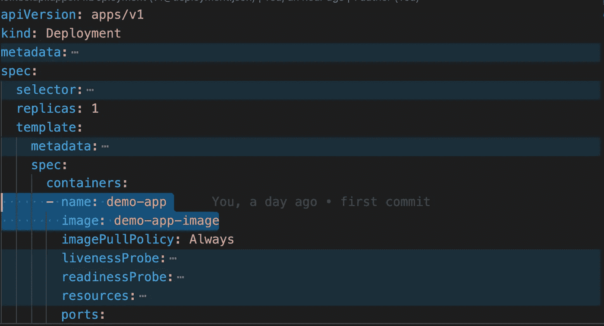
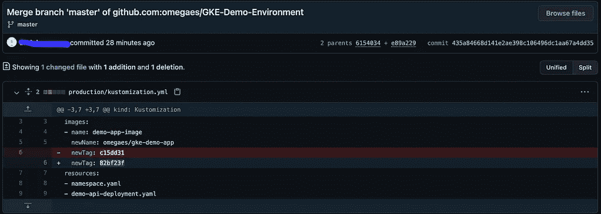

# 如何在 5 分钟内将 GitOps CD 应用于 GKE 和云构建！

> 原文：<https://medium.com/google-cloud/how-to-apply-gitops-cd-with-gke-and-cloud-build-in-5-minutes-58455a2bf063?source=collection_archive---------0----------------------->

高效的工程师总是喜欢先完成高杠杆的工作，高杠杆的工作是一种时间投资，它需要花费一些时间和努力来建立一些在未来节省大量时间或防止许多人为错误的东西，这些良好的投资之一是 CI/CD 管道。

CI/CD 管道从来都不是大团队才有的需求，即使是单个开发人员也需要它，不管是什么项目，然而，根据团队规模和需求，它可能有几个或许多步骤。

# Kubernetes 和云原生应用

我假设您的应用程序是构建在微服务之上的云原生应用程序，每个微服务都由不同的编程语言构建，并且它以一种有组织的方式与其他微服务进行通信。

当我们谈论云原生应用和微服务时，可能意味着我们使用容器和容器编排(Kubernetes)，我不会在本文中谈论 Kubernetes 的所有好处，但我会提到 IAC(作为代码的基础设施)的伟大之处，当有代码描述您的基础设施的当前状态时，您可以轻松地移动它或在几秒/几分钟内重新构建。

# 什么是 GitOps？

> GitOps 是实现云原生应用持续部署的一种方式。它通过使用开发人员已经熟悉的工具，包括 Git 和持续部署工具，关注操作基础设施时以开发人员为中心的体验。—[https://www.gitops.tech/](https://www.gitops.tech/)

主要想法是有一个 Git repo(环境 Repo)来托管基础设施的当前状态(Kubernetes 的清单)，然后在环境 Repo 与 Kubernetes 集群同步后，在云上更改应用程序将来自对环境 Repo 所做的更改。

# GitOps 的优点

*   在云上部署速度更快，无需配置您的本地机器，这在您管理多个环境时非常有用
*   因为它是基于 Git 的，所以只恢复最后一次提交的数据！
*   安全，不需要在本地机器上存储基础设施的凭证
*   使用 Git 权限知道谁可以读写
*   使用 Git 历史来了解发生了什么以及何时发生的

# GitOps 的方法

在准备好环境报告并将运行应用程序所需的所有清单放到 Kubernetes 上之后，我们必须将这些清单与 Kubernetes 集群同步，这意味着环境报告上发生的任何变化都应该反映在当前运行的基础设施上。

*   基于推送的更新:环境报告上的更改将触发一个作业来更新当前的 Kubernetes 状态，以跟随环境报告中的新状态。
*   基于拉的更新:Kubernetes 集群将定期运行一个作业来检查/观察环境报告中描述的当前状态，并在需要时进行自我更新。

# GitOps 示例

来源:[https://www.gitops.tech/](https://www.gitops.tech/)

我的简单示例是关于 web 应用程序回购和环境回购，我使用 [GKE](https://cloud.google.com/kubernetes-engine) 来管理我的 Kubernetes 集群，这里我们需要两个[云构建](https://cloud.google.com/build)触发器:

*   应用程序 repo 触发器:它将构建一个新的 docker 映像，将其推送到[容器注册表](https://cloud.google.com/container-registry) / [Docker hub](https://hub.docker.com/) ，最后但同样重要的是，它将更新环境 repo 以使用最新的 web 应用程序映像而不是旧映像。
*   环境报告触发器:当有一个新的提交来应用 Kubernetes 集群上的最新更改时，它将运行。

环境回购将如下所示:

环境报告

演示应用程序部署，此处图像被视为一个变量

创建 Kubernetes 对象的 kustomization 文件将使用特定的构建标记替换 image 变量

我正在使用 Kubernetes 的 kustomize，它将使更改 Kubernetes 对象的部分变得更容易，例如，如果你有许多 cronjobs，并且它们都使用相同的映像，你需要使用一个更新的映像，你必须更新许多 YAML 文件并应用它们，但是如果你正在使用 kustomize，你更新并应用一个文件，这将更新所有的 cronjobs！非常好！。

下面是应用程序报告(演示 API)中需要实现的更改

这个 cloudbuild.yaml 应该添加到应用程序 repo 的顶层。

ENV_REPO_FILES:这些是您想要在环境报告中更新的定制化文件的路径。

我使用了一个自定义步骤`omegaes/kubci`作为概念验证如何为云构建构建一个自定义步骤，该步骤将完成三项任务:

*   克隆环境 repo，签出目标分支以进行所需的更改
*   更新 Kustomiztion 文件，更改应用程序部署的图像标签
*   提交这些更改，并将它们与环境报告中的主分支合并。

> *最好将构建任务分成多个步骤。
> 
> *最好让应用程序管道从环境回购的主分支创建目标分支，目标分支上的另一个触发器将检查是否可以应用这些更改，如果可以，它将应用并合并到环境回购的主分支。

这个 cloudbuild.yaml 应该添加到您的环境报告的顶层。

最后，创建两个云构建触发器和秘密的“Environment-repo-auth-URL”:

“Environment-repo-auth-URL”将在前面的自定义步骤中使用，以克隆环境 repo 并在那里推送新的图像标记。

让我们对应用程序回购做一个小小的改变:

应用程序回收触发器，更新基础结构代码的提交和环境回收触发器，

# 结论

我们所经历的只是 GitOps 的一个简单示例，在现实世界的项目中，您会发现许多困难，这种方法对我从环境 Git 存储库控制多个 Kubernetes 集群很有帮助，请不要犹豫询问任何澄清或分享您的想法！！

您可以查看这些 Github 库，看看我是如何在这里构建演示的:

*   [GKE 演示 App](https://github.com/omegaes/GKE-Demo-App)(node . js 中的 Hello World)
*   [GKE-演示-环境](https://github.com/omegaes/GKE-Demo-Environment)(宿主 Kubernetes 对象清单)
*   [Kubci](https://github.com/omegaes/Kubci)(Docker 映像旨在用作云构建中的自定义步骤，这将克隆环境报告，更新 kustomization yaml 并将这些更改推回环境报告)

激发我灵感的资源:

 [## GitOps

### 自 2017 年由 Weaveworks 推出以来，GitOps 在 Twitter 和 KubeCon 上引起了相当大的轰动。这个网站…

www.gitops.tech](https://www.gitops.tech/)  [## 通过云构建| Kubernetes 引擎实现 GitOps 风格的持续交付

### 发送反馈本页解释了如何在 Google Cloud 上创建持续集成和交付(CI/CD)管道…

cloud.google.com](https://cloud.google.com/kubernetes-engine/docs/tutorials/gitops-cloud-build)