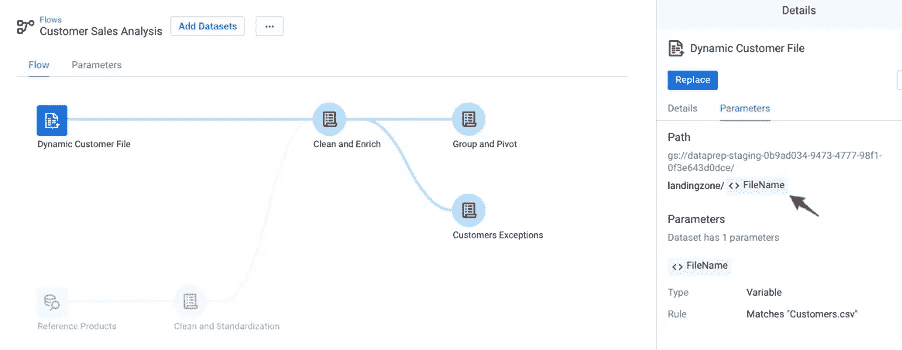
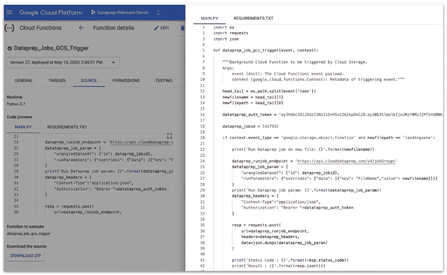
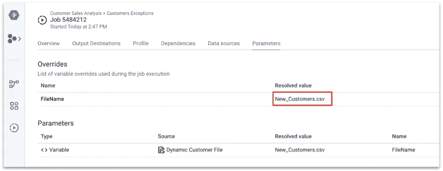

# 当文件到达时，如何自动化云数据准备管道

> 原文：<https://medium.com/google-cloud/how-to-automate-a-cloud-dataprep-pipeline-when-a-file-arrives-9b85f2745a09?source=collection_archive---------1----------------------->

*随着对云函数的更好掌握，当文件进入云存储桶时，您可以通过 API 触发 Dataprep 作业*

曾经梦想过自动化整个数据管道来加载数据仓库吗？如果没有自动化，每个用户都需要手动上传数据，然后手动启动转换作业，或者等待预定任务在特定时间执行。这是非常繁琐和资源密集的。

阅读完本文后，您将能够在文件夹中拖放文件，在数据仓库中执行和加载整个数据管道，并且只需简单地点击几下，就可以在报告和仪表板中获得最新数据。


为了说明这个概念，我们将以一家零售店为例，这家零售店希望每天用新客户的联系信息和客户职业更新其数据库。通过在每天结束时手动将新的客户文件上传到一个文件夹中，我们的目标是从在区域级别维护的 Google 表单中自动更新数据。

本文是一个循序渐进的指南，它将带您了解当一个新文件出现在[云存储](https://cloud.google.com/storage)文件夹中时，触发[云数据准备](https://cloud.google.com/dataprep)任务的过程。这是通过[云函数](https://cloud.google.com/functions)监控文件到达并调用云 Dataprep API 从 Dataprep 流中启动特定作业来实现的。

## **1。入门**

为了帮助您应用下面描述的过程，我们已经为您提供了尝试该过程所需的所有资源。[在 Github](https://github.com/victorcouste/demo-trigger-dataprep-job-from-gcs) 上，你会发现以下内容:

*   源文件:Customers.csv 和包含丰富数据的 Google 表单
*   您可以作为新流程导入的云数据准备方案
*   云函数的 Python 代码

你所需要的只是一个有效的 Google 账户和对 Cloud Dataprep、Cloud Functions 和 BigQuery 的访问。

## **2。使用数据集作为参数创建云数据准备流**

首先，您需要创建一个 Cloud Dataprep 流，它接受定义为参数的源数据集。源数据集名称(定义为变量)将在运行时通过云函数的应用程序编程接口(API)调用作为参数进行解析。当创建源数据集或替换现有 Dataprep 流中的源时，可以将源数据集定义为变量/参数。


在这个现有的数据流中，我们的目标是将 Google Sheet 与 CSV 文件结合起来，我们希望将 CSV 源文件替换为变量。

在流视图中，必须选择要监控的特定文件夹，并将文件名定义为变量。当您导入一个新数据集并点击“**用参数**创建数据集”按钮时，您将进入该页面。通过选择源数据集和菜单“**用带参数**的数据集替换”，您同样可以在流程视图中找到它。


您需要单击数据集名称，并为源数据集选择“添加变量”。


在这个例子中，云存储文件夹是 **/landingzone** 。该变量被命名为**文件名**；这也是将通过 API 调用的参数。



在这个例子中，Dataprep 流只包含一个参数。但是，您可以有多个输入、输出参数，甚至可以用一个数据转换配方来定义。

您可以在流程视图中选择**参数**选项卡，查看和编辑所有流程参数。


## **3。配置通过 API 调用的云数据准备方法**

我们想在每次将文件上传到 **landingzone** 文件夹时触发“**客户例外**”配方。因此，我们需要为这个特定的配方启用 Cloud Dataprep REST API。

因此，您必须选择相应的配方，并记下配方 URL 中提供的配方 ID。


云数据准备 API 文档可以在[这里](https://cloud.google.com/dataprep/docs/html/API-Overview_145281442)找到。这就是我们需要使用 POST 请求类型的 **/v4/jobgroups** 端点的地方。

在我们的例子中，配方 ID 是 **1427932** 。我们的 API 调用的请求体将如下所示:

```
{
   "wrangledDataset": {
   "id": **1427932** 
   },
   "runParameters": {
       "overrides": {
          "data": [{
               "key": "**FileName**",
               "value": **override value (string)**
          }]
        }
   }
}
```

您需要的下一件事是为将进行 API 调用的 Dataprep 用户提供一个访问令牌。这将确保用户被授权和认证来进行 API 调用。为此，请转到 Cloud Dataprep 的用户设置并生成一个新令牌(如果还没有这样做的话)。

**注意**:你需要成为 Google 项目的所有者才能生成访问令牌。试用时，您可以使用项目所有者的帐户或个人 gmail 帐户。


## 4.创建云函数来监控文件到达，并调用云 Dataprep API

我们现在可以创建云功能，当云存储文件夹中出现新文件时将触发该功能。

要从 Google Cloud 控制台创建云功能，请单击此处的。

触发类型必须为“**云存储**”，触发该功能的对象事件类型为“**完成/创建”。**

您还需要指定想要从中触发该函数的云存储空间。在我们的例子中，我们将使用 Python 作为运行时。


云函数代码遵循以下逻辑:

1.  从事件对象中检索文件名。
2.  检查文件路径是否是要监控的文件夹(在我们的例子中是 **landingzone** )。
3.  使用配方 ID 和文件名作为 file name 参数的值，调用 Cloud Dataprep REST API 端点。
4.  在 API 调用中利用 Dataprep 用户访问令牌进行云 Dataprep 认证。

如果你想探索更多关于云功能和云存储管理的知识，我推荐你去看看这篇[教程](https://cloud.google.com/functions/docs/tutorials/storage)。



我们在这里提供了 Python 代码[。您需要相应地编辑它，将突出显示的值替换为您在 Cloud Dataprep 项目中检索到的值(博客的第 2 和第 3 部分):](https://github.com/victorcouste/google-cloudfunctions-dataprep/blob/master/gcs_trigger_dataprep_job.py)

```
datataprep_auth_token = ‘**xxxxxxxxxxxxxxx**‘dataprep_jobid = **99999999**if context.event_type == ‘google.storage.object.finalize’ and newfilepath == ‘**landingzone**‘:
```

然后，您需要部署云功能。它将运行并等待文件被上传以触发 Cloud Dataprep 作业。你可以在这里了解更多关于部署和执行云功能[的信息。](https://cloud.google.com/functions/docs/deploying/console)

## 5.测试端到端流程

现在，您已经准备好测试端到端数据管道了，方法是在 Google Cloud bucket 中添加一个新文件，并监控它以确保 Cloud Dataprep 作业得到执行。

在 Google 控制台中，导航到“存储”、“浏览器”,然后转到适当的 Google 云存储空间以上传 customer.csv 文件。


在 Cloud Dataprep Jobs 窗口中，等待(刷新)启动并执行“客户异常”作业，以加载 BigQuery 表。


您可以通过此窗口验证作业正在处理正确的文件。



最后，您可以通过查看位于[此处](https://console.cloud.google.com/logs/viewer?resource=cloud_function)的 Google Cloud Functions 日志来确认正确的执行细节(带参数的 API 调用和 Cloud Dataprep 作业状态)。


## **结论**

遵循这个逐步指南后，您现在已经掌握了在特定文件夹中上传文件时自动触发端到端数据管道所需的基本原则。

您已经了解了:

*   云数据准备参数
*   云数据准备 API
*   具有存储监控和调用 API 的云功能
*   使用 API 调用和参数监控云功能和云数据准备执行

您现在已经准备好基于一个事件来自动化您的流程。如果您希望从更广的角度将 Cloud Dataprep 作为特定计划的企业数据逻辑的一部分，那么您也可以利用外部调度器来自动化 Cloud Dataprep。看看这篇[博客文章](/google-cloud/automation-of-data-wrangling-and-machine-learning-on-google-cloud-7de6a80fde91)，了解如何利用 Cloud Composer(Google Cloud scheduler)来调度云数据准备作业。

*原载于*【www.trifacta.com】